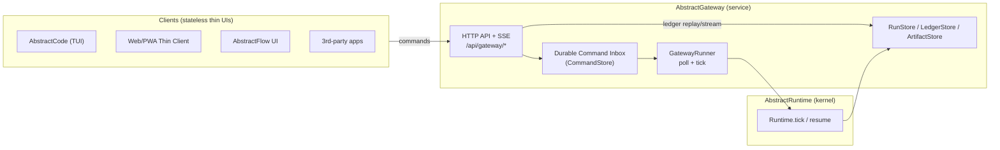

# AbstractGateway — Architecture (Living)

> Updated: 2026-01-08  
> Status: implemented (see completed backlog 318)

AbstractGateway is the **deployable control-plane host** for AbstractRuntime runs:
- clients submit **durable commands** (start/resume/pause/cancel/emit_event)
- clients render by replaying/streaming the **append-only ledger** (cursor-based)
- the gateway host owns the durable stores and is the single authority for a run (ADR‑0020)

## Diagram (v0)

## Scope and packaging
AbstractGateway should be deployable without installing authoring tools (AbstractFlow).
Workflow loading must therefore be pluggable:
- core `abstractgateway` depends on `abstractruntime`
- default workflow source: **WorkflowBundles (.flow)** containing **VisualFlow JSON** (`manifest.flows`), compiled via `abstractruntime.visualflow_compiler` (no `abstractflow` import)
- optional extras can add additional workflow sources (e.g. a “directory of VisualFlow JSON files” host wired with authoring-side helpers)

Bundle-mode execution wiring:
- VisualFlow is compiled via `abstractruntime.visualflow_compiler` (single semantics engine).
- LLM/tool workflows are supported by wiring `abstractruntime.integrations.abstractcore`:
  - `LLM_CALL` handler (AbstractCore-backed)
  - `TOOL_CALLS` handler (host-configured tool executor)
- Visual Agent nodes are supported by registering deterministic per-node ReAct workflows (requires `abstractagent`).
- Visual “On Event” nodes are supported by compiling derived listener workflows and starting them as child runs in the same session.

Runtime configuration (env):
- `ABSTRACTGATEWAY_PROVIDER` / `ABSTRACTGATEWAY_MODEL`: default provider/model for bundle-mode runs that contain LLM nodes.
- `ABSTRACTGATEWAY_TOOL_MODE`:
  - `passthrough` (default): tool calls enter a durable wait (safest for untrusted hosts)
  - `local`: tool calls execute in the gateway process (dev only)

Run start identifiers (bundle mode):
- The **bundle** is the portable distribution unit. Clients should primarily identify “what to run” via `bundle_id`.
- The **flow id** selects *which entrypoint/subflow* within the bundle to start:
  - If a bundle has a single `manifest.entrypoints[]` item **or** declares `manifest.default_entrypoint`, the gateway can start it with `{bundle_id, input_data}` (no `flow_id`).
  - If the bundle has multiple entrypoints and no `default_entrypoint`, clients must specify `flow_id` (or pass a fully-qualified workflow id like `bundle:flow`).

## Related
- Backlog 318: `docs/backlog/completed/318-framework-abstractgateway-extract-run-gateway-host.md`
- ADR‑0018: `docs/adr/0018-durable-run-gateway-and-remote-host-control-plane.md`
- ADR‑0020: `docs/adr/0020-agent-host-pool-and-orchestrator-placement.md`
