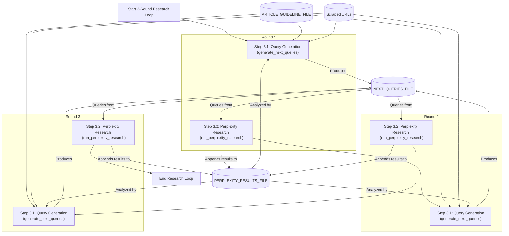
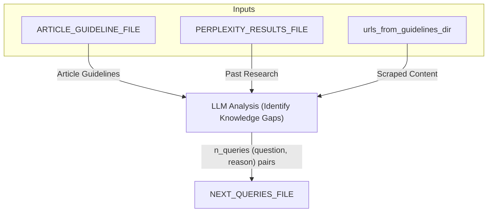
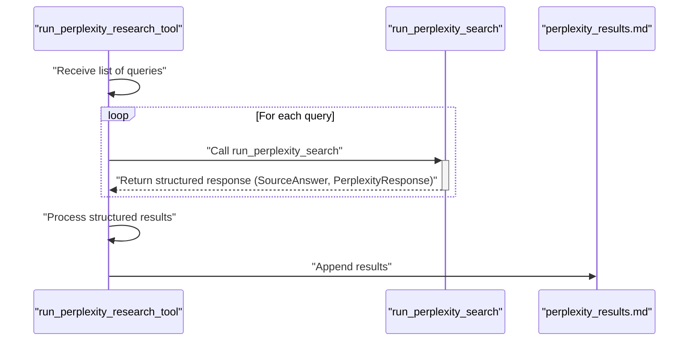
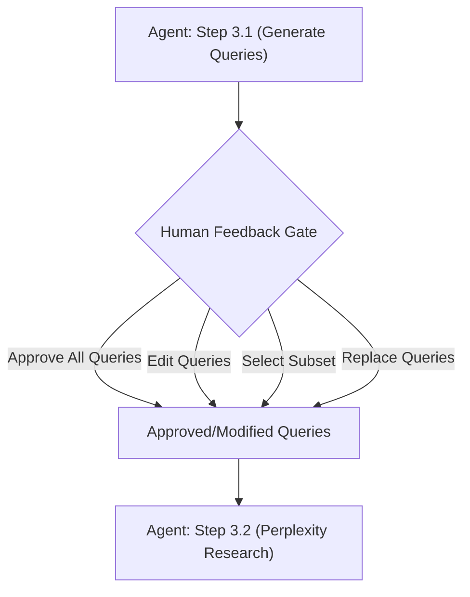

# Lesson 18: The Research Loop: Query Generation, Perplexity, and Human Feedback
### Building a Controllable, Production-Ready Research Agent

In this lesson, we will explore the research loop that forms the heart of our research agent's intelligence. We will see how the agent generates relevant search queries based on content gathered in previous lessons and uses Perplexity to expand its knowledge base. We'll also see how to integrate human feedback into the research workflow. This creates a powerful human-in-the-loop (HITL) system that allows users to guide the research direction while using the agent's analytical capabilities.

Learning Objectives:
- Learn how to generate contextual research queries using LLMs and structured outputs
- Understand how to integrate external research services like Perplexity for comprehensive web search
- Implement human-in-the-loop feedback mechanisms in agentic workflows
- Explore the iterative design process behind building effective AI research agents

Open-ended research can easily drift without a control loop. We need a repeatable way to detect knowledge gaps, propose targeted queries, fetch cited answers, and pause for human approval before spending more of our budget. In previous lessons, we laid the foundation for our research agent. We built the MCP server and client, defined our server-hosted prompts, and implemented a suite of ingestion tools to process URLs, GitHub repositories, and YouTube videos [[1]](https://amplifypartners.com/blog-posts/the-ai-research-experimentation-problem), [[2]](https://modelcontextprotocol.io/docs/concepts/prompts?utm_source=chatgpt.com).

Now, we will build the agent's core intelligence: a research loop that generates gap-filling queries, fetches cited answers from Perplexity, and allows for human oversight. You will learn to build a system that is controllable, explainable, and economical, a workflow you can reuse across your own projects.

## Understanding the Research Loop

The research loop is where our agent becomes truly intelligent. After gathering initial content from guidelines, the agent enters a three-round research cycle designed to fill knowledge gaps and expand its understanding.

From the MCP prompt workflow, here's how the research loop works:

```markdown
3. Repeat the following research loop for 3 rounds:

    3.1. Run the "generate_next_queries" tool to analyze the ARTICLE_GUIDELINE_FILE, the already-scraped guideline
    URLs, and the existing PERPLEXITY_RESULTS_FILE. The tool identifies knowledge gaps, proposes new web-search
    questions, and writes them - together with a short justification for each - to the NEXT_QUERIES_FILE within
    NOVA_FOLDER.

    3.2. Run the "run_perplexity_research" tool with the new queries. This tool executes the queries with
    Perplexity and appends the results to the PERPLEXITY_RESULTS_FILE within NOVA_FOLDER.
```

This workflow, illustrated in Image 1, is defined in our server-hosted MCP prompt. Each round consists of two main steps: generating new queries and executing them. This iterative process allows the agent to build upon its knowledge with each cycle.


Image 1: A flowchart illustrating the three-round research loop of the MCP-based research agent, showing the iterative flow between query generation and perplexity research, and the data dependencies.

Notice the file-first pattern we established in Lesson 17. The `next_queries.md` file is overwritten in each round with new queries, while `perplexity_results.md` is appended, creating a persistent and auditable log of all research findings [[3]](https://decoding.io/2023/11/reviewing-append-only-workflows/). The prompt also includes our critical-failure policy: if any of the initial ingestion tools from Step 2 reported zero successes (e.g., failed to scrape any URLs), the agent is instructed to halt and ask for human guidance before starting the research loop.

## Why We Use Perplexity (The Philosophy)

Before diving into the implementation, it's important to understand our architectural philosophy. Similar to our approach with web scraping, we're using Perplexity for web search rather than building our own solution.

When there's a general problem faced by many in the industry, it's often more efficient to plug into dedicated tools rather than building every element yourself. Companies like Perplexity make LLM-based web search their entire business, investing heavily in:

-   Comprehensive source coverage across the web
-   Real-time information retrieval with source citations [[4]](https://beam.ai/llm/perplexity/)
-   Advanced ranking and relevance algorithms
-   Handling of dynamic content and paywalls
-   Rate limiting and API reliability

This allows us to focus on the unique elements of our research agent: the intelligent query generation, human feedback integration, and workflow orchestration.

On the technical side, Perplexity offers two key benefits for our agent. First, it supports structured outputs, allowing us to request responses as objects containing a URL and the answer text. As we covered in Lesson 4, this is essential for reliable parsing. Second, its API is asynchronous, which means we can run multiple queries at the same time to keep the research loop fast and efficient. The results are then appended to a single file for auditability [[5]](https://docs.perplexity.ai/guides/structured-outputs?utm_source=chatgpt.com), [[6]](https://python.useinstructor.com/blog/2023/11/13/learn-async/).

## Query Generation: The Brain of the Research Loop

The `generate_next_queries` tool is central to the research loop's intelligence. It analyzes all available context and intelligently identifies knowledge gaps to fill.

### Understanding the Implementation

Let's examine the core implementation.

```python
async def generate_next_queries_tool(research_directory: str, n_queries: int = 5) -> Dict[str, Any]:
    """
    Generate candidate web-search queries for the next research round.

    Analyzes the article guidelines, already-scraped content, and existing Perplexity
    results to identify knowledge gaps and propose new web-search questions.
    Each query includes a rationale explaining why it's important for the article.
    Results are saved to next_queries.md in the research directory.
    """
    # Convert to Path object
    research_path = Path(research_directory)
    nova_path = research_path / NOVA_FOLDER

    # Gather context from the research folder
    guidelines_path = research_path / ARTICLE_GUIDELINE_FILE
    results_path = nova_path / PERPLEXITY_RESULTS_FILE
    urls_from_guidelines_dir = nova_path / URLS_FROM_GUIDELINES_FOLDER

    article_guidelines = read_file_safe(guidelines_path)
    past_research = read_file_safe(results_path)

    # Collect all scraped content for context
    scraped_ctx_parts: List[str] = []
    if urls_from_guidelines_dir.exists():
        for md_file in sorted(urls_from_guidelines_dir.glob(f"*{MARKDOWN_EXTENSION}")):
            scraped_ctx_parts.append(md_file.read_text(encoding="utf-8"))
    scraped_ctx_str = "\n\n".join(scraped_ctx_parts)

    # Generate queries using LLM
    queries_and_reasons = await generate_queries_with_reasons(
        article_guidelines, past_research, scraped_ctx_str, n_queries=n_queries
    )

    # Write to next_queries.md (overwrite)
    next_q_path = nova_path / NEXT_QUERIES_FILE
    write_queries_to_file(next_q_path, queries_and_reasons)

    return {
        "status": "success",
        "queries_count": len(queries_and_reasons),
        "queries": queries_and_reasons,
        "output_path": str(next_q_path.resolve()),
        "message": f"Successfully generated {len(queries_and_reasons)} candidate queries..."
    }
```

The tool gathers three types of context:

1.  **Article Guidelines**: The original requirements and scope. This provides the foundational understanding of what the article should cover.
2.  **Past Research**: Previous Perplexity results. This ensures the LLM does not generate duplicate queries and can identify gaps in existing research.
3.  **Scraped Content**: All content from guideline URLs concatenated together. This provides comprehensive background context that helps the LLM understand what information is already available.

The LLM analyzes all three contexts simultaneously. It uses the article guidelines to understand the target scope, reviews past research to see what has already been covered, and examines scraped content to understand the existing knowledge base. This comprehensive analysis, shown in Image 2, enables it to generate queries that specifically target knowledge gaps [[7]](https://arxiv.org/html/2508.12752v1). For example, if the article guidelines mention "error handling in AI agents" but neither past research nor scraped content covers this topic adequately, the LLM will prioritize generating queries about error handling strategies.


Image 2: Data flow diagram for the 'generate_next_queries' tool

### The LLM-Powered Query Generation

The actual query generation happens in the `generate_queries_with_reasons` function.

```python
async def generate_queries_with_reasons(
    article_guidelines: str,
    past_research: str,
    scraped_ctx: str,
    n_queries: int = 5,
) -> List[Tuple[str, str]]:
    """Return a list of tuples (query, reason)."""

    prompt = PROMPT_GENERATE_QUERIES_AND_REASONS.format(
        n_queries=n_queries,
        article_guidelines=article_guidelines or "<none>",
        past_research=past_research or "<none>",
        scraped_ctx=scraped_ctx or "<none>",
    )

    chat_llm = get_chat_model(settings.query_generation_model, GeneratedQueries)
    response = await chat_llm.ainvoke(prompt)

    queries_and_reasons = [(item.question, item.reason) for item in response.queries]
    return queries_and_reasons[:n_queries]
```

This is the prompt used for query generation. It can potentially have contexts of ~100k tokens or more.

```python
PROMPT_GENERATE_QUERIES_AND_REASONS = """
You are a research assistant helping to craft an article.

Your task: propose {n_queries} diverse, insightful web-search questions
that, taken **as a group**, will collect authoritative sources for the
article **and** provide a short explanation of why each question is
important.

<article_guidelines>
{article_guidelines}
</article_guidelines>

<past_research>
{past_research}
</past_research>

<scraped_context>
{scraped_ctx}
</scraped_context>

Guidelines for the set of queries:
• Give priority to sections/topics from the article guidelines that
  currently lack supporting sources in <past_research> and
  <scraped_context>.
• Cover any remaining major sections to ensure balanced coverage.
• Avoid duplication; each query should target a distinct aspect.
• The web search queries should be natural language questions, not just keywords.
""".strip()
```

This prompt explicitly instructs the LLM to identify missing information and ensures queries cover different aspects rather than duplicating existing research [[8]](https://mirascope.com/blog/prompt-engineering-best-practices). Last, the `generate_queries_with_reasons` function uses Pydantic models to ensure consistent, structured responses.

```python
class QueryAndReason(BaseModel):
    """A single web-search query and the reason for it."""

    question: str = Field(description="The web-search question to research.")
    reason: str = Field(description="The reason why this question is important for the research.")

class GeneratedQueries(BaseModel):
    """A list of generated web-search queries and their reasons."""

    queries: List[QueryAndReason] = Field(description="A list of web-search queries and their reasons.")
```

This structured approach ensures the LLM returns exactly what we need: queries paired with clear justifications. These justifications help us understand the LLM's thought process when generating queries, which is useful for debugging and for the human in the loop to provide useful feedback to the agent [[9]](https://www.lakera.ai/blog/prompt-engineering-guide).

### Testing Query Generation

Let's test the `generate_queries_with_reasons` function to see how it works in practice.

```python
from research_agent_part_2.mcp_server.src.app.generate_queries_handler import generate_queries_with_reasons

# Example inputs (simplified for demonstration)
article_guidelines = '''
# Article: Advanced Function Calling with LLMs

## Sections to cover:
1. Error handling strategies
2. Performance optimization
3. Security considerations
4. Best practices for production
'''

past_research = '''
### Source [1]: https://example.com/basic-function-calling
Query: What is function calling in LLMs?
Answer: Function calling allows LLMs to invoke external tools and APIs...

### Source [2]: https://example.com/simple-examples  
Query: How to implement basic function calling?
Answer: Basic implementation involves defining function schemas...
'''

scraped_ctx = '''
# Function Calling Documentation
This guide covers the fundamentals of function calling...
[Basic examples and simple use cases already covered]
'''

# Generate queries based on this context
queries_and_reasons = await generate_queries_with_reasons(
    article_guidelines=article_guidelines,
    past_research=past_research,
    scraped_ctx=scraped_ctx,
    n_queries=3
)

for query, reason in queries_and_reasons:
    print(f"Query: {query}")
    print(f"Reason: {reason}")
    print("---")
```

It outputs:
```text
Query: What are the most common security vulnerabilities when giving LLMs access to external tools via function calling, and what are the established mitigation strategies?
Reason: This question directly targets the 'Security considerations' section, a critical topic for production systems that is not covered in the existing research. It seeks to find authoritative sources on risks and specific, actionable solutions.
---
Query: How can latency be minimized and token usage be optimized when using chained or parallel function calls with large language models?
Reason: This addresses the 'Performance optimization' section. It focuses on advanced, practical challenges like speed and cost-efficiency, especially in complex scenarios that go beyond single, basic function calls.
---
Query: What are robust error handling patterns for LLM function calling when external API calls fail, return unexpected data, or the LLM hallucinates a function call?
Reason: This covers the 'Error handling strategies' section. It aims to find expert advice on building resilient systems, which is a cornerstone of production-readiness and a key theme for an 'advanced' article.
---
```

**Understanding the Output**

Observe the following:

1.  **Gap Analysis**: Notice how the LLM identified that the existing research only covers "basic function calling" and "simple examples", then generated queries specifically targeting the missing advanced topics (security, performance, error handling).
2.  **Section Mapping**: Each generated query directly maps to sections mentioned in the article guidelines that lack coverage. The LLM demonstrates sophisticated understanding by connecting article requirements to knowledge gaps.
3.  **Query Quality**: The queries are well-crafted, specific, and actionable. Instead of generic questions like "What is security?", it asks targeted questions like "What are the most common security vulnerabilities when implementing LLM function calling?"
4.  **Reasoning Transparency**: Each query comes with clear reasoning explaining why it's important and which article section it addresses. This transparency helps users understand the LLM's decision-making process.
5.  **Progressive Complexity**: The LLM naturally progresses from basic concepts (already covered) to advanced topics (security, performance, production practices), showing an understanding of knowledge hierarchies.

This intelligent gap analysis is what makes the research loop so powerful.

## Perplexity Integration: Concurrent Execution and Structured Outputs

Once we have our queries, we need to execute them efficiently. The `run_perplexity_research_tool` tool handles this integration with concurrent execution and structured outputs.

### The Research Tool Implementation

The `run_perplexity_research_tool` is the orchestrator that manages the entire Perplexity research process.

```python
async def run_perplexity_research_tool(research_directory: str, queries: List[str]) -> Dict[str, Any]:
    """
    Run Perplexity research queries for the research folder.

    Executes the provided queries using Perplexity's Sonar-Pro model and appends
    the results to perplexity_results.md in the research directory. Each query
    result includes the answer and source citations.
    """
    research_path = Path(research_directory)
    nova_path = research_path / NOVA_FOLDER
    results_path = nova_path / PERPLEXITY_RESULTS_FILE

    if not queries:
        return {
            "status": "success",
            "message": "No queries provided – nothing to do.",
            "queries_processed": 0,
            "sources_added": 0,
        }

    # Execute all queries concurrently
    tasks = [run_perplexity_search(query) for query in queries]
    search_results = await asyncio.gather(*tasks)

    # Process and append search results to file
    total_sources = append_search_results_to_file(results_path, queries, search_results)

    return {
        "status": "success",
        "queries_processed": len(queries),
        "sources_added": total_sources,
        "output_path": str(results_path.resolve()),
        "message": f"Successfully completed Perplexity research round..."
    }
```

The key performance optimization is concurrent execution. Instead of running queries sequentially, it creates a list of tasks and executes them all at once with `asyncio.gather(*tasks)` [[10]](https://www.unite.ai/asynchronous-llm-api-calls-in-python-a-comprehensive-guide/). Results from each round are appended to the same file, building up a comprehensive research database over the three rounds while maintaining a complete audit trail.

### Structured Perplexity Responses

The core Perplexity integration uses structured outputs to ensure consistent, parseable results. We are not just getting raw text, but structured data that our system can reliably process.

```python
class SourceAnswer(BaseModel):
    """A single source answer with URL and content."""

    url: str = Field(description="The URL of the source")
    answer: str = Field(description="The detailed answer extracted from that source")

class PerplexityResponse(BaseModel):
    """Structured response from Perplexity search containing multiple sources."""

    sources: List[SourceAnswer] = Field(description="List of sources with their answers")

async def run_perplexity_search(query: str) -> Tuple[str, Dict[int, str], Dict[int, str]]:
    """Run a Perplexity Sonar-Pro search and return full answer + parsed sections."""
    
    llm = get_chat_model("perplexity", PerplexityResponse)
    prompt = PROMPT_WEB_SEARCH.format(query=query)
    
    response = await llm.ainvoke(prompt)
    
    # Convert structured response to expected format
    answer_by_source = {}
    citations = {}
    for i, source in enumerate(response.sources, 1):
        answer_by_source[i] = source.answer
        citations[i] = source.url

    return full_answer, answer_by_source, citations
```

When you run a Perplexity search as above, you get a structured response like this:

```python
# Example of what run_perplexity_search returns for a query about "LLM function calling best practices"

full_answer = '''### [1]: https://openai.com/docs/guides/function-calling
Function calling allows models to connect to external tools and APIs...

### [2]: https://docs.anthropic.com/claude/docs/tool-use
Claude can use tools to perform actions beyond text generation...

### [3]: https://ai.google.dev/gemini-api/docs/function-calling
Gemini models support function calling for structured interactions...
'''

answer_by_source = {
    1: "Function calling allows models to connect to external tools and APIs. Best practices include defining clear schemas, handling errors gracefully, and validating inputs...",
    2: "Claude can use tools to perform actions beyond text generation. Key considerations include security, rate limiting, and proper error handling...",
    3: "Gemini models support function calling for structured interactions. Important aspects include schema design, response validation, and performance optimization..."
}

citations = {
    1: "https://openai.com/docs/guides/function-calling",
    2: "https://docs.anthropic.com/claude/docs/tool-use", 
    3: "https://ai.google.dev/gemini-api/docs/function-calling"
}
```

This structured format ensures that each source is clearly separated, URLs are preserved for citation, the content is substantial, and the data is parseable by downstream tools. The sequence diagram in Image 3 illustrates this flow.


Image 3: Sequence diagram for run_perplexity_research_tool

### The Perplexity Search Prompt

The prompt used for Perplexity searches is designed to extract maximum value.

```python
PROMPT_WEB_SEARCH = """
Question: {query}

Provide a detailed answer to the question above.
The answer should be organized into source sections, where each source section
contains all the information coming from a single source.
Never use multiple source citations in the same source section. A source section should refer to a single source.
Focus on the official sources and avoid personal opinions.
For each source, write as much information as possible coming from the source
and that is relevant to the question (at most 300 words).

Return a list of objects, where each object represents a source and has the following fields:
- url: The URL of the source
- answer: The detailed answer extracted from that source
""".strip()
```

This prompt ensures that each source is clearly identified and separated, provides detailed information, and returns the output in a consistent format for parsing and storage.

## Testing the Tools Programmatically

Testing tools programmatically helps you understand their contracts before integrating them into the full agent workflow [[11]](https://galileo.ai/learn/test-ai-agents).

### Testing the Query Generation Tool

Let's test the query generation tool to understand its output.

```python
from research_agent_part_2.mcp_server.src.tools import generate_next_queries_tool

# Update this path to your actual sample research folder
research_folder = "/path/to/research_folder"
result = await generate_next_queries_tool(research_directory=research_folder, n_queries=3)
print(result)
```

The output will show a structured summary.
```json
{
  "status": "success",
  "queries_count": 3,
  "queries": [
    ("What are the latest best practices for implementing function calling with LLMs?", "This query addresses implementation details that may not be fully covered in the basic documentation from the guidelines."),
    ("How do different LLM providers handle function calling differently?", "Understanding provider-specific approaches will help create more comprehensive guidance."),
    ("What are common pitfalls and debugging techniques for function calling?", "Practical troubleshooting information is essential for developers implementing these systems.")
  ],
  "output_path": "/path/to/research_folder/.nova/next_queries.md",
  "message": "Successfully generated 3 candidate queries for research folder..."
}
```

### Testing the Perplexity Research Tool

Now let's test the Perplexity research functionality.

```python
from research_agent_part_2.mcp_server.src.tools import run_perplexity_research_tool

# Example queries to test
test_queries = [
    "What are the latest developments in LLM function calling?",
    "How do you handle errors in AI agent tool execution?"
]

result = await run_perplexity_research_tool(
    research_directory=research_folder, 
    queries=test_queries
)
print("Tool call output:")
print(result)
print()

print("Content of the resulting file:")
with open(result["output_path"], "r") as f:
    print(f.read())
```

It outputs:
```text
Tool call output:
{'status': 'success', 'queries_processed': 2, 'sources_added': 7, 'output_path': '/Users/fabio/Desktop/course-ai-agents/lessons/research_agent_part_2/data/sample_research_folder/.nova/perplexity_results.md', 'message': "Successfully completed Perplexity research round for research folder '/Users/fabio/Desktop/course-ai-agents/lessons/research_agent_part_2/data/sample_research_folder'. Processed 2 queries and added 7 source sections to perplexity_results.md"}

Content of the resulting file:
### Source [1]: https://arxiv.org/html/2505.20192v1

Query: What are the latest developments in LLM function calling?

Answer: The paper introduces **FunReason**, a novel framework designed to enhance large language models’ (LLMs) function calling capabilities. FunReason addresses the challenge of combining detailed reasoning with accurate function execution—a known limitation of prior approaches—by employing an automated data refinement strategy and a Self-Refinement Multiscale Loss (SRML) technique. This approach allows LLMs to generate high-quality training examples, focusing on three aspects: query parseability, reasoning coherence, and function call precision. The SRML dynamically balances reasoning and function call accuracy during training, overcoming the typical trade-off between these factors. The authors report that FunReason achieves performance on par with GPT-4o and effectively mitigates catastrophic forgetting during fine-tuning. The work positions function calling as central for LLM practical utility, highlighting a shift from prompt engineering to more data-driven and fine-tuned approaches, including reinforcement learning (RL)-based optimization for task success. The availability of code and datasets is emphasized, supporting reproducibility and practical adoption.

-----
...
```

## Human-in-the-Loop: Adding Feedback Gates

One of the most powerful aspects of our research agent is its ability to integrate human feedback directly into the workflow. This transforms the agent from a fully automated system into a collaborative research partner.

### How Human Feedback Works

The agent can be instructed to pause after generating queries and ask for human approval before proceeding. This is accomplished by modifying the workflow instructions when triggering the MCP prompt. When the user starts the research workflow, they can specify modifications like:

-   "Ask for my feedback after generating each set of queries"
-   "Show me the proposed queries and wait for my approval before running them"
-   "Let me select which queries to run from the generated list"

Let's see how to run the complete research agent with HITL feedback. We'll start the MCP client and demonstrate how to request user feedback integration.

```python
from research_agent_part_2.mcp_client.src.client import main as client_main
import sys

async def run_client():
    _argv_backup = sys.argv[:]
    sys.argv = ["client"]
    try:
        await client_main()
    finally:
        sys.argv = _argv_backup

# Start client with in-memory server 
await run_client()
```

It outputs:
```text
🛠️  Available tools: 11
📚 Available resources: 2
💬 Available prompts: 1

Available Commands: /tools, /resources, /prompts, /prompt/<name>, /resource/<uri>, /model-thinking-switch, /quit


 🤔 LLM's Thoughts: 
**Ready to Begin the Research Workflow!**

Okay, so I'm geared up and ready to dive into this research project. The user has given me the go-ahead, so let's get rolling. First things first, I need to outline the workflow. I'll make sure the user understands what I'm about to do, so they know what to expect.
...
💬 LLM Response: Here's a breakdown of the research workflow steps:

1.  **Setup**: Extracts URLs (GitHub, YouTube, other web links) and local file references from your `ARTICLE_GUIDELINE_FILE`.
2.  **Process Extracted Resources**: Simultaneously processes the extracted resources:
    *   Copies referenced local files to a dedicated folder.
    *   Scrapes and cleans content from other web URLs.
    *   Processes GitHub URLs to create summaries and content.
    *   Transcribes YouTube videos.
3.  **Research Loop**: Repeats for 3 rounds:
    ...
```

Once the client is running, try these commands in sequence:

1.  **Start the workflow with feedback**: `/prompt/full_research_instructions_prompt`
2.  **Request human feedback integration**: When the agent asks for the research directory and workflow modifications, respond with:
    `The research folder is /path/to/your/research_folder. Please modify the workflow to ask for my feedback after generating each set of queries in the research loop. Show me the proposed queries and wait for my approval before running them with Perplexity. Run up to step 3 of the workflow and then stop there, don't run the rest of the workflow from step 4 onwards.`
3.  **Observe the agent behavior**: The agent will run the initial data ingestion, generate the first set of research queries, and then pause and show you the queries, waiting for your feedback.
4.  **Provide feedback**: You can respond with "Approve all queries", "Only run queries 1, 3, and 5", or "Replace query 2 with: [your custom query]".
5.  **Continue the loop**: The agent will repeat this process for each of the 3 research rounds.

This feedback gate is injected by modifying the prompt invocation. For example, you can add a policy like, "**Stop after generating queries each round; show them to me; run Perplexity only on my approved subset.**" No code changes are needed; the server-hosted prompt accepts these policy tweaks as plain text [[12]](https://modelcontextprotocol.info/docs/concepts/prompts/). This is useful because you can add constraints without altering the codebase, and the same prompt can be used in different modes (fully autonomous vs. HITL). Image 4 shows this feedback loop.


Image 4: A flowchart illustrating the human-in-the-loop (HITL) feedback gate within the research loop.

We arrived at this design through an iterative process [[13]](https://www.neuralconcept.com/post/the-iterative-design-process-a-step-by-step-guide-the-role-of-deep-learning). We started with a simple two-step process: generate questions and answer them. We experimented to find that three rounds of research gave good coverage without excessive cost. Then, we improved the output format from Perplexity to use structured outputs, as we covered in Lesson 4. Finally, we added the ability to provide workflow modifications to the agent, which enabled the HITL feedback gate. Human oversight ensures budget control, quality assurance, and alignment with research goals before spending on API calls [[14]](https://workos.com/blog/why-ai-still-needs-you-exploring-human-in-the-loop-systems).

You can experiment with different types of feedback to see how the agent responds:
-   **Approve as-is**: Let the agent proceed with all generated queries.
-   **Edit queries**: Modify the text of a query to make it more specific.
-   **Select a subset**: Instruct the agent to run only a few of the proposed queries (e.g., "Only run queries 1, 3, and 5").
-   **Replace queries**: Provide entirely new queries to steer the research in a different direction.

As you do this, you can monitor the `.nova/next_queries.md` and `.nova/perplexity_results.md` files to see what the agent proposed versus what it actually executed based on your feedback.

## Conclusion

In this lesson, you built a controllable, three-round research loop. This system generates gap-filling queries using long-context analysis, fetches cited answers via Perplexity with structured outputs, and can pause for human approval between query generation and execution.

This matters for building production-ready systems. Reliability is enhanced through structured outputs and normalized markdown, which simplifies parsing and auditing. Cost awareness is built-in; three rounds limit drift and help you reason about spending. For example, if a Perplexity Sonar Pro query costs about $0.02, a full research run of 15 queries (5 per round) would be around $0.30 [[15]](https://docs.perplexity.ai/getting-started/models/models/sonar-pro?utm_source=chatgpt.com). Because the prompt lives on the server, as we saw in Lesson 16, any MCP client can run the same workflow. Finally, HITL gates prevent budget waste, and all results are stored in an append-only file for auditability.

In our next lesson, we will focus on the final steps of the research process: curating the best sources from our Perplexity results, performing deep scrapes of those sources, and assembling the final `research.md` document.

## References

1. Amplify Partners. (n.d.). *The AI Research Experimentation Problem*. [https://amplifypartners.com/blog-posts/the-ai-research-experimentation-problem](https://amplifypartners.com/blog-posts/the-ai-research-experimentation-problem)
2. Model Context Protocol. (n.d.). *Prompts (server-hosted, discoverable)*. [https://modelcontextprotocol.io/docs/concepts/prompts?utm_source=chatgpt.com](https://modelcontextprotocol.io/docs/concepts/prompts?utm_source=chatgpt.com)
3. Decoding.io. (2023, November). *Reviewing Append-Only Workflows*. [https://decoding.io/2023/11/reviewing-append-only-workflows/](https://decoding.io/2023/11/reviewing-append-only-workflows/)
4. Beam.ai. (n.d.). *Perplexity*. [https://beam.ai/llm/perplexity/](https://beam.ai/llm/perplexity/)
5. Perplexity. (n.d.). *Structured Outputs (JSON Schema & Regex)*. [https://docs.perplexity.ai/guides/structured-outputs?utm_source=chatgpt.com](https://docs.perplexity.ai/guides/structured-outputs?utm_source=chatgpt.com)
6. Instructor. (2023, November 13). *Learn Async for LLMs*. [https://python.useinstructor.com/blog/2023/11/13/learn-async/](https://python.useinstructor.com/blog/2023/11/13/learn-async/)
7. arXiv. (2025, August 29). *A deep research pipeline with large language models*. [https://arxiv.org/html/2508.12752v1](https://arxiv.org/html/2508.12752v1)
8. Mirascope. (n.d.). *Prompt Engineering Best Practices*. [https://mirascope.com/blog/prompt-engineering-best-practices](https://mirascope.com/blog/prompt-engineering-best-practices)
9. Lakera. (n.d.). *The Ultimate Prompt Engineering Guide*. [https://www.lakera.ai/blog/prompt-engineering-guide](https://www.lakera.ai/blog/prompt-engineering-guide)
10. Unite.AI. (n.d.). *Asynchronous LLM API Calls in Python: A Comprehensive Guide*. [https://www.unite.ai/asynchronous-llm-api-calls-in-python-a-comprehensive-guide/](https://www.unite.ai/asynchronous-llm-api-calls-in-python-a-comprehensive-guide/)
11. Galileo. (n.d.). *A Guide to Testing AI Agents*. [https://galileo.ai/learn/test-ai-agents](https://galileo.ai/learn/test-ai-agents)
12. Model Context Protocol. (n.d.). *Prompts*. [https://modelcontextprotocol.info/docs/concepts/prompts/](https://modelcontextprotocol.info/docs/concepts/prompts/)
13. Neural Concept. (n.d.). *The Iterative Design Process: a Step-by-Step Guide & The Role of Deep Learning*. [https://www.neuralconcept.com/post/the-iterative-design-process-a-step-by-step-guide-the-role-of-deep-learning](https://www.neuralconcept.com/post/the-iterative-design-process-a-step-by-step-guide-the-role-of-deep-learning)
14. WorkOS. (n.d.). *Why AI still needs you: Exploring Human-in-the-Loop systems*. [https://workos.com/blog/why-ai-still-needs-you-exploring-human-in-the-loop-systems](https://workos.com/blog/why-ai-still-needs-you-exploring-human-in-the-loop-systems)
15. Perplexity. (n.d.). *Sonar Pro model page*. [https://docs.perplexity.ai/getting-started/models/models/sonar-pro?utm_source=chatgpt.com](https://docs.perplexity.ai/getting-started/models/models/sonar-pro?utm_source=chatgpt.com)
