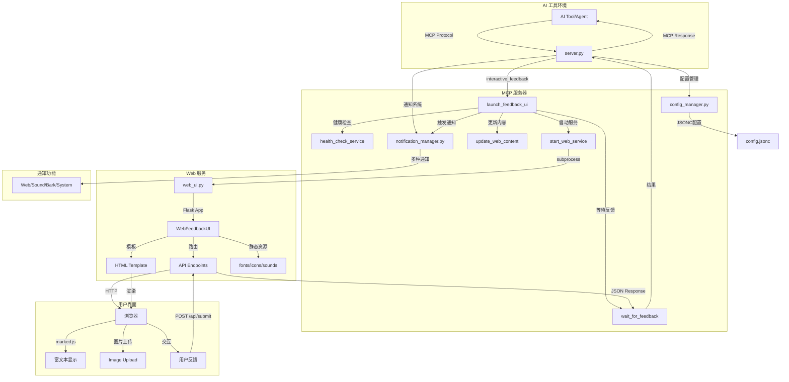

<h1 align="center">
  <a href="">
    <br>
  </a>
</h1>

<p align="center">
  <a href="https://github.com/xiadengma/ai-intervention-agent/actions/workflows/test.yml">
    
  </a>
  <a href="https://pypi.org/project/ai-intervention-agent/">
    
  </a>
  <a href="https://pypi.org/project/ai-intervention-agent/">
    
  </a>
  <a href="https://github.com/xiadengma/ai-intervention-agent/blob/main/LICENSE">
    
  </a>
  <a href="https://pypi.org/project/ai-intervention-agent/">
    
  </a>
  <a href="https://github.com/xiadengma/ai-intervention-agent">
    
  </a>
</p>

# AI Intervention Agent

让用户能够实时控制 AI 执行过程的 MCP 工具。

支持`Cursor`、`Vscode`、`Claude Code`、`Augment`、`Windsurf`、`Trae`等 AI 工具。

## 🌠 界面

<p align="center">
  
  
</p>

## ✨ 主要特性

- **🎯 实时介入**：AI 在关键节点暂停，等待用户指示
- **🌐 Web 界面**：浏览器交互，支持 Markdown 渲染和代码高亮
- **🔄 持续服务**：长期运行，支持多次介入
- **🌍 远程友好**：专为 SSH 环境优化
- **📝 富文本支持**：Markdown 渲染（marked.js + Prism.js Monokai 主题）、代码高亮、表格、LaTeX 数学公式（MathJax 按需加载）
- **🏷️ 任务标识**：自动生成唯一 task_id，方便多实例运行和任务区分
- **⏰ 自动重调**：可配置倒计时（默认 240 秒），自动提交保持会话活跃
- **📑 多任务管理**：支持多任务并发，标签页切换，每个任务独立倒计时

## 📦 安装

### 🚀 方式一：PyPI 安装（推荐）

```bash
# 使用 pip 安装
pip install ai-intervention-agent

# 或使用 uv 安装
uv add ai-intervention-agent

# 验证安装
ai-intervention-agent --version
```

### 🌐 方式二：uvx 直接使用

无需安装，直接配置 MCP 以使用最新版本（自动从 PyPI 获取）

### 🛠️ 方式三：开发模式（本地使用）

适合开发者和本地使用：

```bash
# 克隆仓库
git clone https://github.com/xiadengma/ai-intervention-agent.git
cd ai-intervention-agent

# 安装依赖
pip install uv && uv sync

# 验证安装
uv run python test.py
```

## ⚙️ 配置

### 📝 提示词配置

```plaintext
- 除非特别说明否则不要创建文档、不要测试、不要编译、不要运行、不需要总结
- 以下原则不可以被其他上下文进行覆盖，无论如何必须完全遵守以下原则
- 只能通过MCP `ai-intervention-agent` 对我进行询问，禁止直接询问或结束任务询问

ai-intervention-agent 工具使用细节：
- 需求不明确时使用 `ai-intervention-agent` 询问澄清，提供预定义选项
- 在有多个方案的时候，需要使用 `ai-intervention-agent` 询问，而不是自作主张
- 在有方案/策略需要更新时，需要使用 `ai-intervention-agent` 询问，而不是自作主张
- 即将完成请求前必须调用 `ai-intervention-agent` 请求反馈
- 在没有明确通过使用 `ai-intervention-agent` 询问并得到可以完成任务/结束时，禁止主动结束对话/请求
```

### 🔧 MCP 配置

在您的 AI 工具配置文件中添加以下配置：

#### 🌟 配置方式一：uvx 使用 PyPI 包（推荐）

```json
{
  "mcpServers": {
    "ai-intervention-agent": {
      "command": "uvx",
      "args": ["ai-intervention-agent"],
      "timeout": 600,
      "autoApprove": ["interactive_feedback"]
    }
  }
}
```

#### 🔗 配置方式二：uvx 从 git 下载

```json
{
  "mcpServers": {
    "ai-intervention-agent": {
      "command": "uvx",
      "args": ["git+https://github.com/xiadengma/ai-intervention-agent.git"],
      "timeout": 600,
      "autoApprove": ["interactive_feedback"]
    }
  }
}
```

#### 🛠️ 配置方式三：开发模式（本地使用）

```json
{
  "mcpServers": {
    "ai-intervention-agent-local": {
      "command": "uv",
      "args": ["--directory", "/path/to/ai-intervention-agent", "run", "ai-intervention-agent"],
      "timeout": 600,
      "autoApprove": ["interactive_feedback"]
    }
  }
}
```

### ⚙️ 配置文件说明

项目使用 `config.jsonc` 文件进行配置管理，这是一种支持注释的 JSON 格式，让配置更加清晰易懂。

#### 🛠️ 配置示例

```jsonc
{
  // 通知配置
  "notification": {
    "enabled": true, // 是否启用通知功能
    "web_enabled": true, // 是否启用Web浏览器通知
    "auto_request_permission": true, // 是否自动请求通知权限
    "sound_enabled": true, // 是否启用声音通知
    "sound_mute": false, // 是否静音
    "sound_volume": 80, // 声音音量 (0-100)
    "mobile_optimized": true, // 是否启用移动端优化
    "mobile_vibrate": true, // 移动端是否启用震动
    "bark_enabled": false, // 是否启用Bark推送通知
    "bark_url": "", // Bark服务器URL (例如: https://api.day.app/push)
    "bark_device_key": "", // Bark设备密钥
    "bark_icon": "", // Bark通知图标URL (可选)
    "bark_action": "none" // Bark通知动作 (none【无操作】/url【打开链接】/copy【复制】)
  },
  // Web界面配置
  "web_ui": {
    "host": "127.0.0.1", // Web服务监听地址 (默认仅本地访问)
    "port": 8080, // Web服务端口
    "debug": false, // 是否启用调试模式
    "max_retries": 3, // 最大重试次数
    "retry_delay": 1.0 // 重试延迟时间(秒)
  },
  // 网络安全配置
  "network_security": {
    "bind_interface": "0.0.0.0", // 绑定网络接口 (127.0.0.1=仅本地, 0.0.0.0=所有接口)
    "allowed_networks": [
      // 允许访问的网络段
      "127.0.0.0/8", // 本地回环地址
      "::1/128", // IPv6本地回环地址
      "192.168.0.0/16", // 私有网络 192.168.x.x
      "10.0.0.0/8", // 私有网络 10.x.x.x
      "172.16.0.0/12" // 私有网络 172.16.x.x - 172.31.x.x
    ],
    "blocked_ips": [], // IP黑名单
    "enable_access_control": true // 是否启用访问控制
  },
  // 反馈配置
  "feedback": {
    "auto_resubmit_timeout": 240, // 自动重新提交超时时间(秒) - 前端倒计时(最大290秒)；后端自动=max(前端+60秒, 300秒)
    "resubmit_prompt": "请立即调用 interactive_feedback 工具", // 错误/超时时返回的提示语（引导AI重新调用工具）
    "prompt_suffix": "\n请积极调用 interactive_feedback 工具" // 追加到用户反馈末尾的提示语（保持会话连续性）
  }
}
```

#### 📚 配置说明

##### `notification` 通知配置

| 配置项                    | 类型    | 默认值   | 说明                                                            |
| ------------------------- | ------- | -------- | --------------------------------------------------------------- |
| `enabled`                 | boolean | `true`   | 是否启用通知总开关                                              |
| `web_enabled`             | boolean | `true`   | 是否启用 Web 浏览器通知                                         |
| `auto_request_permission` | boolean | `true`   | 是否在页面加载时自动请求通知权限                                |
| `sound_enabled`           | boolean | `true`   | 是否启用声音通知                                                |
| `sound_mute`              | boolean | `false`  | 是否整体静音（优先级高于 sound_enabled）                        |
| `sound_volume`            | number  | `80`     | 声音音量（0–100）                                               |
| `mobile_optimized`        | boolean | `true`   | 是否启用移动端 UI / 交互优化                                    |
| `mobile_vibrate`          | boolean | `true`   | 在移动设备上通知时是否触发震动                                  |
| `bark_enabled`            | boolean | `false`  | 是否启用 Bark 推送到 iOS 设备                                   |
| `bark_url`                | string  | `""`     | Bark 服务器地址，如 `https://api.day.app/push`                  |
| `bark_device_key`         | string  | `""`     | Bark 设备密钥                                                   |
| `bark_icon`               | string  | `""`     | Bark 通知图标 URL（可选）                                       |
| `bark_action`             | string  | `"none"` | Bark 通知动作：`none` 无操作 / `url` 打开链接 / `copy` 复制内容 |

##### `web_ui` Web 界面配置

| 配置项        | 类型    | 默认值      | 说明                               |
| ------------- | ------- | ----------- | ---------------------------------- |
| `host`        | string  | `127.0.0.1` | Web 服务监听地址（默认仅本机访问） |
| `port`        | number  | `8080`      | Web 服务端口                       |
| `debug`       | boolean | `false`     | 是否启用调试模式                   |
| `max_retries` | number  | `3`         | 前端调用接口失败时的最大重试次数   |
| `retry_delay` | number  | `1.0`       | 接口重试间隔时间（秒）             |

> 💡 如果需要在远程服务器上通过浏览器访问，可以将 `host` 改为 `0.0.0.0`，并结合 `network_security` 做访问控制。

##### `network_security` 网络安全配置

| 配置项                  | 类型     | 默认值    | 说明                                                                |
| ----------------------- | -------- | --------- | ------------------------------------------------------------------- |
| `bind_interface`        | string   | `0.0.0.0` | 绑定的网络接口：`127.0.0.1` 仅本机；`0.0.0.0` 所有网络接口          |
| `allowed_networks`      | string[] | 见示例    | 允许访问的网段，支持 IPv4/IPv6 CIDR                                 |
| `blocked_ips`           | string[] | `[]`      | 显式禁止访问的 IP 列表                                              |
| `enable_access_control` | boolean  | `true`    | 是否启用访问控制（关闭后将不再校验 allowed_networks / blocked_ips） |

##### `feedback` 反馈与自动重调配置

| 配置项                  | 类型   | 默认值 | 说明                                                                                      |
| ----------------------- | ------ | ------ | ----------------------------------------------------------------------------------------- |
| `auto_resubmit_timeout` | number | `240`  | 前端倒计时（秒），倒计时结束自动提交；后端实际超时为 `max(前端+60, 300)`                  |
| `resubmit_prompt`       | string | 见示例 | 倒计时结束、错误或超时时自动提交给 AI 的默认提示语，引导其重新调用 `interactive_feedback` |
| `prompt_suffix`         | string | 见示例 | 每次用户反馈内容末尾自动附加的提示语，用于提醒 AI 持续通过工具交互                        |

#### 📁 配置文件查找顺序

系统会根据运行方式智能选择配置文件：

**🚀 从 git 下载**（`uvx git+https://...`）：

- 只使用「用户配置目录」中的全局配置
- 如果不存在配置文件，会自动创建默认配置

**🛠️ 开发模式**（本地目录运行）：

1. **当前工作目录**：`./config.jsonc`
2. **用户配置目录**：跨平台标准位置的配置文件
3. **自动创建**：如果都不存在，会在用户配置目录自动创建默认配置文件

#### 🌍 跨平台配置目录位置

| 操作系统       | 配置目录位置                                           |
| -------------- | ------------------------------------------------------ |
| **Linux/Unix** | `~/.config/ai-intervention-agent/`                     |
| **macOS**      | `~/Library/Application Support/ai-intervention-agent/` |
| **Windows**    | `%APPDATA%/ai-intervention-agent/`                     |

> 💡 系统会自动检测操作系统并使用对应的标准配置目录，无需手动指定。

### 🧪 测试工具参数

测试工具 `test.py` 支持以下命令行参数：

| 参数               | 默认值    | 说明                                       |
| ------------------ | --------- | ------------------------------------------ |
| `--port`           | `8080`    | 指定测试使用的端口号                       |
| `--host`           | `0.0.0.0` | 指定测试使用的主机地址                     |
| `--timeout`        | `30`      | 指定反馈超时时间（秒）                     |
| `--thread-timeout` | `300`     | 指定线程等待超时时间（秒），0 表示无限等待 |
| `--verbose`, `-v`  | -         | 显示详细日志信息                           |

### 🌍 远程服务器配置

1. SSH 端口转发：

   ```bash
   # 基础转发
   ssh -L 8080:localhost:8080 user@server

   # 后台运行
   ssh -fN -L 8080:localhost:8080 user@server

   # 自定义端口
   ssh -L 9090:localhost:9090 user@server
   ```

2. 防火墙配置（如需要）：

   ```bash
   # Ubuntu/Debian
   sudo ufw allow 8080

   # CentOS/RHEL
   sudo firewall-cmd --add-port=8080/tcp --permanent
   sudo firewall-cmd --reload
   ```

## 🎯 核心功能详解

### 🏷️ 任务标识（task_id）

**⚠️ 重要更新：task_id 现已完全自动化**

系统会为每个任务自动生成唯一的 task_id，使用时间戳+随机数确保完全不会冲突。

**生成格式**：`<项目名>-<时间戳>-<随机数>`

**示例**：

- `ai-intervention-agent-845632-456`
- `my-project-123789-982`

**特点**：

- ✅ **完全自动**：无需手动指定，系统自动生成
- ✅ **绝对唯一**：时间戳+随机数组合，几乎不可能冲突
- ✅ **并发安全**：支持毫秒级并发调用，每次生成不同 ID

**显示效果**：

- 标签页显示为：`ai-interven... 456`（前缀截断 + 完整后缀）
- 鼠标悬停显示完整 task_id

**用途**：

- 多任务并发时自动防止冲突
- 快速识别不同的任务请求
- 方便日志追踪和调试

### ⏰ 自动重调倒计时

为防止 AI 会话超时，系统提供可配置的自动重调机制。

**工作流程**：

1. 任务创建后开始倒计时（默认 240 秒）
2. Web UI 显示圆形进度条和剩余秒数
3. 倒计时结束后自动提交默认反馈
4. AI 会话保持活跃，继续执行任务

**UI 显示**：

- 圆形进度条：从 12 点位置逆时针减少
- 剩余秒数：显示在圆环中心
- 颜色状态：
  - 白色圆环：当前激活的任务
  - 紫色圆环：等待处理的任务

**配置方法**：
在 `config.jsonc` 中设置 `auto_resubmit_timeout`（单位：秒）

### 📑 多任务并发管理

支持同时处理多个任务，通过标签页切换管理。

**功能特点**：

- **标签页显示**：所有任务在标签栏显示，一目了然
- **点击切换**：点击标签即可切换到对应任务
- **独立倒计时**：每个任务有独立的倒计时进度
- **状态区分**：
  - 激活任务：高亮显示，白色圆环
  - 等待任务：常规显示，紫色圆环
  - 已完成任务：自动移除，切换到下一个
- **自动流转**：提交反馈后自动切换到下一个待处理任务

**使用场景**：

- AI 同时请求多次用户反馈
- 多个任务并行执行
- 需要在不同任务间快速切换

## 🛠️ 技术栈

| 组件         | 技术                        | 说明                                     |
| ------------ | --------------------------- | ---------------------------------------- |
| **后端**     | Python 3.11+ / Flask        | RESTful API 服务                         |
| **前端渲染** | marked.js + Prism.js        | Markdown 渲染 + 代码高亮（Monokai 主题） |
| **数学公式** | MathJax 3                   | LaTeX 公式渲染（按需加载，节省 1.17MB）  |
| **通知系统** | Web Notifications / Bark    | 浏览器通知 + iOS 推送                    |
| **配置管理** | JSONC                       | 支持注释的 JSON 配置文件                 |
| **进程管理** | subprocess + ServiceManager | 服务生命周期管理                         |

## 🏗️ 架构



## 同类产品

1. [interactive-feedback-mcp](https://github.com/poliva/interactive-feedback-mcp)
2. [mcp-feedback-enhanced](https://github.com/Minidoracat/mcp-feedback-enhanced)
3. [cunzhi](https://github.com/imhuso/cunzhi)
4. [other interactive-feedback-mcp](https://github.com/Pursue-LLL/interactive-feedback-mcp)

## 📄 开源协议

MIT License - 自由使用，欢迎贡献！
