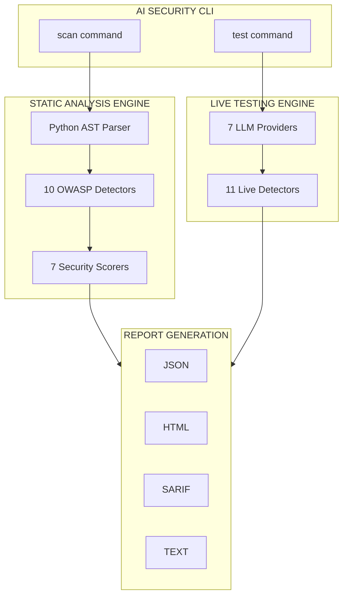
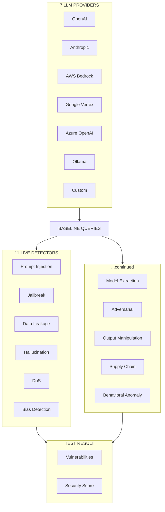
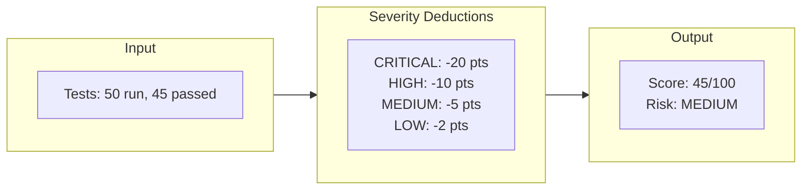
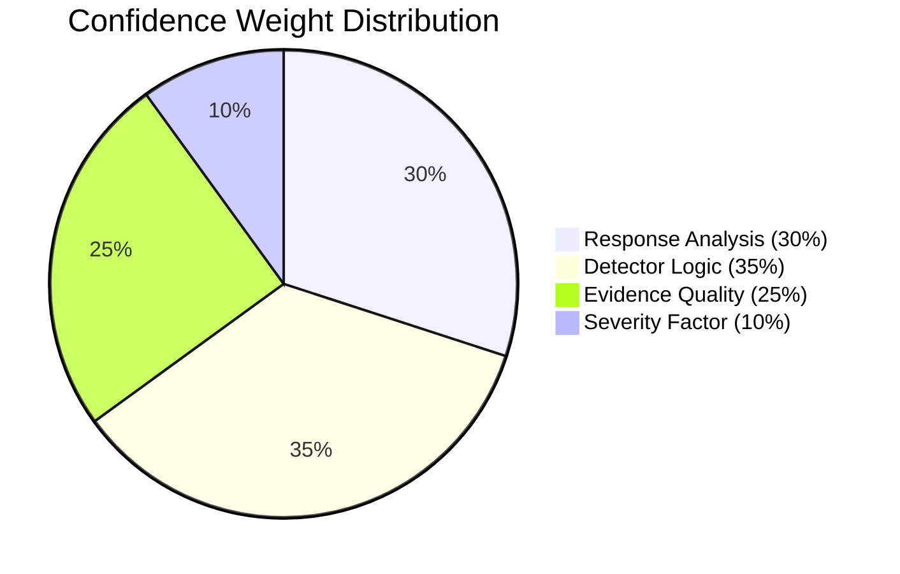

# AI Security CLI

A unified command-line tool for AI/LLM security scanning and testing. Combines static code analysis with live model testing to provide comprehensive security assessment for AI applications.

## Features

- **Static Code Analysis**: Scan Python codebases for OWASP LLM Top 10 vulnerabilities
- **Live Model Testing**: Test live LLM models for security vulnerabilities via API
- **Remote Repository Scanning**: Scan GitHub, GitLab, and Bitbucket repositories directly via URL
- **Multiple Providers**: Support for OpenAI, Anthropic, AWS Bedrock, Google Vertex AI, Azure OpenAI, Ollama, and custom endpoints
- **Interactive HTML Reports**: Rich reports with real-time filtering by severity, category, and text search
- **SARIF Output**: CI/CD integration with GitHub Code Scanning, Azure DevOps, VS Code, and more
- **4-Factor Confidence Scoring**: Advanced confidence calculation for accurate vulnerability assessment

## Installation

```bash
# Basic installation
pip install ai-security-cli

# With cloud provider support
pip install ai-security-cli[cloud]

# Development installation
pip install ai-security-cli[dev]

# Full installation with all features
pip install ai-security-cli[all]
```

## Quick Start

```bash
# Static code analysis (local)
ai-security-cli scan ./my_project

# Static code analysis (remote GitHub repository)
ai-security-cli scan https://github.com/langchain-ai/langchain

# Live model testing
export OPENAI_API_KEY=sk-...
ai-security-cli test -p openai -m gpt-4 --mode quick

# Generate HTML report
ai-security-cli scan ./my_project -o html -f security_report.html
```

## Architecture

### High-Level Overview



### Static Analysis Flow

```
┌──────────────────────────────────────────────────────────────────────────────────┐
│                           STATIC ANALYSIS PIPELINE                                │
└──────────────────────────────────────────────────────────────────────────────────┘

  ┌─────────┐      ┌─────────────┐      ┌────────────────────────────────────────┐
  │ Python  │      │  AST Parser │      │         10 OWASP DETECTORS             │
  │  Code   │─────▶│  & Pattern  │─────▶│                                        │
  │ (.py)   │      │  Extractor  │      │  ┌──────────┐ ┌──────────┐ ┌────────┐ │
  └─────────┘      └─────────────┘      │  │  LLM01   │ │  LLM02   │ │ LLM03  │ │
                                        │  │  Prompt  │ │ Insecure │ │Training│ │
                                        │  │ Injection│ │  Output  │ │Poison  │ │
                                        │  └──────────┘ └──────────┘ └────────┘ │
                                        │  ┌──────────┐ ┌──────────┐ ┌────────┐ │
                                        │  │  LLM04   │ │  LLM05   │ │ LLM06  │ │
                                        │  │Model DoS │ │  Supply  │ │Secrets │ │
                                        │  │          │ │  Chain   │ │        │ │
                                        │  └──────────┘ └──────────┘ └────────┘ │
                                        │  ┌──────────┐ ┌──────────┐ ┌────────┐ │
                                        │  │  LLM07   │ │  LLM08   │ │ LLM09  │ │
                                        │  │ Insecure │ │Excessive │ │  Over  │ │
                                        │  │  Plugin  │ │ Agency   │ │reliance│ │
                                        │  └──────────┘ └──────────┘ └────────┘ │
                                        │  ┌──────────┐                         │
                                        │  │  LLM10   │                         │
                                        │  │  Model   │                         │
                                        │  │  Theft   │                         │
                                        │  └──────────┘                         │
                                        └───────────────────┬────────────────────┘
                                                            │
                                                            ▼
  ┌────────────────────────────────────────────────────────────────────────────────┐
  │                            7 SECURITY SCORERS                                   │
  │                                                                                 │
  │   ┌──────────┐ ┌──────────┐ ┌──────────┐ ┌──────────┐ ┌──────────┐            │
  │   │  Prompt  │ │  Model   │ │   Data   │ │Hallucin- │ │ Ethical  │            │
  │   │ Security │ │ Security │ │ Privacy  │ │  ation   │ │    AI    │            │
  │   └──────────┘ └──────────┘ └──────────┘ └──────────┘ └──────────┘            │
  │   ┌──────────┐ ┌──────────┐                                                    │
  │   │Governance│ │  OWASP   │                                                    │
  │   │          │ │  Score   │                                                    │
  │   └──────────┘ └──────────┘                                                    │
  └───────────────────────────────────────────┬────────────────────────────────────┘
                                              │
                                              ▼
                            ┌─────────────────────────────────┐
                            │          SCAN RESULT            │
                            │  ┌───────────┐ ┌─────────────┐  │
                            │  │ Findings  │ │  Category   │  │
                            │  │           │ │   Scores    │  │
                            │  └───────────┘ └─────────────┘  │
                            │  ┌───────────┐ ┌─────────────┐  │
                            │  │  Overall  │ │ Confidence  │  │
                            │  │   Score   │ │             │  │
                            │  └───────────┘ └─────────────┘  │
                            └─────────────────────────────────┘
```

### Live Testing Flow



### Component Architecture

```
┌─────────────────────────────────────────────────────────────────────────────────┐
│                           ai_security package                                    │
├─────────────────────────────────────────────────────────────────────────────────┤
│                                                                                  │
│  ┌─────────────────────────────────────────────────────────────────────────┐    │
│  │                           CLI LAYER (cli.py)                             │    │
│  │                                                                          │    │
│  │    scan command ─────────────────────────── test command                 │    │
│  │         │                                        │                       │    │
│  └─────────┼────────────────────────────────────────┼───────────────────────┘    │
│            │                                        │                            │
│            ▼                                        ▼                            │
│  ┌──────────────────────────┐          ┌──────────────────────────┐             │
│  │      CORE LAYER          │          │       CORE LAYER         │             │
│  │                          │          │                          │             │
│  │  ┌────────────────────┐  │          │  ┌────────────────────┐  │             │
│  │  │    scanner.py      │  │          │  │     tester.py      │  │             │
│  │  │ Static Scanner     │  │          │  │   Live Tester      │  │             │
│  │  └────────────────────┘  │          │  └────────────────────┘  │             │
│  └────────────┬─────────────┘          └────────────┬─────────────┘             │
│               │                                     │                            │
│      ┌────────┴────────┐                   ┌────────┴────────┐                  │
│      ▼                 ▼                   ▼                 ▼                  │
│  ┌────────────┐  ┌────────────┐      ┌────────────┐   ┌────────────┐           │
│  │  STATIC    │  │  SCORERS   │      │   LIVE     │   │ PROVIDERS  │           │
│  │ DETECTORS  │  │            │      │ DETECTORS  │   │            │           │
│  ├────────────┤  ├────────────┤      ├────────────┤   ├────────────┤           │
│  │llm01_promp │  │owasp_score │      │prompt_inje │   │openai_prov │           │
│  │llm02_insec │  │prompt_secu │      │jailbreak   │   │anthropic_p │           │
│  │llm03_train │  │model_secur │      │data_leakag │   │bedrock_pro │           │
│  │llm04_model │  │data_privac │      │hallucinati │   │vertex_prov │           │
│  │llm05_suppl │  │hallucinati │      │dos         │   │azure_provi │           │
│  │llm06_secre │  │ethical_ai_ │      │bias        │   │ollama_prov │           │
│  │llm07_insec │  │governance_ │      │model_extra │   │custom_prov │           │
│  │llm08_exces │  └────────────┘      │adversarial │   └────────────┘           │
│  │llm09_overr │                      │output_mani │                             │
│  │llm10_model │                      │supply_chai │                             │
│  └────────────┘                      │behavioral_ │                             │
│                                      └────────────┘                             │
│                                             │                                    │
│                                             ▼                                    │
│                                      ┌────────────┐                             │
│                                      │  UTILITIES │                             │
│                                      ├────────────┤                             │
│                                      │markov_chai │                             │
│                                      │entropy     │                             │
│                                      │scoring     │                             │
│                                      │statistical │                             │
│                                      └────────────┘                             │
│                                                                                  │
│  ┌─────────────────────────────────────────────────────────────────────────┐    │
│  │                          REPORTERS                                       │    │
│  │   ┌─────────────┐  ┌─────────────┐  ┌─────────────┐  ┌─────────────┐    │    │
│  │   │base_reporter│  │json_reporter│  │html_reporter│  │sarif_report │    │    │
│  │   └─────────────┘  └─────────────┘  └─────────────┘  └─────────────┘    │    │
│  └─────────────────────────────────────────────────────────────────────────┘    │
│                                                                                  │
│  ┌─────────────────────────────────────────────────────────────────────────┐    │
│  │                           MODELS                                         │    │
│  │   ┌─────────────┐    ┌─────────────┐    ┌─────────────┐                 │    │
│  │   │  finding.py │    │vulnerability│    │  result.py  │                 │    │
│  │   │  (Static)   │    │    .py      │    │  (Unified)  │                 │    │
│  │   └─────────────┘    └─────────────┘    └─────────────┘                 │    │
│  └─────────────────────────────────────────────────────────────────────────┘    │
│                                                                                  │
└─────────────────────────────────────────────────────────────────────────────────┘
```

### Security Score Calculation



### 4-Factor Confidence Calculation



## CLI Commands

### Static Code Analysis (`scan`)

Scan Python code for OWASP LLM Top 10 vulnerabilities. Supports local files/directories and remote Git repositories.

```bash
ai-security-cli scan <path> [OPTIONS]
```

**Path Options:**

| Path Type | Example |
|-----------|---------|
| Local file | `./app.py` |
| Local directory | `./my_project` |
| GitHub URL | `https://github.com/user/repo` |
| GitLab URL | `https://gitlab.com/user/repo` |
| Bitbucket URL | `https://bitbucket.org/user/repo` |

**Options:**

| Option | Description | Default |
|--------|-------------|---------|
| `-o, --output` | Output format: text, json, html, sarif | text |
| `-f, --output-file` | Write output to file | - |
| `-s, --severity` | Minimum severity: critical, high, medium, low, info | info |
| `-c, --confidence` | Minimum confidence threshold (0.0-1.0) | 0.7 |
| `--category` | Filter by OWASP category (LLM01-LLM10) | all |
| `-v, --verbose` | Enable verbose output | false |

**Examples:**

```bash
# Scan a local project directory
ai-security-cli scan ./my_llm_app

# Scan with JSON output
ai-security-cli scan ./app.py -o json -f results.json

# Scan for high severity issues only
ai-security-cli scan ./project -s high

# Scan specific OWASP categories
ai-security-cli scan ./project --category LLM01 --category LLM02

# Generate HTML report
ai-security-cli scan ./project -o html -f security_report.html

# Scan a GitHub repository directly
ai-security-cli scan https://github.com/langchain-ai/langchain

# Scan a GitLab repository with HTML report
ai-security-cli scan https://gitlab.com/user/llm-app -o html -f report.html
```

### Live Model Testing (`test`)

Test live LLM models for security vulnerabilities.

```bash
ai-security-cli test [OPTIONS]
```

**Options:**

| Option | Description | Default |
|--------|-------------|---------|
| `-p, --provider` | LLM provider (required) | - |
| `-m, --model` | Model name (required) | - |
| `-e, --endpoint` | Custom endpoint URL | - |
| `-t, --tests` | Specific tests to run | all |
| `--mode` | Testing depth: quick, standard, comprehensive | standard |
| `-o, --output` | Output format: text, json, html, sarif | text |
| `-f, --output-file` | Write output to file | - |
| `--timeout` | Timeout per test in seconds | 30 |
| `--parallelism` | Maximum concurrent tests | 5 |
| `-v, --verbose` | Enable verbose output | false |

**Supported Providers:**

| Provider | Environment Variables |
|----------|----------------------|
| `openai` | `OPENAI_API_KEY` |
| `anthropic` | `ANTHROPIC_API_KEY` |
| `bedrock` | `AWS_ACCESS_KEY_ID`, `AWS_SECRET_ACCESS_KEY` |
| `vertex` | `GOOGLE_APPLICATION_CREDENTIALS` |
| `azure` | `AZURE_OPENAI_API_KEY`, `AZURE_OPENAI_ENDPOINT` |
| `ollama` | None (local) |
| `custom` | `CUSTOM_API_KEY` (optional) |

**Examples:**

```bash
# Quick test with OpenAI
export OPENAI_API_KEY=sk-...
ai-security-cli test -p openai -m gpt-4 --mode quick

# Comprehensive test with Anthropic
export ANTHROPIC_API_KEY=...
ai-security-cli test -p anthropic -m claude-3-opus --mode comprehensive

# Test specific vulnerabilities
ai-security-cli test -p openai -m gpt-4 -t prompt-injection -t jailbreak

# Test with Ollama (local)
ai-security-cli test -p ollama -m llama2 --mode standard

# Generate HTML report
ai-security-cli test -p openai -m gpt-4 -o html -f test_report.html

# Test with custom endpoint
ai-security-cli test -p custom -m my-model -e https://api.example.com/v1
```

### List Available Tests (`list-tests`)

```bash
ai-security-cli list-tests
```

## OWASP LLM Top 10 Coverage

### Static Analysis Detectors

| ID | Vulnerability | Description |
|----|---------------|-------------|
| LLM01 | Prompt Injection | Detects unsanitized user input in prompts, f-string injection, template vulnerabilities |
| LLM02 | Insecure Output Handling | Identifies unvalidated LLM output used in sensitive operations |
| LLM03 | Training Data Poisoning | Finds unsafe data loading, pickle usage, unvalidated training data |
| LLM04 | Model Denial of Service | Detects missing rate limiting, unbounded loops, no timeout configuration |
| LLM05 | Supply Chain Vulnerabilities | Identifies unsafe model loading, unverified downloads, dependency risks |
| LLM06 | Sensitive Information Disclosure | Finds hardcoded secrets, API keys, credentials in code |
| LLM07 | Insecure Plugin Design | Detects unsafe plugin loading, dynamic code execution |
| LLM08 | Excessive Agency | Identifies autonomous actions without human oversight |
| LLM09 | Overreliance | Finds missing output validation, no fact-checking mechanisms |
| LLM10 | Model Theft | Detects exposed model artifacts, unprotected weights |

### Live Testing Detectors

| ID | Detector | Description |
|----|----------|-------------|
| PI | Prompt Injection | Tests for direct/indirect prompt injection vulnerabilities |
| JB | Jailbreak | Tests for DAN, roleplay, and instruction bypass attacks |
| DL | Data Leakage | Tests for PII exposure, system prompt leakage |
| HAL | Hallucination | Tests for factual accuracy and logical consistency |
| DOS | Denial of Service | Tests for resource exhaustion vulnerabilities |
| BIAS | Bias Detection | Tests for demographic bias in responses |
| ME | Model Extraction | Tests for model architecture/parameter disclosure |
| ADV | Adversarial Inputs | Tests for unicode, homoglyph, and encoding attacks |
| OM | Output Manipulation | Tests for response injection and format hijacking |
| SC | Supply Chain | Tests for unsafe code generation recommendations |
| BA | Behavioral Anomaly | Tests for unexpected behavioral changes |

## Confidence Scoring

### 4-Factor Confidence Calculation

The live testing engine uses a sophisticated 4-factor confidence calculation:

| Factor | Weight | Description |
|--------|--------|-------------|
| Response Analysis | 30% | How clearly the response indicates vulnerability |
| Detector Logic | 35% | Strength of detection algorithm match |
| Evidence Quality | 25% | Quality and completeness of evidence |
| Severity Factor | 10% | Impact factor of the finding |

**Formula:**
```
Confidence = (RA × 0.30) + (DL × 0.35) + (EQ × 0.25) + (SF × 0.10)
```

## Output Formats

### Text Output

Default human-readable output with rich formatting.

### JSON Output

Machine-readable JSON format for CI/CD integration:

```json
{
  "report_type": "static_scan",
  "generated_at": "2026-01-15T10:30:00Z",
  "summary": {
    "target": "./my_project",
    "files_scanned": 15,
    "overall_score": 72.5,
    "confidence": 0.85,
    "findings_count": 8
  },
  "findings": [...],
  "category_scores": [...]
}
```

### HTML Output

Professional HTML reports with embedded styling and interactive features:

- Executive summary with score visualization
- Severity breakdown charts
- Detailed findings with code snippets
- Remediation recommendations
- Category-wise analysis

**Interactive Filtering:**

- **Filter by Severity** - Click colored chips to show/hide CRITICAL, HIGH, MEDIUM, LOW, INFO findings
- **Filter by Category** - Toggle OWASP LLM categories (LLM01-LLM10) or detector types
- **Text Search** - Real-time search across all finding content
- **Quick Actions** - "All", "None", and "Reset" buttons for fast filtering

### SARIF Output

SARIF (Static Analysis Results Interchange Format) output for CI/CD integration:

```bash
# Generate SARIF report
ai-security-cli scan ./project -o sarif -f results.sarif
```

Compatible with: GitHub Code Scanning, Azure DevOps, VS Code SARIF Viewer, GitLab SAST, SonarQube

## Project Structure

```
ai-security-cli/
├── pyproject.toml
├── README.md
├── LICENSE
├── src/
│   └── ai_security/
│       ├── cli.py                      # CLI entry point
│       ├── core/                       # Scanner and Tester
│       ├── models/                     # Data models
│       ├── parsers/                    # AST parser
│       ├── static_detectors/           # 10 OWASP detectors
│       ├── live_detectors/             # 11 live detectors
│       ├── providers/                  # 7 LLM providers
│       ├── scorers/                    # 7 security scorers
│       ├── reporters/                  # JSON, HTML, SARIF
│       └── utils/                      # Utilities
└── tests/
```

## Integration

### GitHub Actions

```yaml
name: AI Security Scan

on: [push, pull_request]

jobs:
  security-scan:
    runs-on: ubuntu-latest
    steps:
      - uses: actions/checkout@v3
      - uses: actions/setup-python@v4
        with:
          python-version: '3.11'
      - run: pip install ai-security-cli
      - run: ai-security-cli scan . -o sarif -f results.sarif
      - uses: github/codeql-action/upload-sarif@v2
        with:
          sarif_file: results.sarif
```

### Pre-commit Hook

```yaml
# .pre-commit-config.yaml
repos:
  - repo: local
    hooks:
      - id: ai-security-scan
        name: AI Security Scan
        entry: ai-security-cli scan
        language: system
        types: [python]
        args: ['-s', 'high', '-c', '0.8']
```

## Development

```bash
git clone https://github.com/deosha/ai-security-cli.git
cd ai-security-cli
pip install -e ".[dev]"
pytest tests/ -v --cov=ai_security
```

## License

MIT License - see [LICENSE](LICENSE) for details.

## Support

- Issues: [GitHub Issues](https://github.com/deosha/ai-security-cli/issues)
- Discussions: [GitHub Discussions](https://github.com/deosha/ai-security-cli/discussions)
