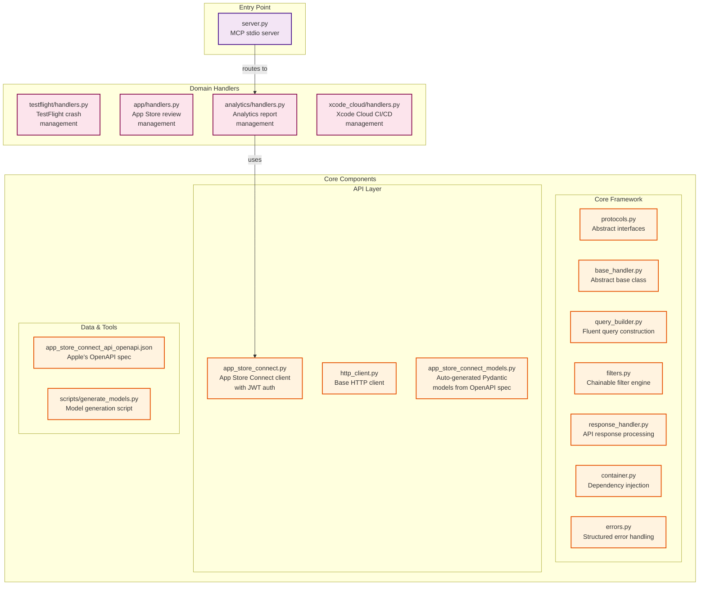

## App Store Connect MCP Server

<!-- mcp-name: io.github.gjeltep/app-store-connect-mcp -->

[](https://github.com/gjeltep/app-store-connect-mcp/actions/workflows/test.yml)
[](https://pypi.org/project/app-store-connect-mcp/)
[](https://pypi.org/project/app-store-connect-mcp/)
[](https://registry.modelcontextprotocol.io)

Talk to App Store Connect about your app. Modular tools, async I/O, and OpenAPI‑driven typing so your agent stays accurate as Apple evolves.

### Why this is different
- **Spec‑aware**: Fields and enums are derived from Apple’s OpenAPI spec at runtime, reducing drift and surprise breakage.
- **Fast by default**: Async `httpx` client, server‑side filtering, and smart pagination to keep payloads lean.
- **Smart filtering**: Server‑side + client‑side filtering with chainable filter engine for complex queries.
- **Modular domains**: Clean separation of tool schemas and handlers; add new domains without touching the core; optimized LLM discovery/ usage
- **MCP‑native**: Stdio transport, capability declarations, and tool wiring align with the official SDK [python‑sdk README](https://github.com/modelcontextprotocol/python-sdk?tab=readme-ov-file).

### Installation

#### From PyPI

```bash
pip install app-store-connect-mcp
```

#### From Source

```bash
git clone https://github.com/gjeltep/app-store-connect-mcp.git
cd app-store-connect-mcp
uv pip install -e ".[dev]"
```

### Configuration

Set these environment variables:

```bash
# Required
export APP_STORE_KEY_ID="YOUR_KEY_ID"
export APP_STORE_ISSUER_ID="YOUR_ISSUER_ID"
export APP_STORE_PRIVATE_KEY_PATH="/path/to/AuthKey_XXXXX.p8"

# Optional
export APP_STORE_APP_ID="YOUR_APP_ID"
export APP_STORE_KEY_TYPE="team"  # or "individual"
```

### Usage

Run with your environment variables set (recommended):

```bash
app-store-connect-mcp
```

Or use a `.env` file during development:

```bash
# Copy and configure .env file
cp .env.example .env
# Edit .env with your credentials

# Run with --env-file flag
app-store-connect-mcp-dev --env-file .env

# Validate configuration without starting server
app-store-connect-mcp-dev --env-file .env --validate-only
```

Use with any MCP‑compatible client; the server announces tools and handles calls over stdio.

### Generate or update API models

Models are generated from Apple's official OpenAPI spec (fetched automatically from [Apple's developer site](https://developer.apple.com/sample-code/app-store-connect/app-store-connect-openapi-specification.zip)).
You can override the source with `APP_STORE_CONNECT_OPENAPI_URL` to point to a local JSON file.

```bash
uv pip install -e .[dev]
python scripts/generate_models.py
```

### Development

For development setup, testing, and contribution guidelines, see [CONTRIBUTING.md](CONTRIBUTING.md).

### Tools

Tools use a resource-first naming convention (`resource.verb`) with category tags for discoverability.

#### App Tools
- **reviews.list**: List customer reviews with filters (`rating`, `territory`, `appStoreVersion`).
- **reviews.search**: Advanced search with rating ranges, territory matching, date windows, and content search.
- **reviews.get**: Get detailed review information.

#### TestFlight Tools
- **crashes.list**: List crash submissions from beta testers with filters (`device_model`, `os_version`, `app_platform`, `device_platform`, `build_id`, `tester_id`).
- **crashes.search**: Advanced search with:
  - Server‑side filters (`appPlatform`, `deviceModel`, `osVersion`)
  - Post‑filters: OS ranges (min/max), device model substrings (e.g., "iPhone 15"), and date windows (`created_since_days`, `created_after`, `created_before`).
- **crashes.get_by_id**: Get detailed information about a specific crash submission.
- **crashes.get_log**: Retrieve the raw crash log text for a specific submission.

#### Analytics Tools
**Requests:**
- **analytics_report_requests.list**: List analytics report requests for an app with filters (`access_type`).
- **report_requests.create**: Create new analytics report requests for specific metrics and timeframes.
- **report_requests.get**: Get detailed information about a specific analytics report request.

**Reports:**
- **report_requests.list_reports**: List available reports within a request with filters (`name`, `category`).
- **reports.get**: Get specific analytics report information.
- **reports.list_instances**: List report instances with filters (`granularity`, `processing_date`).
- **report_instances.get**: Get detailed information about a specific report instance.

**Segments:**
- **report_instances.list_segments**: List data segments for a report instance.
- **report_segments.get**: Get segment download information (checksum, URL, size).
- **report_instances.download_data**: Download analytics report data to a TSV file.

#### Xcode Cloud Tools
**Products & Workflows:**
- **products.list**: List all Xcode Cloud products with filters (`product_type`).
- **products.get**: Get detailed information about a specific product.
- **workflows.list**: List workflows for a product with filters (`is_enabled`).
- **workflows.get**: Get detailed workflow information (note: create/update/delete operations not supported for safety).

**Builds:**
- **builds.list**: List builds for a product or workflow with filters (`execution_progress`, `completion_status`, `is_pull_request_build`).
- **builds.get**: Get detailed build information including status, duration, and issue counts.
- **builds.start**: Start a new build for a workflow with optional branch/tag or pull request specification.

**Build Artifacts & Results:**
- **artifacts.list**: List downloadable artifacts for a build.
- **issues.list**: List issues (errors, warnings) for builds or workflows.
- **test_results.list**: List test results including status, duration, and failure messages.

**SCM Integration:**
- **scm_providers.list**: List configured SCM providers (GitHub, GitLab, Bitbucket).
- **repositories.list**: List Git repositories for an SCM provider.
- **pull_requests.list**: List pull requests for a repository.
- **git_references.list**: List branches and tags for a repository.

### Architecture



### Credits

Built on the official Model Context Protocol Python SDK — see the docs and examples in the
[python‑sdk README](https://github.com/modelcontextprotocol/python-sdk?tab=readme-ov-file).

---

See [CONTRIBUTING.md](CONTRIBUTING.md) if you'd like to help.