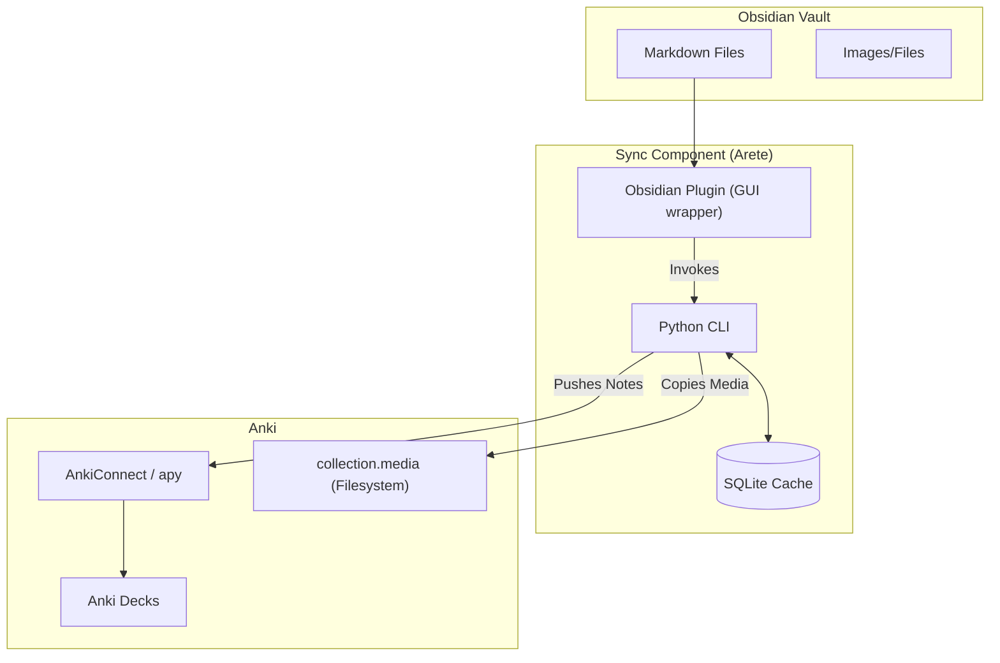

# Arete (formerly o2a)

**Pro-grade synchronization from Obsidian to Anki.**

`arete` is a robust, fast, and feature-rich tool that adheres to a strict **One-Way Sync** philosophy: **Obsidian is the Source of Truth**.



---

## 📚 Documentation
- **[CLI Guide](./docs/cli_guide.md)**: Command-line usage, configuration, and syntax.
- **[Obsidian Plugin Guide](./docs/plugin_guide.md)**: Installation and usage of the Obsidian plugin.
- **[Architecture](./docs/ARCHITECTURE.md)**: Deep dive into how it works.
- **[Troubleshooting](./docs/troubleshooting.md)**: Common fixes for WSL, networking, and sync issues.

---

## Quick Start

### 1. Install CLI (Python)
Ensure you have [uv](https://github.com/astral-sh/uv) installed.
```bash
git clone https://github.com/Adanato/obsidian_2_anki
cd obsidian_2_anki
uv sync
```

### 2. Install Plugin (Optional)
Download `main.js`, `manifest.json`, `styles.css` from [Releases](https://github.com/Adanato/obsidian_2_anki/releases) and place in `.obsidian/plugins/obsidian-2-anki`.

### 3. Initialize & Sync
```bash
uv run arete init   # Set up your vault path
uv run arete sync   # First sync (will scan and link cards)
```

## Key Features
- ⚡ **Fast**: SQLite caching skips unchanged files, making syncs near-instant.
- 🧹 **Prune Mode**: Automatically removes cards from Anki that you've deleted in Obsidian.
- 🩹 **Self-Healing**: Fixes duplicate IDs or broken links automatically.
- 📐 **MathJax/LaTeX**: Native protection for complex mathematical notation.
- 📸 **Media Support**: Full synchronization of local images and attachments.
- 💻 **WSL Friendly**: Specialized bridge for Windows Subsystem for Linux users.

## License
MIT

## Roadmap
- [ ] **Community Plugin**: Official Obsidian Community Plugins list submission.
- [ ] **PyPI Release**: Publish as `obsianki` via `uv publish`.
- [ ] **Cloud Sync**: Research remote sync strategies.
