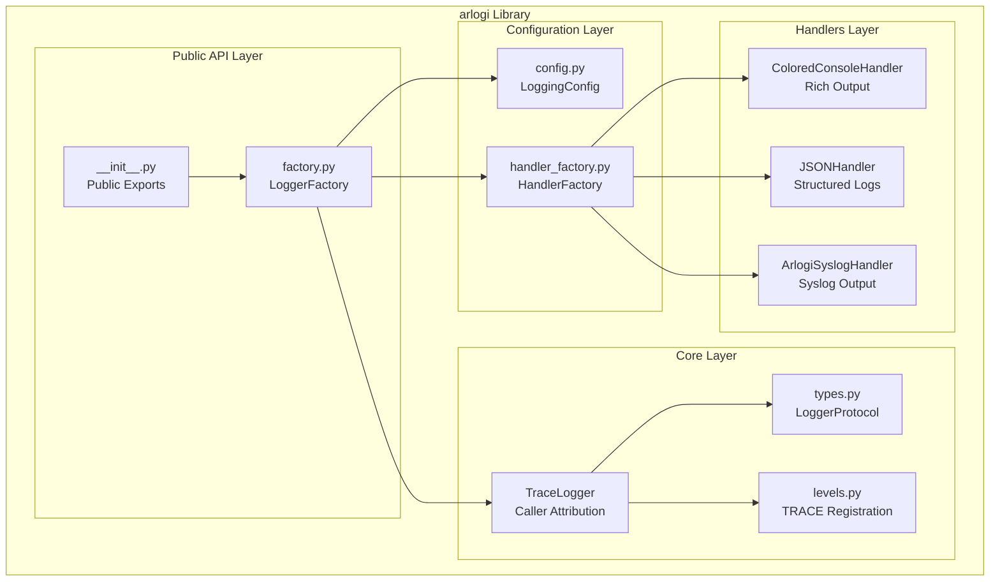
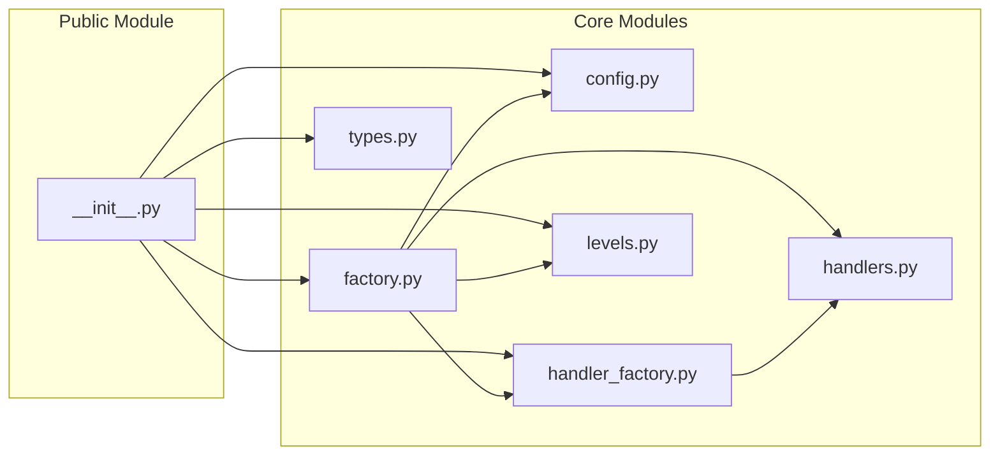
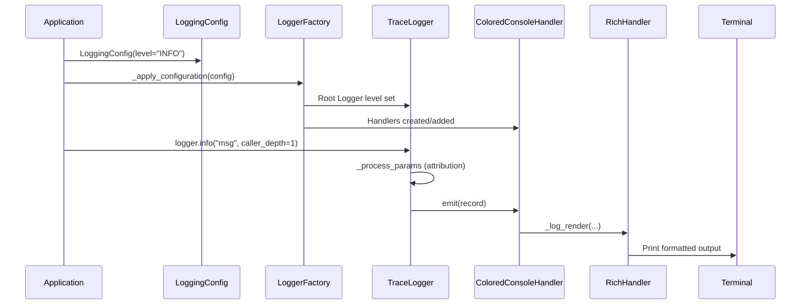
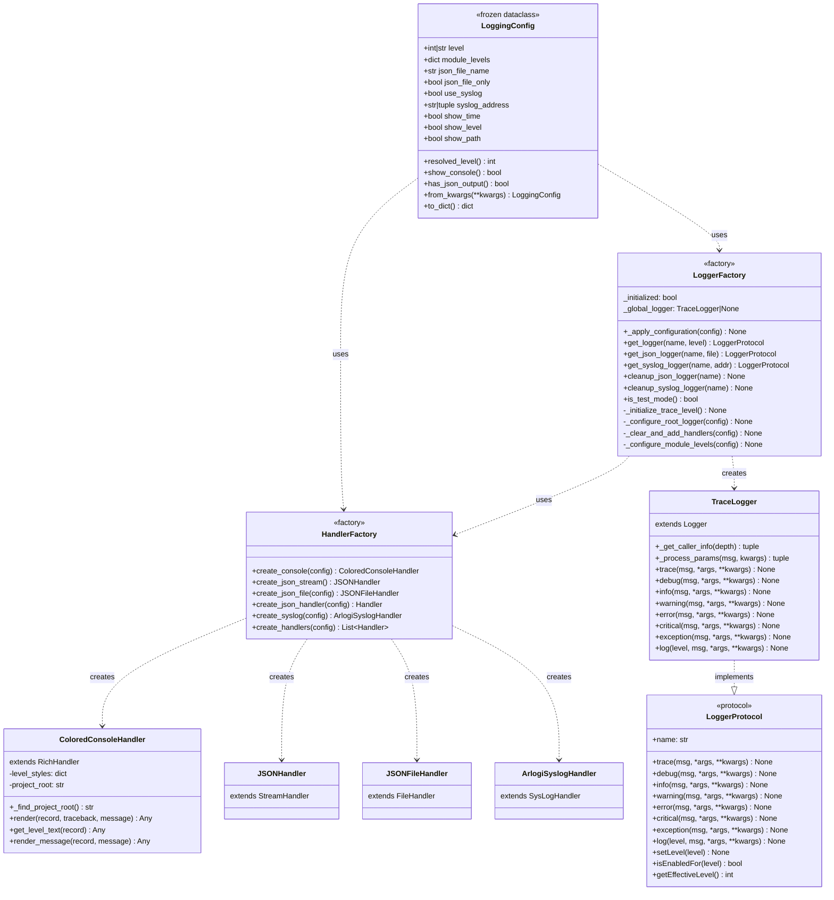
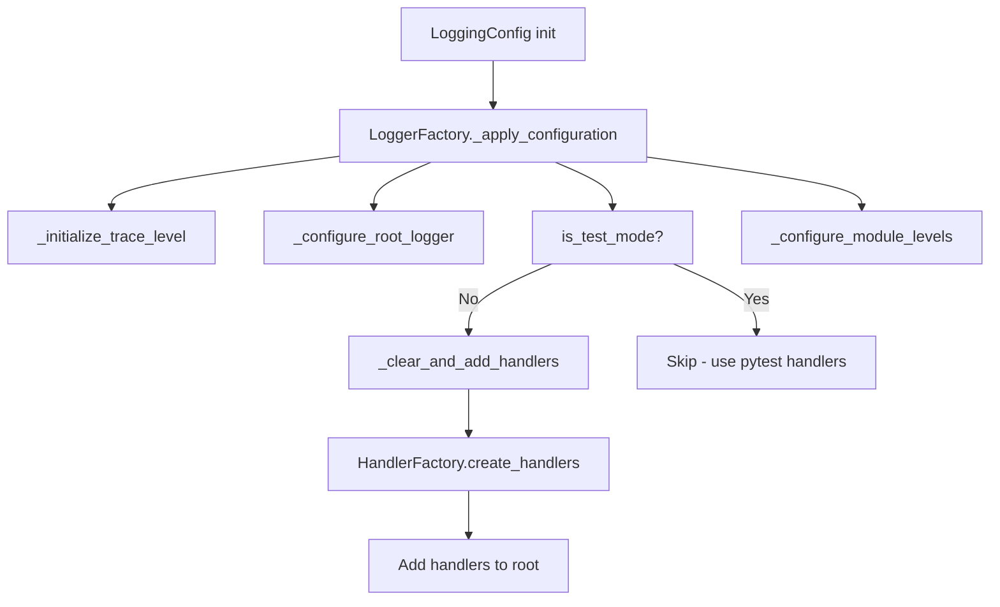
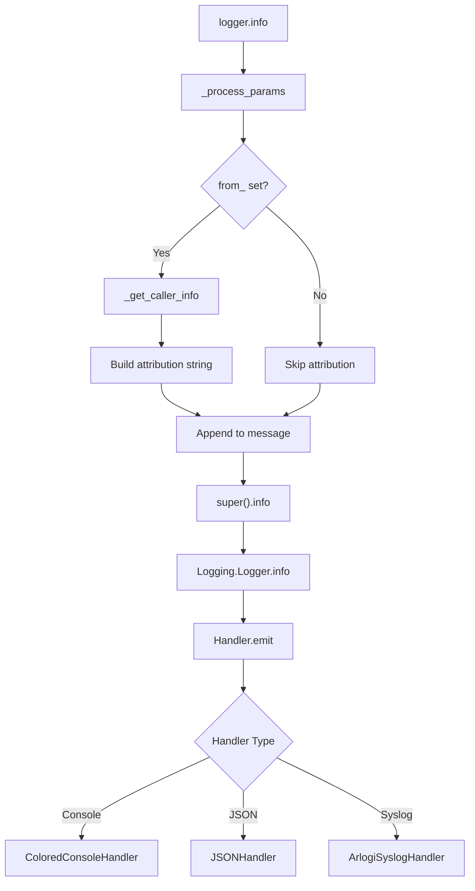
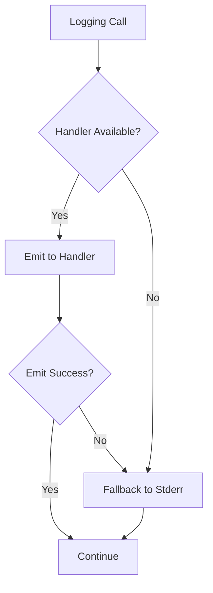

# Arlogi Architecture Documentation

This document describes the architecture, design patterns, and internal structure of the arlogi logging library.

---

## Table of Contents

- [System Overview](#system-overview)
- [Architecture Diagrams](#architecture-diagrams)
- [Design Patterns](#design-patterns)
- [Component Reference](#component-reference)
- [Data Flow](#data-flow)
- [Extensibility](#extensibility)

---

## System Overview

Arlogi is a Python logging library built on top of the standard `logging` module. It provides:

- **Custom TRACE level** (below DEBUG) for ultra-detailed logging
- **Caller attribution** via stack frame inspection
- **Multiple output handlers**: Rich console, JSON files, Syslog
- **Type-safe configuration** via dataclasses
- **Factory pattern** for handler creation

### Technology Stack

| Component       | Technology        | Purpose                            |
| --------------- | ----------------- | ---------------------------------- |
| Core Logging    | `logging` module  | Python standard library foundation |
| Console Output  | `rich`            | Premium colored terminal output    |
| Type Safety     | `typing.Protocol` | Runtime-checkable type hints       |
| Configuration   | `dataclasses`     | Immutable configuration objects    |
| Structured Logs | `json`            | Machine-readable log output        |

---

## Architecture Diagrams

### C4 Context Diagram

```mermaid
graph TB
    subgraph "Your Application"
        App[Application Code]
    end

    subgraph "arlogi"
    subgraph "arlogi"
        API[Public API<br/>LoggingConfig, get_logger]
        Logger[LoggerFactory<br/>TraceLogger]
        Handlers[Handlers<br/>Console, JSON, Syslog]
    end

    subgraph "External Systems"
        Console[Terminal]
        Files[Log Files]
        Syslog[Syslog Server]
    end

    App --> API
    API --> Logger
    Logger --> Handlers
    Handlers --> Console
    Handlers --> Files
    Handlers --> Syslog
```

### C4 Container Diagram



### Component Dependency Diagram



### Sequence Diagram: Logging Flow



### Class Diagram



---

## Design Patterns

### Factory Pattern

**HandlerFactory** encapsulates handler creation logic:

```python
# Instead of direct instantiation
handler = ColoredConsoleHandler(show_time=True)

# Use factory for consistency and testability
handler = HandlerFactory.create_console(config)
```

**Benefits:**

- Single responsibility per factory method
- Easy to add new handler types
- Simplified testing with mock factories

### Builder Pattern

**LoggingConfig.from_kwargs()** provides flexible configuration:

```python
# Build configuration from multiple sources
config = LoggingConfig.from_kwargs(
    level="INFO",
    module_levels={"app.db": "DEBUG"}
)
LoggerFactory._apply_configuration(config)
```

### Protocol Pattern

**LoggerProtocol** defines the logger interface:

```python
@runtime_checkable
class LoggerProtocol(Protocol):
    def info(self, msg: Any, *args: Any, **kwargs: Any) -> None: ...
```

**Benefits:**

- Type safety without inheritance
- Runtime checking with `isinstance()`
- Structural subtyping support

### Strategy Pattern

Different handlers implement different output strategies:

```python
# Console strategy
console = ColoredConsoleHandler()

# JSON strategy
json_handler = JSONHandler()

# Syslog strategy
syslog = ArlogiSyslogHandler()
```

---

## Component Reference

### Core Modules

| Module               | Responsibility                    | Lines of Code |
| -------------------- | --------------------------------- | ------------- |
| `factory.py`         | Logger creation and configuration | ~450          |
| `handlers.py`        | Output handler implementations    | ~340          |
| `config.py`          | Configuration dataclass           | ~195          |
| `handler_factory.py` | Handler factory                   | ~170          |
| `levels.py`          | TRACE level registration          | ~20           |
| `types.py`           | Logger protocol definition        | ~25           |

### File Structure

```text
src/arlogi/
├── __init__.py              # Public API exports
├── config.py                # LoggingConfig dataclass
├── config_builder.py        # Configuration builder utilities (if present)
├── factory.py               # LoggerFactory, TraceLogger
├── handler_factory.py       # HandlerFactory
├── handlers.py              # All handler classes
├── levels.py                # TRACE level registration
└── types.py                 # LoggerProtocol
```

---

## Data Flow

### Initialization Flow

The initialization process uses the `LoggingConfig` pattern for type-safe configuration:



### Logging Call Flow



---

## Extensibility

### Adding Custom Handlers

```python
from arlogi import HandlerFactory, LoggingConfig
from arlogi.handlers import ColoredConsoleHandler

class CustomConsoleHandler(ColoredConsoleHandler):
    """Custom handler with additional formatting."""

    def emit(self, record):
        # Custom pre-processing
        record.custom_field = "custom_value"
        super().emit(record)

# Extend HandlerFactory
class ExtendedHandlerFactory(HandlerFactory):
    @staticmethod
    def create_custom(config):
        return CustomConsoleHandler(
            show_time=config.show_time,
            show_level=config.show_level
        )
```

### Adding Custom Log Levels

```python
import logging
from arlogi.levels import TRACE_LEVEL_NUM

# Define a new level
VERBOSE = 8  # Between TRACE (5) and DEBUG (10)

# Register it
logging.addLevelName(VERBOSE, "VERBOSE")
setattr(logging, "VERBOSE", VERBOSE)

# Use it
logger.log(VERBOSE, "Verbose message")
```

### Custom Configuration Sources

```python
from arlogi import LoggingConfig
import yaml

def config_from_yaml(file_path):
    """Load LoggingConfig from YAML file."""
    with open(file_path) as f:
        data = yaml.safe_load(f)
    return LoggingConfig(**data)

# Use it
config = config_from_yaml("logging_config.yaml")
```

---

## Performance Considerations

### Caller Attribution Overhead

| Operation            | Time   | Notes                  |
| -------------------- | ------ | ---------------------- |
| Standard log call    | ~0.5μs | No attribution         |
| Log with `caller_depth=`    | ~1.5μs | Stack frame inspection |
| Deep stack (depth=5) | ~3μs   | Multiple frame walks   |

**Optimization Tip:** Use `from_` only in development/debug builds.

### Memory Usage

| Component         | Memory          | Notes                  |
| ----------------- | --------------- | ---------------------- |
| LoggingConfig     | ~200 bytes      | Immutable, shared      |
| TraceLogger       | ~1KB            | Per logger instance    |
| Handler instances | ~500 bytes each | Varies by handler type |

---

## Error Handling Strategy

### Graceful Degradation



### Error Boundaries

| Component             | Error Handling                        |
| --------------------- | ------------------------------------- |
| LoggingConfig         | Validates on init, raises ValueError  |
| HandlerFactory        | Raises ValueError for invalid config  |
| LoggerFactory         | Silently falls back on handler errors |
| ColoredConsoleHandler | Falls back to basic formatting        |
| ArlogiSyslogHandler   | Falls back to UDP, then silent        |

---

## Testing Strategy

### Test Mode Detection

```python
def is_test_mode() -> bool:
    return (
        "pytest" in sys.modules
        or "unittest" in sys.modules
        or os.environ.get("PYTEST_CURRENT_TEST") is not None
    )
```

In test mode:

- Default level is DEBUG (not INFO)
- Handlers are NOT added to root (prevents double logging)
- Works seamlessly with `caplog` fixture

---

## Version Compatibility

| Python | arlogi | Status              |
| ------ | ------ | ------------------- |
| 3.13+  | 0.601+ | Supported           |
| 3.12   | 0.512+ | Supported (with uv) |
| 3.11   | 0.512+ | Supported (with uv) |
| <3.11  | -      | Not supported       |

---

## Future Enhancements

### Planned Features

1. **Async Handlers** - AsyncIO-compatible log handlers
2. **Log Rotation** - Built-in rotation for JSON files
3. **Filter Support** - Per-handler log filtering
4. **Context Injection** - Automatic request/context IDs
5. **Metrics Integration** - OpenTelemetry integration

### Extension Points

- Custom formatters via `Formatter` subclassing
- Custom filters via `Filter` subclassing
- Custom handlers via `Handler` subclassing
- Configuration plugins via `LoggingConfig` inheritance

---

## References

- [Python Logging Documentation](https://docs.python.org/3/library/logging.html)
- [Rich Library](https://rich.readthedocs.io/)
- [C4 Model](https://c4model.com/)
- [SOLID Principles](https://en.wikipedia.org/wiki/SOLID)
