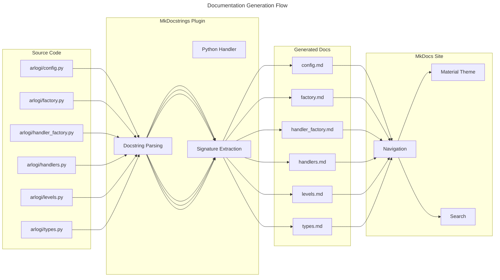
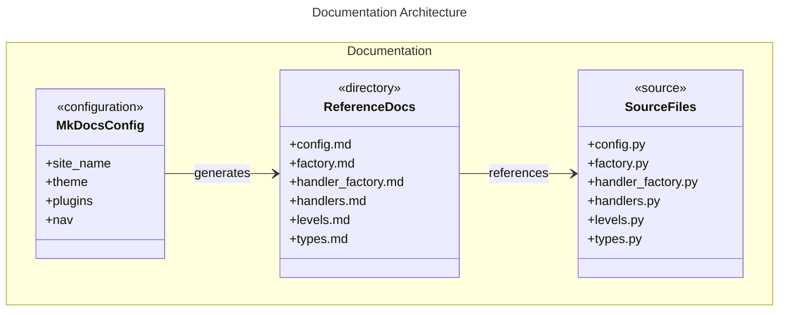

# C4 Code Level: API Reference Documentation

## Overview
- **Name**: API Reference Documentation Directory
- **Description**: Generated API reference documentation for the arlogi logging library
- **Location**: `/docs/reference/`
- **Format**: Markdown files with MkDocs configuration
- **Purpose**: Provides comprehensive auto-generated API documentation for developers using the arlogi library

## Code Elements

### Generated Documentation Files
The `docs/reference` directory contains auto-generated markdown files that reference specific Python modules:

- `config.md`
  - Description: Documents the `arlogi.config` module
  - Location: `/docs/reference/arlogi/config.md`
  - Source Reference: `/src/arlogi/config.py`
  - Dependencies: Uses MkDocstrings Python handler

- `factory.md`
  - Description: Documents the `arlogi.factory` module
  - Location: `/docs/reference/arlogi/factory.md`
  - Source Reference: `/src/arlogi/factory.py`
  - Dependencies: Uses MkDocstrings Python handler

- `handler_factory.md`
  - Description: Documents the `arlogi.handler_factory` module
  - Location: `/docs/reference/arlogi/handler_factory.md`
  - Source Reference: `/src/arlogi/handler_factory.py`
  - Dependencies: Uses MkDocstrings Python handler

- `handlers.md`
  - Description: Documents the `arlogi.handlers` module
  - Location: `/docs/reference/arlogi/handlers.md`
  - Source Reference: `/src/arlogi/handlers.py`
  - Dependencies: Uses MkDocstrings Python handler

- `levels.md`
  - Description: Documents the `arlogi.levels` module
  - Location: `/docs/reference/arlogi/levels.md`
  - Source Reference: `/src/arlogi/levels.py`
  - Dependencies: Uses MkDocstrings Python handler

- `types.md`
  - Description: Documents the `arlogi.types` module
  - Location: `/docs/reference/arlogi/types.md`
  - Source Reference: `/src/arlogi/types.py`
  - Dependencies: Uses MkDocstrings Python handler

### MkDocs Configuration
- **File**: `/mkdocs.yml`
- **Description**: Main configuration file for the documentation site
- **Purpose**: Defines navigation, theme, plugins, and structure for the generated documentation
- **Key Components**:
  - Material theme with code copy feature
  - MkDocstrings plugin for automatic Python API documentation
  - Search plugin for navigation
  - PyMdownX extensions for syntax highlighting and Mermaid support

### Navigation Structure
The documentation follows this navigation hierarchy:
```
Reference/
├── Config
├── Factory
├── Handler factory
├── Handlers
├── Levels
└── Types
```

## Dependencies

### Source Dependencies
All documentation files directly reference corresponding Python source modules in `/src/arlogi/`:
- `arlogi.config` - Configuration management
- `arlogi.factory` - Logger factory implementations
- `arlogi.handler_factory` - Handler creation utilities
- `arlogi.handlers` - Handler classes
- `arlogi.levels` - Logging levels definitions
- `arlogi.types` - Type definitions and protocols

### Tool Dependencies
- **MkDocs**: Static site generator for documentation
- **Material Theme**: Modern documentation theme
- **MkDocstrings**: Plugin for automatic API documentation generation
- **Python**: Source language for the documented code
- **PyMdownX**: Markdown extensions

### Configuration Dependencies
- `mkdocs.yml`: Main configuration file
- `docs/extra.css`: Custom styling
- `docs/index.md`: Homepage content
- Documentation files in other directories (API_REFERENCE.md, USER_GUIDE.md, etc.)

## Relationships

### Source Code Documentation Relationship


### Documentation Structure Relationship


### Cross-Reference Relationships
The documentation system maintains the following relationships:

1. **Direct References**: Each markdown file uses MkDocs inline syntax (`::: module.path`) to reference Python modules
2. **Navigation Integration**: MkDocs.yml includes the reference section in the main navigation
3. **Theme Integration**: Uses Material theme features for consistent styling
4. **Plugin Integration**: Leverages MkDocstrings for automatic documentation generation
5. **Code Integration**: Source code changes automatically propagate to documentation through rebuild

### Integration Points
- **API Reference**: Complements the detailed API_REFERENCE.md with auto-generated documentation
- **User Guide**: Provides technical details for developers implementing the library
- **Developer Guide**: Serves as reference for contributors
- **Configuration Guide**: Integrates with configuration documentation

## Notes

This directory represents the automated documentation generation system for the arlogi library. The documentation is generated using MkDocs with the MkDocstrings plugin, which automatically extracts docstrings and type information from the Python source code. The Material theme provides a modern, readable interface for developers exploring the API.

Key features of this documentation system:
- Auto-generated from source code docstrings
- Type hints and signature information preserved
- Searchable through MkDocs search plugin
- Integrates with GitHub-style code copying
- Supports cross-references and navigation
- Follows MkDocs best practices for Python libraries

The documentation can be built using `mkdocs build` and served locally with `mkdocs serve` for development purposes.