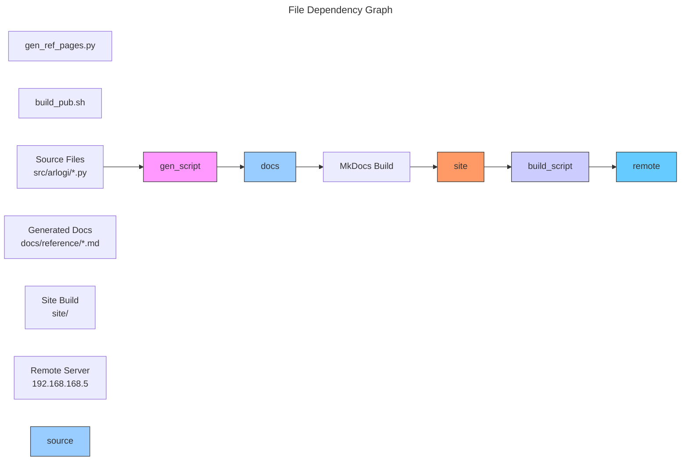

# C4 Code Level: docs/scripts

## Overview
- **Name**: Documentation Build Scripts
- **Description**: Scripts for building, generating, and publishing documentation for the arlogi library
- **Location**: `/opt/Code/2026/_Libs/arlogi/docs/scripts`
- **Language**: Bash, Python
- **Purpose**: Automates documentation generation, reference page creation, and deployment of documentation to a remote server

## Code Elements

### Scripts

#### `build_pub.sh`
- **Description**: Bash script for publishing built documentation to a remote server via SSH
- **Location**: `/opt/Code/2026/_Libs/arlogi/docs/scripts/build_pub.sh:1-32`
- **Type**: Shell script
- **Purpose**: Deploys generated documentation from `./site` directory to remote web server
- **Dependencies**:
  - `bash` shell
  - `ssh` client
  - `rsync` for file synchronization
  - Remote SSH server access
- **Key Variables**:
  - `DOCS_SOURCE`: Local source directory (`./site`)
  - `REMOTE_USER`: SSH username (`root`)
  - `REMOTE_HOST`: Remote server IP (`192.168.168.5`)
  - `REMOTE_PATH`: Remote destination path (`/opt/c/nginx/html/arlogi`)
  - `SSH_KEY`: SSH private key path (`$HOME/.ssh/il-ed25519`)

#### `gen_ref_pages.py`
- **Description**: Python script for generating API reference documentation from source code
- **Location**: `/opt/Code/2026/_Libs/arlogi/docs/scripts/gen_ref_pages.py:1-118`
- **Type**: Python script
- **Purpose**: Extracts classes and functions from Python source files and creates MkDocs-compatible markdown files
- **Dependencies**:
  - `python` (3.x)
  - Standard library modules: `re`, `sys`, `pathlib`
  - Source directory: `src/arlogi/`
  - Output directory: `docs/reference/`

### Functions

#### `extract_classes_and_functions(filepath: Path) -> tuple[list[str], list[str]]`
- **Location**: `/opt/Code/2026/_Libs/arlogi/docs/scripts/gen_ref_pages.py:12-24`
- **Description**: Extracts class and function names from a given Python file using regex patterns
- **Parameters**:
  - `filepath`: Path object pointing to the Python file to analyze
- **Returns**: Tuple containing lists of class names and function names
- **Dependencies**: `pathlib.Path`, `re` module
- **Regex Patterns**:
  - Classes: `(?:^|\n)class\s(\w+)(?:\(|:)`
  - Functions: `(?:^|\n)def\s(\w+)\(` (filtered to exclude private functions)

#### `create_markdown(md_filepath: Path, module_path: str, classes: list, functions: list)`
- **Location**: `/opt/Code/2026/_Libs/arlogi/docs/scripts/gen_ref_pages.py:27-48`
- **Description**: Creates a Markdown file containing the API reference for the given Python module
- **Parameters**:
  - `md_filepath`: Path where the markdown file should be created
  - `module_path`: Python module path (e.g., `arlogi.handlers`)
  - `classes`: List of class names found in the module
  - `functions`: List of function names found in the module
- **Returns**: Relative path to the created markdown file
- **Dependencies**: `pathlib.Path`
- **Generated Content**: MkDocs-friendly markdown with autodoc configuration

#### `create_nav_menu_yaml(nav_items: list[Path])`
- **Location**: `/opt/Code/2026/_Libs/arlogi/docs/scripts/gen_ref_pages.py:51-83`
- **Description**: Prints a YAML-friendly navigation structure for MkDocs configuration
- **Parameters**:
  - `nav_items`: List of Path objects for generated markdown files
- **Returns**: None (prints to stdout)
- **Dependencies**: `pathlib.Path`
- **Functionality**:
  - Creates nested navigation structure
  - Converts underscores to spaces and capitalizes names
  - Generates proper YAML indentation for MkDocs nav section

#### `main()`
- **Location**: `/opt/Code/2026/_Libs/arlogi/docs/scripts/gen_ref_pages.py:85-114`
- **Description**: Main function to orchestrate reference documentation generation
- **Parameters**: None
- **Returns**: None
- **Dependencies**:
  - `sys` module for path manipulation
  - `extract_classes_and_functions()`
  - `create_markdown()`
  - `create_nav_menu_yaml()`
- **Workflow**:
  1. Adds source directory to Python path
  2. Recursively searches for Python files in `src/` directory
  3. Skips private modules (those starting with `_`)
  4. Extracts classes and functions from each Python file
  5. Generates markdown files for modules with content
  6. Creates navigation structure and prints YAML

## Dependencies

### Internal Dependencies
- **Source Code**: `/opt/Code/2026/_Libs/arlogi/src/arlogi/` - Python modules for which documentation is generated
- **Documentation Structure**: `/opt/Code/2026/_Libs/arlogi/docs/reference/` - Output directory for generated reference pages
- **MkDocs Configuration**: Relies on MkDocs for final documentation generation

### External Dependencies
- **Bash Utilities**:
  - `bash` - Shell interpreter
  - `ssh` - SSH client for remote connection
  - `rsync` - File synchronization utility
  - `chmod` - File permission utility
  - `mkdir` - Directory creation utility

- **Python Libraries**:
  - `re` - Regular expression operations
  - `sys` - System-specific parameters and functions
  - `pathlib` - Object-oriented filesystem paths

- **Infrastructure**:
  - SSH key authentication (`$HOME/.ssh/il-ed25519`)
  - Remote SSH server access
  - Web server deployment environment

## Relationships

### Script Workflow Diagram
```mermaid
---
title: Documentation Build Workflow
---
flowchart TB
    subgen_ref_pages[gen_ref_pages.py]
    subbuild_pub[build_pub.sh]
    submkdocs[mkdocs build]

    subgen_ref_pages --> extract[extract_classes_and_functions]
    subgen_ref_pages --> create_md[create_markdown]
    subgen_ref_pages --> create_nav[create_nav_menu_yaml]

    submkdocs --> |Creates| site[/site directory]
    site --> |Deploys| subbuild_pub

    style gen_ref_pages.py fill:#f9f,stroke:#333,stroke-width:2px
    style build_pub.sh fill:#ccf,stroke:#333,stroke-width:2px
    style site fill:#9cf,stroke:#333,stroke-width:2px
```

### File Dependencies


### Function Call Flow
```mermaid
---
title: Function Call Hierarchy
---
flowchart TB
    main[main()]
    extract[extract_classes_and_functions<br/>(filepath: Path)]
    create_md[create_markdown<br/>(md_filepath, module_path, classes, functions)]
    create_nav[create_nav_menu_yaml<br/>(nav_items)]

    main --> extract
    main --> create_md
    main --> create_nav

    style main fill:#f9f,stroke:#333,stroke-width:2px
    style extract fill:#ccf,stroke:#333
    style create_md fill:#ccf,stroke:#333
    style create_nav fill:#ccf,stroke:#333
```

## Notes

- The `build_pub.sh` script is designed for deployment to a specific remote server with hardcoded configuration values
- The `gen_ref_pages.py` script uses simple regex patterns for code analysis, which may not capture all edge cases but provides good automation for basic API documentation
- Both scripts are executable and designed to be run from the repository root directory
- The scripts support automated documentation generation as part of a CI/CD pipeline or manual documentation updates
- Reference page generation creates MkDocs-autodoc compatible markdown files with proper navigation structure