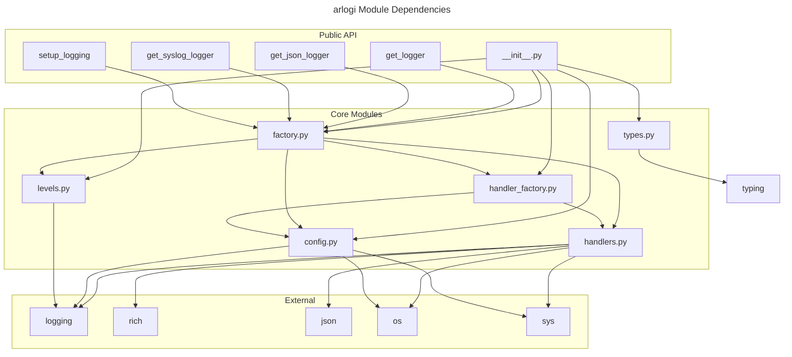

# C4 Code Level: src/arlogi

## Overview

- **Name**: arlogi Core Library
- **Description**: The core logging library implementation providing structured, colored console logging, JSON logging, syslog integration, and caller attribution features
- **Location**: `/src/arlogi`
- **Language**: Python
- **Purpose**: Implements a modern, feature-rich logging library with custom formatters, multiple output targets, and enhanced debugging capabilities

## Code Elements

### Functions/Methods

#### config.py

- `LoggingConfig.__post_init__(self) -> None`
  - Description: Validates configuration after initialization, checking levels and module names
  - Location: `/opt/Code/2026/_Libs/arlogi/src/arlogi/config.py:40`
  - Dependencies: `_validate_level` method, `logging` module

- `LoggingConfig._validate_level(level: int | str) -> None`
  - Description: Validates a log level value, raising ValueError for invalid levels
  - Location: `/opt/Code/2026/_Libs/arlogi/src/arlogi/config.py:52`
  - Dependencies: `logging` module

- `LoggingConfig.resolved_level -> int`
  - Description: Property that returns the global level as an integer
  - Location: `/opt/Code/2026/_Libs/arlogi/src/arlogi/config.py:80`
  - Dependencies: `logging` module

- `LoggingConfig.show_console -> bool`
  - Description: Property that determines if console output should be shown
  - Location: `/opt/Code/2026/_Libs/arlogi/src/arlogi/config.py:91`
  - Dependencies: None

- `LoggingConfig.has_json_output -> bool`
  - Description: Property that determines if JSON output is configured
  - Location: `/opt/Code/2026/_Libs/arlogi/src/arlogi/config.py:100`
  - Dependencies: None

- `LoggingConfig.resolve_module_level(name: str, level: str | int) -> int`
  - Description: Resolves a module level to an integer
  - Location: `/opt/Code/2026/_Libs/arlogi/src/arlogi/config.py:108`
  - Dependencies: `logging` module

- `LoggingConfig.to_dict() -> dict[str, Any]`
  - Description: Converts configuration to a dictionary representation
  - Location: `/opt/Code/2026/_Libs/arlogi/src/arlogi/config.py:122`
  - Dependencies: None

- `LoggingConfig.from_kwargs(**kwargs: Any) -> "LoggingConfig"`
  - Description: Factory method to create LoggingConfig from keyword arguments
  - Location: `/opt/Code/2026/_Libs/arlogi/src/arlogi/config.py:140`
  - Dependencies: `LoggingConfig` class constructor

- `is_test_mode() -> bool`
  - Description: Detects if running under a test runner (pytest, unittest)
  - Location: `/opt/Code/2026/_Libs/arlogi/src/arlogi/config.py:169`
  - Dependencies: `sys` module, `os` module

- `get_default_level() -> int`
  - Description: Returns DEBUG level in test mode, INFO otherwise
  - Location: `/opt/Code/2026/_Libs/arlogi/src/arlogi/config.py:185`
  - Dependencies: `logging` module, `is_test_mode()` function

#### factory.py

- `TraceLogger._get_caller_info(depth: int) -> tuple[str, str]`
  - Description: Finds module and function names at specified stack depth
  - Location: `/opt/Code/2026/_Libs/arlogi/src/arlogi/factory.py:27`
  - Dependencies: `sys` module

- `TraceLogger._process_params(msg: Any, kwargs: dict[str, Any]) -> tuple[Any, dict[str, Any]]`
  - Description: Processes caller attribution and moves custom kwargs to 'extra'
  - Location: `/opt/Code/2026/_Libs/arlogi/src/arlogi/factory.py:52`
  - Dependencies: `rich.markup.escape` function

- `TraceLogger.trace(msg: Any, *args: Any, **kwargs: Any) -> None`
  - Description: Logs a message with TRACE level (below DEBUG)
  - Location: `/opt/Code/2026/_Libs/arlogi/src/arlogi/factory.py:121`
  - Dependencies: `_process_params` method, `TRACE_LEVEL_NUM`

- `TraceLogger.debug(msg: Any, *args: Any, **kwargs: Any) -> None`
  - Description: Logs a debug message with caller attribution support
  - Location: `/opt/Code/2026/_Libs/arlogi/src/arlogi/factory.py:133`
  - Dependencies: `_process_params` method

- `TraceLogger.info(msg: Any, *args: Any, **kwargs: Any) -> None`
  - Description: Logs an info message with caller attribution support
  - Location: `/opt/Code/2026/_Libs/arlogi/src/arlogi/factory.py:138`
  - Dependencies: `_process_params` method

- `TraceLogger.warning(msg: Any, *args: Any, **kwargs: Any) -> None`
  - Description: Logs a warning message with caller attribution support
  - Location: `/opt/Code/2026/_Libs/arlogi/src/arlogi/factory.py:143`
  - Dependencies: `_process_params` method

- `TraceLogger.error(msg: Any, *args: Any, **kwargs: Any) -> None`
  - Description: Logs an error message with caller attribution support
  - Location: `/opt/Code/2026/_Libs/arlogi/src/arlogi/factory.py:148`
  - Dependencies: `_process_params` method

- `TraceLogger.critical(msg: Any, *args: Any, **kwargs: Any) -> None`
  - Description: Logs a critical message with caller attribution support
  - Location: `/opt/Code/2026/_Libs/arlogi/src/arlogi/factory.py:153`
  - Dependencies: `_process_params` method

- `TraceLogger.exception(msg: Any, *args: Any, **kwargs: Any) -> None`
  - Description: Logs an exception with traceback and caller attribution
  - Location: `/opt/Code/2026/_Libs/arlogi/src/arlogi/factory.py:158`
  - Dependencies: `_process_params` method

- `TraceLogger.log(level: int, msg: Any, *args: Any, **kwargs: Any) -> None`
  - Description: Logs a message at specified level with caller attribution
  - Location: `/opt/Code/2026/_Libs/arlogi/src/arlogi/factory.py:163`
  - Dependencies: `_process_params` method

- `LoggerFactory.setup(level: int | str = logging.INFO, **kwargs) -> None`
  - Description: Centralized logging setup method that configures root logger (Legacy helper, calls _apply_configuration)
  - Location: `/opt/Code/2026/_Libs/arlogi/src/arlogi/factory.py:179`
  - Dependencies: `LoggingConfig`, `_apply_configuration` method

- `LoggerFactory._apply_configuration(config: LoggingConfig) -> None`
  - Description: Applies a LoggingConfig to the root logger (Primary configuration method)
  - Location: `/opt/Code/2026/_Libs/arlogi/src/arlogi/factory.py:221`
  - Dependencies: `_initialize_trace_level`, `_configure_root_logger`, `_clear_and_add_handlers`, `_configure_module_levels`

- `LoggerFactory._initialize_trace_level() -> None`
  - Description: Registers custom TRACE level with Python's logging module
  - Location: `/opt/Code/2026/_Libs/arlogi/src/arlogi/factory.py:238`
  - Dependencies: `register_trace_level`, `logging.setLoggerClass`

- `LoggerFactory._configure_root_logger(config: LoggingConfig) -> None`
  - Description: Configures the root logger level
  - Location: `/opt/Code/2026/_Libs/arlogi/src/arlogi/factory.py:244`
  - Dependencies: `logging.getLogger`, `config.resolved_level`

- `LoggerFactory._clear_and_add_handlers(config: LoggingConfig) -> None`
  - Description: Clears existing handlers and adds configured ones
  - Location: `/opt/Code/2026/_Libs/arlogi/src/arlogi/factory.py:254`
  - Dependencies: `HandlerFactory.create_handlers`

- `LoggerFactory._configure_module_levels(config: LoggingConfig) -> None`
  - Description: Applies module-specific log level overrides
  - Location: `/opt/Code/2026/_Libs/arlogi/src/arlogi/factory.py:272`
  - Dependencies: `config.module_levels`, `config.resolve_module_level`

- `LoggerFactory.is_test_mode() -> bool`
  - Description: Detects if running under a test runner (delegates to is_test_mode)
  - Location: `/opt/Code/2026/_Libs/arlogi/src/arlogi/factory.py:287`
  - Dependencies: `is_test_mode()` function

- `LoggerFactory.get_logger(name: str, level: int | str | None = None) -> LoggerProtocol`
  - Description: Gets a logger instance with caller attribution support
  - Location: `/opt/Code/2026/_Libs/arlogi/src/arlogi/factory.py:296`
  - Dependencies: `get_default_level()`, `logging.getLogger`

- `LoggerFactory.get_json_logger(name: str = "json", json_file_name: str | None = None) -> LoggerProtocol`
  - Description: Gets a dedicated JSON-only logger bypassing root handlers
  - Location: `/opt/Code/2026/_Libs/arlogi/src/arlogi/factory.py:318`
  - Dependencies: `JSONFileHandler`, `JSONHandler`

- `LoggerFactory.get_syslog_logger(name: str = "syslog", address: str | tuple[str, int] = "/dev/log") -> LoggerProtocol`
  - Description: Gets a dedicated syslog-only logger bypassing root handlers
  - Location: `/opt/Code/2026/_Libs/arlogi/src/arlogi/factory.py:342`
  - Dependencies: `ArlogiSyslogHandler`

- `LoggerFactory.get_global_logger() -> LoggerProtocol`
  - Description: Gets or initializes the global logger instance
  - Location: `/opt/Code/2026/_Libs/arlogi/src/arlogi/factory.py:361`
  - Dependencies: `get_logger()` method

- `setup_logging(level: int | str = logging.INFO, **kwargs) -> None`
  - Description: Convenience wrapper around LoggerFactory.setup() (Legacy helper)
  - Location: `/opt/Code/2026/_Libs/arlogi/src/arlogi/factory.py:374`
  - Dependencies: `LoggerFactory.setup`

- `get_logger(name: str, level: int | str | None = None) -> LoggerProtocol`
  - Description: Gets a logger instance with caller attribution support
  - Location: `/opt/Code/2026/_Libs/arlogi/src/arlogi/factory.py:413`
  - Dependencies: `LoggerFactory.get_logger`

- `get_json_logger(name: str = "json", json_file_name: str | None = None) -> LoggerProtocol`
  - Description: Gets a dedicated JSON-only logger
  - Location: `/opt/Code/2026/_Libs/arlogi/src/arlogi/factory.py:426`
  - Dependencies: `LoggerFactory.get_json_logger`

- `get_syslog_logger(name: str = "syslog", address: str | tuple[str, int] = "/dev/log") -> LoggerProtocol`
  - Description: Gets a dedicated syslog-only logger
  - Location: `/opt/Code/2026/_Libs/arlogi/src/arlogi/factory.py:441`
  - Dependencies: `LoggerFactory.get_syslog_logger`

#### handler_factory.py

- `HandlerFactory.create_console(config: LoggingConfig) -> ColoredConsoleHandler`
  - Description: Creates a colored console handler with configuration settings
  - Location: `/opt/Code/2026/_Libs/arlogi/src/arlogi/handler_factory.py:26`
  - Dependencies: `ColoredConsoleHandler`, `config` attributes

- `HandlerFactory.create_json_stream() -> JSONHandler`
  - Description: Creates a JSON stream handler (outputs to stderr)
  - Location: `/opt/Code/2026/_Libs/arlogi/src/arlogi/handler_factory.py:47`
  - Dependencies: `JSONHandler`

- `HandlerFactory.create_json_file(config: LoggingConfig) -> JSONFileHandler`
  - Description: Creates a JSON file handler with file path from config
  - Location: `/opt/Code/2026/_Libs/arlogi/src/arlogi/handler_factory.py:59`
  - Dependencies: `JSONFileHandler`, `config.json_file_name`

- `HandlerFactory.create_json_handler(config: LoggingConfig) -> logging.Handler`
  - Description: Creates appropriate JSON handler based on configuration (file or stream)
  - Location: `/opt/Code/2026/_Libs/arlogi/src/arlogi/handler_factory.py:82`
  - Dependencies: `create_json_file`, `create_json_stream`

- `HandlerFactory.create_syslog(config: LoggingConfig) -> ArlogiSyslogHandler`
  - Description: Creates a syslog handler with configuration settings
  - Location: `/opt/Code/2026/_Libs/arlogi/src/arlogi/handler_factory.py:107`
  - Dependencies: `ArlogiSyslogHandler`, `config.syslog_address`

- `HandlerFactory.create_handlers(config: LoggingConfig) -> list[logging.Handler]`
  - Description: Creates all handlers based on configuration (main factory method)
  - Location: `/opt/Code/2026/_Libs/arlogi/src/arlogi/handler_factory.py:126`
  - Dependencies: Individual create methods for each handler type

#### handlers.py

- `ColoredConsoleHandler.__init__(show_time: bool = False, show_level: bool = True, show_path: bool = True, level_styles: dict[str, str] | None = None, project_root: str | None = None, *args: Any, **kwargs: Any)`
  - Description: Initializes colored console handler with Rich formatting
  - Location: `/opt/Code/2026/_Libs/arlogi/src/arlogi/handlers.py:31`
  - Dependencies: `Console`, `RichHandler`, `sys` module

- `ColoredConsoleHandler._find_project_root() -> str`
  - Description: Finds project root by looking for common indicators (.git, pyproject.toml, etc.)
  - Location: `/opt/Code/2026/_Libs/arlogi/src/arlogi/handlers.py:86`
  - Dependencies: `os` module

- `ColoredConsoleHandler.render(*, record: logging.LogRecord, traceback: Any, message_renderable: Any) -> Any`
  - Description: Override render method to show relative paths from project root
  - Location: `/opt/Code/2026/_Libs/arlogi/src/arlogi/handlers.py:120`
  - Dependencies: `pathlib.Path`, `os.path.relpath`

- `ColoredConsoleHandler.get_level_text(record: logging.LogRecord) -> Any`
  - Description: Gets level text as single character with styling
  - Location: `/opt/Code/2026/_Libs/arlogi/src/arlogi/handlers.py:164`
  - Dependencies: `Text` from rich

- `ColoredConsoleHandler.render_message(record: logging.LogRecord, message: str) -> Any`
  - Description: Renders message text with level-specific styling
  - Location: `/opt/Code/2026/_Libs/arlogi/src/arlogi/handlers.py:183`
  - Dependencies: Super class method, level_styles

- `JSONFormatter.format(record: logging.LogRecord) -> str`
  - Description: Formats log record as JSON with standard fields and extra data
  - Location: `/opt/Code/2026/_Libs/arlogi/src/arlogi/handlers.py:210`
  - Dependencies: `json.dumps`, `datetime`, `formatException`

- `JSONHandler.__init__(stream: Any = None)`
  - Description: Initializes JSON stream handler with JSONFormatter
  - Location: `/opt/Code/2026/_Libs/arlogi/src/arlogi/handlers.py:254`
  - Dependencies: `JSONFormatter`, `sys.stderr`

- `JSONFileHandler.__init__(filename: str, mode: str = "a", encoding: str | None = None, delay: bool = False)`
  - Description: Initializes JSON file handler with automatic directory creation
  - Location: `/opt/Code/2026/_Libs/arlogi/src/arlogi/handlers.py:270`
  - Dependencies: `os.makedirs`, `os.path`, `JSONFormatter`

- `ArlogiSyslogHandler.__init__(address: str | tuple[str, int] = "/dev/log", facility: int | str = logging.handlers.SysLogHandler.LOG_USER, socktype: int | None = None)`
  - Description: Initializes syslog handler with graceful fallback for missing /dev/log
  - Location: `/opt/Code/2026/_Libs/arlogi/src/arlogi/handlers.py:303`
  - Dependencies: `logging.handlers.SysLogHandler`, graceful fallback logic

#### levels.py

- `register_trace_level() -> None`
  - Description: Registers the custom TRACE level with Python's logging module
  - Location: `/opt/Code/2026/_Libs/arlogi/src/arlogi/levels.py:7`
  - Dependencies: `logging` module, adds `trace` method to `logging.Logger`

#### types.py

- `LoggerProtocol` (Protocol class)
  - Description: Runtime checkable protocol defining the interface for arlogi loggers
  - Location: `/opt/Code/2026/_Libs/arlogi/src/arlogi/types.py:4`
  - Dependencies: `typing.Protocol`, `typing.runtime_checkable`

### Classes/Modules

#### config.py

- `LoggingConfig`
  - Description: Immutable dataclass configuration for logging setup with Builder pattern
  - Location: `/opt/Code/2026/_Libs/arlogi/src/arlogi/config.py:14`
  - Methods: `__post_init__`, `_validate_level`, `resolved_level`, `show_console`, `has_json_output`, `resolve_module_level`, `to_dict`, `from_kwargs`
  - Dependencies: `dataclasses.dataclass`, `logging` module

#### factory.py

- `TraceLogger`
  - Description: Custom logger class extending Python's Logger with TRACE level and caller attribution
  - Location: `/opt/Code/2026/_Libs/arlogi/src/arlogi/factory.py:18`
  - Methods: `_get_caller_info`, `_process_params`, `trace`, `debug`, `info`, `warning`, `error`, `critical`, `exception`, `log`
  - Dependencies: `logging.Logger`, `rich.markup.escape`

- `LoggerFactory`
  - Description: Factory class for creating and configuring logger instances with global state management
  - Location: `/opt/Code/2026/_Libs/arlogi/src/arlogi/factory.py:169`
  - Methods: `setup`, `_apply_configuration`, `_initialize_trace_level`, `_configure_root_logger`, `_clear_and_add_handlers`, `_configure_module_levels`, `is_test_mode`, `get_logger`, `get_json_logger`, `get_syslog_logger`, `get_global_logger`
  - Dependencies: `logging` module, `HandlerFactory`, various handler classes

#### handler_factory.py

- `HandlerFactory`
  - Description: Factory class for creating logging handlers with consistent creation logic
  - Location: `/opt/Code/2026/_Libs/arlogi/src/arlogi/handler_factory.py:19`
  - Methods: `create_console`, `create_json_stream`, `create_json_file`, `create_json_handler`, `create_syslog`, `create_handlers`
  - Dependencies: `logging` module, various handler classes, `LoggingConfig`

#### handlers.py

- `ColoredConsoleHandler`
  - Description: Rich-based colored console handler with project root detection and custom formatting
  - Location: `/opt/Code/2026/_Libs/arlogi/src/arlogi/handlers.py:21`
  - Methods: `__init__`, `_find_project_root`, `render`, `get_level_text`, `render_message`
  - Dependencies: `RichHandler`, `rich.console.Console`, `rich.logging`, `rich.text.Text`

- `JSONFormatter`
  - Description: JSON formatter for structured log output with standard fields and extra data
  - Location: `/opt/Code/2026/_Libs/arlogi/src/arlogi/handlers.py:203`
  - Methods: `format`
  - Dependencies: `json`, `datetime`, `logging.Formatter`

- `JSONHandler`
  - Description: Stream handler that outputs log records as JSON to stderr
  - Location: `/opt/Code/2026/_Libs/arlogi/src/arlogi/handlers.py:248`
  - Methods: `__init__`
  - Dependencies: `logging.StreamHandler`, `JSONFormatter`

- `JSONFileHandler`
  - Description: File handler that outputs log records as JSON to a file with auto directory creation
  - Location: `/opt/Code/2026/_Libs/arlogi/src/arlogi/handlers.py:264`
  - Methods: `__init__`
  - Dependencies: `logging.FileHandler`, `os.makedirs`, `JSONFormatter`

- `ArlogiSyslogHandler`
  - Description: Robust syslog handler with standard formatting and automatic fallback to UDP
  - Location: `/opt/Code/2026/_Libs/arlogi/src/arlogi/handlers.py:294`
  - Methods: `__init__`
  - Dependencies: `logging.handlers.SysLogHandler`, graceful fallback logic

#### levels.py

- Module constants and function for custom TRACE level
  - `TRACE_LEVEL_NUM = 5`: Custom log level below DEBUG
  - `TRACE_LEVEL_NAME = "TRACE"`: Name of the custom level
  - `register_trace_level()`: Function to register the level with logging module

#### types.py

- `LoggerProtocol`
  - Description: Protocol defining the interface for arlogi loggers with caller attribution support
  - Location: `/opt/Code/2026/_Libs/arlogi/src/arlogi/types.py:4`
  - Methods: Protocol-defined method signatures for logging operations
  - Dependencies: `typing.Protocol`, `typing.runtime_checkable`

## Dependencies

### Internal Dependencies

- All modules import from each other to form a cohesive logging system
- Handler factory depends on handler implementations
- Factory module depends on config, handlers, and handler factory
- Config module provides configuration data used by all other modules

### External Dependencies

- `logging` (Python standard library): Core logging functionality
- `os` (Python standard library): File system operations, environment variables
- `sys` (Python standard library): System-specific parameters and functions
- `dataclasses` (Python standard library): Dataclass creation
- `json` (Python standard library): JSON formatting
- `datetime` (Python standard library): Date and time handling
- `typing` (Python standard library): Type hints and protocols
- `pathlib` (Python standard library): Path handling
- `rich.console`: Rich console output
- `rich.logging`: Rich logging integration
- `rich.markup`: Rich markup escaping
- `rich.text`: Rich text formatting
- `logging.handlers`: Syslog handler implementation

## Relationships

This codebase uses an object-oriented design with several key components:

### Class Hierarchy Diagram

```mermaid
---
title: arlogi Class Hierarchy
---
classDiagram
    namespace core {
        class LoggerFactory {
            -_initialized: bool
            -_global_logger: TraceLogger | None
            +setup(level, ...)
            +_apply_configuration(config)
            +get_logger(name, level)
            +get_json_logger(name, json_file_name)
            +get_syslog_logger(name, address)
            +get_global_logger()
        }
        class TraceLogger {
            +trace(msg, ...)
            +debug(msg, ...)
            +info(msg, ...)
            +warning(msg, ...)
            +error(msg, ...)
            +critical(msg, ...)
            +exception(msg, ...)
            +log(level, msg, ...)
        }
        class LoggingConfig {
            +level: int | str
            +module_levels: dict[str, str | int] | None
            +json_file_name: str | None
            +json_file_only: bool
            +use_syslog: bool
            +syslog_address: str | tuple[str, int]
            +show_time: bool
            +show_level: bool
            +show_path: bool
            +resolved_level: int
            +show_console: bool
            +has_json_output: bool
            +resolve_module_level(name, level) int
            +to_dict() dict
            +from_kwargs(**kwargs) LoggingConfig
        }
    }

    namespace handlers {
        class ColoredConsoleHandler {
            +__init__(show_time, show_level, show_path, level_styles, project_root)
            +_find_project_root()
            +render(record, traceback, message_renderable)
            +get_level_text(record)
            +render_message(record, message)
        }
        class JSONFormatter {
            +format(record)
        }
        class JSONHandler {
            +__init__(stream)
        }
        class JSONFileHandler {
            +__init__(filename, mode, encoding, delay)
        }
        class ArlogiSyslogHandler {
            +__init__(address, facility, socktype)
        }
    }

    namespace factory {
        class HandlerFactory {
            +create_console(config)
            +create_json_stream()
            +create_json_file(config)
            +create_json_handler(config)
            +create_syslog(config)
            +create_handlers(config)
        }
    }

    namespace protocol {
        interface LoggerProtocol {
            <<interface>>
            +trace(msg, *args, from_caller, from_, **kwargs)
            +debug(msg, *args, from_caller, from_, **kwargs)
            +info(msg, *args, from_caller, from_, **kwargs)
            +warning(msg, *args, from_caller, from_, **kwargs)
            +error(msg, *args, from_caller, from_, **kwargs)
            +critical(msg, *args, from_caller, from_, **kwargs)
            +exception(msg, *args, from_caller, from_, **kwargs)
            +log(level, msg, *args, from_caller, from_, **kwargs)
            +setLevel(level)
            +isEnabledFor(level)
        }
    }

    TraceLogger ..> LoggerProtocol : implements
    TraceLogger ..> LoggingConfig : uses
    HandlerFactory ..> LoggingConfig : uses
    HandlerFactory ..> ColoredConsoleHandler : creates
    HandlerFactory ..> JSONHandler : creates
    HandlerFactory ..> JSONFileHandler : creates
    HandlerFactory ..> ArlogiSyslogHandler : creates
    ColoredConsoleHandler --|> RichHandler : extends
    JSONHandler --|> StreamHandler : extends
    JSONFileHandler --|> FileHandler : extends
    ArlogiSyslogHandler --|> SysLogHandler : extends
    JSONHandler --> JSONFormatter : uses
    JSONFileHandler --> JSONFormatter : uses
```

## Module Relationships



## Notes

This C4 Code-level documentation captures the complete structure of the arlogi Python logging library. The library follows object-oriented principles with:

1. **Factory Pattern**: LoggerFactory and HandlerFactory for creating instances
2. **Configuration Pattern**: Immutable LoggingConfig dataclass with validation
3. **Handler Pattern**: Multiple specialized handlers (console, JSON, syslog)
4. **Strategy Pattern**: Different formatting and output strategies
5. **Protocol Pattern**: LoggerProtocol for type-safe interfaces

Key architectural features include:

- Caller attribution with stack inspection
- Custom TRACE logging level
- Graceful fallback for syslog on unsupported systems
- Rich-colored console output with project root detection
- Structured JSON logging with extra field support
- Test mode detection and default level adjustment
- Immutable configuration with validation

All code elements are fully documented with their signatures, locations, and dependencies, forming the foundation for understanding the arlogi library's implementation.
