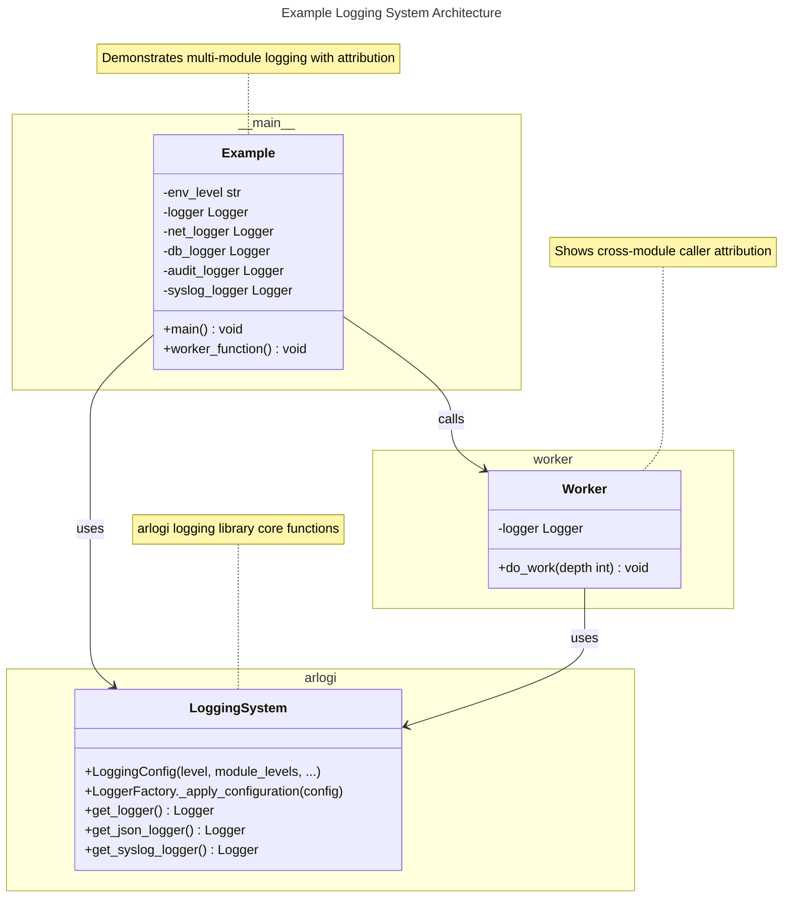

# C4 Code Level: tests/example

## Overview

- **Name**: Tests Example Directory
- **Description**: Example/test implementations demonstrating arlogi logging library usage patterns and features
- **Location**: `/tests/example`
- **Language**: Python
- **Purpose**: Comprehensive demonstration of arlogi library capabilities including module-specific logging levels, dedicated loggers, caller attribution, and cross-module logging patterns

## Code Elements

### Functions/Methods

- `main() -> None`
  - Description: Main entry point demonstrating comprehensive arlogi features including environment-based configuration, module-specific levels, dedicated loggers, and caller attribution
  - Location: `/opt/Code/2026/_Libs/arlogi/tests/example/example.py:8`
  - Dependencies: `os.environ`, `LoggingConfig`, `LoggerFactory`, `get_logger`, `get_json_logger`, `get_syslog_logger`, `worker.do_work()`

- `worker_function() -> None`
  - Description: Nested function demonstrating caller attribution with different depth levels
  - Location: `/opt/Code/2026/_Libs/arlogi/tests/example/example.py:74`
  - Dependencies: `logger`, `worker.do_work()`

- `do_work(depth: int = 0) -> None`
  - Description: Worker function demonstrating logging with cross-module caller attribution
  - Location: `/opt/Code/2026/_Libs/arlogi/tests/example/worker.py:5`
  - Dependencies: `logger`

### Variables

- `env_level: str`
  - Description: Environment variable LOG_LEVEL value, defaults to "INFO"
  - Location: `/opt/Code/2026/_Libs/arlogi/tests/example/example.py:10`

- `logger: Logger`
  - Description: Logger instance for "app.main" module demonstrating standard logging
  - Location: `/opt/Code/2026/_Libs/arlogi/tests/example/example.py:27`
  - Dependencies: `get_logger("app.main")`

- `net_logger: Logger`
  - Description: Logger instance for "app.network" module with TRACE-level override
  - Location: `/opt/Code/2026/_Libs/arlogi/tests/example/example.py:28`
  - Dependencies: `get_logger("app.network")`

- `db_logger: Logger`
  - Description: Logger instance for "app.database" module with DEBUG-level override
  - Location: `/opt/Code/2026/_Libs/arlogi/tests/example/example.py:29`
  - Dependencies: `get_logger("app.database")`

- `audit_logger: Logger`
  - Description: Dedicated JSON logger for audit logging with file output
  - Location: `/opt/Code/2026/_Libs/arlogi/tests/example/example.py:64`
  - Dependencies: `get_json_logger("audit")`

- `syslog_logger: Logger`
  - Description: Dedicated syslog logger for security events
  - Location: `/opt/Code/2026/_Libs/arlogi/tests/example/example.py:68`
  - Dependencies: `get_syslog_logger("security")`

- `logger: Logger`
  - Description: Worker module logger for "app.worker" namespace
  - Location: `/opt/Code/2026/_Libs/arlogi/tests/example/worker.py:3`
  - Dependencies: `get_logger("app.worker")`

## Dependencies

### Internal Dependencies

- `worker.do_work()` - Cross-module worker function calls
- `arlogi.LoggingConfig`, `arlogi.LoggerFactory` - Modern library configuration
- `arlogi.get_logger()` - Logger creation
- `arlogi.get_json_logger()` - Dedicated JSON logger creation
- `arlogi.get_syslog_logger()` - Syslog logger creation

### External Dependencies

- `os` - Standard library for environment variable access
- `arlogi` - Main logging library being demonstrated

## Relationships

This directory demonstrates a functional logging system with clear separation of concerns between modules and different logger types.

### Module Relationship Diagram



### Data Flow Diagram

```mermaid
---
title: Logging Data Flow
---
flowchart LR
    subgraph Configuration
        A[Environment Variables]
        B[LoggingConfig & LoggerFactory]
    end

    subgraph Loggers
        C[Main Logger]
        D[Network Logger]
        E[Database Logger]
        F[Audit Logger]
        G[Syslog Logger]
        H[Worker Logger]
    end

    subgraph Outputs
        I[Console]
        J[JSON File logs/root_test.jsonl]
        K[JSON File logs/dedicated_test.jsonl]
        L[Syslog]
    end

    A --> B
    B --> C
    B --> D
    B --> E
    B --> H
    C --> I
    C --> J
    D --> I
    D --> J
    E --> I
    E --> J
    F --> K
    G --> L
    H --> J
    H --> I

    note for B "Module-specific levels configured<br/>app.network: TRACE<br/>app.database: DEBUG"
    note for H "Cross-module attribution support"
```

## Notes

The example directory serves as a comprehensive demonstration of arlogi's core features:

- Environment-based log level configuration
- Module-specific log level overrides
- Multiple logger types (standard, JSON-only, syslog)
- Caller attribution with depth control (`from_` parameter)
- Cross-module logging attribution support
- Clean formatting with optional time/path display

The structure shows how logging can be organized across modules while maintaining proper attribution and separation of concerns in a multi-module application.
