# C4 Code Level: tests

## Overview
- **Name**: Arlogi Test Suite
- **Description**: Comprehensive test suite for the arlogi logging library, covering core functionality, features, and integration examples
- **Location**: `/opt/Code/2026/_Libs/arlogi/tests`
- **Language**: Python
- **Purpose**: Validate the correctness, reliability, and feature completeness of the arlogi logging library through unit tests and integration examples

## Code Elements

### Test Functions in test_core.py

#### `test_trace_level_registered()`
- **Signature**: `test_trace_level_registered() -> None`
- **Description**: Validates that the TRACE log level is properly registered in the logging system
- **Location**: `/opt/Code/2026/_Libs/arlogi/tests/test_core.py:6`
- **Dependencies**: `arlogi.TRACE`, `arlogi.get_logger`, `logging.getLevelName`

#### `test_protocol_compliance()`
- **Signature**: `test_protocol_compliance() -> None`
- **Description**: Ensures that logger instances properly implement the LoggerProtocol interface
- **Location**: `/opt/Code/2026/_Libs/arlogi/tests/test_core.py:11`
- **Dependencies**: `arlogi.LoggerProtocol`, `arlogi.get_logger`, `isinstance()`

#### `test_test_mode_detection()`
- **Signature**: `test_test_mode_detection() -> None`
- **Description**: Verifies that the LoggerFactory correctly detects test mode and returns appropriate behavior
- **Location**: `/opt/Code/2026/_Libs/arlogi/tests/test_core.py:15`
- **Dependencies**: `arlogi.factory.LoggerFactory.is_test_mode()`

#### `test_logging_calls(caplog)`
- **Signature**: `test_logging_calls(caplog: Any) -> None`
- **Description**: Tests that all logging levels (TRACE, DEBUG, INFO) work correctly when called on a logger instance
- **Location**: `/opt/Code/2026/_Libs/arlogi/tests/test_core.py:19`
- **Dependencies**: `caplog` (pytest fixture), `arlogi.TRACE`, `arlogi.get_logger`

### Test Functions in test_features.py

#### `test_module_specific_levels()`
- **Signature**: `test_module_specific_levels() -> None`
- **Description**: Validates module-specific log level configuration works as expected
- **Location**: `/opt/Code/2026/_Libs/arlogi/tests/test_features.py:7`
- **Dependencies**: `arlogi.setup_logging()`, `arlogi.get_logger`, `logging.INFO`, `logging.DEBUG`

#### `test_json_logger(capsys)`
- **Signature**: `test_json_logger(capsys: Any) -> None`
- **Description**: Tests the dedicated JSON logger functionality and its output format
- **Location**: `/opt/Code/2026/_Libs/arlogi/tests/test_features.py:27`
- **Dependencies**: `capsys` (pytest fixture), `arlogi.get_json_logger()`, `json.loads`

#### `test_trace_stacklevel(caplog)`
- **Signature**: `test_trace_stacklevel(caplog: Any) -> None`
- **Description**: Validates that stacklevel functionality works correctly for the TRACE level
- **Location**: `/opt/Code/2026/_Libs/arlogi/tests/test_features.py:46`
- **Dependencies**: `caplog` (pytest fixture), `arlogi.TRACE`, `arlogi.get_logger`

#### `test_caller_attribution(caplog)`
- **Signature**: `test_caller_attribution(caplog: Any) -> None`
- **Description**: Tests the caller attribution feature that shows the calling function name in log messages
- **Location**: `/opt/Code/2026/_Libs/arlogi/tests/test_features.py:55`
- **Dependencies**: `caplog` (pytest fixture), `arlogi.get_logger`

### Integration Examples

#### `main()` function in tests/example/example.py
- **Signature**: `main() -> None`
- **Description**: Comprehensive integration example demonstrating all major arlogi features including module-specific levels, dedicated loggers, caller attribution, and cross-module logging
- **Location**: `/opt/Code/2026/_Libs/arlogi/tests/example/example.py:8`
- **Dependencies**: `os.environ`, `tests.example.worker`, `arlogi.get_json_logger()`, `arlogi.get_logger()`, `arlogi.get_syslog_logger()`, `arlogi.setup_logging()`

#### `do_work()` function in tests/example/worker.py
- **Signature**: `do_work(depth: int = 0) -> None`
- **Description**: Example worker function demonstrating cross-module caller attribution functionality
- **Location**: `/opt/Code/2026/_Libs/arlogi/tests/example/worker.py:5`
- **Dependencies**: `arlogi.get_logger()`, global logger instance

## Dependencies

### Internal Dependencies
- `arlogi`: Main library being tested
  - `arlogi.TRACE`: Custom log level constant
  - `arlogi.LoggerProtocol`: Type hint for logger interface
  - `arlogi.get_logger()`: Function to get configured logger instances
  - `arlogi.get_json_logger()`: Function to get JSON-formatted logger
  - `arlogi.get_syslog_logger()`: Function to get syslog logger
  - `arlogi.setup_logging()`: Function to configure logging system
  - `arlogi.factory.LoggerFactory`: Factory class with test mode detection

### External Dependencies
- `logging`: Python standard library logging module
- `json`: Python standard library JSON handling
- `os`: Python standard library operating system interface
- `pytest`: Testing framework
  - `caplog`: Pytest fixture for capturing log output
  - `capsys`: Pytest fixture for capturing stdout/stderr

### Test Configuration
- **Test Framework**: pytest 9.0.2+
- **Coverage**: pytest-cov 7.0.0+ (for test coverage reporting)
- **Python Version**: 3.13+

## Relationships

### Test Coverage Overview

```mermaid
---
title: Arlogi Test Suite Coverage
---
flowchart TD
    subgraph Unit Tests
        TC1[test_trace_level_registered]
        TC2[test_protocol_compliance]
        TC3[test_test_mode_detection]
        TC4[test_logging_calls]
        TC5[test_module_specific_levels]
        TC6[test_json_logger]
        TC7[test_trace_stacklevel]
        TC8[test_caller_attribution]
    end

    subgraph Integration Examples
        IE1[main example]
        IE2[worker module]
    end

    subgraph Features Tested
        FT1[TRACE Level]
        FT2[Protocol Compliance]
        FT3[Test Mode Detection]
        FT4[Logging Calls]
        FT5[Module-Specific Levels]
        FT6[JSON Logger]
        FT7[Stack Level]
        FT8[Caller Attribution]
        FT9[Cross-Module Logging]
        FT10[Dedicated Loggers]
        FT11[Environment Configuration]
    end

    TC1 --> FT1
    TC2 --> FT2
    TC3 --> FT3
    TC4 --> FT4
    TC5 --> FT5
    TC6 --> FT6
    TC7 --> FT7
    TC8 --> FT8

    IE1 --> FT1
    IE1 --> FT5
    IE1 --> FT6
    IE1 --> FT8
    IE1 --> FT9
    IE1 --> FT10
    IE1 --> FT11

    IE2 --> FT8
    IE2 --> FT9

    style TC1 fill:#e1f5fe
    style TC2 fill:#e1f5fe
    style TC3 fill:#e1f5fe
    style TC4 fill:#e1f5fe
    style TC5 fill:#e1f5fe
    style TC6 fill:#e1f5fe
    style TC7 fill:#e1f5fe
    style TC8 fill:#e1f5fe
    style IE1 fill:#f3e5f5
    style IE2 fill:#f3e5f5
    style FT1 fill:#e8f5e8
    style FT2 fill:#e8f5e8
    style FT3 fill:#e8f5e8
    style FT4 fill:#e8f5e8
    style FT5 fill:#e8f5e8
    style FT6 fill:#e8f5e8
    style FT7 fill:#e8f5e8
    style FT8 fill:#e8f5e8
    style FT9 fill:#e8f5e8
    style FT10 fill:#e8f5e8
    style FT11 fill:#e8f5e8
```



### Test Structure Diagram

```mermaid
---
title: Arlogi Test File Organization
---
classDiagram
    namespace tests/
        class test_core {
            <<test module>>
            +test_trace_level_registered() None
            +test_protocol_compliance() None
            +test_test_mode_detection() None
            +test_logging_calls(caplog) None
        }

        class test_features {
            <<test module>>
            +test_module_specific_levels() None
            +test_json_logger(capsys) None
            +test_trace_stacklevel(caplog) None
            +test_caller_attribution(caplog) None
        }

        namespace example/ {
            class example {
                <<example module>>
                +main() None
            }

            class worker {
                <<example module>>
                logger Logger
                +do_work(depth int) None
            }
        }
    }

    test_core ..> arlogi : imports
    test_features ..> arlogi : imports
    example ..> arlogi : imports
    worker ..> arlogi : imports

    example --> worker : imports worker
    worker --> logger : uses global logger
```

### Key Test Categories

1. **Core Functionality Tests** (test_core.py)
   - Basic logger initialization and protocol compliance
   - Test mode detection
   - Logging level verification

2. **Feature Implementation Tests** (test_features.py)
   - Module-specific level configuration
   - JSON logger functionality
   - Stack level handling
   - Caller attribution features

3. **Integration Examples** (example/)
   - Comprehensive feature demonstration
   - Cross-module logging scenarios
   - Real-world usage patterns

## Notes

The test suite follows pytest conventions and uses fixtures like `caplog` and `capsys` for capturing log output and console output. The integration examples in the `example/` directory serve both as tests and as documentation of how to use various arlogi features in practice. All tests validate the core logging functionality while the examples demonstrate practical usage patterns including environment-based configuration, dedicated loggers, and cross-module caller attribution.