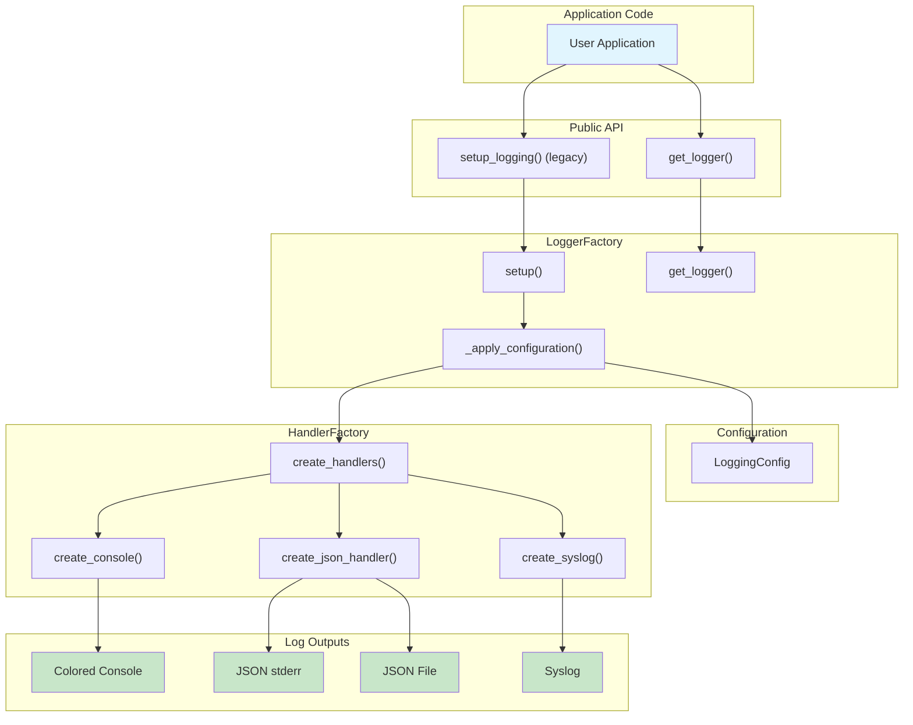

# C4 Component Level: Core Logging Library

## Overview

- **Name**: Core Logging Library
- **Description**: A modern, feature-rich Python logging library providing structured colored console output, JSON logging, syslog integration, and advanced caller attribution capabilities
- **Type**: Library
- **Technology**: Python 3.13+, Rich, Python Standard Library

## Purpose

The Core Logging Library is the central component of the arlogi system, providing a comprehensive logging framework that extends Python's standard logging module with enhanced features designed for modern application development.

### What It Does

The Core Logging Library implements a complete logging infrastructure that addresses common pain points in Python application logging:

1. **Enhanced Console Output**: Provides beautiful, colored console output using the Rich library with project root detection for relative file paths, making logs easier to read and understand.

2. **Structured JSON Logging**: Outputs log records in JSON format with standard fields (timestamp, level, message, file, line, function) plus support for custom extra fields, ideal for log aggregation and analysis systems.

3. **Syslog Integration**: Offers native syslog integration with graceful fallback on systems where syslog is unavailable, making it suitable for production deployments.

4. **Caller Attribution**: Automatically detects and displays the calling function name in log messages, enabling better tracking of log message origins without manual annotation.

5. **Custom TRACE Level**: Implements a TRACE log level below DEBUG for more granular logging control during development and debugging.

6. **Module-Specific Configuration**: Allows different log levels for different modules, enabling fine-grained control over logging verbosity across large applications.

7. **Test Mode Detection**: Automatically detects test execution and adjusts default log levels to DEBUG for better test visibility.

### Problems It Solves

- **Poor Readability**: Traditional Python logging output is difficult to read and lacks color coding
- **Limited Debugging Information**: Standard logging doesn't easily show which function generated a log message
- **Log Aggregation Challenges**: Plain text logs are difficult to parse and analyze in log aggregation systems
- **Coarse Log Control**: Standard log levels (DEBUG, INFO, WARNING, ERROR, CRITICAL) are sometimes too granular
- **Cross-Module Attribution**: Difficult to trace log messages back to their source in complex, multi-module applications
- **Production Integration**: Lack of built-in syslog support forces manual integration work

### Role in the System

The Core Logging Library serves as the foundational component that:

- Provides all core logging functionality to consuming applications
- Exposes both high-level convenience functions and low-level configuration APIs
- Manages global logging state and configuration
- Implements custom handlers for different output targets
- Defines the logger protocol interface for type safety

## Software Features

The Core Logging Library provides the following software features:

### Core Logging Features

- **Standard Logging Levels**: Full support for Python standard logging levels (DEBUG, INFO, WARNING, ERROR, CRITICAL)
- **Custom TRACE Level**: Additional TRACE level (below DEBUG) for ultra-detailed logging during development
- **Colored Console Output**: Beautiful, syntax-colored console logs with Rich formatting
- **Relative Path Display**: Automatically detects project root and displays relative file paths
- **Configurable Display Elements**: Optional display of timestamp, log level, and file path in console output

### Structured Logging Features

- **JSON Stream Output**: Structured JSON output to stderr for log aggregation
- **JSON File Output**: Structured JSON output to rotating log files
- **Standard Fields**: Automatic inclusion of timestamp, level, message, file, line number, function name
- **Custom Extra Fields**: Support for adding custom fields to JSON log records
- **Automatic Directory Creation**: JSON file handlers automatically create required directories

### Integration Features

- **Syslog Support**: Native syslog integration for production deployments
- **Graceful Fallback**: Automatic fallback to UDP or disabled syslog when /dev/log is unavailable
- **Unix Domain Socket Support**: Supports both Unix domain sockets (/dev/log) and remote syslog servers

### Advanced Features

- **Caller Attribution**: Automatic detection and display of calling function names
- **Cross-Module Attribution**: Tracks call chains across module boundaries
- **Stack Inspection**: Uses Python's stack inspection to determine log origin
- **Custom Attribution**: Manual override of attribution using `from_caller` or `from_` parameters

### Configuration Features

- **Module-Specific Levels**: Different log levels for different modules
- **Immutable Configuration**: Dataclass-based configuration with validation
- **Environment Integration**: Reads configuration from environment variables
- **Builder Pattern**: Fluent configuration API with `from_kwargs()` factory method
- **Test Mode Detection**: Automatically adjusts behavior during test execution

### Logger Management Features

- **Dedicated JSON Loggers**: Separate logger instances that only output JSON
- **Dedicated Syslog Loggers**: Separate logger instances that only output to syslog
- **Global Logger**: Singleton pattern for application-wide logging
- **Logger Factory**: Centralized logger creation and configuration

## Code Elements

This component contains the following code-level elements:

### Core Modules

- **[c4-code-src-arlogi.md](./c4-code-src-arlogi.md)** - Core library implementation containing:
  - `config.py` - LoggingConfig dataclass with validation and property methods
  - `factory.py` - LoggerFactory and TraceLogger classes for logger creation and management
  - `handler_factory.py` - HandlerFactory for creating log handlers
  - `handlers.py` - Custom handler implementations (ColoredConsoleHandler, JSONHandler, JSONFileHandler, ArlogiSyslogHandler)
  - `levels.py` - Custom TRACE level registration
  - `types.py` - LoggerProtocol for type-safe logger interfaces

### Test and Example Code

- **[c4-code-tests.md](./c4-code-tests.md)** - Comprehensive test suite:
  - `tests/test_core.py` - Core functionality tests
  - `tests/test_features.py` - Feature implementation tests

- **[c4-code-tests-example.md](./c4-code-tests-example.md)** - Integration examples:
  - `tests/example/example.py` - Comprehensive feature demonstration
  - `tests/example/worker.py` - Cross-module logging examples

## Interfaces

The Core Logging Library exposes multiple interfaces for different use cases:

### Python API: High-Level Convenience Functions

**Protocol**: Python module-level functions
**Description**: Simple, convenient interface for common logging operations

**Operations**:

```python
setup_logging(level: int | str = logging.INFO, **kwargs) -> None
```

- **Description**: Configure the root logging system with specified level and options (Legacy/Deprecated)
- **Parameters**:
  - `level`: Global logging level (default: INFO)
  - `**kwargs**: Additional configuration options (module_levels, json_file_name, use_syslog, etc.)
- **Returns**: None
- **Example**: `setup_logging(level="DEBUG", json_file_name="app.jsonl")`
- **Note**: This is a legacy helper that internally calls `LoggingConfig` and `LoggerFactory._apply_configuration`.

```python
get_logger(name: str, level: int | str | None = None) -> LoggerProtocol
```

- **Description**: Get a logger instance with caller attribution support
- **Parameters**:
  - `name`: Logger name (typically module name using **name**)
  - `level`: Optional level override for this logger
- **Returns**: LoggerProtocol instance implementing standard logging methods
- **Example**: `logger = get_logger(__name__)`

```python
get_json_logger(name: str = "json", json_file_name: str | None = None) -> LoggerProtocol
```

- **Description**: Get a dedicated JSON-only logger that bypasses root handlers
- **Parameters**:
  - `name`: Logger name (default: "json")
  - `json_file_name`: Optional JSON file path (default: uses config or stderr)
- **Returns**: LoggerProtocol instance that only outputs JSON
- **Example**: `audit_logger = get_json_logger("audit", "audit.jsonl")`

```python
get_syslog_logger(name: str = "syslog", address: str | tuple[str, int] = "/dev/log") -> LoggerProtocol
```

- **Description**: Get a dedicated syslog-only logger that bypasses root handlers
- **Parameters**:
  - `name`: Logger name (default: "syslog")
  - `address`: Syslog server address (default: "/dev/log")
- **Returns**: LoggerProtocol instance that only outputs to syslog
- **Example**: `syslog_logger = get_syslog_logger("security")`

### Python API: LoggerProtocol Interface

**Protocol**: Python Protocol with runtime checking
**Description**: Type-safe interface defining all logging operations

**Operations**:

```python
trace(msg: Any, *args: Any, from_caller: str | None = None, from_: str | None = None, **kwargs: Any) -> None
```

- **Description**: Log a TRACE level message (below DEBUG)
- **Parameters**:
  - `msg`: Log message (can be string or any object)
  - `*args`: Format arguments for message
  - `from_caller`: Override caller function name
  - `from_`: Alias for from_caller
  - `**kwargs`: Extra fields for JSON handlers
- **Returns**: None

```python
debug(msg: Any, *args: Any, from_caller: str | None = None, from_: str | None = None, **kwargs: Any) -> None
info(msg: Any, *args: Any, from_caller: str | None = None, from_: str | None = None, **kwargs: Any) -> None
warning(msg: Any, *args: Any, from_caller: str | None = None, from_: str | None = None, **kwargs: Any) -> None
error(msg: Any, *args: Any, from_caller: str | None = None, from_: str | None = None, **kwargs: Any) -> None
critical(msg: Any, *args: Any, from_caller: str | None = None, from_: str | None = None, **kwargs: Any) -> None
```

- **Description**: Log messages at standard levels with caller attribution
- **Parameters**: Same as trace()
- **Returns**: None

```python
exception(msg: Any, *args: Any, from_caller: str | None = None, from_: str | None = None, **kwargs: Any) -> None
```

- **Description**: Log an exception with traceback information
- **Parameters**: Same as trace() plus automatic exception info capture
- **Returns**: None

```python
log(level: int, msg: Any, *args: Any, from_caller: str | None = None, from_: str | None = None, **kwargs: Any) -> None
```

- **Description**: Log a message at a custom level
- **Parameters**:
  - `level`: Custom logging level integer
  - Other parameters same as trace()
- **Returns**: None

```python
setLevel(level: int) -> None
```

- **Description**: Set the logger's level threshold
- **Parameters**: `level`: Logging level integer
- **Returns**: None

```python
isEnabledFor(level: int) -> bool
```

- **Description**: Check if a log level would be processed
- **Parameters**: `level`: Logging level integer to check
- **Returns**: True if level is enabled

### Python API: LoggingConfig Class

**Protocol**: Python dataclass with builder pattern
**Description**: Immutable configuration object for logging setup

**Operations**:

```python
LoggingConfig.__init__(level: int | str = ..., module_levels: dict[str, str | int] | None = None, ...)
```

- **Description**: Create a new LoggingConfig instance
- **Parameters**:
  - `level`: Global log level (default: from get_default_level())
  - `module_levels`: Dictionary of module-specific levels
  - `json_file_name`: Path for JSON log file
  - `json_file_only`: If True, only log to JSON file
  - `use_syslog`: Enable syslog output
  - `syslog_address`: Syslog server address
  - `show_time`: Show timestamp in console output
  - `show_level`: Show log level in console output
  - `show_path`: Show file path in console output
- **Returns**: LoggingConfig instance

```python
LoggingConfig.from_kwargs(**kwargs: Any) -> LoggingConfig
```

- **Description**: Factory method to create LoggingConfig from keyword arguments
- **Parameters**: `**kwargs`: Configuration keyword arguments
- **Returns**: LoggingConfig instance

```python
LoggingConfig.resolved_level -> int
```

- **Description**: Property returning global level as integer
- **Returns**: Log level integer

```python
LoggingConfig.show_console -> bool
```

- **Description**: Property indicating if console output should be shown
- **Returns**: True if console output enabled

```python
LoggingConfig.has_json_output -> bool
```

- **Description**: Property indicating if JSON output is configured
- **Returns**: True if JSON output enabled

```python
LoggingConfig.resolve_module_level(name: str, level: str | int) -> int
```

- **Description**: Resolve a module-specific level to integer
- **Parameters**:
  - `name`: Module name
  - `level`: Level value (string or integer)
- **Returns**: Resolved log level integer

```python
LoggingConfig.to_dict() -> dict[str, Any]
```

- **Description**: Convert configuration to dictionary
- **Returns**: Dictionary representation of config

### Python API: LoggerFactory Class

**Protocol**: Python class with static and instance methods
**Description**: Factory for creating and configuring loggers

**Operations**:

```python
LoggerFactory._apply_configuration(config: LoggingConfig) -> None
```

- **Description**: Configure the root logging system using a configuration object (Recommended)
- **Parameters**: `config`: LoggingConfig instance
- **Returns**: None
- **Side Effects**: Modulates root logger configuration

```python
LoggerFactory.get_logger(name: str, level: int | str | None = None) -> LoggerProtocol
```

- **Description**: Get a logger instance with caller attribution
- **Parameters**:
  - `name`: Logger name
  - `level`: Optional level override
- **Returns**: LoggerProtocol instance

```python
LoggerFactory.get_json_logger(name: str = "json", json_file_name: str | None = None) -> LoggerProtocol
```

- **Description**: Get a dedicated JSON-only logger
- **Parameters**:
  - `name`: Logger name
  - `json_file_name`: Optional JSON file path
- **Returns**: LoggerProtocol instance

```python
LoggerFactory.get_syslog_logger(name: str = "syslog", address: str | tuple[str, int] = "/dev/log") -> LoggerProtocol
```

- **Description**: Get a dedicated syslog-only logger
- **Parameters**:
  - `name`: Logger name
  - `address`: Syslog server address
- **Returns**: LoggerProtocol instance

```python
LoggerFactory.get_global_logger() -> LoggerProtocol
```

- **Description**: Get or initialize the global logger instance
- **Parameters**: None
- **Returns**: Singleton global LoggerProtocol instance

```python
LoggerFactory.is_test_mode() -> bool
```

- **Description**: Detect if running under test runner
- **Parameters**: None
- **Returns**: True if in test mode

### JSON Handler Output Format

**Protocol**: JSON Lines (JSONL) format
**Description**: Structured log format for machine parsing

**Schema**:

```json
{
  "timestamp": "string (ISO 8601 format)",
  "level": "string (level name)",
  "message": "string (log message)",
  "file": "string (file path)",
  "line": "number (line number)",
  "function": "string (function name)",
  "caller": "string | null (caller function name if available)",
  "extra": "object (custom fields from **kwargs)"
}
```

**Example**:

```json
{
  "timestamp": "2025-12-28T20:30:45.123456",
  "level": "INFO",
  "message": "User logged in successfully",
  "file": "app/auth.py",
  "line": 42,
  "function": "login",
  "caller": "process_login",
  "extra": {
    "user_id": 12345,
    "ip_address": "192.168.1.100"
  }
}
```

## Dependencies

### Components Used

This is a foundational component with no dependencies on other components. It is self-contained and provides logging services to the rest of the application.

### External Systems

#### Python Standard Library

- **logging** (Core): Python's standard logging framework
  - Used for: Base logger classes, level definitions, formatter infrastructure
  - Version: Built-in to Python standard library

- **os** (System Interface): Operating system interface
  - Used for: Environment variable access, file system operations, directory creation
  - Version: Built-in to Python standard library

- **sys** (System Parameters): System-specific parameters
  - Used for: Stack inspection, system-specific constants
  - Version: Built-in to Python standard library

- **dataclasses** (Data Structures): Data class decorator
  - Used for: LoggingConfig immutable configuration class
  - Version: Built-in to Python standard library (Python 3.7+)

- **json** (JSON Encoding): JSON encoder and decoder
  - Used for: JSON log formatting in JSONHandler and JSONFormatter
  - Version: Built-in to Python standard library

- **datetime** (Date/Time): Date and time handling
  - Used for: Timestamp generation in JSON logs
  - Version: Built-in to Python standard library

- **typing** (Type Hints): Type hint support
  - Used for: LoggerProtocol, type hints throughout
  - Version: Built-in to Python standard library

- **pathlib** (Paths): Object-oriented filesystem paths
  - Used for: Path manipulation in ColoredConsoleHandler
  - Version: Built-in to Python standard library

- **logging.handlers** (Logging Handlers): Additional logging handlers
  - Used for: SysLogHandler base class
  - Version: Built-in to Python standard library

#### Third-Party Libraries

- **rich** (Terminal Formatting): Rich text and beautiful formatting in the terminal
  - Used for: Colored console output, RichHandler, Console, text formatting
  - Version: 13.9.4+ (as specified in pyproject.toml)
  - Website: <https://github.com/Textualize/rich>

#### Development Dependencies (Testing)

- **pytest** (Testing Framework): Testing framework for Python
  - Used for: Running test suite, caplog and capsys fixtures
  - Version: 9.0.2+
  - Not required in production, only for testing

- **pytest-cov** (Coverage): Pytest plugin for coverage reporting
  - Used for: Test coverage measurement
  - Version: 7.0.0+
  - Not required in production, only for testing

## Component Diagram

```mermaid
C4Component
    title Component Diagram for arlogi Logging Library

    Container_Boundary(c1, "arlogi Logging Library") {
        Component(config, "LoggingConfig", "Configuration", "Immutable configuration dataclass with validation and builder pattern")
        Component(levels, "TRACE Level", "Custom Level", "Custom TRACE log level registration below DEBUG")
        Component(types, "LoggerProtocol", "Protocol", "Type-safe logger interface definition")
        Component(handlers, "Handlers", "Handlers", "Custom log handlers: ColoredConsole, JSON Stream/File, Syslog")
        Component(handler_factory, "HandlerFactory", "Factory", "Creates and configures log handlers")
        Component(trace_logger, "TraceLogger", "Logger", "Custom logger with TRACE level and caller attribution")
        Component(logger_factory, "LoggerFactory", "Factory", "Creates and configures logger instances")
        Component(api, "Public API", "Functions", "High-level convenience functions: get_logger, setup_logging (legacy), etc.")
    }

    Person(user, "Application Developer", "Developer using arlogi")

    System_Ext(rich, "Rich Library", "Terminal formatting library")
    System_Ext(logging, "Python logging", "Python standard logging module")
    System_Ext(syslog, "Syslog Daemon", "System log service")

    Rel(user, api, "Uses", "Python API")
    Rel(api, logger_factory, "Uses", "Delegates to factory")
    Rel(logger_factory, config, "Uses", "For configuration")
    Rel(logger_factory, handler_factory, "Uses", "Creates handlers")
    Rel(logger_factory, trace_logger, "Creates", "Logger instances")
    Rel(handler_factory, handlers, "Creates", "Handler instances")
    Rel(trace_logger, levels, "Uses", "TRACE level")
    Rel(trace_logger, types, "Implements", "LoggerProtocol")
    Rel(handlers, rich, "Uses", "Colored output")
    Rel(handlers, logging, "Extends", "Base handlers")
    Rel(handlers, syslog, "Writes to", "Syslog output")

    Rel_N(api, logging, "Extends", "Python logging")
```

## Data Flow Diagram



## Key Design Patterns

The Core Logging Library implements several design patterns:

### 1. Factory Pattern

- **LoggerFactory**: Creates and configures logger instances
- **HandlerFactory**: Creates handler instances based on configuration
- **Benefit**: Centralized object creation with consistent configuration

### 2. Builder Pattern

- **LoggingConfig.from_kwargs()**: Fluent configuration building
- **Benefit**: Flexible, readable configuration with validation

### 3. Strategy Pattern

- **Multiple Handlers**: Different output strategies (console, JSON, syslog)
- **Benefit**: Easy to add new output targets without changing core logic

### 4. Protocol Pattern

- **LoggerProtocol**: Type-safe interface definition
- **Benefit**: Compile-time type checking with runtime validation

### 5. Singleton Pattern

- **Global Logger**: Single global logger instance
- **Benefit**: Consistent logging configuration across application

### 6. Template Method Pattern

- **Custom Handlers**: Extend base handlers with specialized behavior
- **Benefit**: Code reuse and consistent handler interface

## Architecture Notes

### Separation of Concerns

The component is organized into clear layers:

- **Configuration Layer**: LoggingConfig handles all configuration
- **Factory Layer**: LoggerFactory and HandlerFactory create instances
- **Handler Layer**: Handlers implement output strategies
- **Protocol Layer**: LoggerProtocol defines the interface
- **API Layer**: Public functions provide convenient access

### Extensibility

The component is designed for extension:

- New handlers can be added by extending logging.Handler
- New formatters can be added by extending logging.Formatter
- Custom log levels can be registered using the same pattern as TRACE
- HandlerFactory can be extended to support new handler types

### Immutability

LoggingConfig uses @dataclass with frozen=True to ensure:

- Configuration cannot be accidentally modified after creation
- Thread-safe configuration access
- Clear configuration lifecycle

### Performance Considerations

- Stack inspection only happens when caller attribution is requested
- Handlers are created once and reused
- JSON formatting uses efficient JSON encoder
- Rich console output uses optimized rendering

### Error Handling

- Syslog handler gracefully falls back when /dev/log is unavailable
- Configuration validation happens at initialization time
- Invalid log levels raise clear ValueError exceptions
- File handlers automatically create required directories

## Related Documentation

- **[c4-code-src-arlogi.md](./c4-code-src-arlogi.md)** - **[Core Logging Library Component](./c4-component-core-logging.md)** - Core logging functionality details
- **[Test Suite Component](./c4-component-test-suite.md)** - Testing infrastructure documentation
- **[Documentation System Component](./c4-component-documentation.md)** - Documentation generation and deployment
- **[Documentation Index](../index.md)** - Project overview and getting started guide
- **[API Reference](../API_REFERENCE.md)** - Complete API reference documentation
