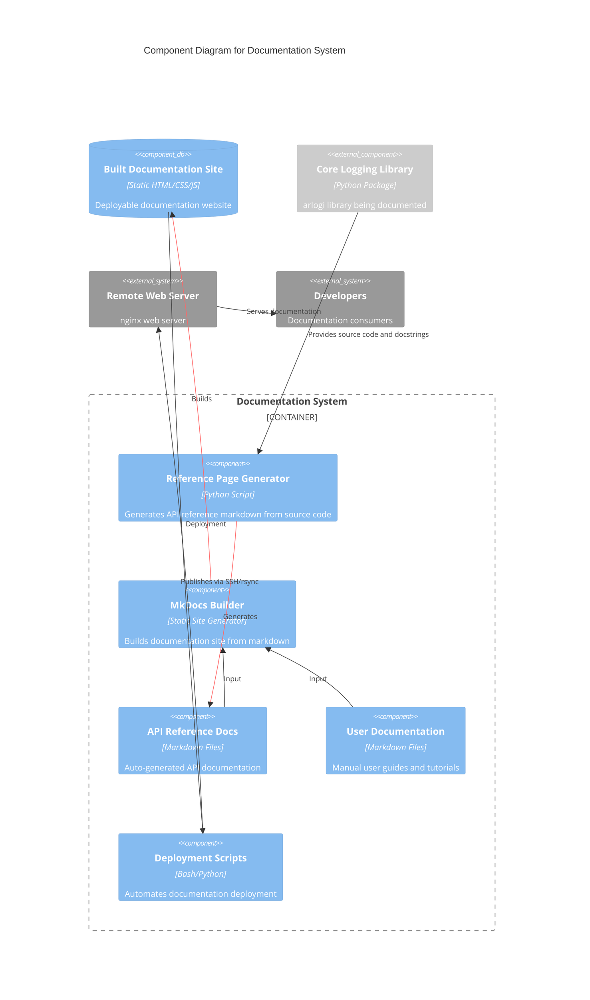

# C4 Component Level: Documentation System

## Overview
- **Name**: Documentation System
- **Description**: Automated documentation generation, build, and deployment system for the arlogi logging library
- **Type**: Documentation Infrastructure
- **Technology**: MkDocs, Material Theme, MkDocstrings, Markdown, Python, Bash

## Purpose

The Documentation System component is responsible for generating, building, and publishing comprehensive technical documentation for the arlogi logging library. It automates the extraction of API documentation from Python source code, provides a modern web-based documentation interface, and includes deployment capabilities for publishing documentation to remote servers.

This component serves as the bridge between the library's source code and its users, ensuring that API documentation stays synchronized with code changes and provides an intuitive, searchable interface for developers exploring the library's capabilities.

The system supports multiple documentation types:
- **API Reference Documentation**: Auto-generated from Python docstrings and type hints
- **User Guides**: Conceptual documentation for library users
- **Developer Guides**: Technical documentation for contributors
- **Configuration Guides**: Setup and customization documentation
- **Architecture Documentation**: C4 architectural diagrams and design documents

## Software Features

### API Documentation Generation
- **Automatic extraction**: Generates API reference documentation from Python source code using MkDocstrings
- **Type hints preservation**: Maintains type information and function signatures in documentation
- **Class and function indexing**: Automatically identifies and documents all public classes and functions
- **Module-level documentation**: Creates dedicated pages for each Python module in the library
- **Cross-referencing**: Supports links between related API elements

### Documentation Build System
- **Static site generation**: Uses MkDocs to build fast, static HTML documentation sites
- **Theme integration**: Leverages Material theme for modern, responsive design
- **Search functionality**: Built-in search plugin for full-text documentation search
- **Syntax highlighting**: PyMdownX extensions for code highlighting and Mermaid diagram support
- **Navigation management**: Automatic generation of hierarchical navigation structures

### Developer Tools
- **Reference page generator**: Python script (`gen_ref_pages.py`) for automated API documentation creation
- **YAML navigation builder**: Generates MkDocs-compatible navigation configuration
- **Source code analysis**: Regex-based extraction of classes and functions from Python files
- **Markdown generation**: Creates MkDocs-autodoc compatible markdown files

### Deployment Automation
- **Remote publishing**: Bash script (`build_pub.sh`) for deploying documentation to remote servers
- **Secure transfer**: Uses SSH/rsync for secure file synchronization
- **Incremental updates**: Efficiently syncs only changed files to remote server
- **Key-based authentication**: Supports SSH key authentication for secure deployments

### Documentation Features
- **Code copy functionality**: GitHub-style code copying for code examples
- **Mobile responsive**: Material theme provides mobile-optimized viewing experience
- **Print-friendly**: Documentation pages are formatted for printing
- **Version-aware**: Structure supports documentation versioning
- **Mermaid diagram support**: Renders architecture diagrams directly in documentation

## Code Elements

This component contains the following code-level elements:

- **[c4-code-docs-reference.md](./c4-code-docs-reference.md)** - API Reference Documentation
  - Documents the auto-generated API reference system
  - Covers MkDocstrings integration and configuration
  - Describes module documentation structure and navigation
  - Details reference documentation for all arlogi modules (config, factory, handlers, levels, types)

- **[c4-code-docs-scripts.md](./c4-code-docs-scripts.md)** - Documentation Build Scripts
  - Documents Python scripts for automated documentation generation
  - Covers Bash scripts for deployment automation
  - Describes functions for extracting classes and functions from source code
  - Details workflow for building and publishing documentation

## Interfaces

### Command Line Interface (CLI)

#### Documentation Generation
```bash
# Generate API reference pages from source code
python docs/scripts/gen_ref_pages.py

# Build the complete documentation site
mkdocs build

# Serve documentation locally for development
mkdocs serve
```

#### Documentation Deployment
```bash
# Deploy built documentation to remote server
docs/scripts/build_pub.sh
```

**Parameters**:
- None required for generation (uses default paths)
- Deployment uses pre-configured SSH settings

**Returns**:
- Generation: Creates markdown files in `docs/reference/` and prints YAML navigation
- Build: Creates static HTML site in `site/` directory
- Deployment: Syncs files to remote server and provides status messages

### Web Interface

#### Documentation Site
- **Protocol**: HTTP/HTTPS
- **Access**: `http://[server]/arlogi` (when deployed)
- **Features**:
  - Browse API reference by module
  - Search across all documentation
  - Navigate using hierarchical menu
  - View Mermaid architecture diagrams
  - Copy code examples with one click

#### Local Development Server
- **Protocol**: HTTP
- **Access**: `http://localhost:8000` (default MkDocs serve port)
- **Live Reload**: Automatically refreshes on documentation changes
- **Purpose**: Preview documentation changes before deployment

### Configuration Interface

#### MkDocs Configuration File
- **File**: `mkdocs.yml`
- **Format**: YAML
- **Purpose**: Defines documentation structure, theme, plugins, and navigation
- **Key Settings**:
  - Site name and description
  - Theme configuration (Material theme)
  - Plugin settings (MkDocstrings, search)
  - Navigation structure
  - Markdown extensions

## Dependencies

### Components Documented
- **Core Logging Library** (`arlogi`): All Python modules in `src/arlogi/` are documented
  - `arlogi.config` - Configuration management
  - `arlogi.factory` - Logger factory implementations
  - `arlogi.handler_factory` - Handler creation utilities
  - `arlogi.handlers` - Handler classes
  - `arlogi.levels` - Logging levels definitions
  - `arlogi.types` - Type definitions and protocols

### External Systems
- **MkDocs**: Static site generator for building documentation
  - Provides core documentation framework
  - Handles markdown processing and site generation
  - Manages plugins and themes

- **Material Theme for MkDocs**: Modern documentation theme
  - Provides responsive design
  - Implements search functionality
  - Offers navigation components
  - Supports code copying and syntax highlighting

- **MkDocstrings**: Automatic API documentation generation
  - Extracts docstrings from Python code
  - Generates markdown documentation
  - Handles cross-references and type hints
  - Integrates with MkDocs build process

- **PyMdownX Extensions**: Markdown processing extensions
  - Syntax highlighting for code blocks
  - Mermaid diagram rendering
  - Advanced markdown features

### Infrastructure Dependencies
- **SSH Server**: Remote documentation hosting (192.168.168.5)
  - Deployment target for published documentation
  - Web server hosting (nginx)
  - Document root: `/opt/c/nginx/html/arlogi`

- **Development Tools**:
  - Python 3.x for script execution
  - Bash shell for deployment automation
  - rsync for file synchronization

### Data Dependencies
- **Source Code**: Python files in `src/arlogi/` directory
- **Docstrings**: Documentation embedded in source code
- **Type Hints**: Type annotations used for API documentation
- **Configuration Files**: `mkdocs.yml`, `docs/extra.css`

## Component Diagram



## Component Interactions

### Documentation Generation Flow
1. **Source Code Analysis**: `gen_ref_pages.py` scans Python source files in `src/arlogi/`
2. **API Extraction**: Uses regex to identify classes, functions, and their docstrings
3. **Markdown Generation**: Creates MkDocs-compatible markdown files for each module
4. **Navigation Creation**: Generates YAML navigation structure for MkDocs configuration

### Documentation Build Flow
1. **Input Collection**: MkDocs reads markdown files from `docs/` directory
2. **Processing**: Applies theme, plugins, and markdown extensions
3. **API Documentation**: MkDocstrings generates API reference from inline references
4. **Site Generation**: Creates static HTML site in `site/` directory
5. **Asset Optimization**: Bundles CSS, JavaScript, and images

### Documentation Deployment Flow
1. **Pre-flight Check**: `build_pub.sh` verifies SSH connectivity
2. **File Synchronization**: Uses rsync to efficiently transfer changed files
3. **Remote Publishing**: Copies files to nginx web server document root
4. **Verification**: Confirms successful deployment

### User Access Flow
1. **Browse**: Users access documentation via web browser
2. **Navigation**: Hierarchical menu for exploring documentation
3. **Search**: Full-text search for finding specific information
4. **Reference**: View API documentation with type hints and examples
5. **Copy**: One-click code copying for code examples

## Technology Stack

### Documentation Generation
- **MkDocs** (v1.5+): Static site generator
- **Material Theme**: Modern documentation theme
- **MkDocstrings** (v1.0+): Automatic API documentation
- **Python** (3.10+): Script execution and code analysis
- **Markdown**: Documentation authoring format

### Development Tools
- **PyMdown Extensions**: Advanced Markdown features
- **Python Standard Library**: `re`, `sys`, `pathlib` for code analysis
- **Bash**: Shell scripting for deployment automation

### Deployment
- **OpenSSH**: Secure remote access
- **rsync**: Efficient file synchronization
- **nginx**: Web server for hosting documentation

### Documentation Features
- **Mermaid.js**: Diagram rendering
- **Highlight.js**: Code syntax highlighting
- **JavaScript**: Interactive features (search, navigation, code copying)

## Deployment Considerations

### Local Development
- Scripts assume execution from repository root directory
- Requires Python 3.x and Bash environment
- MkDocs must be installed in development environment
- Generated files committed to version control for consistency

### Production Deployment
- Remote server configuration hardcoded in `build_pub.sh`
- SSH key authentication required for automated deployment
- Target directory must exist and have proper permissions
- nginx configuration must point to documentation root

### Build Artifacts
- `site/` directory contains complete static site
- Can be deployed to any static web hosting service
- Supports deployment to GitHub Pages, Netlify, or custom servers
- No server-side processing required

### Maintenance
- Documentation should be regenerated when API changes are made
- MkDocs configuration updates require rebuild
- Navigation structure must be manually maintained in `mkdocs.yml`
- Theme customization requires CSS modifications in `docs/extra.css`

## Integration Points

### With Core Library
- **Docstrings**: Source code must have comprehensive docstrings
- **Type Hints**: Type annotations improve documentation quality
- **Module Structure**: Documentation follows Python module organization
- **Examples**: Code examples in docstrings appear in API reference

### With Development Workflow
- **CI/CD Integration**: Scripts can be integrated into automated pipelines
- **Pre-commit Hooks**: Can generate documentation on code changes
- **Version Control**: Generated documentation can be versioned with code
- **Code Review**: Documentation updates can be reviewed alongside code

### With External Services
- **Web Hosting**: Can deploy to various static hosting platforms
- **CDN**: Built assets can be distributed via CDN
- **Analytics**: Can integrate web analytics for usage tracking
- **Search**: Can integrate with external search services (Algolia, etc.)

## Quality Assurance

### Documentation Testing
- **Link Checking**: Verify all internal and external links resolve
- **Build Verification**: Ensure documentation builds without errors
- **Content Review**: Technical accuracy of API documentation
- **Accessibility**: Verify documentation meets accessibility standards
- **Browser Compatibility**: Test across different browsers and devices

### Automated Validation
- **MkDocs Build**: Catches markdown syntax errors
- **MkDocstrings Validation**: Validates docstring format and references
- **Script Testing**: Verify generation scripts produce expected output
- **Deployment Testing**: Confirm successful remote deployment

### Continuous Improvement
- **User Feedback**: Collect feedback on documentation clarity
- **Usage Analytics**: Track most-accessed documentation pages
- **Search Queries**: Analyze search terms to identify content gaps
- **Error Reporting**: Monitor documentation-related error reports
