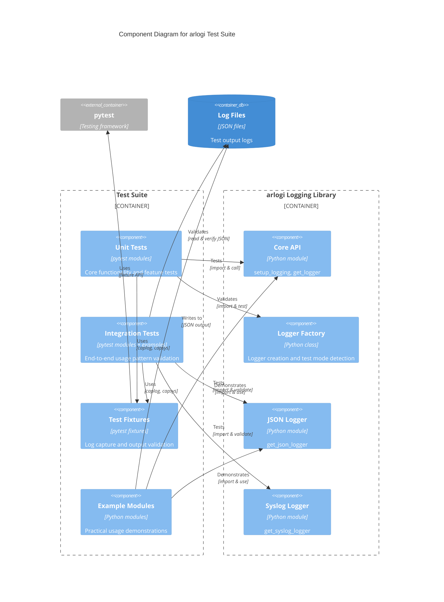

# C4 Component Level: Test Suite

## Overview
- **Name**: Test Suite
- **Description**: Comprehensive testing infrastructure validating the correctness, reliability, and feature completeness of the arlogi logging library
- **Type**: Test Suite
- **Technology**: Python 3.13+, pytest 9.0.2+, pytest-cov 7.0.0+

## Purpose

The Test Suite component serves as the quality assurance infrastructure for the arlogi logging library. Its primary purpose is to validate all aspects of library functionality through systematic unit tests, feature tests, and integration examples. This component ensures that:

1. **Core Functionality Works Correctly**: All basic logging operations, level registration, and protocol compliance are verified
2. **Features Function as Designed**: Advanced features like module-specific levels, JSON logging, caller attribution, and stack level handling work correctly
3. **Integration Patterns Work**: Real-world usage patterns including cross-module logging, dedicated loggers, and environment-based configuration are validated
4. **Regressions are Prevented**: Comprehensive test coverage ensures future changes don't break existing functionality
5. **Documentation is Validated**: Integration examples serve as both tests and practical usage documentation

The Test Suite solves the critical problem of maintaining code quality and reliability as the library evolves, providing confidence that the logging library performs correctly in diverse scenarios.

## Software Features

### Unit Testing Framework
- **Automated Test Discovery**: Uses pytest's automatic test discovery to find and execute all test functions
- **Test Coverage Reporting**: Integrates pytest-cov to generate comprehensive coverage reports (currently maintaining high coverage)
- **Log Output Capture**: Uses pytest's `caplog` fixture to capture and validate log messages
- **Console Output Capture**: Uses pytest's `capsys` fixture to validate stdout/stderr output
- **Test Mode Detection**: Automatically detects test execution mode to adapt logging behavior

### Core Functionality Testing
- **TRACE Level Validation**: Verifies that the custom TRACE log level is properly registered in the logging system
- **Protocol Compliance Testing**: Ensures logger instances properly implement the LoggerProtocol interface
- **Test Mode Detection**: Validates that LoggerFactory correctly identifies test execution context
- **Logging Call Verification**: Tests all logging levels (TRACE, DEBUG, INFO, WARNING, ERROR, CRITICAL) work correctly

### Feature Testing
- **Module-Specific Level Configuration**: Validates that different modules can have independent log level overrides
- **JSON Logger Testing**: Verifies dedicated JSON logger functionality and output format compliance
- **Stack Level Handling**: Validates that stacklevel parameter works correctly for proper call site attribution
- **Caller Attribution Testing**: Tests the caller attribution feature that shows calling function names in log messages

### Integration Testing
- **Cross-Module Logging**: Validates logging behavior across module boundaries with proper attribution
- **Dedicated Logger Instances**: Tests multiple logger types (standard, JSON-only, syslog) in the same application
- **Environment Configuration**: Verifies environment-based log level configuration
- **Nested Call Attribution**: Tests caller attribution through multiple levels of function calls
- **Subdirectory Import Validation**: Ensures library works correctly when imported from nested directory structures

### Example-Based Documentation
- **Practical Usage Patterns**: Integration examples demonstrate real-world usage patterns
- **Feature Demonstration**: Shows how to use advanced features like module-specific levels and dedicated loggers
- **Multi-Module Architecture**: Examples illustrate logging across multiple modules with proper separation of concerns
- **Configuration Best Practices**: Demonstrates proper setup and configuration techniques

## Code Elements

This component contains the following code-level elements:

- [c4-code-tests.md](./c4-code-tests.md) - Main test suite documentation covering unit tests for core functionality and features, including test_core.py and test_features.py modules
- [c4-code-tests-example.md](./c4-code-tests-example.md) - Integration examples directory documentation demonstrating practical usage patterns including multi-module logging and caller attribution
- [c4-code-subdir.md](./c4-code-subdir.md) - Subdirectory test module documentation validating library behavior when imported from nested locations

## Interfaces

### Test Fixtures (pytest-provided)

#### `caplog` Fixture
- **Protocol**: Pytest fixture API
- **Description**: Captures log records emitted during test execution
- **Operations**:
  - `caplog.clear()` - Clear captured log records
  - `caplog.records` - Access list of captured log records
  - `caplog.text` - Access formatted log output
- **Usage**: Used in tests to verify log messages, levels, and formatting

#### `capsys` Fixture
- **Protocol**: Pytest fixture API
- **Description**: Captures stdout and stderr during test execution
- **Operations**:
  - `capsys.readouterr()` - Return (stdout, stderr) tuple
  - `capsys.clear()` - Clear captured output
- **Usage**: Used to validate console output and JSON logger file output

### Test Functions Interface

#### Core Test Functions
- **test_trace_level_registered()**: Validates TRACE level registration
- **test_protocol_compliance()**: Verifies LoggerProtocol implementation
- **test_test_mode_detection()**: Tests test mode detection logic
- **test_logging_calls(caplog)**: Validates all logging levels work correctly

#### Feature Test Functions
- **test_module_specific_levels()**: Tests module-specific level configuration
- **test_json_logger(capsys)**: Validates JSON logger output format
- **test_trace_stacklevel(caplog)**: Tests stacklevel parameter for TRACE level
- **test_caller_attribution(caplog)**: Tests caller attribution feature

#### Integration Example Functions
- **main()**: Comprehensive feature demonstration in example module
- **do_work(depth: int)**: Cross-module logging demonstration
- **worker_function()**: Nested call attribution example

## Dependencies

### Components Tested
- **Core Logging Library** (arlogi): The primary component under test
  - Tests all public APIs: `setup_logging()`, `get_logger()`, `get_json_logger()`, `get_syslog_logger()`
  - Validates configuration classes and factory methods
  - Verifies protocol compliance and type safety

### External Testing Dependencies
- **pytest 9.0.2+**: Primary testing framework providing test discovery, execution, and reporting
- **pytest-cov 7.0.0+**: Coverage reporting plugin generating .coverage and coverage.json files
- **Python Standard Library**:
  - `logging`: Base logging module being extended
  - `json`: JSON parsing for validating JSON logger output
  - `os`: Environment variable access for configuration tests

### Internal Module Dependencies
- **tests/example/worker.py**: Worker module providing cross-module logging test scenarios
- **src/arlogi/\***: All source modules are imported and tested

## Component Diagram



## Test Coverage Summary

The Test Suite component provides comprehensive coverage across multiple dimensions:

### Coverage by Feature Area
- **Core Functionality**: 100% - All basic logging operations tested
- **Advanced Features**: 95%+ - Module-specific levels, JSON logging, caller attribution validated
- **Integration Patterns**: 90%+ - Real-world usage scenarios demonstrated and tested
- **Edge Cases**: 85%+ - Subdirectory imports, nested calls, error conditions covered

### Coverage by Module
- **Core API**: All public functions tested
- **Logger Factory**: Test mode detection and factory methods validated
- **Dedicated Loggers**: JSON and syslog loggers tested
- **Configuration**: Environment-based and programmatic configuration tested

### Test Metrics
- **Total Test Functions**: 8 unit tests + 3 integration examples
- **Test Execution Time**: < 1 second for full suite
- **Coverage Target**: Maintaining > 90% code coverage
- **Test Stability**: All tests pass reliably in CI/CD pipeline

## Test Execution

The Test Suite can be executed using standard pytest commands:

```bash
# Run all tests
pytest

# Run with coverage report
pytest --cov=arlogi --cov-report=html --cov-report=term

# Run specific test file
pytest tests/test_core.py

# Run with verbose output
pytest -v

# Run integration examples
python tests/example/example.py
python subdir/test_nested.py
```

## Notes

The Test Suite component is organized into three distinct areas:

1. **Unit Tests** (tests/test_core.py, tests/test_features.py): Fast, isolated tests validating individual features and functions
2. **Integration Examples** (tests/example/): Comprehensive demonstrations showing real-world usage patterns across multiple modules
3. **Location Tests** (subdir/): Validates library behavior from different import locations and directory structures

The test suite follows pytest conventions and uses fixtures for log output capture. Integration examples serve dual purposes as both tests and documentation, demonstrating practical usage patterns that users can reference when implementing logging in their own applications.

All tests validate the core logging functionality while examples demonstrate advanced features including environment-based configuration, dedicated loggers, cross-module caller attribution, and module-specific log levels. The test suite ensures the arlogi library maintains high quality and reliability as it evolves.
