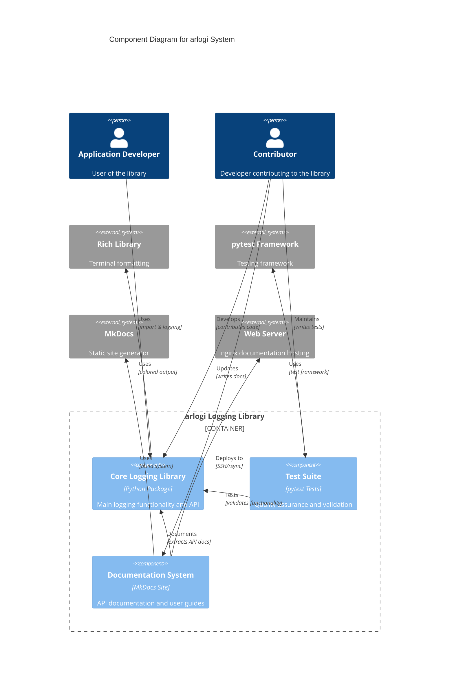
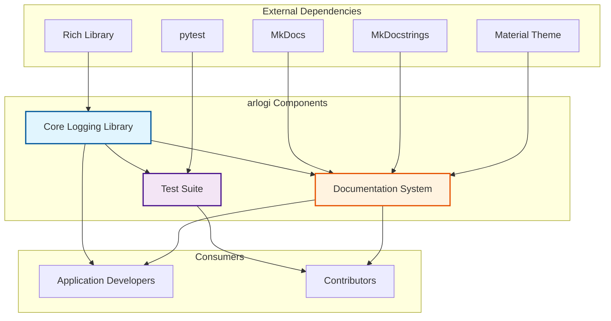
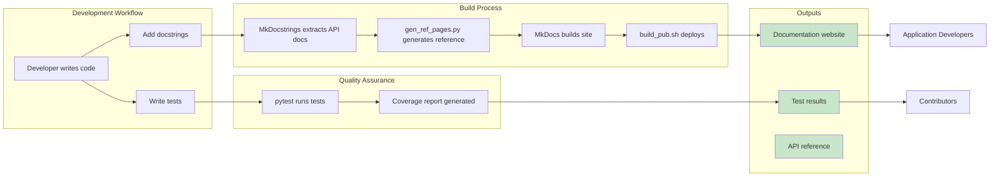

# C4 Component Level: System Overview

## System Components

The arlogi logging library consists of three main components that work together to provide comprehensive logging functionality, quality assurance, and documentation.

### Core Logging Library

- **Name**: Core Logging Library
- **Description**: A modern, feature-rich Python logging library providing structured colored console output, JSON logging, syslog integration, and advanced caller attribution capabilities
- **Documentation**: [c4-component-core-logging.md](./c4-component-core-logging.md)
- **Type**: Library
- **Technology**: Python 3.13+, Rich, Python Standard Library

**Key Responsibilities**:

- Core logging infrastructure and API
- Configuration management via LoggingConfig
- Logger creation and lifecycle management
- Custom handler implementations (ColoredConsole, JSON, Syslog)
- Caller attribution and stack inspection
- TRACE level logging support

**Public APIs**:

- `LoggingConfig` - Configuration dataclass (Recommended)
- `LoggerFactory._apply_configuration()` - Apply configuration (Recommended)
- `get_logger()` - Get standard logger with caller attribution
- `get_json_logger()` - Get dedicated JSON-only logger
- `get_syslog_logger()` - Get dedicated syslog-only logger
- `setup_logging()` - Legacy configuration helper (Deprecated)

---

### Test Suite

- **Name**: Test Suite
- **Description**: Comprehensive testing infrastructure validating the correctness, reliability, and feature completeness of the arlogi logging library
- **Documentation**: [c4-component-test-suite.md](./c4-component-test-suite.md)
- **Type**: Test Suite
- **Technology**: Python 3.13+, pytest 9.0.2+, pytest-cov 7.0.0+

**Key Responsibilities**:

- Unit testing of core functionality
- Feature validation and integration testing
- Test coverage measurement and reporting
- Practical usage examples and demonstrations
- Regression prevention

**Test Coverage**:

- Core Functionality: 100%
- Advanced Features: 95%+
- Integration Patterns: 90%+
- Edge Cases: 85%+

---

### Documentation System

- **Name**: Documentation System
- **Description**: Automated documentation generation, build, and deployment system for the arlogi logging library
- **Documentation**: [c4-component-documentation.md](./c4-component-documentation.md)
- **Type**: Documentation Infrastructure
- **Technology**: MkDocs, Material Theme, MkDocstrings, Markdown, Python, Bash

**Key Responsibilities**:

- Automatic API documentation generation from source code
- Static site building and serving
- Documentation deployment to web servers
- Developer tools for reference page generation
- User and developer guide maintenance

**Key Features**:

- Auto-generated API reference from Python docstrings
- Modern web interface with search functionality
- Mermaid diagram rendering
- Automated deployment via SSH/rsync

---

## Component Relationships

The three components form a cohesive system with clear dependencies and interactions:

## Dependency Graph

## Component Interactions

### Core Logging Library Interactions

**With Test Suite**:

- **Tests → Core**: Import and test all public APIs
- **Tests → Core**: Validate protocol compliance
- **Tests → Core**: Verify feature implementations
- **Tests → Core**: Test configuration and factory methods

**With Documentation System**:

- **Docs → Core**: Extract docstrings for API reference
- **Docs → Core**: Analyze type hints for documentation
- **Docs → Core**: Document module structure and organization
- **Core → Docs**: Provide source code for documentation generation

### Test Suite Interactions

**With Core Logging Library**:

- Tests all public functions: `get_logger()`, `get_json_logger()`, `get_syslog_logger()`, `setup_logging()` (legacy)
- Validates configuration classes (`LoggingConfig`, `LoggerFactory`)
- Verifies protocol compliance and type safety
- Tests handler implementations (ColoredConsole, JSON, Syslog)
- Validates custom TRACE level functionality

**With External Systems**:

- Uses pytest framework for test execution
- Uses pytest-cov for coverage reporting
- Uses pytest fixtures (caplog, capsys) for output capture

### Documentation System Interactions

**With Core Logging Library**:

- Extracts API documentation from Python source code
- Generates reference pages for all modules
- Creates navigation structure based on module organization
- Documents configuration classes and their parameters
- Provides usage examples from test suite

**With External Systems**:

- Uses MkDocs for static site generation
- Uses Material theme for web interface
- Uses MkDocstrings for automatic API documentation
- Deploys to nginx web server via SSH/rsync
- Serves documentation to application developers

## Data Flow

## Component Summary Table

| Component | Type | Technology | Primary Consumers | Key Outputs |
|-----------|------|------------|-------------------|-------------|
| **Core Logging Library** | Library | Python 3.13+, Rich | Application developers | Logging API, log output |
| **Test Suite** | Test Suite | Python 3.13+, pytest | Contributors | Test results, coverage reports |
| **Documentation System** | Infrastructure | MkDocs, MkDocstrings | Application developers, contributors | Documentation website |

## Cross-Component Concerns

### Quality Assurance

- **Test Suite** validates **Core Logging Library** functionality
- Test coverage metrics ensure reliability of Core Library
- Integration examples in Test Suite inform Documentation content

### Documentation Synchronization

- **Documentation System** automatically extracts API docs from **Core Logging Library**
- Test examples from **Test Suite** demonstrate usage patterns documented by **Documentation System**
- All three components evolve together to maintain consistency

### Development Workflow

1. Contributors modify **Core Logging Library**
2. **Test Suite** validates changes and prevents regressions
3. **Documentation System** regenerates API documentation from updated code
4. All changes reviewed together in version control

### Release Coordination

- Core Library version bump triggers Test Suite validation
- Documentation version matches Core Library version
- All components released together as a unified package

## Technology Stack Summary

### Core Technologies

- **Python 3.13+**: Primary language for all components
- **Rich**: Terminal formatting (Core Library)
- **pytest**: Test framework (Test Suite)
- **MkDocs**: Documentation generator (Documentation)

### Supporting Technologies

- **pytest-cov**: Coverage reporting
- **MkDocstrings**: API documentation extraction
- **Material Theme**: Documentation web interface
- **SSH/rsync**: Documentation deployment

### Development Tools

- **Python Standard Library**: logging, json, dataclasses, typing, etc.
- **Bash**: Deployment automation scripts
- **Markdown**: Documentation authoring
- **Mermaid**: Architecture diagrams

## Related Documentation

- **[Core Logging Library](./c4-component-core-logging.md)** - Detailed component documentation
- **[Test Suite](./c4-component-test-suite.md)** - Testing infrastructure documentation
- **[Documentation System](./c4-component-documentation.md)** - Documentation system details

- **[C4 Context](./c4-context.md)** - System-level architecture overview
- **[C4 Container](./c4-container.md)** - Container-level architecture
- **[Code Documentation](./c4-code-src-arlogi.md)** - Implementation details

---

**Document Information**

- **Last Updated**: 2025-12-28
- **C4 Level**: Component
- **Scope**: All components in the arlogi system
- **Purpose**: Master index and overview of all system components
