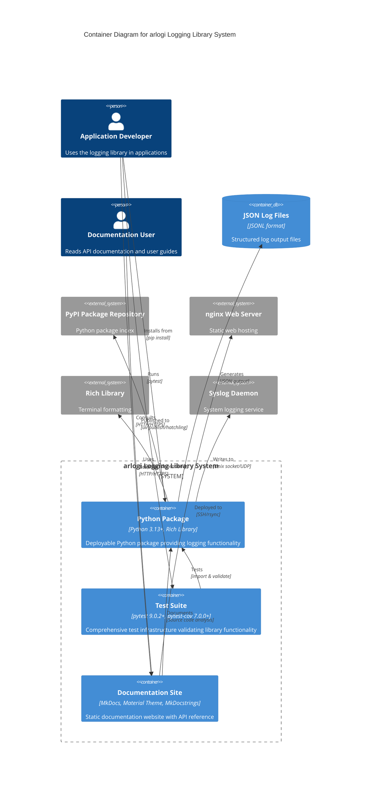
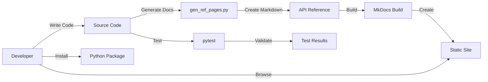

# C4 Container Level: arlogi System Deployment

## Overview

The arlogi system is organized into three main deployment containers that separate concerns between the core library functionality, quality assurance, and documentation. Each container represents a distinct deployable unit with specific technologies, deployment methods, and responsibilities.

## Container Diagram



## Containers

### 1. Python Package Container

#### Container Information

- **Name**: Python Package (arlogi)
- **Description**: Deployable Python package providing enhanced logging functionality with colored console output, structured JSON logging, syslog integration, and caller attribution
- **Type**: Python Package / Library
- **Technology**: Python 3.13+, Rich 14.2.0+, Python Standard Library
- **Deployment**: PyPI (Python Package Index), via pip or uv package managers
- **Version**: 0.512.28

#### Purpose

The Python Package container is the primary deployment unit of the arlogi system. It contains all the core logging functionality that application developers import and use in their applications. This container is designed to be:

1. **Installable**: Can be installed from PyPI using standard Python package managers
2. **Importable**: Provides a clean Python module API that developers can import
3. **Configurable**: Supports multiple configuration methods (programmatic, environment-based)
4. **Extensible**: Allows custom handlers, formatters, and log levels
5. **Production-Ready**: Includes error handling, graceful fallbacks, and performance optimizations

The container solves the problem of inadequate Python logging by providing a drop-in replacement for the standard logging module with enhanced features for modern application development.

#### Components

This container deploys the following component:

**[Core Logging Library](./c4-component-core-logging.md)** - The complete logging infrastructure

- Configuration Management (LoggingConfig, HandlerFactory)
- Logger Factory (LoggerFactory, TraceLogger)
- Handler Implementations (ColoredConsoleHandler, JSONHandler, JSONFileHandler, ArlogiSyslogHandler)
- Type Definitions (LoggerProtocol, custom TRACE level)
- Public API Functions (get_logger, get_json_logger, get_syslog_logger)
- Legacy Helpers (`setup_logging`)

#### Interfaces

##### Python Module API

**Protocol**: Python module-level import interface
**Description**: High-level convenience functions for application developers
**Specification**: [apis/arlogi-api.yaml](./apis/arlogi-api.yaml)

**Endpoints**:

- `arlogi.LoggingConfig` - Configuration dataclass
- `arlogi.LoggerFactory` - Logger factory class
- `arlogi.get_logger(name, level=None)` - Get standard logger
- `arlogi.get_json_logger(name, json_file_name=None)` - Get JSON-only logger
- `arlogi.get_syslog_logger(name, address="/dev/log")` - Get syslog-only logger
- `arlogi.setup_logging(**kwargs)` - Legacy configuration helper (Deprecated)
- `arlogi.HandlerFactory` - Handler factory class
- `arlogi.TRACE` - Custom TRACE log level constant

##### JSON Output Interface

**Protocol**: JSON Lines (JSONL) format
**Description**: Structured log format for log aggregation systems
**Specification**: [API Reference - JSON Output Format](../API_REFERENCE.md#jsonhandler)

**Schema**:

```json
{
  "timestamp": "string (ISO 8601)",
  "level": "string (level name)",
  "message": "string (log message)",
  "file": "string (file path)",
  "line": "number (line number)",
  "function": "string (function name)",
  "caller": "string | null (caller function)",
  "extra": "object (custom fields)"
}
```

##### Syslog Interface

**Protocol**: Unix Domain Socket or UDP
**Description**: Standard syslog integration for enterprise logging
**Specification**: [API Reference - ArlogiSyslogHandler](../API_REFERENCE.md#arlogisysloghandler)

**Endpoints**:

- `/dev/log` - Unix domain socket (primary)
- `localhost:514` - UDP fallback (secondary)
- Custom host/port tuple - Remote syslog server

#### Dependencies

**Container Dependencies**: None (standalone library)

**External Systems**:

- **Rich Library** (14.2.0+): Terminal formatting and colored console output
  - Used for: ColoredConsoleHandler, Rich rendering
  - License: MIT
  - Website: <https://github.com/Textualize/rich>

- **Python Standard Library**:
  - `logging`: Base logging framework
  - `dataclasses`: Configuration immutability
  - `json`: JSON log formatting
  - `os`, `sys`: System integration
  - `datetime`: Timestamp generation
  - `pathlib`: Path manipulation

- **Syslog Daemon** (optional): System logging service
  - Integration: Unix socket (/dev/log) or UDP
  - Fallback: Graceful degradation when unavailable

#### Infrastructure

**Deployment Configuration**:

- **Package Config**: `pyproject.toml`
- **Build System**: hatchling (Python build backend)
- **Package Manager**: uv (recommended) or pip
- **Source Layout**: `src/arlogi/` directory structure
- **Distribution Format**: Wheel (.whl) and Source (.tar.gz)

**Build Commands**:

```bash
# Build package
uv build

# Publish to PyPI
uv publish

# Install from PyPI
uv add arlogi
# or
pip install arlogi

# Install from local source
uv pip install -e .
```

**Scaling**:

- Type: Library package (no scaling required)
- Deployment: Installed into application environment
- Isolation: Application-level import boundaries

**Resource Requirements**:

- **Python**: 3.13+ required
- **Memory**: Minimal (only when logging)
- **Storage**: Configurable for JSON file handlers
- **Network**: Optional (for remote syslog)

---

### 2. Test Suite Container

#### Container Information

- **Name**: Test Suite
- **Description**: Comprehensive pytest-based testing infrastructure ensuring library correctness, reliability, and feature completeness
- **Type**: Test Suite / Quality Assurance
- **Technology**: Python 3.13+, pytest 9.0.2+, pytest-cov 7.0.0+
- **Deployment**: Local development machine, CI/CD pipeline
- **Coverage Target**: > 90%

#### Purpose

The Test Suite container provides quality assurance for the arlogi system by:

1. **Validating Correctness**: Ensures all logging operations work as specified
2. **Preventing Regressions**: Catches breaking changes during development
3. **Demonstrating Usage**: Integration examples serve as practical documentation
4. **Enabling Confidence**: Allows rapid iteration with test-backed safety
5. **Measuring Coverage**: Tracks test coverage to ensure comprehensive validation

This container is essential for maintaining code quality and reliability as the library evolves, providing a safety net for refactoring and new feature development.

#### Components

This container deploys the following component:

**[Test Suite](./c4-component-test-suite.md)** - Quality assurance infrastructure

- Unit Tests (tests/test_core.py, tests/test_features.py)
- Integration Examples (tests/example/example.py, tests/example/worker.py)
- Test Fixtures (pytest caplog, capsys)
- Coverage Reporting (pytest-cov with .coverage and coverage.json output)

#### Interfaces

##### Command Line Interface

**Protocol**: Shell commands
**Description**: Execute tests and generate coverage reports

**Commands**:

```bash
# Run all tests
pytest

# Run with coverage
pytest --cov=arlogi --cov-report=html --cov-report=term

# Run specific test file
pytest tests/test_core.py

# Run with verbose output
pytest -v

# Run integration example
python tests/example/example.py
```

##### Test Result Interface

**Protocol**: Console output + HTML reports
**Description**: Test execution results and coverage metrics

**Outputs**:

- **Console**: Test progress, pass/fail status, assertion details
- **.coverage**: Coverage database (binary format)
- **coverage.json**: Coverage metrics in JSON format
- **htmlcov/**: HTML coverage report (with --cov-report=html)

#### Dependencies

**Container Dependencies**:

- **Python Package Container**: The primary component under test
  - Imports all arlogi modules
  - Tests all public APIs
  - Validates protocol compliance

**External Systems**:

- **pytest 9.0.2+**: Testing framework
  - Test discovery and execution
  - Fixture support (caplog, capsys)
  - Assertion and reporting

- **pytest-cov 7.0.0+**: Coverage plugin
  - Code coverage measurement
  - Multiple report formats (term, html, json)

- **Python Standard Library**:
  - `logging`: For testing logging behavior
  - `json`: For validating JSON log output
  - `os`: For environment variable tests

#### Infrastructure

**Deployment Configuration**:

- **Test Config**: pytest.ini (uses default pytest discovery)
- **Coverage Config**: .coveragerc (or pyproject.toml [tool.coverage] section)
- **Test Files**: `tests/` directory with `test_*.py` pattern
- **CI/CD Integration**: Can be integrated into GitHub Actions, GitLab CI, etc.

**Execution Commands**:

```bash
# Run tests
uv run pytest

# Run with coverage
uv run pytest --cov=arlogi --cov-report=html --cov-report=term

# Generate coverage badge
uv run pytest --cov=arlogi --cov-report=json
```

**Scaling**:

- Type: Test suite (no scaling required)
- Execution: Local or CI/CD pipeline
- Parallelization: pytest-xdist can be added for parallel test execution

**Resource Requirements**:

- **Python**: 3.13+ required
- **Memory**: Minimal (test execution only)
- **Storage**: For coverage reports and HTML output
- **Execution Time**: < 1 second for full suite

**Test Organization**:

```text
tests/
├── test_core.py              # Core functionality tests
├── test_features.py          # Feature implementation tests
├── example/
│   ├── example.py           # Integration demonstration
│   └── worker.py            # Cross-module logging example
└── conftest.py              # Shared pytest fixtures (if needed)
```

---

### 3. Documentation Site Container

#### Container Information

- **Name**: Documentation Site
- **Description**: Automated documentation generation and static website deployment providing API reference, user guides, and architectural documentation
- **Type**: Static Website / Documentation Infrastructure
- **Technology**: MkDocs 1.5+, Material Theme 9.7.1+, MkDocstrings 1.0+, Python 3.10+
- **Deployment**: nginx web server at <http://192.168.168.5/cpaiops/>
- **Build Output**: Static HTML/CSS/JS in `site/` directory

#### Purpose

The Documentation Site container serves as the bridge between the library's source code and its users by:

1. **Auto-Generating API Docs**: Extracts API documentation from Python docstrings using MkDocstrings
2. **Providing User Guides**: Offers conceptual documentation for library users
3. **Documenting Architecture**: Includes C4 diagrams and design documentation
4. **Enabling Search**: Provides full-text search across all documentation
5. **Supporting Offline Use**: Static site can be viewed without internet access
6. **Simplifying Maintenance**: Automated generation keeps docs synchronized with code

This container ensures that users have access to comprehensive, up-to-date documentation that stays synchronized with code changes.

#### Components

This container deploys the following component:

**[Documentation System](./c4-component-documentation.md)** - Documentation infrastructure

- Reference Page Generator (`docs/scripts/gen_ref_pages.py`)
- MkDocs Builder (`mkdocs build`, `mkdocs serve`)
- API Reference Docs (`docs/reference/*.md`)
- User Documentation (`docs/*.md`)
- Deployment Scripts (`docs/scripts/build_pub.sh`)

#### Interfaces

##### Command Line Interface

**Protocol**: Shell commands
**Description**: Build, serve, and deploy documentation

**Commands**:

```bash
# Generate API reference pages
python docs/scripts/gen_ref_pages.py

# Build documentation site
mkdocs build

# Serve locally for development
mkdocs serve

# Deploy to remote server
./docs/scripts/build_pub.sh
```

##### Web Interface

**Protocol**: HTTP/HTTPS
**Description**: User-facing documentation website
**Access**: <http://192.168.168.5/cpaiops/> (production) or <http://localhost:8000> (development)

**Features**:

- Browse API reference by module
- Full-text search across all documentation
- Hierarchical navigation menu
- View Mermaid architecture diagrams
- Copy code examples with one click
- Mobile-responsive design

#### Dependencies

**Container Dependencies**:

- **Python Package Container**: Source code being documented
  - All modules in `src/arlogi/` are analyzed
  - Docstrings are extracted for API documentation
  - Type hints are preserved in documentation

**External Systems**:

- **MkDocs 1.5+**: Static site generator
  - Markdown processing
  - Site generation
  - Plugin management

- **Material Theme**: Modern documentation theme
  - Responsive design
  - Search functionality
  - Navigation components

- **MkDocstrings 1.0+**: Automatic API documentation
  - Docstring extraction
  - Type hint handling
  - Cross-referencing

- **PyMdownX Extensions**: Advanced Markdown features
  - Syntax highlighting
  - Mermaid diagram rendering
  - SuperFences for custom blocks

- **nginx Web Server**: Production hosting
  - Static file serving
  - HTTP/HTTPS support
  - Document root: `/opt/c/nginx/html/arlogi`

#### Infrastructure

**Deployment Configuration**:

- **MkDocs Config**: `mkdocs.yml`
- **Custom CSS**: `extra.css`
- **Source Files**: `docs/` directory with markdown files
- **Build Output**: `site/` directory (static HTML)
- **Remote Server**: 192.168.168.5 via SSH/rsync

**Build Commands**:

```bash
# Generate API reference
python docs/scripts/gen_ref_pages.py

# Build site
mkdocs build

# Serve locally (development)
mkdocs serve

# Deploy to production
docs/scripts/build_pub.sh
```

**Scaling**:

- Type: Static website (no server-side processing)
- CDN: Can be distributed via CDN for global performance
- Hosting: Can be deployed to any static hosting service (GitHub Pages, Netlify, etc.)

**Resource Requirements**:

- **Build Time**: ~5-10 seconds
- **Site Size**: ~1-2 MB (static files)
- **Server Requirements**: Any web server capable of serving static files
- **Bandwidth**: Minimal (static assets can be cached)

**Documentation Structure**:

```text
docs/
├── index.md                  # Home page
├── USER_GUIDE.md             # User guide
├── DEVELOPER_GUIDE.md        # Developer guide
├── API_REFERENCE.md          # Complete API reference
├── CONFIGURATION_GUIDE.md    # Configuration options
├── ARCHITECTURE.md           # Architecture overview
├── extra.css                 # Custom styling
├── reference/                # Auto-generated API docs
│   └── arlogi/
│       ├── config.md
│       ├── factory.md
│       ├── handlers.md
│       └── ...
├── scripts/                  # Documentation tools
│   ├── gen_ref_pages.py     # API reference generator
│   └── build_pub.sh         # Deployment script
└── C4-Documentation/         # C4 architecture docs
    ├── c4-context.md
    ├── c4-container.md
    └── ...
```

**Technology Stack**:

- **MkDocs**: Core static site generator
- **Material for MkDocs**: Theme with search and navigation
- **MkDocstrings**: API documentation from Python code
- **PyMdown Extensions**: Markdown enhancements (syntax highlighting, Mermaid)
- **Python 3.10+**: Script execution for doc generation
- **Bash**: Deployment automation
- **OpenSSH/rsync**: Secure file transfer
- **nginx**: Production web server

---

## Inter-Container Communication

### Python Package → Test Suite

**Protocol**: Python import and function calls
**Description**: Test suite imports and validates all Python Package functionality
**Data Flow**:

1. Test suite imports arlogi modules
2. Tests call public APIs with various parameters
3. Tests validate output via caplog and capsys fixtures
4. Coverage data is collected and reported

### Python Package → Documentation Site

**Protocol**: Source code analysis and docstring extraction
**Description**: Documentation generator reads Python source to create API reference
**Data Flow**:

1. gen_ref_pages.py scans `src/arlogi/` directory
2. Extracts classes, functions, and docstrings using regex
3. Creates markdown files with MkDocstrings directives
4. MkDocs builds static HTML from markdown
5. Site is deployed to nginx web server

### Developer → All Containers

**Protocol**: Various (pip, pytest, HTTP)
**Description**: Developers interact with all containers during development workflow
**Workflow**:

1. Install Python Package: `uv add arlogi`
2. Use in application: `from arlogi import get_logger`
3. Run tests: `pytest` (validates Test Suite)
4. Read docs: Browse documentation site for API reference

---

## Deployment Patterns

### Development Workflow



### Production Deployment

1. **Python Package Deployment**:

   ```bash
   uv build  # Create .whl and .tar.gz
   uv publish  # Upload to PyPI
   ```

2. **Documentation Deployment**:

   ```bash
   python docs/scripts/gen_ref_pages.py  # Generate API docs
   mkdocs build  # Build static site
   docs/scripts/build_pub.sh  # Deploy to nginx
   ```

3. **Test Execution**:
   - Local: `uv run pytest`
   - CI/CD: Integrated into GitHub Actions or similar

---

## Technology Choices Rationale

### Python Package Container

**Python 3.13+**: Latest Python version with modern features

- Pattern matching, type hint improvements, better error messages

**Rich 14.2.0+**: Best-in-class terminal formatting

- Beautiful colored output, tables, progress bars
- Wide adoption and active maintenance

**Hatchling**: Modern Python build backend

- Fast, reliable, PEP 517 compliant
- Zero-configuration for simple projects

### Test Suite Container

**pytest 9.0.2+**: De facto standard Python testing framework

- Powerful fixture system, assert introspection, plugin ecosystem
- Superior to unittest for modern Python testing

**pytest-cov 7.0.0+**: Coverage plugin for pytest

- Seamless integration, multiple report formats
- Tracks coverage trends over time

### Documentation Site Container

**MkDocs**: Fast, simple static site generator

- Markdown-based, Python-native, large plugin ecosystem
- Easier to use than Sphinx for documentation-focused sites

**Material Theme**: Most popular MkDocs theme

- Beautiful design, built-in search, responsive
- Extensive customization options

**MkDocstrings**: Automatic API documentation

- Extracts docstrings, handles type hints, supports cross-references
- Better than manual API documentation maintenance

---

## Cross-Cutting Concerns

### Configuration Management

All containers support configuration:

- **Python Package**: LoggingConfig dataclass, environment variables
- **Test Suite**: pytest.ini, command-line arguments
- **Documentation Site**: mkdocs.yml, custom CSS

### Error Handling

- **Python Package**: Graceful syslog fallback, validation errors
- **Test Suite**: pytest assertion handling, fixture cleanup
- **Documentation Site**: Build error reporting, YAML validation

### Versioning

- **Python Package**: Semantic versioning (0.512.28)
- **Test Suite**: Version-locked to Python Package
- **Documentation Site**: Version-specific documentation

### Security

- **Python Package**: No external network calls (except optional syslog)
- **Test Suite**: No security concerns (local execution)
- **Documentation Site**: Static files (no server-side execution), SSH key auth for deployment

---

## Summary

The arlogi system is organized into three containers that each serve distinct purposes:

1. **Python Package**: The core library deployed to PyPI for application developers
2. **Test Suite**: Quality assurance ensuring library correctness and reliability
3. **Documentation Site**: Auto-generated documentation deployed to a web server

Each container uses appropriate technologies for its purpose and has well-defined interfaces for communication with other containers and external systems. The containers support independent development, testing, and deployment while working together to provide a complete, high-quality logging library for Python developers.
