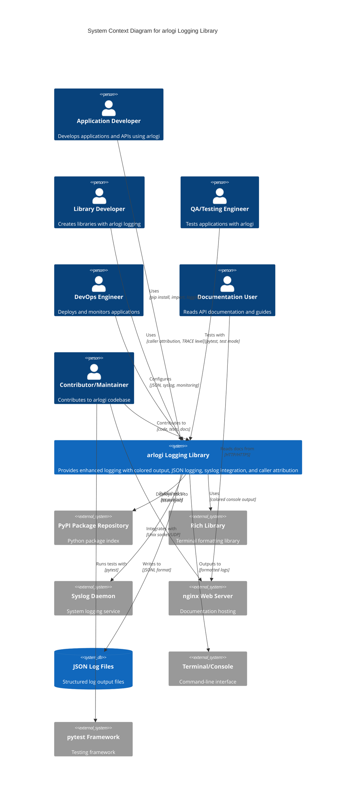

# C4 Context Level: System Context

## System Overview

### Short Description

Arlogi is a robust, type-safe Python logging library that provides enhanced colored console output, structured JSON logging, syslog integration, and advanced caller attribution capabilities for modern application development.

### Long Description

Arlogi extends Python's standard logging module with modern features designed to solve the problem of inadequate logging capabilities in production applications. The system provides a custom TRACE log level (level 5) for ultra-detailed debugging, premium colored console output using the Rich library, structured JSON logging for log aggregation systems, and enterprise-grade syslog integration. The library's unique caller attribution feature allows developers to trace log calls across function boundaries using depth parameters (from_, from_caller, or **{"from": depth}), making it easier to understand the flow of complex applications. Arlogi is designed as a drop-in replacement for the standard logging module while maintaining full backward compatibility, prioritizing modern type-safe configuration objects (LoggingConfig) and provides legacy support for simple helper functions (setup_logging). The system ensures test-mode awareness for seamless pytest integration and follows SOLID principles for maintainability and clear separation of concerns.

---

## Personas

### Application Developer

- **Type**: Human User
- **Description**: Python developers building applications, APIs, microservices, or scripts who need production-ready logging capabilities beyond what the standard logging module provides
- **Goals**:
  - Quickly set up professional logging with minimal configuration
  - Add colored console output for better development experience
  - Implement structured JSON logging for log aggregation systems (ELK, Splunk, etc.)
  - Use caller attribution to trace log messages through complex call stacks
  - Configure module-specific log levels for different parts of the application
  - Integrate with enterprise syslog infrastructure
  - Maintain backward compatibility with existing logging code
- **Key Features Used**:
  - LoggingConfig for type-safe configuration (Primary)
  - get_logger() for standard logging with caller attribution
  - get_json_logger() for structured JSON output
  - get_syslog_logger() for enterprise integration
  - Module-specific log levels
  - Custom TRACE log level
  - setup_logging() for legacy configuration support

### Library Developer

- **Type**: Human User
- **Description**: Python developers creating reusable libraries or frameworks that need to provide logging capabilities while respecting the consuming application's logging configuration
- **Goals**:
  - Add logging to library code without forcing configuration on users
  - Use caller attribution to show meaningful context (caller's function) rather than library internals
  - Support the TRACE level for ultra-detailed library debugging
  - Ensure logging works regardless of when the library is imported
  - Provide lazy initialization patterns for logging
- **Key Features Used**:
  - get_logger() for library logging
  - Caller attribution with from_=1 to show caller context
  - TRACE level for detailed debugging
  - Lazy logger initialization with LoggerProtocol
  - Safe logging patterns that work with or without arlogi setup

### QA/Testing Engineer

- **Type**: Human User
- **Description**: Quality assurance engineers and testers who run automated tests and need to verify application behavior through log output
- **Goals**:
  - Run tests without log output cluttering test results
  - Capture and validate log messages during test execution
  - Use pytest fixtures (caplog, capsys) effectively
  - Verify correct log levels and messages in tests
  - Test application behavior without interference from logging configuration
- **Key Features Used**:
  - Automatic test mode detection
  - DEBUG default level in test environments
  - Compatibility with pytest caplog and capsys fixtures
  - No handler addition in test mode (prevents double logging)
  - Test mode detection via is_test_mode()

### DevOps Engineer

- **Type**: Human User
- **Description**: Operations engineers responsible for deploying, monitoring, and maintaining applications in production environments
- **Goals**:
  - Collect and aggregate logs from multiple application instances
  - Parse structured JSON logs for monitoring and alerting
  - Integrate with centralized logging infrastructure (syslog, ELK stack, Splunk)
  - Configure appropriate log levels for different environments
  - Monitor application health through log analysis
- **Key Features Used**:
  - Structured JSON logging (JSONHandler, JSONFileHandler)
  - Syslog integration (ArlogiSyslogHandler)
  - Environment variable configuration (ARLOGI_LEVEL, LOG_LEVEL)
  - Module-specific log levels for fine-grained control
  - JSON log format with timestamps, level names, and source information

### Documentation User

- **Type**: Human User
- **Description**: Developers reading API documentation, user guides, and examples to learn how to use the arlogi library effectively
- **Goals**:
  - Understand the library's capabilities and features
  - Find API reference documentation for all functions and classes
  - Learn from practical examples and usage patterns
  - Access architecture diagrams and design documentation
  - Get troubleshooting guidance for common issues
- **Key Features Used**:
  - MkDocs documentation website
  - API reference with auto-generated documentation
  - User guides and tutorials
  - Example code and integration patterns
  - C4 architecture diagrams

### Contributor/Maintainer

- **Type**: Human User
- **Description**: Developers contributing to the arlogi codebase, maintaining the library, and releasing new versions
- **Goals**:
  - Understand the codebase architecture and design patterns
  - Add new features while maintaining backward compatibility
  - Write comprehensive tests for new functionality
  - Generate and update API documentation
  - Release new versions to PyPI
  - Review and merge pull requests
- **Key Features Used**:
  - Test suite with pytest
  - Source code architecture
  - Documentation generation tools (MkDocs, MkDocstrings)
  - C4 architecture documentation
  - Development workflow and contribution guidelines

---

## System Features

### Enhanced Colored Console Output

- **Description**: Provides beautiful, readable colored console logs using the Rich library with automatic traceback support, configurable level colors, and clean formatting options
- **Users**: Application Developer, Library Developer
- **User Journey**: [Application Developer - Basic Logging Journey](#application-developer-basic-logging-journey)
- **User Journey**: [Application Developer - JSON Logging Journey](#application-developer-json-logging-journey)
- **User Journey**: [Application Developer - TRACE Logging Journey](#application-developer-trace-logging-journey)
- **User Journey**: [Library Developer - Caller Attribution Journey](#library-developer-caller-attribution-journey)
- **User Journey**: [Application Developer - Module Configuration Journey](#application-developer-module-configuration-journey)
- **User Journey**: [DevOps Engineer - Syslog Integration Journey](#devops-engineer-syslog-integration-journey)
- **User Journey**: [Application Developer - Dedicated Logger Journey](#application-developer-dedicated-logger-journey)
- **User Journey**: [Application Developer - Advanced Configuration Journey](#application-developer-advanced-configuration-journey)
- **User Journey**: [QA/Testing Engineer - Test Mode Journey](#qatesting-engineer-test-mode-journey)
- **User Journey**: [Documentation User - API Reference Journey](#documentation-user-api-reference-journey)

---

## User Journeys

### Application Developer: Basic Logging Journey

**Persona**: Application Developer

1. **Installation**: Developer installs arlogi using pip or uv package manager
   - Command: `pip install arlogi` or `uv add arlogi`
   - System: PyPI Package Repository → Python Package

2. **Import and Setup**: Developer imports arlogi and configures logging using the modern configuration pattern

   ```python
   from arlogi import LoggingConfig, LoggerFactory, get_logger
   config = LoggingConfig(level="INFO")
   LoggerFactory._apply_configuration(config)
   ```

   - System: Python Package (LoggingConfig, LoggerFactory)

3. **Create Logger**: Developer obtains a logger instance

   ```python
   logger = get_logger(__name__)
   ```

   - System: Python Package (get_logger function)

4. **Log Messages**: Developer logs messages with automatic colored output

   ```python
   logger.info("Application started")
   logger.warning("Configuration file not found")
   logger.error("Failed to connect to database")
   ```

   - System: Python Package → ColoredConsoleHandler → Terminal

5. **View Output**: Developer sees beautifully formatted colored console output with level indicators and file paths

### Application Developer: JSON Logging Journey

**Persona**: Application Developer, DevOps Engineer

1. **Setup with JSON**: Developer configures logging with JSON file output

   ```python
   config = LoggingConfig(
       level="INFO",
       json_file_name="logs/app.jsonl"
   )
   LoggerFactory._apply_configuration(config)
   ```

   - System: Python Package → JSONFileHandler → JSON Log Files

2. **Log with Structured Data**: Developer logs messages with extra fields

   ```python
   logger.info("User logged in", extra={"user_id": 123, "ip": "192.168.1.1"})
   ```

3. **View JSON Output**: Developer views structured JSON log file
   - System: JSON Log Files (JSONL format with timestamp, level, message, logger_name, module, function, line_number, and extra fields)

4. **Integrate with Log Aggregation**: DevOps engineer configures log aggregation system (ELK, Splunk) to parse JSON logs

### Library Developer: Caller Attribution Journey

**Persona**: Library Developer, Application Developer

1. **Create Library with Logging**: Developer creates a utility function in a library module

   ```python
   # app/utils.py
   from arlogi import get_logger

   logger = get_logger(__name__)

   def fetch_user(user_id):
       logger.info("Fetching user", from_=1)  # Show caller, not this function
       # ... fetch logic
       return user
   ```

2. **Call from Application**: Application code calls the library function

   ```python
   # app/main.py
   from app.utils import fetch_user

   def handle_request(user_id):
       user = fetch_user(user_id)  # Log shows: [from handle_request()]
   ```

3. **View Attribution**: Developer sees log output showing the calling function (handle_request) rather than the library function (fetch_user)

4. **Deep Stack Tracing**: Developer uses deeper attribution for complex call stacks

   ```python
   logger.debug("Processing", from_=2)  # Show caller's caller
   ```

### Application Developer: TRACE Logging Journey

**Persona**: Application Developer, Library Developer

1. **Import TRACE Level**: Developer imports the custom TRACE level

   ```python
   from arlogi import get_logger, TRACE
   ```

2. **Use TRACE Logs**: Developer adds ultra-detailed logging

   ```python
   logger.trace("Variable x = %s, y = %s", x, y, from_=0)
   logger.trace("Entering function complex_calculation")
   logger.trace("Step 1: Initialize", from_=1)
   logger.trace("Step 2: Validate inputs")
   logger.trace("Step 3: Perform calculation")
   logger.trace("Exiting function complex_calculation")
   ```

3. **Configure TRACE Level**: Developer enables TRACE level for specific modules

   ```python
   config = LoggingConfig(
       level="INFO",
       module_levels={"app.complex": "TRACE"}
   )
   LoggerFactory._apply_configuration(config)
   ```

   - System: Python Package → TRACE level registration (logging.addLevelName)

4. **Enable for Debugging**: Developer temporarily sets global level to TRACE for debugging

   ```python
   config = LoggingConfig(level="TRACE")
   LoggerFactory._apply_configuration(config)
   ```

### Application Developer: Module Configuration Journey

**Persona**: Application Developer, DevOps Engineer

1. **Plan Module Structure**: Developer identifies modules needing different log levels
   - app.database: Needs verbose logging (DEBUG)
   - app.network: Needs ultra-detailed tracing (TRACE)
   - app.security: Only warnings and errors (WARNING)
   - app.api: Standard logging (INFO)

2. **Configure Module Levels**: Developer sets up module-specific configuration

   ```python
   config = LoggingConfig(
       level="INFO",
       module_levels={
           "app.database": "DEBUG",
           "app.network": "TRACE",
           "app.security": "WARNING"
       }
   )
   LoggerFactory._apply_configuration(config)
   ```

   - System: Python Package → LoggingConfig → LoggerFactory._configure_module_levels()

3. **Create Loggers**: Developer creates loggers for each module

   ```python
   db_logger = get_logger("app.database")
   net_logger = get_logger("app.network")
   sec_logger = get_logger("app.security")
   api_logger = get_logger("app.api")
   ```

4. **Verify Levels**: Developer logs messages at different levels and verifies output matches configuration
   - net_logger.trace() → Shows (TRACE enabled)
   - db_logger.trace() → Hidden (only DEBUG enabled)
   - sec_logger.info() → Hidden (only WARNING+ enabled)
   - api_logger.info() → Shows (INFO enabled)

### Application Developer: Dedicated Logger Journey

**Persona**: Application Developer, DevOps Engineer

1. **Identify Use Case**: Developer needs separate log for audit trail (not shown in console)
   - Use case: Security audit logs sent to dedicated JSON file
   - Requirements: No console output, structured JSON, separate file

2. **Create Dedicated JSON Logger**: Developer creates JSON-only logger

   ```python
   from arlogi import get_json_logger

   audit_logger = get_json_logger("audit", "logs/audit.jsonl")
   ```

   - System: Python Package → get_json_logger() → JSONFileHandler (bypasses root handlers)

3. **Log to Dedicated Destination**: Developer logs audit events

   ```python
   audit_logger.info("User logged in", extra={"user_id": 123, "ip": "192.168.1.1"})
   audit_logger.warning("Privilege escalation attempt", extra={"user_id": 456})
   ```

4. **Verify Output**: Developer verifies console remains clean while audit.jsonl contains structured logs

5. **Create Dedicated Syslog Logger**: Developer creates syslog-only logger for security events

   ```python
   from arlogi import get_syslog_logger

   security_logger = get_syslog_logger("security")
   security_logger.critical("Brute force attack detected", extra={"ip": "10.0.0.50"})
   ```

   - System: Python Package → get_syslog_logger() → ArlogiSyslogHandler → Syslog Daemon

### Application Developer: Advanced Configuration Journey

**Persona**: Application Developer, Contributor

1. **Modern Configuration Pattern**: Developer uses LoggingConfig dataclass for type safety (Recommended)

   ```python
   from arlogi import LoggingConfig, LoggerFactory

   config = LoggingConfig(
       level="INFO",
       module_levels={"app.db": "DEBUG"},
       json_file_name="logs/app.jsonl",
       show_time=True
   )
   ```

   - System: Python Package → LoggingConfig (immutable dataclass)

2. **Apply Configuration**: Developer applies configuration to logging system

   ```python
   LoggerFactory._apply_configuration(config)
   ```

   - System: Python Package → LoggerFactory._apply_configuration()

3. **Validate Configuration**: Developer benefits from automatic validation
   - Invalid log levels raise ValueError
   - Type hints ensure correct parameter types
   - Immutable configuration prevents accidental modification

4. **Convert Configuration**: Developer can serialize/deserialize configuration

   ```python
   config_dict = config.to_dict()
   # ... save to file, environment, etc.
   new_config = LoggingConfig.from_kwargs(**config_dict)
   ```

### QA/Testing Engineer: Test Mode Journey

**Persona**: QA/Testing Engineer, Application Developer

1. **Write Tests**: Developer writes tests using pytest

   ```python
   import pytest
   from arlogi import get_logger

   def test_application_logic():
       logger = get_logger(__name__)
       logger.info("Test started")
       # ... test code
       logger.info("Test completed")
   ```

2. **Automatic Test Mode Detection**: System detects pytest environment
   - System: Python Package → is_test_mode() → Checks for pytest in sys.modules
   - Result: Test mode = True

3. **Automatic Configuration**: System adjusts for test mode
   - Default level: DEBUG (instead of INFO)
   - No handlers added to root logger (prevents double logging)
   - Seamless integration with pytest caplog fixture

4. **Use pytest Fixtures**: Developer uses caplog to capture logs

   ```python
   def test_log_output(caplog):
       logger = get_logger(__name__)
       logger.info("Test message")

       assert "Test message" in caplog.text
       assert caplog.records[0].levelname == "INFO"
   ```

5. **Verify Logs**: Developer verifies log messages and levels in tests

### DevOps Engineer: Syslog Integration Journey

**Persona**: DevOps Engineer, Application Developer

1. **Setup Syslog**: DevOps engineer ensures syslog daemon is running
   - System: Syslog Daemon (rsyslog, syslog-ng, etc.)
   - Default socket: /dev/log (Unix) or /var/run/syslog (macOS)

2. **Enable Syslog in Application**: Developer configures syslog output

   ```python
   config = LoggingConfig(
       level="INFO",
       use_syslog=True,
       syslog_address="/dev/log"
   )
   LoggerFactory._apply_configuration(config)
   ```

   - System: Python Package → ArlogiSyslogHandler → Unix socket → Syslog Daemon

3. **Log Messages**: Application logs normally, syslog handler forwards to syslog daemon

   ```python
   logger.info("Application event")
   logger.error("Application error")
   ```

4. **Configure Remote Syslog**: DevOps engineer configures remote syslog server

   ```python
   config = LoggingConfig(
       syslog_address=("syslog.example.com", 514),
       use_syslog=True
   )
   LoggerFactory._apply_configuration(config)
   ```

   - System: ArlogiSyslogHandler → UDP → Remote Syslog Server

5. **Automatic Fallback**: System gracefully handles syslog unavailability
   - Try: Unix socket (/dev/log)
   - Fallback 1: UDP on localhost:514
   - Fallback 2: Silent (no errors, application continues)

6. **Monitor Logs**: DevOps engineer views logs in syslog dashboard or SIEM tool

### Documentation User: API Reference Journey

**Persona**: Documentation User, Contributor

1. **Access Documentation**: User navigates to documentation website
   - System: Documentation Site (MkDocs) → Web Browser
   - URL: <http://192.168.168.5/cpaiops/> (production) or <http://localhost:8000> (development)

2. **Browse API Reference**: User clicks "API Reference" in navigation menu
   - System: Documentation Site → API Reference Page
   - Content: Auto-generated from Python docstrings

3. **Search for Function**: User uses search box to find specific function
   - Example: Search "get_logger" → Shows get_logger() documentation
   - System: MkDocs Material Theme → Full-text search

4. **Read Documentation**: User reads comprehensive API documentation
   - Function signature with type hints
   - Parameter descriptions
   - Return value documentation
   - Usage examples
   - Related functions

5. **View Examples**: User navigates to examples section
   - Code snippets demonstrating real-world usage
   - Integration patterns with third-party libraries
   - Common use cases and best practices

6. **Access Architecture**: User views C4 architecture diagrams
   - System: Documentation Site → Architecture Documentation
   - Mermaid diagrams showing system context, containers, components

### Contributor: Documentation Generation Journey

**Persona**: Contributor, Maintainer

1. **Write Code with Docstrings**: Contributor adds Python code with comprehensive docstrings

   ```python
   def get_logger(name: str, level: int | str | None = None) -> LoggerProtocol:
       """Get a logger instance with caller attribution support.

       Args:
           name: Logger name (typically __name__)
           level: Optional level override

       Returns:
           A logger instance implementing LoggerProtocol

       Examples:
           >>> logger = get_logger("my_app")
           >>> logger.info("Hello")
       """
   ```

   - System: Python Package Source Code

2. **Generate API Reference**: Contributor runs documentation generation script

   ```bash
   python docs/scripts/gen_ref_pages.py
   ```

   - System: gen_ref_pages.py → Scans src/arlogi/ → Extracts classes/functions/docstrings → Creates markdown files

3. **Build Documentation Site**: Contributor builds static HTML documentation

   ```bash
   mkdocs build
   ```

   - System: MkDocs → Reads markdown files → Runs MkDocstrings → Generates static HTML

4. **Serve Locally**: Contributor previews documentation locally

   ```bash
   mkdocs serve
   ```

   - System: MkDocs dev server → <http://localhost:8000>

5. **Deploy to Production**: Contributor deploys documentation to web server

   ```bash
   docs/scripts/build_pub.sh
   ```

   - System: build_pub.sh → rsync → nginx Web Server (192.168.168.5)

6. **Verify Deployment**: Contributor verifies documentation is accessible at production URL

---

## External Systems and Dependencies

### Rich Library

- **Type**: Python Dependency (Third-Party Library)
- **Description**: Terminal formatting library providing beautiful colored console output, tables, progress bars, and rich text rendering capabilities
- **Integration Type**: Python dependency (import and use)
- **Purpose**: Used by ColoredConsoleHandler to render premium colored console output with automatic traceback support, level indicators, and formatted messages. Without Rich, arlogi would fall back to basic console output or require an alternative formatting solution.

### Python Standard Library (logging module)

- **Type**: Standard Library
- **Description**: Python's built-in logging framework providing the foundation for all logging functionality
- **Integration Type**: Core dependency (extension and subclassing)
- **Purpose**: Arlogi extends the standard logging module by adding custom levels, handlers, and formatters. All arlogi loggers inherit from logging.Logger, ensuring compatibility with existing code and third-party libraries that use standard logging.

### Syslog Daemon

- **Type**: System Service (External System)
- **Description**: Unix/Linux system logging service (rsyslog, syslog-ng, or macOS syslog) responsible for collecting and distributing log messages
- **Integration Type**: Client-Server (Unix socket or UDP)
- **Purpose**: ArlogiSyslogHandler sends log messages to the syslog daemon via Unix domain socket (/dev/log) or UDP (localhost:514). Enables integration with enterprise logging infrastructure and centralized log management systems. Arlogi includes automatic fallback if syslog is unavailable.

### PyPI (Python Package Index)

- **Type**: Package Repository (External System)
- **Description**: The official software repository for the Python programming language
- **Integration Type**: Publishing/Consuming (via pip or uv)
- **Purpose**: Python Package container is published to PyPI, allowing application developers to install arlogi using standard package managers (pip install arlogi or uv add arlogi). Enables distribution and version management of the library.

### pytest (Testing Framework)

- **Type**: Development Tool (External System)
- **Description**: Mature full-featured Python testing framework with powerful fixtures and assertion introspection
- **Integration Type**: Test execution environment
- **Purpose**: Test Suite container uses pytest for test discovery, execution, and reporting. Pytest fixtures (caplog, capsys) are used to capture and validate log output. Arlogi automatically detects pytest to enable test mode (DEBUG default level, no handler addition).

### pytest-cov (Coverage Plugin)

- **Type**: Development Tool (External System)
- **Description**: Pytest plugin for measuring code coverage
- **Integration Type**: Test reporting plugin
- **Purpose**: Test Suite uses pytest-cov to generate coverage reports (.coverage, coverage.json, HTML reports) tracking how much of the arlogi codebase is tested. Ensures quality and identifies untested code.

### MkDocs (Static Site Generator)

- **Type**: Documentation Tool (External System)
- **Description**: Fast, simple static site generator perfect for building project documentation
- **Integration Type**: Documentation build system
- **Purpose**: Documentation Site container uses MkDocs to build the documentation website from markdown files. Processes markdown, generates navigation, and creates static HTML output for deployment.

### Material Theme for MkDocs

- **Type**: Documentation Theme (External System)
- **Description**: Popular, feature-rich documentation theme for MkDocs with search, navigation, and responsive design
- **Integration Type**: MkDocs theme plugin
- **Purpose**: Provides the web interface for documentation website with search functionality, hierarchical navigation, mobile responsiveness, and professional styling. Improves user experience for documentation readers.

### MkDocstrings (API Documentation Tool)

- **Type**: Documentation Tool (External System)
- **Description**: Automatic API documentation generation from Python docstrings and type hints
- **Integration Type**: Documentation generation plugin
- **Purpose**: Automatically extracts API documentation from Python source code (docstrings, type hints, function signatures) and generates markdown reference pages. Keeps documentation synchronized with code changes.

### nginx Web Server

- **Type**: Web Server (External System)
- **Description**: High-performance HTTP server and reverse proxy
- **Integration Type**: Static file hosting
- **Purpose**: Documentation Site container deploys static HTML documentation to nginx web server at <http://192.168.168.5/cpaiops/>. Serves documentation files to users via HTTP/HTTPS. Enables public or internal access to documentation.

### SSH/rsync (Deployment Tools)

- **Type**: Network Protocol/File Transfer (External System)
- **Description**: Secure Shell protocol and rsync file synchronization utility
- **Integration Type**: Remote file transfer
- **Purpose**: build_pub.sh script uses SSH/rsync to deploy documentation site to remote nginx server. Securely transfers files from development machine to production web server. Enables automated documentation deployment.

### JSON Log Files

- **Type**: File Storage (External System)
- **Description**: Structured log files in JSON Lines (JSONL) format for persistent log storage
- **Integration Type**: File I/O
- **Purpose**: JSONFileHandler writes structured log entries to files in JSONL format. Each line is a valid JSON object with timestamp, level, message, logger name, source location, and extra fields. Enables log aggregation, parsing, and analysis by external tools (ELK, Splunk, etc.).

### Terminal/Console

- **Type**: User Interface (External System)
- **Description**: Command-line terminal or console where application output is displayed
- **Integration Type**: Output stream (stdout/stderr)
- **Purpose**: ColoredConsoleHandler renders formatted log messages to the terminal using Rich library. Provides real-time feedback to developers and operators during application execution. Supports colors, formatting, and tracebacks.

### Filesystem

- **Type**: Operating System Service (External System)
- **Description**: Operating system file management for creating, writing, and managing log files
- **Integration Type**: File I/O
- **Purpose**: JSONFileHandler creates log files, writes entries, and manages file handles. System creates parent directories automatically, handles file permissions, and manages file rotation (manual or external). Enables persistent log storage for later analysis.

---

## System Context Diagram



---

## Related Documentation

- **[Container Documentation](./c4-container.md)** - Deployment architecture and container-level details
- **[Component Documentation](./c4-component.md)** - Component structure and component interactions
- **[Core Logging Library Component](./c4-component-core-logging.md)** - Core logging functionality details
- **[Test Suite Component](./c4-component-test-suite.md)** - Testing infrastructure documentation
- **[Documentation System Component](./c4-component-documentation.md)** - Documentation generation and deployment

---

**Document Information**

- **Last Updated**: 2025-12-28
- **C4 Level**: Context
- **Scope**: System-level overview with personas, features, user journeys, and external dependencies
- **Purpose**: Provide stakeholder-friendly system context focusing on people and software systems rather than technical implementation details
