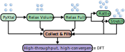

.. assyst ASSYST documentation master file, created by
   sphinx-quickstart on Mon Jun 23 16:38:54 2025.

ASSYST documentation
====================

.. image:: https://zenodo.org/badge/997271420.svg
   :target: https://doi.org/10.5281/zenodo.15744358

.. image:: https://codecov.io/gh/pmrv/assyst/graph/badge.svg?token=NIEJ01UMJF
   :target: https://codecov.io/gh/pmrv/assyst

ASSYST is the Automated Small Symmetric Structure Training, a training protocol, aimed at providing comprehensive,
transferable training sets for machine learning interatomic potentials (MLIP) automatically. A detailed explanation and
verification of the method can be found in our papers. `[1]
<https://doi.org/10.1038/s41524-025-01669-4>`_ `[2] <https://doi.org/10.1103/PhysRevB.107.104103>`_ ASSYST gives up the
notion of fitting potentials to individual phases or structures and instead tries to deliver a
training set spanning the full potential energy surface (PES) of a material.

This software package is a minimal implementation of this idea, designed to be as flexible as possible without assuming
either a specific MLIP, reference data, or workflow manager in mind.
It is built on `ASE <https://ase-lib.org/index.html>`_ and can use any of its calculators.
It also assumes that you bring your own reference energies and forces.
For a ready-to-run implementation that targets Atomic Cluster Expansion and Moment Tensor Potentials fit to Density
Functional Theory (DFT) data check out `pyiron_potentialfit <https://github.com/pyiron/pyiron_potentialfit>`_.

Development happens on `Github <https://github.com/eisenforschung/assyst>`_, feel free to open any issues or pull
request for additional features.
We are open for any contributions!

Overview
========

The training strategy to achieve this splits in three steps:

1. the exploration of the PES with randomly generated, but symmetric, periodic crystals in 
:ref:`assyst.crystals <crystals>`;

2. locating energetically favorable pockets in the PES by relaxing the initially generated sets of structures in
:ref:`assyst.relax <relax>`, this can be done in multiple steps;

3. Exploring the direct neighborhood of these pockets by perturbing the relaxation configurations again in
:ref:`assyst.perturbations <perturbations>`.

4. The first steps are then combined and filtered based on configurable criteria to avoid unreasonable structures.

This is illustrated in :ref:`below <schematic>`, with the steps 1-3 arranged on top in green, and the filtering step 4 in
red.
The final step is labelling the structures with high quality DFT, which is outside of the scope of this package.

.. _schematic:

   ASSYST workflow steps. Reproduced from `Poul et al. <https://doi.org/10.1038/s41524-025-01669-4>`_ under
   `CC-BY 4.0 <https://creativecommons.org/licenses/by/4.0/>`_ license.

.. toctree::
   :maxdepth: 2
   :hidden:
   :caption: Contents:

   Home <self>
   installation
   overview
   assyst
