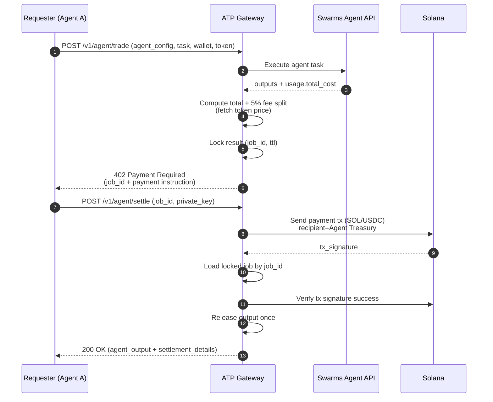
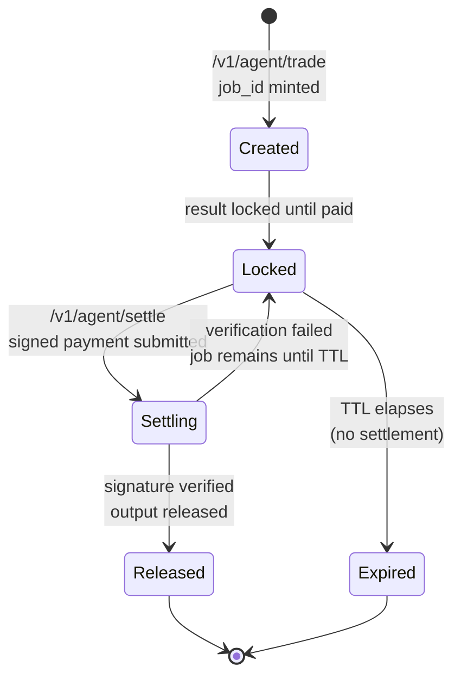
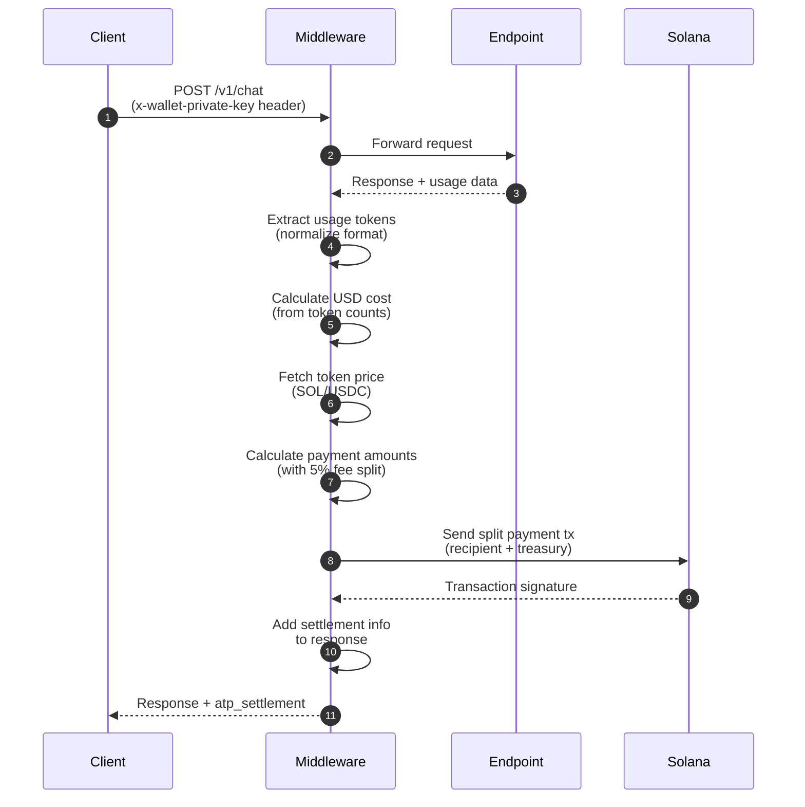

# ATP-Protocol

ATP Protocol is a **payment-gated agent execution API** that makes **agent-to-agent payments** and “pay to unlock results” easy on **Solana**, with a simple client integration (two endpoints + a Solana payment).

At a high level:

- An agent (or any client) requests work from another agent via the ATP Gateway.
- The Gateway executes the upstream agent immediately, but **returns a 402 challenge** instead of the result.
- The requester pays **once** to the agent treasury (in **SOL** or **USDC**).
- After settlement, the Gateway releases the stored agent output.

The ATP Gateway exposes:

- `POST /v1/agent/trade`: execute + return payment challenge (402)
- `POST /v1/agent/settle`: facilitator signs+submits payment (using provided private key) + releases output
- optional helper endpoints for token price/payment info

---

## One simple end-to-end example (trade → settle)

Run the server, then run:

```bash
export ATP_BASE_URL="http://localhost:8000"
export ATP_USER_WALLET="<YOUR_SOLANA_PUBKEY>"
export ATP_PRIVATE_KEY="<YOUR_PRIVATE_KEY_STRING>"

# Safety switch: settlement will broadcast a real SOL transaction
export ATP_ALLOW_SPEND="true"

python full_flow_example.py
```

Notes:
- The first call (`/v1/agent/trade`) returns **HTTP 402** with a `job_id` and the payment challenge JSON.
- The second call (`/v1/agent/settle`) signs+sends the SOL payment in-memory and returns **HTTP 200** with `agent_output`.

Server-side pricing (optional):
- Set `INPUT_COST_PER_MILLION_USD` and/or `OUTPUT_COST_PER_MILLION_USD` on the server to compute `usd_cost` from `usage` token counts.
- If not set (or if token counts are missing), the gateway falls back to upstream `usage.total_cost` (and then a small default).

---

## Conceptual purpose

ATP exists to solve a common agentic workflow problem:

- Agents can call other agents (“agent tools”, “specialist agents”, “market-data agents”), but **payments and settlement** are usually ad-hoc.
- ATP standardizes **a simple handshake**: *execute → challenge → pay → settle → release*.
- Because the settlement happens on Solana, it’s **cheap**, **fast**, and can be done by **another agent** programmatically (no human-in-the-loop required).

Key design goals:

- **Agent-to-agent friendly**: the “client” can be another agent, a bot, or a backend service.
- **Simple integration**: clients can settle by providing a private key string for a single request (used in-memory only).
- **Token flexibility**: support SOL today, and USDC as a stable-priced option.

---

## Core actors

- **Requester (Agent A)**: wants work done (submits the task, later pays and settles).
- **ATP Gateway**: runs the upstream agent, produces the payment challenge, holds the result temporarily.
- **Upstream Agent Service (Swarms API)**: executes the requested agent workload.
- **Solana**: settlement rail (payment transaction + signature).
- **Facilitator**: signs+submits the payment transaction during settlement.
- **Agent Treasury**: receives the payment (minus the fee split logic described below).
- **Swarms Treasury**: receives the **5% settlement fee**.
- **Temporary lockbox**: the gateway holds the output until paid (expires after a TTL).

---

## How it works (step-by-step)

### 1) Request a trade (create challenge)

The requester calls:

- `POST /v1/agent/trade`

with:

- `agent_config`: full agent spec (see `atp/schemas.py:AgentSpec`)
- `task`: what to do
- `user_wallet`: payer public key (used during verification)
- `payment_token`: `SOL` or `USDC`
- optional `history` / `img` / `imgs`

### 2) Gateway executes the agent immediately

The Gateway forwards the request to the upstream agent service (`SWARMS_API_URL`) and waits for completion.

### 3) Gateway computes the price + fee split

The Gateway:

- reads the USD cost from upstream usage (`usage.total_cost`, with a fallback),
- fetches token/USD price (SOL via CoinGecko, USDC treated as $1),
- computes the **total payment** and the **5% settlement fee**.

Important: the fee is **taken from the total** (not added on top):
\[
\text{total} = \frac{\text{usd\_cost}}{\text{token\_price}}
\quad
\text{fee} = 0.05 \cdot \text{total}
\quad
\text{agent\_receives} = \text{total} - \text{fee}
\]

### 4) Gateway stores the result (locked) with a TTL

The agent output is held in a temporary lockbox under a generated `job_id`.

If the requester never pays, the job expires automatically (default TTL: 10 minutes).

### 5) Gateway returns a 402 Payment Required challenge

Instead of returning the agent output, the Gateway returns **HTTP 402** with a JSON payload containing:

- `job_id`
- `recipient` (the agent treasury pubkey)
- amount to pay (in lamports or USDC micro-units)
- a memo format like `ATP:{job_id}`
- a fee breakdown (5% to Swarms treasury)
- TTL info

### 6) Requester pays on Solana

The requester provides a private key string during settlement; the gateway signs+sends the SOL payment transaction in-memory.

### 7) Settle to unlock

The requester calls:

- `POST /v1/agent/settle`

with:

- `job_id`
- `private_key`

### 8) Gateway verifies and releases the output

The Gateway:

- looks up the pending job by `job_id`,
- signs+sends the on-chain payment transaction and verifies it succeeded,
- releases the output exactly once (prevents double-settlement),
- returns the stored `agent_output` and settlement details.

---

## Diagrams

### Architecture overview

```mermaid
flowchart LR
  A["Requester<br/>(Agent A / App / Bot)"] -->|POST /v1/agent/trade| G["ATP Gateway<br/>FastAPI"]
  G -->|Execute task| S["Swarms Agent API<br/>Upstream execution"]
  S -->|Result + usage cost| G

  A -->|POST /v1/agent/settle<br/>(job_id, private_key)| G
  G <-->|Send payment tx| C["Solana<br/>(SOL / USDC)"]
  G -->|Verify signature status| C
  G -->|Unlocked agent output| A

  C --> T1[Agent Treasury]
  C --> T2["Swarms Treasury<br/>(5% fee)"]
```

### End-to-end sequence (challenge → payment → settlement)



### Job lifecycle / state machine



---

## Client expectations (what you can rely on)

- **Two-call integration**: request work via `/v1/agent/trade`, then unlock via `/v1/agent/settle`.
- **Single payment**: you pay once to the `recipient` address returned by the 402 challenge.
- **Clear fee disclosure**: the 402 includes a breakdown showing the **5% settlement fee** and who receives it.
- **Time-bounded**: each `job_id` expires after `ttl_seconds` if you don't settle in time.

---

## ATP Settlement Middleware

The ATP Protocol also provides a **FastAPI middleware** that enables **automatic payment deduction** for any configured endpoint. Unlike the main ATP Gateway (which uses a 402 challenge pattern), the middleware automatically deducts payment **after** the endpoint executes successfully, making it ideal for APIs that want seamless, automatic settlement.

### How the Middleware Works

The `ATPSettlementMiddleware` intercepts requests to configured endpoints and:

1. **Extracts wallet private key** from request headers (default: `x-wallet-private-key`)
2. **Executes the endpoint** normally (passes request through)
3. **Extracts usage data** from the response (token counts from various API formats)
4. **Calculates cost** based on configured rates (`input_cost_per_million_usd`, `output_cost_per_million_usd`)
5. **Automatically deducts payment** from the provided wallet via Solana transaction
6. **Splits payment** between recipient (endpoint host) and Swarms Treasury (5% fee)
7. **Adds settlement info** to the response (optional)

### Key Differences from Main ATP Protocol

| Feature | Main ATP Gateway | Middleware |
|---------|-----------------|------------|
| **Payment Flow** | Two-step: 402 challenge → settle | Automatic: single request |
| **Response** | Returns 402 with payment challenge | Returns normal response + settlement info |
| **Integration** | Requires two API calls | Single API call with wallet header |
| **Use Case** | Pay-to-unlock results | Automatic per-request billing |
| **Wallet Key** | Provided during settlement | Provided in request header |

### Middleware Configuration

Add the middleware to your FastAPI app:

```python
from fastapi import FastAPI
from atp.middleware import ATPSettlementMiddleware
from atp.schemas import PaymentToken

app = FastAPI()

app.add_middleware(
    ATPSettlementMiddleware,
    allowed_endpoints=[
        "/v1/chat",
        "/v1/completions",
        "/v1/agent/execute",
    ],
    input_cost_per_million_usd=10.0,  # $10 per million input tokens
    output_cost_per_million_usd=30.0,  # $30 per million output tokens
    wallet_private_key_header="x-wallet-private-key",  # Header name for wallet key
    payment_token=PaymentToken.SOL,  # SOL or USDC
    recipient_pubkey="YourPublicKeyHere",  # Required: endpoint host receives payment
    skip_preflight=False,  # Skip Solana transaction preflight simulation
    commitment="confirmed",  # Solana commitment level
    usage_response_key="usage",  # Key in response where usage data is located
    include_usage_in_response=True,  # Add usage/cost info to response
    require_wallet=True,  # Require wallet key (if False, skips settlement when missing)
)
```

### Configuration Parameters

- **`allowed_endpoints`** (required): List of endpoint paths to apply settlement to (exact matches only)
- **`input_cost_per_million_usd`** (required): Cost per million input tokens in USD
- **`output_cost_per_million_usd`** (required): Cost per million output tokens in USD
- **`wallet_private_key_header`** (default: `"x-wallet-private-key"`): HTTP header name containing the wallet private key
- **`payment_token`** (default: `PaymentToken.SOL`): Token to use for payment (SOL or USDC)
- **`recipient_pubkey`** (required): Solana public key of the recipient wallet (endpoint host receives main payment)
- **`skip_preflight`** (default: `False`): Whether to skip preflight simulation for Solana transactions
- **`commitment`** (default: `"confirmed"`): Solana commitment level (`processed`|`confirmed`|`finalized`)
- **`usage_response_key`** (default: `"usage"`): Key in response JSON where usage data is located
- **`include_usage_in_response`** (default: `True`): Whether to add usage/cost info to the response
- **`require_wallet`** (default: `True`): Whether to require wallet private key (if False, skips settlement when missing)

### Usage Example

**Client Request:**
```bash
curl -X POST http://localhost:8000/v1/chat \
  -H "Content-Type: application/json" \
  -H "x-wallet-private-key: [1,2,3,...]" \
  -d '{"message": "Hello, world!"}'
```

**Endpoint Implementation:**
```python
@app.post("/v1/chat")
async def chat_endpoint(request: dict):
    # Your endpoint logic here
    response_data = {
        "output": "Hello! This is a response from the chat endpoint.",
        "usage": {
            "input_tokens": 150,  # Tokens in the request
            "output_tokens": 50,  # Tokens in the response
            "total_tokens": 200,
        },
    }
    return JSONResponse(content=response_data)
```

**Response (with settlement info):**
```json
{
  "output": "Hello! This is a response from the chat endpoint.",
  "usage": {
    "input_tokens": 150,
    "output_tokens": 50,
    "total_tokens": 200
  },
  "atp_usage": {
    "input_tokens": 150,
    "output_tokens": 50,
    "total_tokens": 200
  },
  "atp_settlement": {
    "status": "paid",
    "transaction_signature": "5j7s8K9...",
    "pricing": {
      "usd_cost": 0.003,
      "source": "middleware_rates",
      "input_tokens": 150,
      "output_tokens": 50,
      "total_tokens": 200,
      "input_cost_per_million_usd": 10.0,
      "output_cost_per_million_usd": 30.0,
      "input_cost_usd": 0.0015,
      "output_cost_usd": 0.0015
    },
    "payment": {
      "total_amount_lamports": 300000,
      "total_amount_sol": 0.0003,
      "total_amount_usd": 0.003,
      "treasury": {
        "pubkey": "7MaX4muAn8ZQREJxnupm8sgokwFHujgrGfH9Qn81BuEV",
        "amount_lamports": 15000,
        "amount_sol": 0.000015,
        "amount_usd": 0.00015
      },
      "recipient": {
        "pubkey": "YourPublicKeyHere",
        "amount_lamports": 285000,
        "amount_sol": 0.000285,
        "amount_usd": 0.00285
      }
    }
  }
}
```

### Supported Usage Formats

The middleware automatically detects and parses usage data from multiple API formats:

- **OpenAI**: `prompt_tokens`, `completion_tokens`, `total_tokens`
- **Anthropic**: `input_tokens`, `output_tokens`, `total_tokens`
- **Google/Gemini**: `promptTokenCount`, `candidatesTokenCount`, `totalTokenCount`
- **Cohere**: `tokens` (total), or `input_tokens`/`output_tokens` separately
- **Generic**: `input_tokens`, `output_tokens`, `total_tokens`
- **Nested**: `usage.prompt_tokens`, `meta.usage`, `statistics`, etc.

The middleware searches for usage data in this order:
1. The configured `usage_response_key` (default: `"usage"`)
2. Top-level keys in the response
3. Nested structures (`usage`, `meta.usage`, `statistics`, etc.)

### Payment Flow



### Payment Split Logic

The middleware automatically splits payments:

- **Total Payment**: `usd_cost / token_price_usd`
- **Swarms Treasury Fee**: `5%` of total (from `config.SETTLEMENT_FEE_PERCENT`)
- **Recipient Amount**: `95%` of total (endpoint host receives this)

The fee is **taken from the total** (not added on top), so the recipient receives the net amount after fees.

### Error Handling

- **Missing wallet key**: Returns `401 Unauthorized` if `require_wallet=True` (default)
- **Missing usage data**: Logs warning and returns original response (no settlement)
- **Payment failure**: Returns `500 Internal Server Error` with error details
- **Invalid private key**: Returns `500 Internal Server Error` with parsing error

### Custom API Key Integration

You can layer your own API key handling on top of the middleware:

```python
# Simple in-memory mapping (replace with database in production)
API_KEY_TO_WALLET = {
    "user_api_key_123": "[1,2,3,...]",  # Solana private key
}

def get_wallet_from_api_key(api_key: str = Header(..., alias="x-api-key")) -> str:
    """Custom dependency to map API keys to wallet private keys."""
    if api_key not in API_KEY_TO_WALLET:
        raise HTTPException(status_code=401, detail="Invalid API key")
    return API_KEY_TO_WALLET[api_key]

# Use a custom middleware to inject wallet key from API key
# before the ATP middleware processes the request
```

### When to Use Middleware vs. Main Protocol

**Use the Middleware when:**
- You want automatic, per-request billing
- Your API already returns usage data
- You want a single-request flow (no 402 challenge)
- You're building a service that charges per API call

**Use the Main Protocol when:**
- You want explicit payment approval (402 challenge)
- You need to hold results until payment is confirmed
- You want a two-step verification process
- You're building a pay-to-unlock system

See `examples/middleware_usage_example.py` for a complete working example.
