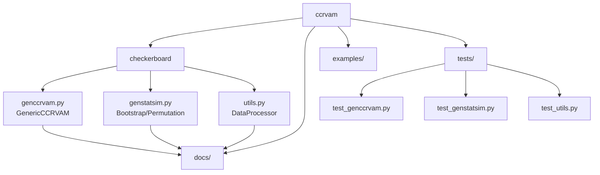
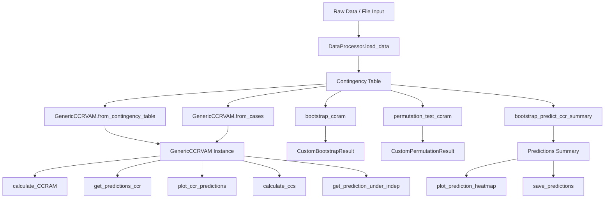

# ccrvam

> Python implementation of Checkerboard Copula Regression-based Visualization and Association Measure (CCRVAM)

[](https://badge.fury.io/py/ccrvam)
[](https://github.com/DhyeyMavani2003/ccrvam/actions/workflows/test.yaml)
[](https://ccrvam.readthedocs.io/en/latest/?badge=latest)
[](https://coveralls.io/github/DhyeyMavani2003/ccrvam?branch=main)
[](https://github.com/christophevg/pypi-template)
[](https://pepy.tech/projects/ccrvam)

## Overview

CCRVAM is a Python package for analyzing associations between categorical variables using Checkerboard Copula Regression. It provides tools for:

- Construction of CCRVAM objects from three forms of categorical data (case form, frequency form, table form)
- Calculation of marginal distributions and CDFs of categorical variables
- Computation of Checkerboard Copula Regression (CCR), its Prediction and Visualization
- Implementation of Checkerboard Copula Regression Association Measure (CCRAM) and Scaled CCRAM (SCCRAM)
- Bootstrap functionality for CCR-based prediction, CCRAM and SCCRAM
- Permutation testing functionality for CCRAM & SCCRAM
- Vectorized implementations for improved performance
- Rigorous Edge-case Handling & Unit Testing with Pytest 

## Authors

- Dhyey Mavani
- Daeyoung Kim 
- Shu-Min Liao

## Installation

### Usage in Jupyter Notebook:
This package (ccrvam) is hosted on PyPi, so for installation add the following line at the top of your Jupyter notebook!

```python3
%pip install --upgrade ccrvam
```

**Now, you should be all set to use it in a Jupyter Notebook!**

**Note:** You might need to restart your kernel after installation in order to use the package. This is because of the way Jupyter handles package installations.

### Usage in a Software Project Through Terminal (Virtual Environment):

Alternatively, if you would like to use it in a project, we recommend you to have a virtual environment for your use of this package, then follow the following workflow:

1. First, create and activate a virtual environment (Python 3.10+ recommended):

```bash
# Create virtual environment
$ python -m venv ccrvam-env

# Activate virtual environment (Mac/Linux)
$ source ccrvam-env/bin/activate

# Verify you're in the virtual environment
$ which python
```

2. Install package

```bash
$ pip install ccrvam
```

3. To deactivate the virtual environment, when done:

```bash
$ deactivate
```

## Documentation Structure

Visit [Read the Docs](https://ccrvam.readthedocs.org) for the full documentation, including overviews and several examples.

## Examples

For detailed examples in Jupyter Notebooks and beyond (organized by functionality) please refer to our [GitHub repository's examples folder](https://github.com/DhyeyMavani2003/ccrvam/tree/master/examples).

### Project Structure

This diagram illustrates the main components of the `ccrvam` package. Understanding this structure can help package users and developers navigate the codebase, locate specific functionalities (like data processing in `utils.py` or the core CCRVAM logic in `genccrvam.py`), and understand how different modules interact. The `examples/` and `tests/` directories provide practical usage scenarios and verification tests, respectively.



### User Workflow Overview

This flowchart outlines the typical steps involved when using the `ccrvam` package, from loading data to performing analyses like calculating CCRAM or generating predictions, and utilizing bootstrap/permutation functionalities. It provides a high-level view of how different functions connect and the expected data flow through the package.



## Contributing

Contributions are welcome! Please feel free to submit a Pull Request.

## License

This project is licensed under the MIT License - see the LICENSE file for details.

## Citation Guide

When using this package in your research, please follow these citation guidelines:

### Software Citation
For citing the software package itself, use:

```bibtex
@software{ccrvam2025,
  author = {Mavani, Dhyey and Kim, Daeyoung and Liao, Shu-Min},
  title = {ccrvam: Checkerboard Copula Regression-based Visualization and Association Measure},
  year = {2025},
  publisher = {GitHub},
  url = {https://github.com/DhyeyMavani2003/ccrvam}
}
```

### Method Citations
For citing the underlying methodology, please cite both papers:

```bibtex
@article{wei2021exploratory,
  title={On exploratory analytic method for multi-way contingency tables with an ordinal response variable and categorical explanatory variables},
  author={Wei, Zheng and Kim, Daeyoung},
  journal={Journal of Multivariate Analysis},
  volume={186},
  pages={104793},
  year={2021},
  publisher={Elsevier},
  doi={10.1016/j.jmva.2021.104793}
}

@incollection{liao2024visualization,
  title={Visualization of Dependence in Multidimensional Contingency Tables with an Ordinal Dependent Variable via Copula Regression},
  author={Liao, Shu-Min and Wang, Li and Kim, Daeyoung},
  booktitle={Dependent Data in Social Sciences Research: Forms, Issues, and Methods of Analysis},
  edition={Second},
  editor={Stemmler, Mark and Wiedermann, Wolfgang and Huang, Francis L.},
  publisher={Springer New York LLC},
  pages={517--538},
  year={2024}
}
```

### Citation in Text
When referring to the methodology in your text, you can use:

- For the original methodology: "Wei and Kim (2021) proposed the Checkerboard Copula Regression..."
- For the visualization extension: "Liao et al. (2024) extended the methodology to include visualization capabilities..."

```text
1. Zheng Wei and Daeyoung Kim (2021). On exploratory analytic method for multi-way contingency tables with an ordinal response variable and categorical explanatory variables. *Journal of Multivariate Analysis*, 186, 104793. https://doi.org/10.1016/j.jmva.2021.104793

2. Shu-Min Liao, Li Wang, Daeyoung Kim (2024). Visualization of Dependence in Multidimensional Contingency Tables with an Ordinal Dependent Variable via Copula Regression. In *Dependent Data in Social Sciences Research: Forms, Issues, and Methods of Analysis*, Second edition, Mark Stemmler, Wolfgang Wiedermann, and Francis L. Huang, eds. Springer New York LLC, pp. 517-538
```

### Version Information
When citing specific versions of the software, please include the version number and DOI (if available) in your citation.

