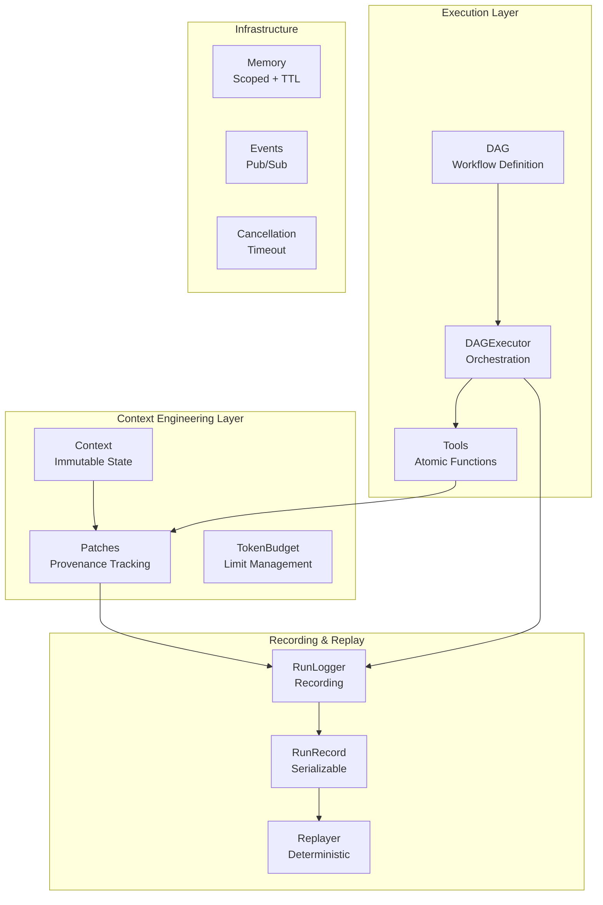

# CEMAF Documentation

**Context Engineering Multi-Agent Framework**

Context engineering infrastructure that solves the hard problems in AI agent systems. CEMAF can be used standalone OR plugged into existing frameworks like LangGraph, AutoGen, and CrewAI.

## System Overview

## Documentation Index

### Getting Started
- [Quick Start Guide](quickstart.md) - Installation and first steps
- [Architecture Overview](architecture.md) - System design and components
- [Integration Guide](integration.md) - Mode A/B integration patterns

### Context Engineering (Core Differentiator)
- [Context Management](context.md) - Patches, provenance, budgeting, compilation
- [Replay & Recording](replay.md) - Run logging, deterministic replay
- [Memory](memory.md) - Scoped memory with TTL and hooks

### Execution Layer
- [Tools](tools.md) - Atomic, stateless functions with recording
- [Skills](skills.md) - Composable capabilities
- [Agents](agents.md) - Autonomous entities with goals
- [Orchestration](orchestration.md) - DAG, Executor, DeepAgent, Checkpointing

### Core Infrastructure
- [Core](core.md) - Types, enums, Result pattern, execution context
- [Resilience](resilience.md) - Retry, CircuitBreaker, RateLimiter
- [Events](events.md) - Event bus and notifiers
- [Observability](observability.md) - Logger, Tracer, Metrics, RunLogger

### Supporting Modules
- [LLM](llm.md) - LLM client protocols and adapters
- [Retrieval](retrieval.md) - Vector stores and embeddings
- [Streaming](streaming.md) - SSE and stream buffers
- [Generation](generation.md) - Image, audio, video, UI, code generation
- [Cache](cache.md) - Caching with TTL and eviction
- [Validation](validation.md) - Validation rules and pipelines
- [Scheduler](scheduler.md) - Job scheduling and triggers
- [Config](config.md) - Configuration management
- [Persistence](persistence.md) - Entities (Project, Run, Artifact)
- [Evals](evals.md) - Evaluators and LLM-as-judge

## Quick Links

| Task | Documentation |
|------|---------------|
| Track context changes | [Context Patches](context.md#context-patches) |
| Record and replay runs | [Replay & Recording](replay.md) |
| Integrate with LangGraph | [Integration Guide](integration.md#with-langgraph) |
| Set memory TTL | [Memory](memory.md#ttl) |
| Add cancellation | [Execution Context](core.md#execution-context) |
| Build a DAG | [Orchestration](orchestration.md#building-dags) |

## Project Stats

- **814 tests** | **100% passing** | **TDD from day one**
- **Python 3.14+** | **Fully typed** | **Protocol-based design**
- **MIT License**
