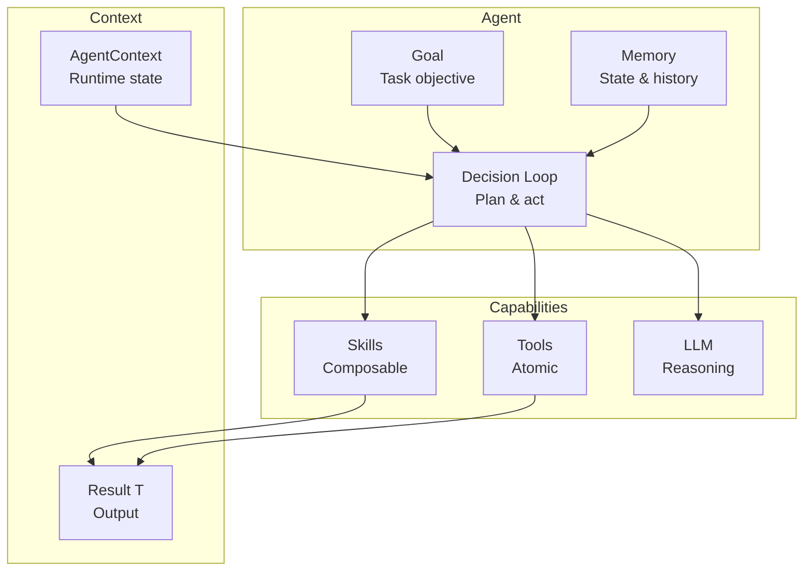
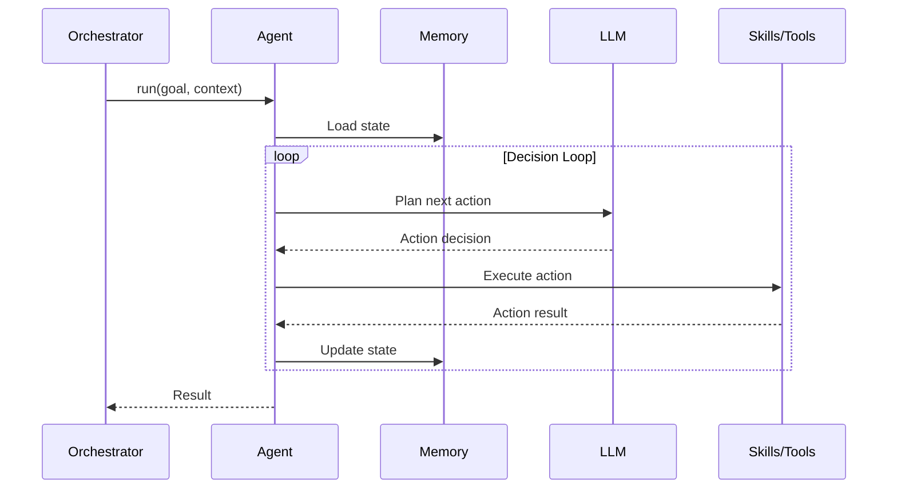

# Agents

Agents are autonomous entities with goals, memory, and decision-making capabilities.

## Agent Architecture



## Agent Execution Flow



## Defining an Agent

```python
from cemaf.agents.base import Agent
from cemaf.core.result import Result

class ResearchAgent(Agent[dict, dict]):
    @property
    def id(self) -> str:
        return "researcher"

    async def run(self, goal: dict, context: AgentContext) -> Result[dict]:
        # Agent logic with memory and decision-making
        return Result.ok({"result": "research complete"})
```
