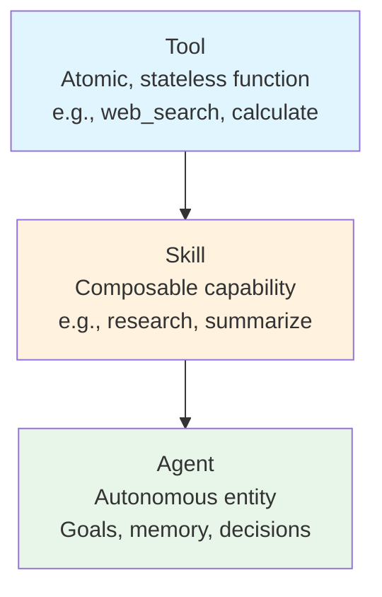
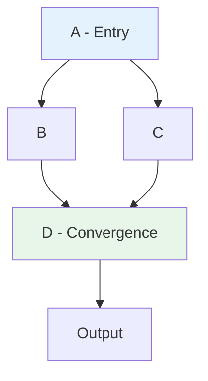

# Architecture Overview

CEMAF is built on a modular, pluggable architecture where all components are defined as `Protocol`s for dependency injection.

## System Architecture

```mermaid
flowchart TB
    subgraph Orchestration
        DEEP[DeepAgent<br/>Orchestrator]
        EXEC[DAGExecutor]
        CHECK[Checkpointer]
        DEEP --> EXEC --> CHECK
    end

    subgraph Execution
        AGENTS[Agents<br/>Goals & State]
        SKILLS[Skills<br/>Composable]
        TOOLS[Tools<br/>Atomic]
        AGENTS --> SKILLS --> TOOLS
    end

    subgraph Context Engineering
        CTX[Context<br/>Immutable]
        PATCH[Patches<br/>Provenance]
        BUDGET[TokenBudget]
        CTX --> PATCH
        BUDGET --> CTX
    end

    subgraph Memory
        MEM[MemoryStore]
        SCOPE[Scoped + TTL]
        MEM --> SCOPE
    end

    subgraph Infrastructure
        LLM[LLM Clients]
        OBS[Observability]
        PERSIST[Persistence]
    end

    Orchestration --> Execution
    Execution --> Context Engineering
    Execution --> Memory
    Context Engineering --> Infrastructure
    Memory --> Infrastructure
```

## Core Concepts

### Tool → Skill → Agent Hierarchy



### Dynamic DAG Execution



## Pluggability

All components are defined as `Protocol`s for dependency injection:

```python
# Swap implementations without changing code
executor = DAGExecutor(
    node_executor=my_executor,
    checkpointer=RedisCheckpointer(),  # or InMemoryCheckpointer()
)

memory = PostgresMemoryStore()  # or InMemoryStore()
llm = AnthropicClient()         # or OpenAIClient(), MockLLMClient()
```

## Project Structure

```
cemaf/
├── src/cemaf/
│   ├── core/           # Types, enums, constants, Result, InMemoryStorage, utils
│   ├── tools/          # Tool abstractions
│   ├── skills/         # Skill abstractions
│   ├── agents/         # Agent abstractions
│   ├── orchestration/  # DAG, Executor, DeepAgent
│   ├── context/        # TokenBudget, Compiler, Context, AdvancedContextCompiler
│   ├── memory/         # MemoryStore protocols
│   ├── persistence/    # Entities (Project, Run, Artifact)
│   ├── llm/            # LLM client protocols
│   ├── retrieval/      # VectorStore, Embeddings
│   ├── streaming/      # SSE, StreamBuffer
│   ├── generation/     # Image, Audio, Video, UI, Code generation
│   ├── evals/          # Evaluators, LLM-as-judge
│   ├── resilience/     # Retry, CircuitBreaker, RateLimiter
│   ├── observability/  # Logger, Tracer, Metrics
│   ├── scheduler/      # Job scheduling, triggers
│   ├── validation/   # Validation rules and pipelines
│   ├── events/         # Event bus and notifiers
│   ├── cache/          # Caching with TTL and eviction
│   └── config/         # Configuration management
└── tests/
    ├── conftest.py     # 55 reusable fixtures
    ├── unit/
    └── integration/
```

## Design Principles

1. **Protocol-Based**: All components use Python `Protocol`s for maximum flexibility
2. **Immutable Context**: State is managed through immutable `Context` objects
3. **Result Pattern**: All operations return `Result[T]` for explicit error handling
4. **Testability**: Comprehensive test suite with 426 tests and 55 fixtures
5. **Modularity**: Each module is independent and can be used standalone
