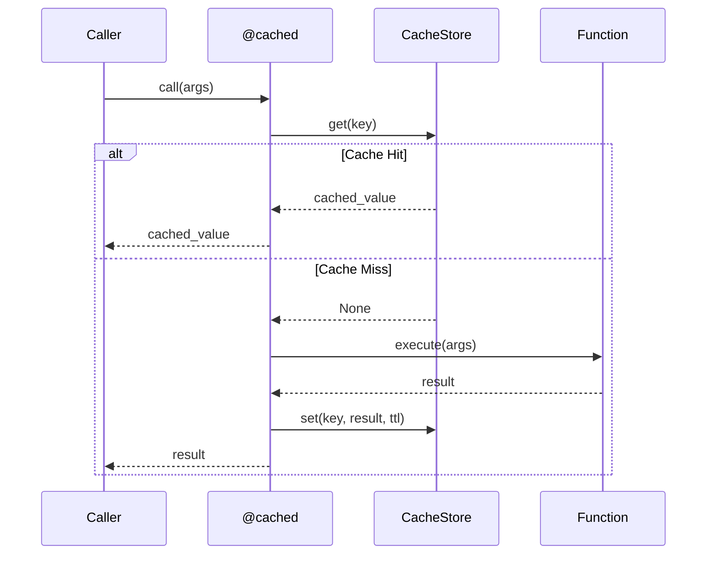

# Cache

Caching with TTL and eviction policies.

## Cache Architecture

```mermaid
flowchart TB
    subgraph Cache Store
        STORE[CacheStore<br/>Protocol]
        INMEM[InMemoryCache<br/>Implementation]
    end

    subgraph Policies
        TTL[TTL<br/>Time-based expiry]
        SIZE[Max Size<br/>Capacity limit]
        LRU[LRU<br/>Least recently used]
    end

    subgraph Decorators
        CACHED[@cached<br/>Function decorator]
        KEY[Key Generation<br/>Args to key]
    end

    STORE --> INMEM
    TTL --> INMEM
    SIZE --> INMEM
    LRU --> INMEM
    CACHED --> STORE
    KEY --> CACHED
```

## Cache Flow



## Cache Store

```python
from cemaf.cache.stores import InMemoryCache

cache = InMemoryCache(max_size=100, default_ttl=3600)

# Set with TTL
await cache.set("key", "value", ttl_seconds=1800)

# Get
value = await cache.get("key")

# Delete
await cache.delete("key")
```

## Cached Decorator

```python
from cemaf.cache.decorators import cached

@cached(ttl_seconds=3600)
async def expensive_operation(arg: str) -> dict:
    # Expensive computation
    return {"result": "data"}
```
