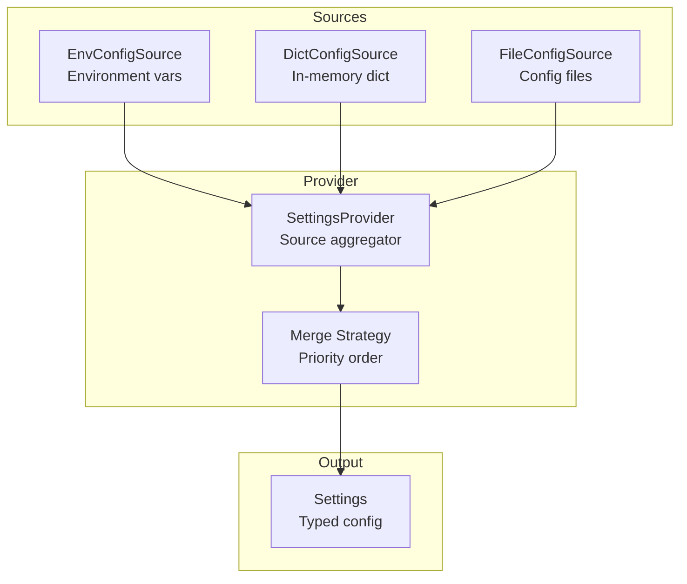
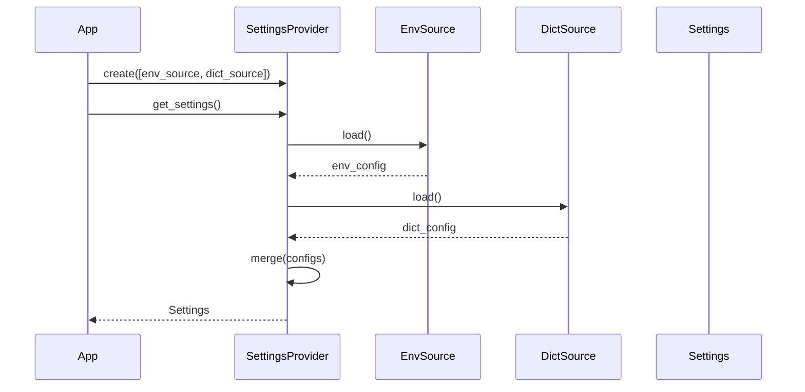

# Configuration

Configuration management with multiple sources.

## Configuration Architecture



## Configuration Flow



## Config Sources

```python
from cemaf.config.loader import SettingsProvider
from cemaf.config.protocols import EnvConfigSource, DictConfigSource

# Load from environment
env_source = EnvConfigSource(prefix="CEMAF_")

# Load from dict
dict_source = DictConfigSource({"key": "value"})

# Combine sources
provider = SettingsProvider([env_source, dict_source])
settings = provider.get_settings()
```
