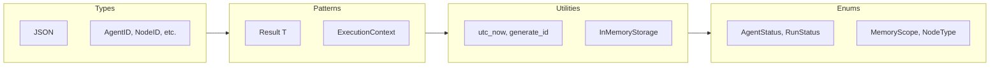
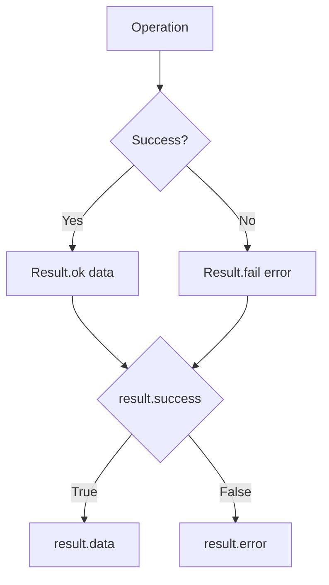

# Core Module

The core module provides fundamental types, enums, utilities, and patterns used throughout CEMAF.

## Overview



## Result Flow



## Result Pattern

All operations return a generic `Result[T]` type for explicit error handling:

```python
from cemaf.core.result import Result

# Success
result = Result.ok(data={"status": "success"})
if result.success:
    print(result.data)

# Failure
result = Result.fail("Error message")
if not result.success:
    print(result.error)

# With metadata
result = Result.ok(data={"value": 42}, metadata={"source": "cache"})
```

### Result API

```python
@dataclass(frozen=True)
class Result(Generic[T]):
    success: bool
    data: T | None = None
    error: str | None = None
    metadata: JSON = field(default_factory=dict)
    created_at: datetime = field(default_factory=utc_now)

    @classmethod
    def ok(cls, data: T, metadata: JSON | None = None) -> Result[T]

    @classmethod
    def fail(cls, error: str, metadata: JSON | None = None) -> Result[T]
```

## Types

Core type aliases for type safety:

```python
from cemaf.core.types import (
    JSON,           # JSON-compatible dict
    AgentID,        # Agent identifier
    NodeID,         # DAG node identifier
    RunID,          # Execution run identifier
    SkillID,        # Skill identifier
    ToolID,         # Tool identifier
)
```

## Enums

Common enumerations:

```python
from cemaf.core.enums import (
    AgentStatus,    # Agent execution status
    MemoryScope,    # Memory persistence scope
    NodeType,       # DAG node type
    RunStatus,      # Execution run status
)
```

## Utilities

Common utility functions:

```python
from cemaf.core.utils import (
    utc_now,        # Current UTC datetime
    generate_id,    # Generate unique ID with optional prefix
    safe_json,      # Safe JSON parsing
    json_dumps,     # JSON serialization
    truncate,       # Truncate strings
)
```

## Storage

Generic in-memory storage:

```python
from cemaf.core.storage import InMemoryStorage

# Create storage
store = InMemoryStorage[str, dict]()

# Operations
await store.set("key", {"value": 42})
value = await store.get("key")
exists = await store.contains("key")
await store.delete("key")
await store.clear()
size = await store.size()
```

## Constants

```python
from cemaf.core.constants import (
    DEFAULT_MAX_RETRIES,
    DEFAULT_TIMEOUT_SECONDS,
    MAX_CONTEXT_TOKENS,
)
```
