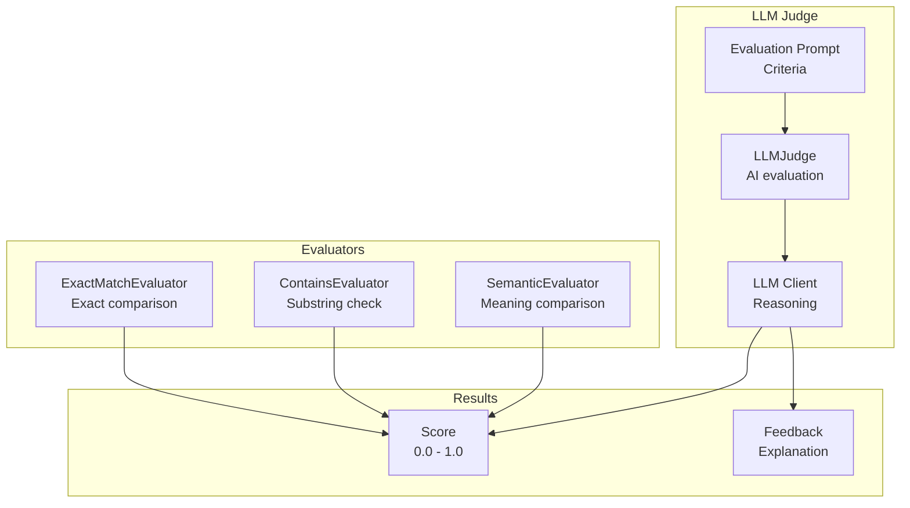
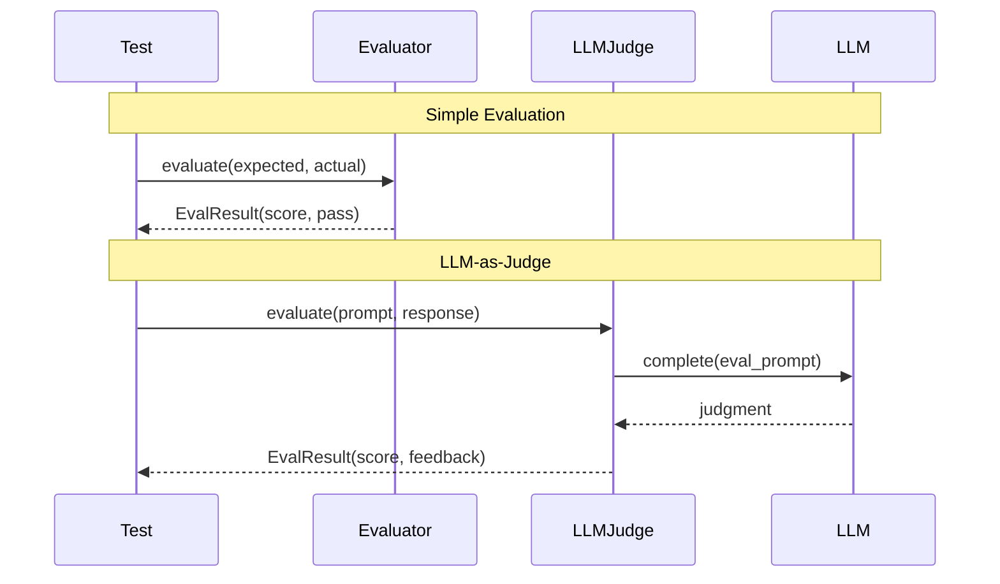

# Evaluations

Evaluators and LLM-as-judge for testing and validation.

## Evaluation Architecture



## Evaluation Flow



## Evaluators

```python
from cemaf.evals.evaluators import ExactMatchEvaluator, ContainsEvaluator

# Exact match
evaluator = ExactMatchEvaluator()
result = evaluator.evaluate("expected", "actual")

# Contains
evaluator = ContainsEvaluator(substrings=["required"])
result = evaluator.evaluate("text with required content")
```

## LLM-as-Judge

```python
from cemaf.evals.llm_judge import LLMJudge

judge = LLMJudge(llm_client=my_llm)
result = await judge.evaluate(
    prompt="Is this correct?",
    response="The answer is 42"
)
```
