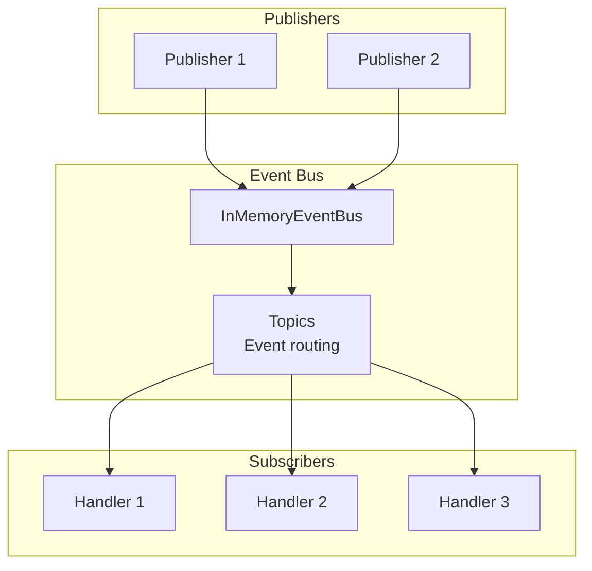
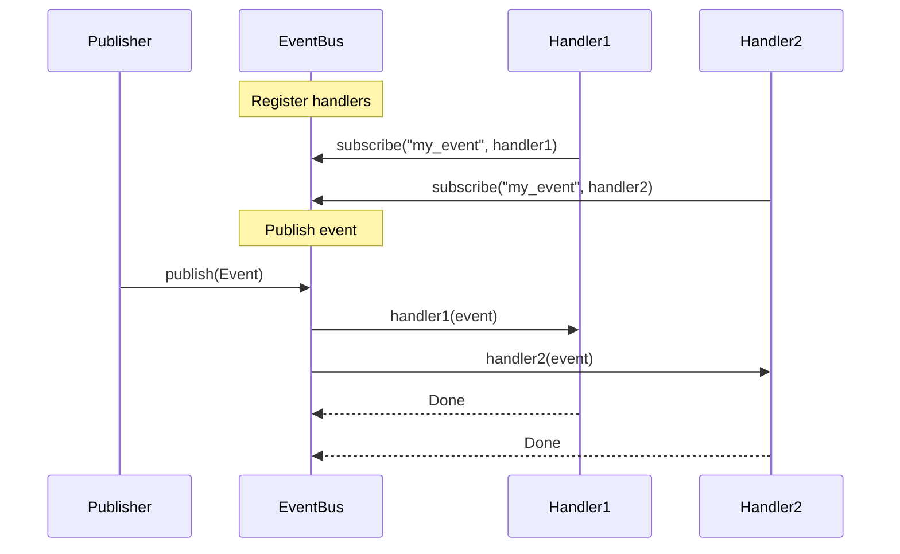

# Events

Event bus and notifiers for system-wide communication.

## Event Architecture



## Event Flow



## Event Bus

```python
from cemaf.events.bus import InMemoryEventBus
from cemaf.events.protocols import Event

bus = InMemoryEventBus()

# Subscribe
async def handler(event: Event):
    print(f"Received: {event.type}")

await bus.subscribe("my_event", handler)

# Publish
await bus.publish(Event(type="my_event", data={"key": "value"}))
```
