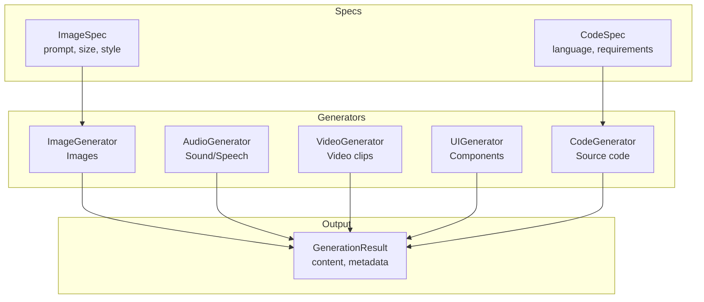
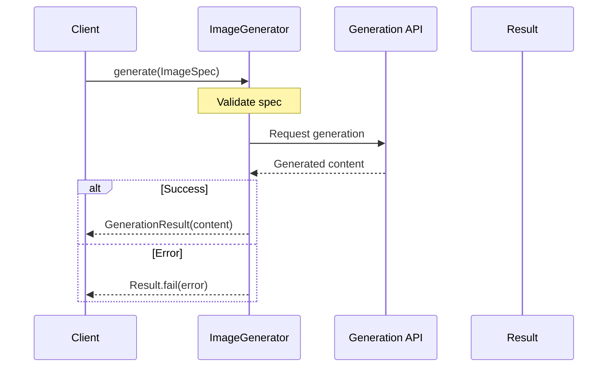

# Generation

Protocols for generative AI outputs: images, audio, video, UI, and code.

## Generation Architecture



## Generation Flow



## Image Generation

```python
from cemaf.generation.protocols import ImageGenerator, ImageSpec

generator: ImageGenerator = DalleGenerator()

spec = ImageSpec(
    prompt="A beautiful sunset",
    size="1024x1024",
    style="photorealistic"
)

result = await generator.generate(spec)
```

## Code Generation

```python
from cemaf.generation.protocols import CodeGenerator, CodeSpec

generator: CodeGenerator = ClaudeCodeGenerator()

spec = CodeSpec(
    language="python",
    requirements="Create a function that calculates fibonacci",
    include_tests=True
)

result = await generator.generate(spec)
```
