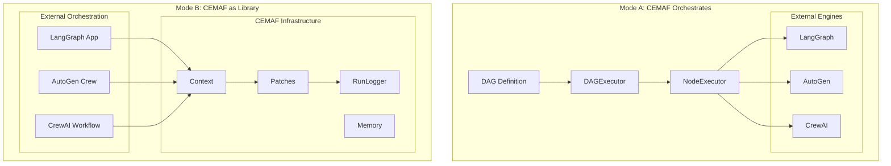
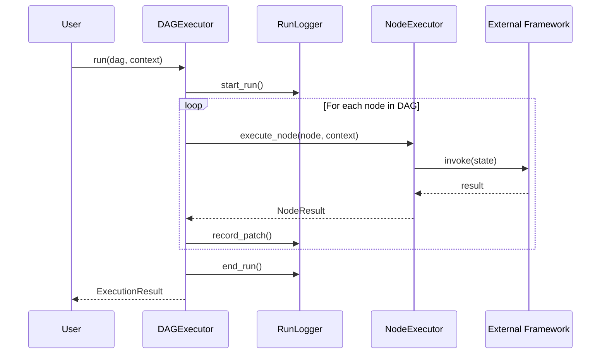
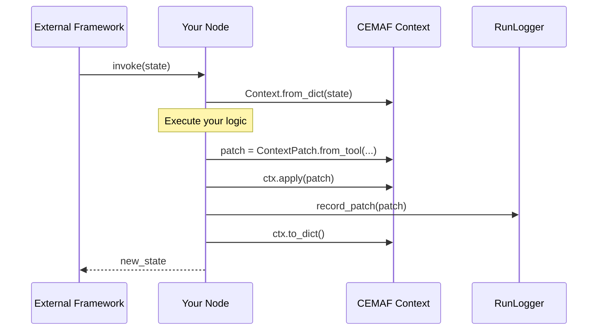

# Integration Guide

CEMAF is designed as **context engineering infrastructure** that can work standalone or integrate with existing agent frameworks. This guide covers both integration modes.

## Architecture Overview



## Mode A: CEMAF Orchestrates



## Mode B: CEMAF as Library



## Integration Modes

| Mode | Description | Best For |
|------|-------------|----------|
| **Mode A** | CEMAF orchestrates, external frameworks execute | New projects, full control |
| **Mode B** | External frameworks orchestrate, CEMAF provides infrastructure | Existing projects, gradual adoption |

## Mode A: CEMAF Orchestrates

In this mode, CEMAF owns the execution flow. External frameworks (LangGraph, AutoGen, etc.) are used as "engines" for specific nodes.

### Basic Setup

```python
from cemaf.orchestration import DAG, Node, Edge, DAGExecutor
from cemaf.observability import InMemoryRunLogger
from cemaf.context import Context

# Create DAG
dag = DAG(name="research_pipeline")
dag = dag.add_node(Node.tool(id="search", name="Search", tool_id="web_search"))
dag = dag.add_node(Node.tool(id="analyze", name="Analyze", tool_id="analyzer"))
dag = dag.add_edge(Edge(source="search", target="analyze"))

# Create executor with logging
logger = InMemoryRunLogger()
executor = DAGExecutor(
    node_executor=my_executor,
    run_logger=logger,
)

# Execute
result = await executor.run(dag, Context(data={"query": "test"}))

# Replay if needed
from cemaf.replay import Replayer
replayer = Replayer(logger.get_record(str(result.run_id)))
replay_result = await replayer.replay()
```

### Integrating LangGraph as Node Executor

```python
from cemaf.orchestration.executor import NodeExecutor, NodeResult

class LangGraphNodeExecutor:
    def __init__(self, langgraph_app):
        self.app = langgraph_app

    async def execute_node(self, node, context) -> NodeResult:
        try:
            # Convert context to LangGraph state
            state = context.to_dict()

            # Run LangGraph
            result = await self.app.ainvoke(state)

            return NodeResult(
                node_id=node.id,
                success=True,
                output=result,
            )
        except Exception as e:
            return NodeResult(
                node_id=node.id,
                success=False,
                error=str(e),
            )

# Use with CEMAF
executor = DAGExecutor(
    node_executor=LangGraphNodeExecutor(my_langgraph_app),
    run_logger=InMemoryRunLogger(),
)
```

### Integrating AutoGen

```python
class AutoGenNodeExecutor:
    def __init__(self, agents: dict):
        self.agents = agents

    async def execute_node(self, node, context) -> NodeResult:
        agent = self.agents.get(node.config.get("agent_id"))
        if not agent:
            return NodeResult(node_id=node.id, success=False, error="Agent not found")

        try:
            result = await agent.run(context.to_dict())
            return NodeResult(
                node_id=node.id,
                success=True,
                output=result,
            )
        except Exception as e:
            return NodeResult(node_id=node.id, success=False, error=str(e))
```

## Mode B: CEMAF as Library

In this mode, external frameworks handle orchestration. CEMAF provides context management, patching, and recording infrastructure.

### With LangGraph

```python
from langgraph.graph import StateGraph
from cemaf.context import Context, ContextPatch, PatchSource
from cemaf.observability import InMemoryRunLogger

# Shared logger
run_logger = InMemoryRunLogger()

@langgraph_node
def search_node(state: dict) -> dict:
    # Convert to CEMAF context
    ctx = Context.from_dict(state)

    # Execute search
    results = web_search(ctx.get("query"))

    # Create patch with provenance
    patch = ContextPatch.from_tool(
        tool_id="web_search",
        path="search_results",
        value=results,
        correlation_id=state.get("run_id"),
    )

    # Apply and record
    ctx = ctx.apply(patch)
    run_logger.record_patch(patch)

    return ctx.to_dict()

@langgraph_node
def analyze_node(state: dict) -> dict:
    ctx = Context.from_dict(state)

    # Use context for analysis
    results = ctx.get("search_results")
    analysis = analyze(results)

    patch = ContextPatch.from_tool(
        tool_id="analyzer",
        path="analysis",
        value=analysis,
    )
    ctx = ctx.apply(patch)
    run_logger.record_patch(patch)

    return ctx.to_dict()

# Build LangGraph
graph = StateGraph()
graph.add_node("search", search_node)
graph.add_node("analyze", analyze_node)
graph.add_edge("search", "analyze")
app = graph.compile()

# Run with CEMAF tracking
run_logger.start_run("run-123", initial_context=Context(data={"query": "test"}))
result = await app.ainvoke({"query": "test", "run_id": "run-123"})
record = run_logger.end_run(final_context=Context.from_dict(result))
```

### With CrewAI

```python
from crewai import Agent, Task, Crew
from cemaf.context import Context, ContextPatch
from cemaf.observability import InMemoryRunLogger

run_logger = InMemoryRunLogger()

class CEMAFAgent(Agent):
    def execute_task(self, task, context):
        ctx = Context.from_dict(context)

        # Execute task
        result = super().execute_task(task, context)

        # Track with CEMAF
        patch = ContextPatch.from_agent(
            agent_id=self.role,
            path=f"agent_results.{self.role}",
            value=result,
        )
        run_logger.record_patch(patch)

        return result
```

## Context Compilation Integration

Use CEMAF's token budgeting with any framework:

```python
from cemaf.context import TokenBudget
from cemaf.context.compiler import ContextCompiler

budget = TokenBudget(max_tokens=4000, reserved_for_output=500)

# Compile context within budget
compiled = await compiler.compile(
    artifacts=(("brief", brief_content),),
    memories=(("history", conversation_history),),
    budget=budget,
    priorities={"brief": 10, "history": 5},  # brief prioritized
)

# Use compiled context with any LLM
messages = compiled.to_messages()
```

## Execution Context Integration

Add cancellation and timeout support to any framework:

```python
from cemaf.core import ExecutionContext, CancellationToken, with_execution_context

# Create execution context
token = CancellationToken()
ctx = ExecutionContext(
    cancellation_token=token,
    timeout_ms=30000,  # 30 second timeout
)

# Wrap any coroutine
result = await with_execution_context(
    my_long_running_task(),
    ctx,
)

# Cancel from elsewhere
token.cancel(reason="User requested cancellation")
```

## Memory Integration

Use CEMAF's scoped memory with TTL:

```python
from cemaf.memory import InMemoryStore, MemoryItem
from cemaf.core import MemoryScope
from datetime import timedelta

store = InMemoryStore()

# Set with TTL
await store.set(MemoryItem(
    scope=MemoryScope.SESSION,
    key="temp_data",
    value={"data": "temporary"},
    ttl=timedelta(hours=1),  # Expires in 1 hour
))

# Automatic expiration
item = await store.get(MemoryScope.SESSION, "temp_data")  # None after TTL

# Redaction hooks for sensitive data
def redact_pii(item):
    value = dict(item.value)
    if "ssn" in value:
        value["ssn"] = "***-**-****"
    return MemoryItem(..., value=value)

store.set_redaction_hook(redact_pii)
```

## Migration Strategy

### Gradual Adoption

1. **Start with Context**: Replace state dicts with `Context`
2. **Add Patching**: Track changes with `ContextPatch`
3. **Enable Recording**: Add `RunLogger` for debugging
4. **Add Replay**: Use `Replayer` for testing
5. **Full Integration**: Consider Mode A for new workflows

### Minimal Integration

Just want provenance tracking? Use only patches:

```python
from cemaf.context import Context, ContextPatch

# In your existing code
ctx = Context.from_dict(existing_state)
patch = ContextPatch.from_tool("my_tool", "result", result_value)
ctx = ctx.apply(patch)
new_state = ctx.to_dict()
```

### Full Integration

Want everything? Use Mode A:

```python
from cemaf.orchestration import DAGExecutor
from cemaf.observability import InMemoryRunLogger

executor = DAGExecutor(
    node_executor=YourFrameworkExecutor(),
    run_logger=InMemoryRunLogger(),
)
```
