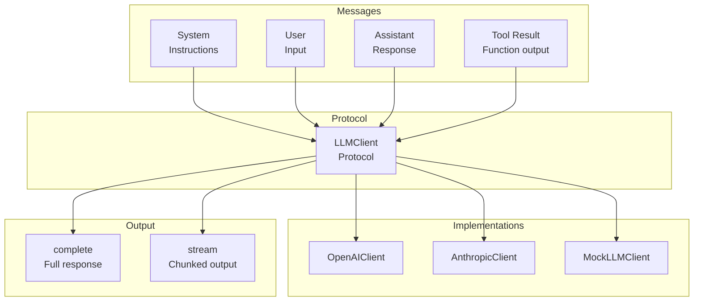
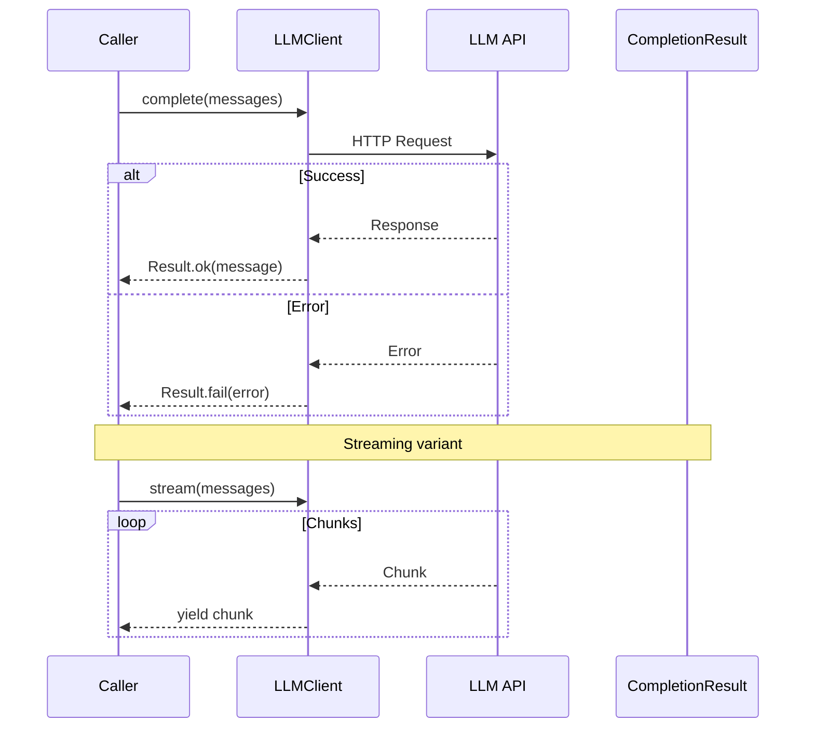

# LLM Module

Protocol-based LLM client abstraction for pluggable backends.

## LLM Architecture



## LLM Request Flow



## LLM Client Protocol

```python
from cemaf.llm.protocols import LLMClient, Message, CompletionResult

# Use any LLM implementation
llm: LLMClient = OpenAIClient()  # or AnthropicClient(), MockLLMClient()

# Complete
result = await llm.complete([
    Message.system("You are a helpful assistant"),
    Message.user("Hello!")
])

if result.success:
    print(result.message.content)
```

## Message Types

```python
from cemaf.llm.protocols import Message

system_msg = Message.system("System prompt")
user_msg = Message.user("User input")
assistant_msg = Message.assistant("Response")
tool_msg = Message.tool_result("tool_id", "result")
```

## Streaming

```python
async for chunk in llm.stream(messages):
    print(chunk.content, end="", flush=True)
```
