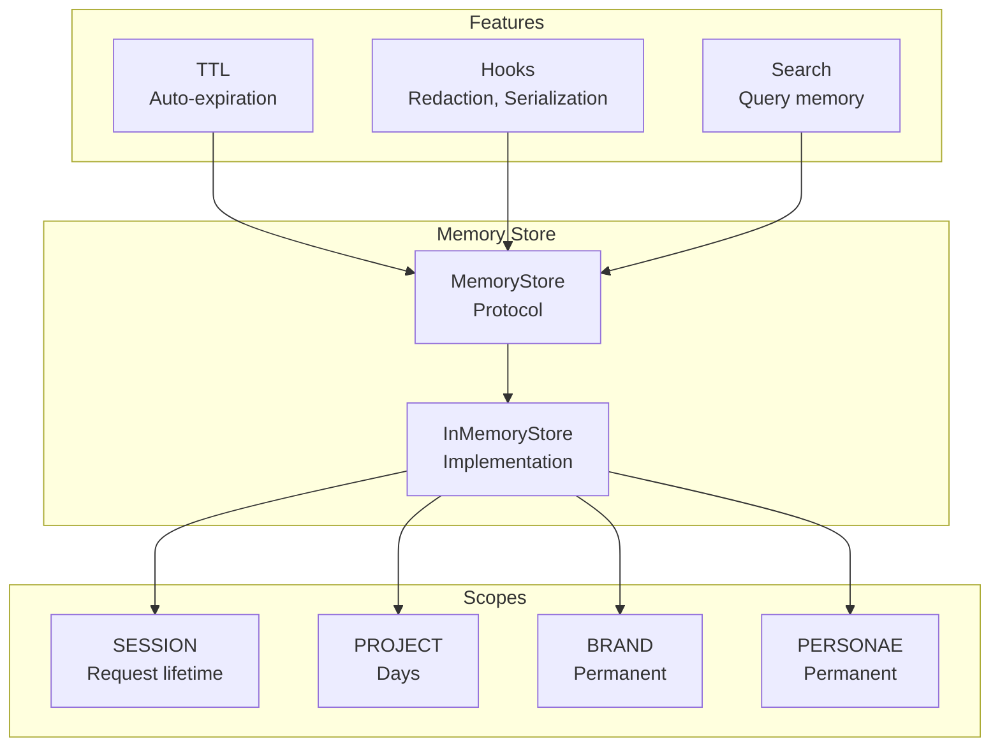
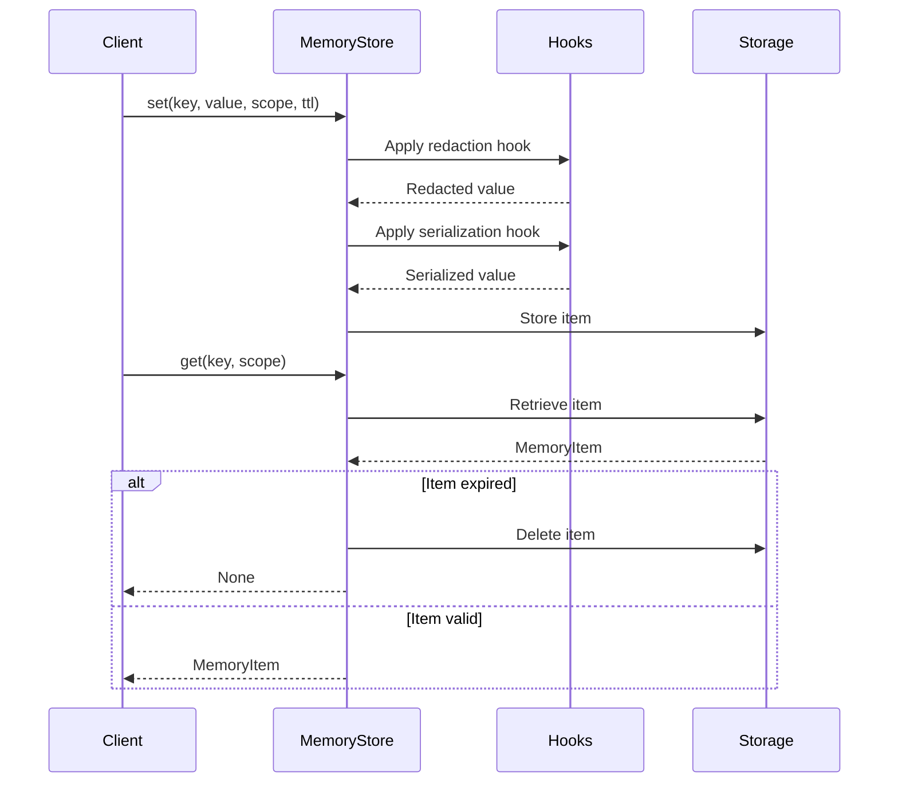

# Memory Management

CEMAF provides scoped memory management for different persistence needs.

## Memory Architecture



## Memory Operations Flow



## Memory Scopes

| Scope      | Persistence | Use Case           |
| ---------- | ----------- | ------------------ |
| `SESSION`  | Request     | Conversation state |
| `PROJECT`  | Days        | Task context       |
| `BRAND`    | Permanent   | Brand guidelines   |
| `PERSONAE` | Permanent   | User preferences   |

## Memory Store

```python
from cemaf.memory.base import MemoryStore, InMemoryStore
from cemaf.core.enums import MemoryScope

store = InMemoryStore()

# Store memory
await store.set(
    key="user_preference",
    value={"theme": "dark"},
    scope=MemoryScope.PERSONAE
)

# Retrieve memory
item = await store.get("user_preference", scope=MemoryScope.PERSONAE)

# List by scope
items = await store.list_by_scope(MemoryScope.PERSONAE)

# Search
results = await store.search("preference", scope=MemoryScope.PERSONAE)
```

## Memory Item

```python
from cemaf.memory.base import MemoryItem

item = MemoryItem(
    key="key",
    value={"data": "value"},
    scope=MemoryScope.PROJECT,
    metadata={"source": "user"}
)

# Full key includes scope
full_key = item.full_key  # "PROJECT:key"
```
