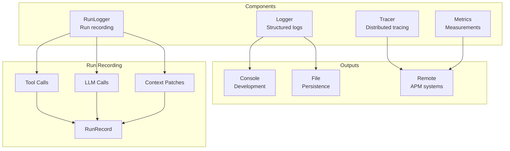
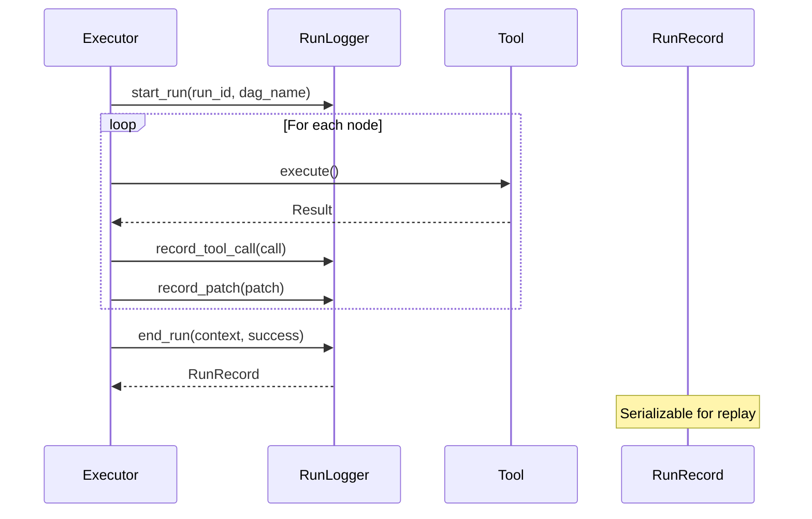

# Observability

Logging, tracing, and metrics for monitoring.

## Observability Architecture



## Run Recording Flow



## Logger

```python
from cemaf.observability.simple import SimpleLogger

logger = SimpleLogger()
logger.info("Operation started")
logger.error("Operation failed", exc_info=True)
```
