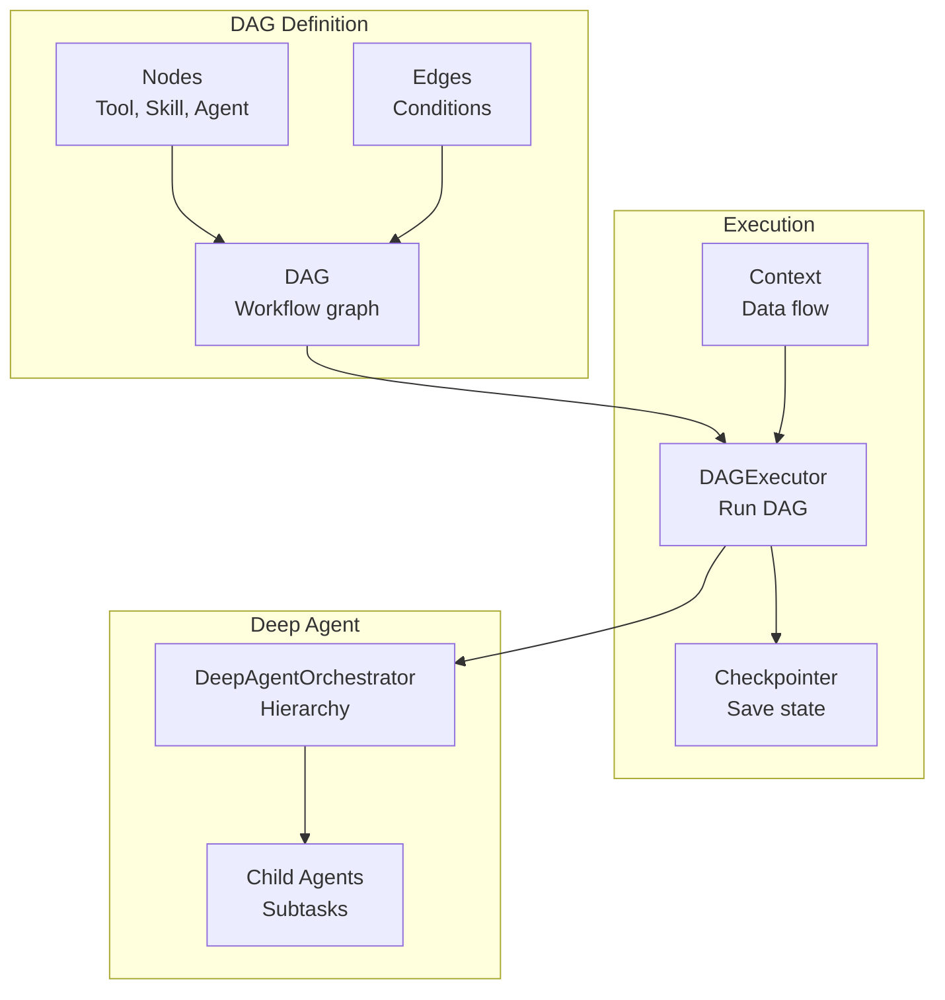
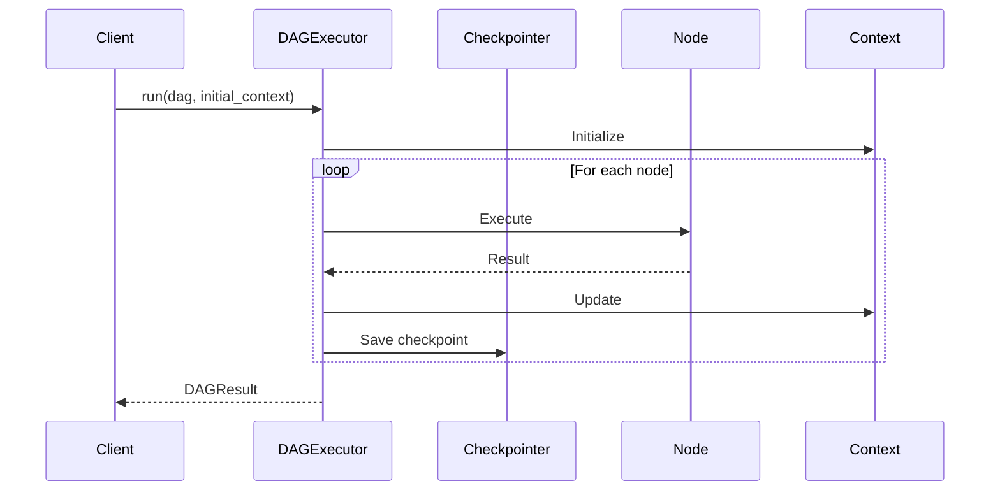

# Orchestration

CEMAF provides powerful orchestration capabilities through DAGs, executors, and deep agent hierarchies.

## Orchestration Architecture



## DAG Execution Flow



## Building DAGs

Create directed acyclic graphs for workflow execution:

```python
from cemaf.orchestration.dag import DAG, Node, Edge
from cemaf.core.types import NodeID

# Create DAG
dag = DAG(name="research-pipeline")

# Add nodes
dag = dag.add_node(Node.tool(id="search", name="Search", tool_id="search", output_key="results"))
dag = dag.add_node(Node.skill(id="analyze", name="Analyze", skill_id="analyzer", output_key="analysis"))
dag = dag.add_node(Node.agent(id="review", name="Review", agent_id="reviewer", output_key="review"))

# Add edges
dag = dag.add_edge(Edge(source=NodeID("search"), target=NodeID("analyze")))
dag = dag.add_edge(Edge(source=NodeID("analyze"), target=NodeID("review")))

# Validate
dag.validate()
```

## Node Types

```python
# Tool node
Node.tool(id="t1", name="Tool", tool_id="tool_id", output_key="result")

# Skill node
Node.skill(id="s1", name="Skill", skill_id="skill_id", output_key="result")

# Agent node
Node.agent(id="a1", name="Agent", agent_id="agent_id", output_key="result")

# Router node (conditional routing)
Node.router(id="r1", name="Router", routes={"success": "next", "failure": "retry"})

# Parallel node
Node.parallel(id="p1", name="Parallel", parallel_nodes=["t1", "t2"], output_key="results")
```

## Edge Conditions

```python
# Always traverse
Edge(source="a", target="b", condition=EdgeCondition.ALWAYS)

# On success
Edge(source="a", target="b", condition=EdgeCondition.ON_SUCCESS)

# On failure
Edge(source="a", target="b", condition=EdgeCondition.ON_FAILURE)

# Conditional rule
rule = Condition(field="status", operator=ConditionOperator.EQUALS, value="done")
Edge(source="a", target="b", condition=EdgeCondition.JSON_RULE, condition_rule=rule)
```

## DAG Visualization

Visualize DAGs as Mermaid diagrams:

```python
# Print to console
dag.print_mermaid()

# Save to file (auto-wraps in markdown if .md)
dag.save_mermaid("pipeline.md")

# Get raw Mermaid code
mermaid_code = dag.to_mermaid(direction="TD")  # TD, LR, BT, RL
```

## Executing DAGs

```python
from cemaf.orchestration.executor import DAGExecutor
from cemaf.context.context import Context

executor = DAGExecutor(node_executor=my_executor)

initial_context = Context(data={"query": "test"})
result = await executor.run(dag, initial_context=initial_context)

if result.status == RunStatus.COMPLETED:
    print(result.final_context.get("summary"))
```

## Checkpointing

Resume DAG execution from checkpoints:

```python
from cemaf.orchestration.checkpointer import CheckpointingDAGExecutor, InMemoryCheckpointer

checkpointer = InMemoryCheckpointer()
executor = CheckpointingDAGExecutor(
    node_executor=my_executor,
    checkpointer=checkpointer,
    checkpoint_interval=5  # Save every 5 nodes
)

# Run with checkpointing
result = await executor.run(dag, initial_context=context)

# Resume from checkpoint
checkpoint = await checkpointer.load(run_id)
result = await executor.resume(checkpoint)
```

## Deep Agent Orchestration

Hierarchical multi-agent execution with context isolation:

```python
from cemaf.orchestration.deep_agent import DeepAgentOrchestrator

orchestrator = DeepAgentOrchestrator(
    agent_registry=my_registry,
    max_depth=3,
    max_children_per_agent=5
)

result = await orchestrator.run(
    agent_id="root_agent",
    goal={"task": "complex task"},
    initial_context=Context()
)
```
