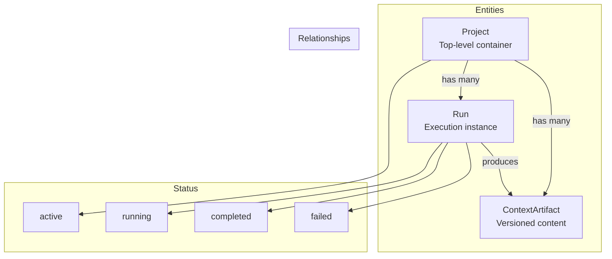
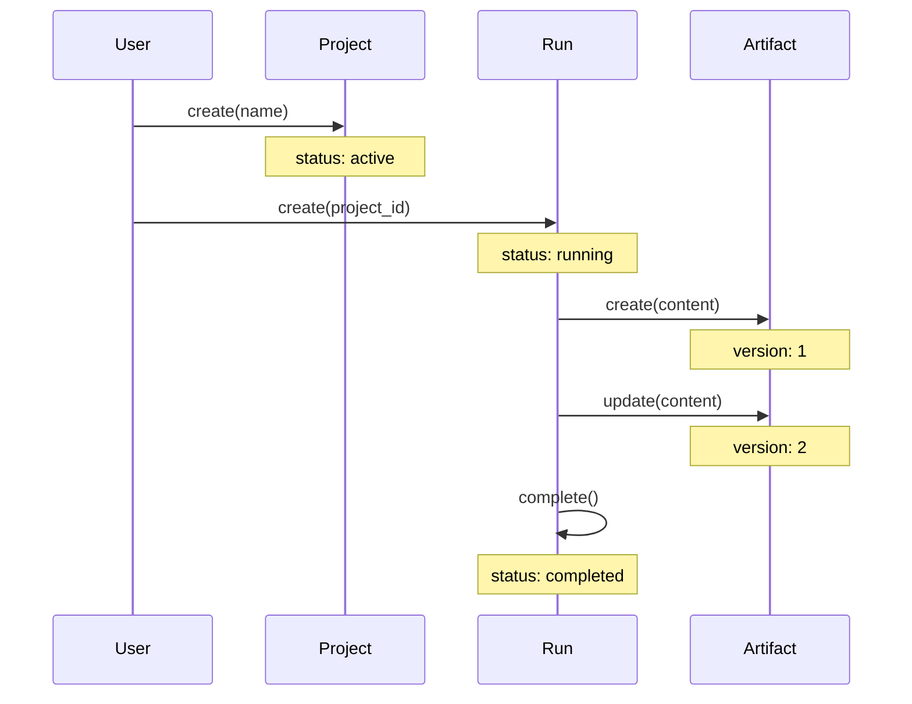

# Persistence

Entities for tracking projects, runs, and artifacts.

## Persistence Architecture



## Entity Lifecycle



## Entities

```python
from cemaf.persistence.entities import Project, Run, ContextArtifact

# Project
project = Project(id="proj1", name="My Project", status="active")

# Run
run = Run(id="run1", project_id="proj1", status=RunStatus.RUNNING)

# Artifact
artifact = ContextArtifact(
    id="art1",
    project_id="proj1",
    content="artifact content",
    version=1
)
```
