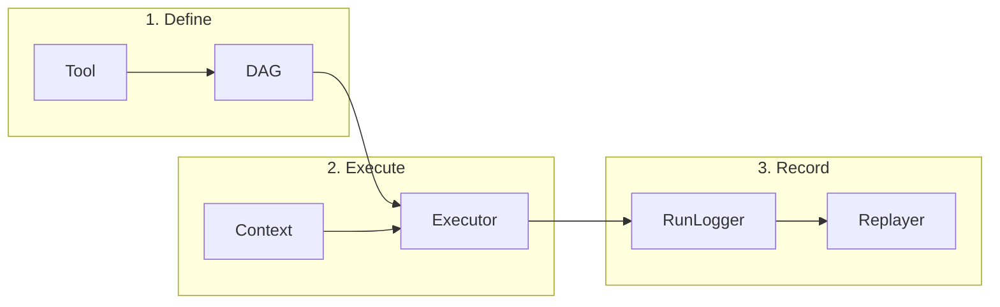

# Quick Start Guide

Get up and running with CEMAF in minutes.

## Quick Overview



## Installation

```bash
# Core only (no AI framework dependencies)
pip install cemaf

# With specific integrations
pip install cemaf[openai]      # OpenAI + tiktoken
pip install cemaf[anthropic]   # Anthropic
pip install cemaf[tiktoken]    # Accurate token counting only
pip install cemaf[all]         # All integrations

# Development
pip install cemaf[dev]
```

## Configuration (Optional)

CEMAF works out-of-the-box with zero configuration. To customize:

```bash
# Copy example configuration
cp .env.example .env

# Edit .env with your settings
CEMAF_LLM_PROVIDER=openai
CEMAF_LLM_API_KEY=your-api-key-here
CEMAF_CACHE_BACKEND=redis
```

Use configuration-driven factories:

```python
from cemaf.llm import create_llm_client_from_config
from cemaf.cache import create_cache_from_config
from cemaf.retrieval import create_vector_store_from_config

# All settings loaded automatically from .env
llm = create_llm_client_from_config()
cache = create_cache_from_config()
store = create_vector_store_from_config()
```

See [Configuration Guide](config.md) for all available settings.

## Development Setup

```bash
cd cemaf
uv sync           # or: pip install -e .
pytest tests/     # run tests
```

## Your First Tool

```python
from cemaf.tools.base import Tool, ToolSchema
from cemaf.core.result import Result

class SearchTool(Tool):
    @property
    def id(self) -> str:
        return "search"

    @property
    def schema(self) -> ToolSchema:
        return ToolSchema(
            name="search",
            description="Search the web",
            parameters={"type": "object", "properties": {"query": {"type": "string"}}},
        )

    async def execute(self, query: str) -> Result[dict]:
        # implementation
        return Result.ok({"results": [...]})
```

## Your First DAG

```python
from cemaf.orchestration.dag import DAG, Node, Edge
from cemaf.core.types import NodeID

dag = DAG(name="research-pipeline")
dag = dag.add_node(Node.tool(id="search", name="Search", tool_id="search", output_key="results"))
dag = dag.add_node(Node.tool(id="summarize", name="Summarize", tool_id="summarize", output_key="summary"))
dag = dag.add_edge(Edge(source=NodeID("search"), target=NodeID("summarize")))

# Visualize the DAG
dag.print_mermaid()  # Prints Mermaid diagram
dag.save_mermaid("dag.md")  # Saves as markdown with mermaid
```

## Execute a DAG

```python
from cemaf.orchestration.executor import DAGExecutor
from cemaf.context.context import Context

executor = DAGExecutor(node_executor=my_executor)
initial_context = Context(data={"query": "context engineering"})
result = await executor.run(dag, initial_context=initial_context)

print(result.final_context.get("summary"))
```

## Next Steps

- Read the [Architecture Overview](architecture.md)
- Learn about [Tools](tools.md)
- Explore [Orchestration](orchestration.md)
- Understand [Context Management](context.md)
