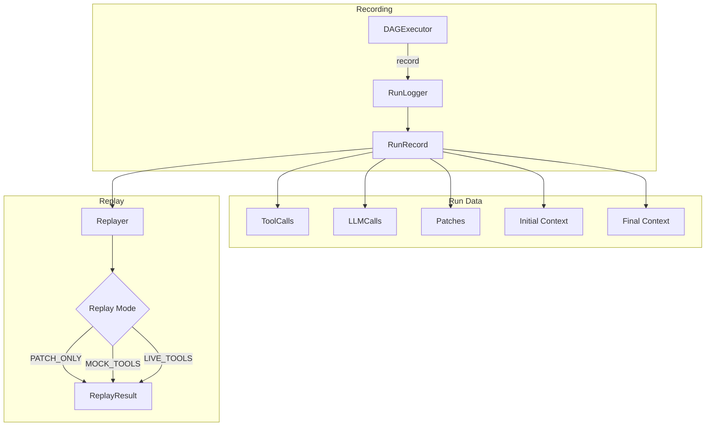
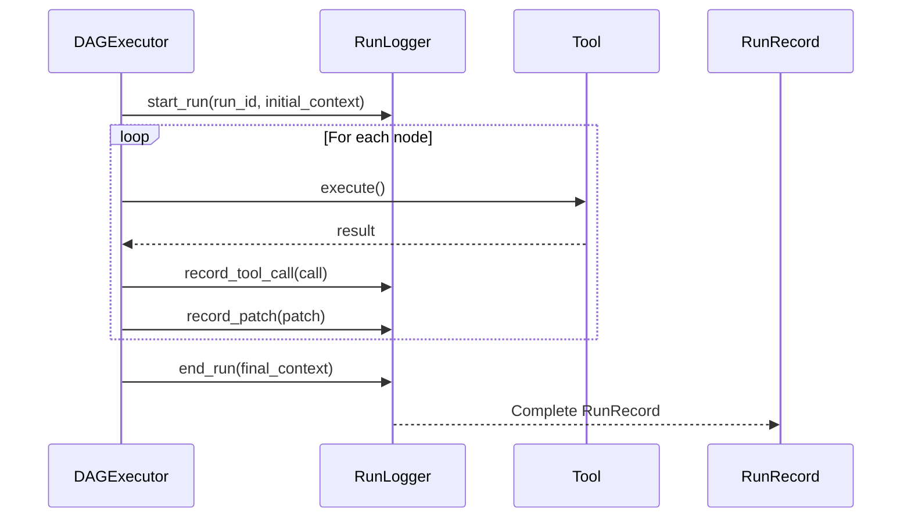
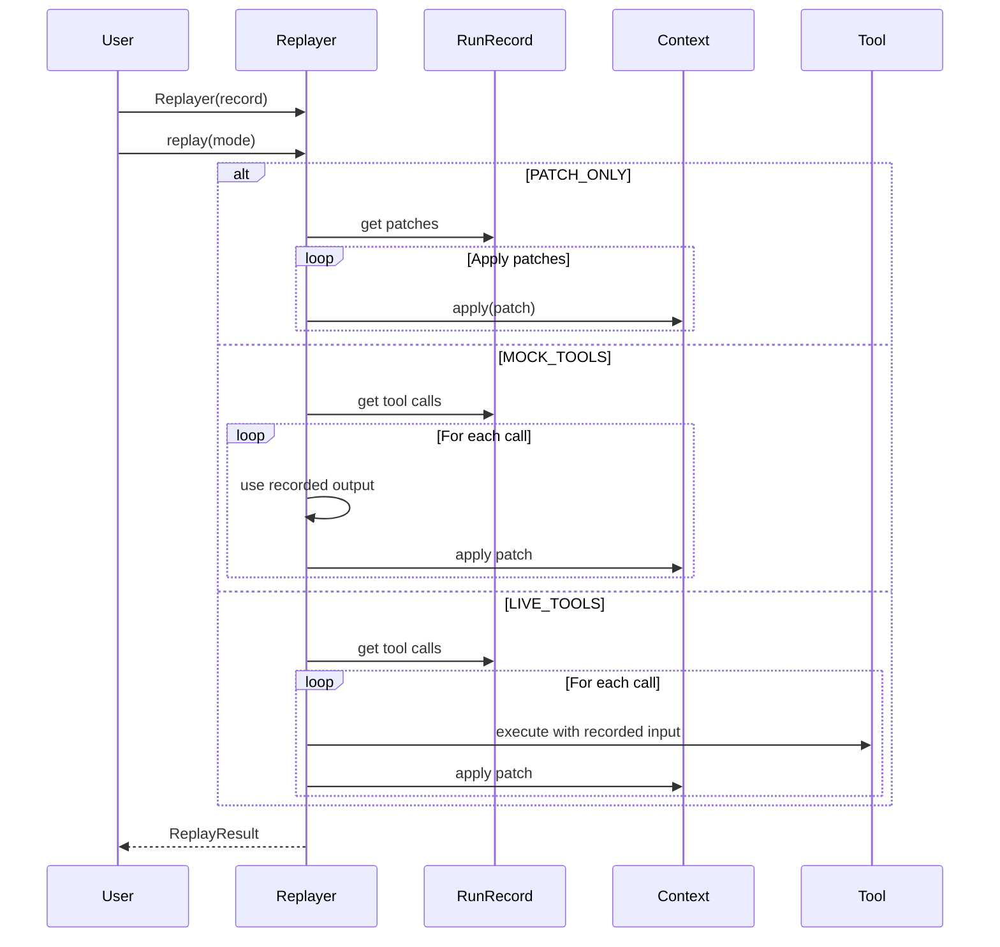

# Replay & Recording

CEMAF provides comprehensive run recording and deterministic replay capabilities for debugging, testing, and validation.

## Architecture Overview



## Recording Flow



## Replay Flow



## Why Replay?

| Use Case | Benefit |
|----------|---------|
| **Debugging** | Reproduce exact execution path that caused a bug |
| **Testing** | Verify agents behave deterministically |
| **Validation** | Compare live execution against recorded baseline |
| **Cost Reduction** | Replay with mocked LLM calls instead of real API calls |

## Run Recording

### Basic Recording

```python
from cemaf.observability import InMemoryRunLogger
from cemaf.context import Context, ContextPatch

# Create logger
logger = InMemoryRunLogger()

# Start recording
logger.start_run(
    run_id="run-123",
    dag_name="my_pipeline",
    initial_context=Context(data={"input": "test"}),
)

# Record tool calls
from cemaf.observability import ToolCall

logger.record_tool_call(ToolCall(
    tool_id="web_search",
    input={"query": "test"},
    output={"results": [...]},
    duration_ms=150.5,
))

# Record context patches
logger.record_patch(ContextPatch.from_tool(
    tool_id="web_search",
    path="search_results",
    value={"results": [...]},
))

# End recording
record = logger.end_run(
    final_context=Context(data={"result": 42}),
    success=True,
)
```

### Automatic Recording with DAGExecutor

```python
from cemaf.orchestration import DAGExecutor
from cemaf.observability import InMemoryRunLogger

logger = InMemoryRunLogger()

executor = DAGExecutor(
    node_executor=my_executor,
    run_logger=logger,  # Automatic recording
)

result = await executor.run(dag, initial_context)

# Get the record
record = logger.get_record(str(result.run_id))
```

### Recording LLM Calls

```python
from cemaf.observability import LLMCall

logger.record_llm_call(LLMCall(
    model="gpt-4",
    input_messages=[{"role": "user", "content": "Hello"}],
    output="Hello! How can I help?",
    input_tokens=10,
    output_tokens=20,
    duration_ms=500.0,
))
```

## Run Records

A `RunRecord` contains everything needed for replay:

```python
record = logger.end_run(final_context=ctx)

# Metadata
print(record.run_id)
print(record.dag_name)
print(record.started_at)
print(record.completed_at)
print(record.duration_ms)

# Context
print(record.initial_context)
print(record.final_context)

# Changes
print(record.patches)      # All context patches
print(record.tool_calls)   # All tool invocations
print(record.llm_calls)    # All LLM calls

# Stats
print(record.total_patches)
print(record.total_tool_calls)
print(record.total_llm_calls)
print(record.total_tokens)

# Get as PatchLog for filtering
log = record.get_patch_log()
tool_patches = log.filter_by_source(PatchSource.TOOL)
```

### Serialization

```python
# Save record
data = record.to_dict()
import json
with open("run_record.json", "w") as f:
    json.dump(data, f)

# Load record
from cemaf.observability import RunRecord

with open("run_record.json") as f:
    data = json.load(f)
restored = RunRecord.from_dict(data)
```

## Replay

### Basic Replay

```python
from cemaf.replay import Replayer, ReplayMode

replayer = Replayer(record)

# Replay by applying patches only (fastest)
result = await replayer.replay(mode=ReplayMode.PATCH_ONLY)

print(result.success)
print(result.final_context)
print(result.patches_applied)
```

### Replay Modes

| Mode | Description | Use Case |
|------|-------------|----------|
| `PATCH_ONLY` | Just apply recorded patches | Fast, always deterministic |
| `MOCK_TOOLS` | Re-run logic with mocked tool outputs | Validate logic without real tools |
| `LIVE_TOOLS` | Re-run with real tool execution | Validate actual behavior |

```python
# PATCH_ONLY - Fastest, just applies patches
result = await replayer.replay(mode=ReplayMode.PATCH_ONLY)

# MOCK_TOOLS - Use recorded outputs
replayer = Replayer(
    record,
    mock_tools={"web_search": {"results": [...]}},
)
result = await replayer.replay(mode=ReplayMode.MOCK_TOOLS)

# LIVE_TOOLS - Re-execute tools
replayer = Replayer(
    record,
    tool_executors={"web_search": web_search_tool.execute},
)
result = await replayer.replay(mode=ReplayMode.LIVE_TOOLS)
```

### Custom Initial Context

```python
# Override initial context for testing
custom_ctx = Context(data={"modified": "input"})
result = await replayer.replay(
    mode=ReplayMode.PATCH_ONLY,
    initial_context=custom_ctx,
)
```

### Verifying Determinism

```python
# Check if replay produces same result
is_deterministic, differences = replayer.verify_determinism(result.final_context)

if not is_deterministic:
    for diff in differences:
        print(f"Difference: {diff}")
```

### Getting Tool Outputs

```python
# Get specific tool call
call = replayer.get_tool_call("web_search", call_index=0)
print(call.output)

# Get outputs in sequence (for mocking)
output1 = replayer.get_next_tool_output("web_search")
output2 = replayer.get_next_tool_output("web_search")
```

## Replay Results

```python
result = await replayer.replay()

# Status
print(result.success)
print(result.error)  # If failed

# Context
print(result.final_context)

# Statistics
print(result.mode)
print(result.duration_ms)
print(result.patches_applied)
print(result.tools_replayed)

# Divergences (differences from recorded run)
for divergence in result.divergences:
    print(f"Warning: {divergence}")
```

## Run History

```python
# Get all recorded runs
history = logger.get_history()
for record in history:
    print(f"{record.run_id}: {record.dag_name}")

# Get specific run
record = logger.get_record("run-123")

# Clear history
logger.clear_history()
```

## Best Practices

1. **Record in Development**: Always enable logging during development
2. **Save Failed Runs**: Persist records of failed runs for debugging
3. **Verify Determinism**: Regularly replay and verify results match
4. **Use PATCH_ONLY for Speed**: For simple debugging, PATCH_ONLY is fastest
5. **Mock Expensive Calls**: Use MOCK_TOOLS to avoid API costs during testing
