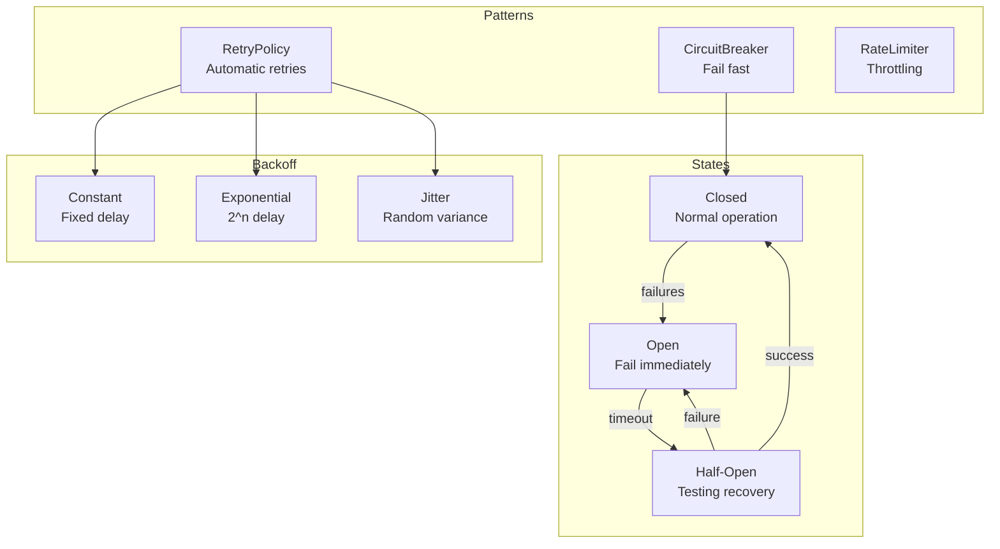
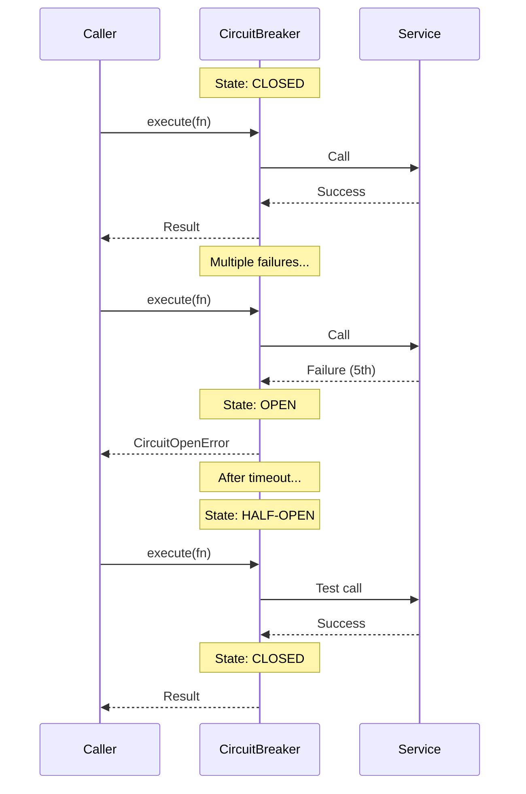

# Resilience

Retry, circuit breaker, and rate limiting for robust operations.

## Resilience Architecture



## Circuit Breaker Flow



## Retry Policy

```python
from cemaf.resilience.retry import RetryPolicy

policy = RetryPolicy(
    max_attempts=3,
    backoff_type="exponential",
    initial_delay=1.0
)

result = await policy.execute(async_function)
```

## Circuit Breaker

```python
from cemaf.resilience.circuit_breaker import CircuitBreaker

breaker = CircuitBreaker(
    failure_threshold=5,
    timeout_seconds=60
)

result = await breaker.execute(async_function)
```

## Rate Limiter

```python
from cemaf.resilience.rate_limiter import RateLimiter

limiter = RateLimiter(max_calls=10, time_window=60)

result = await limiter.execute(async_function)
```
