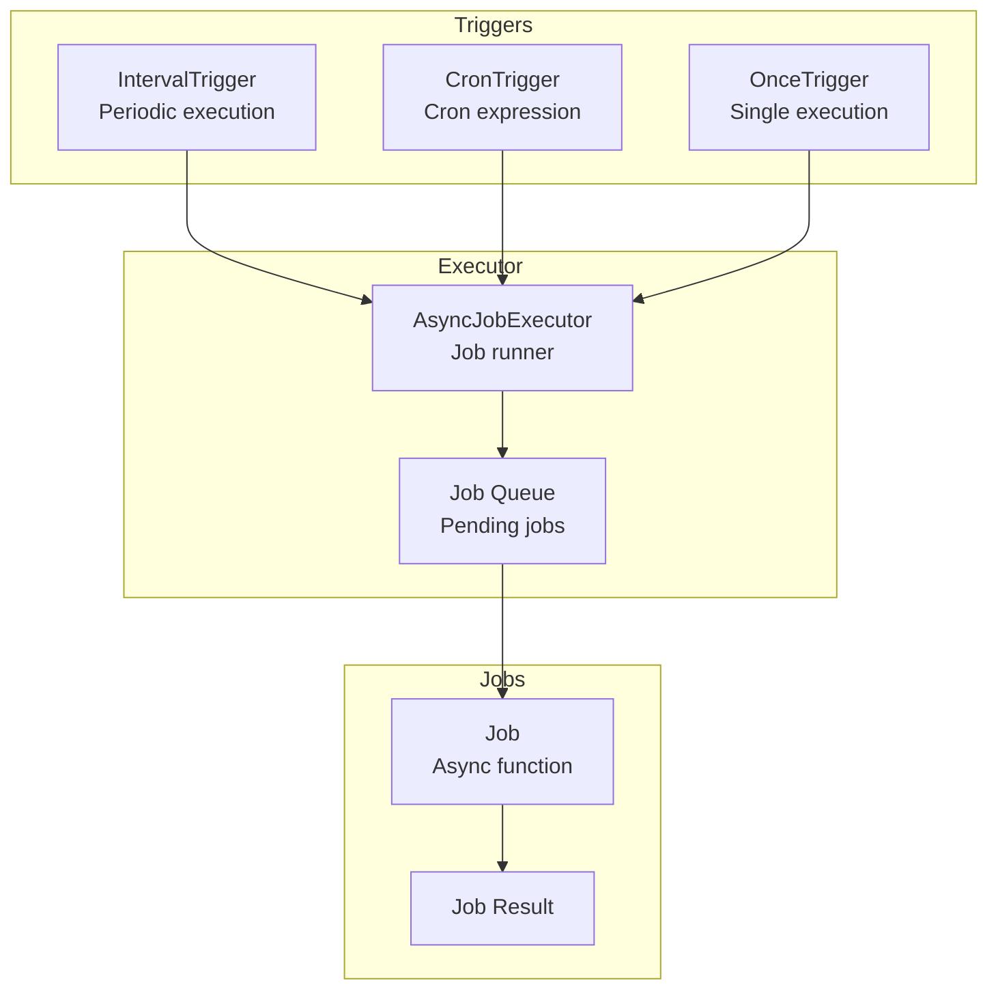
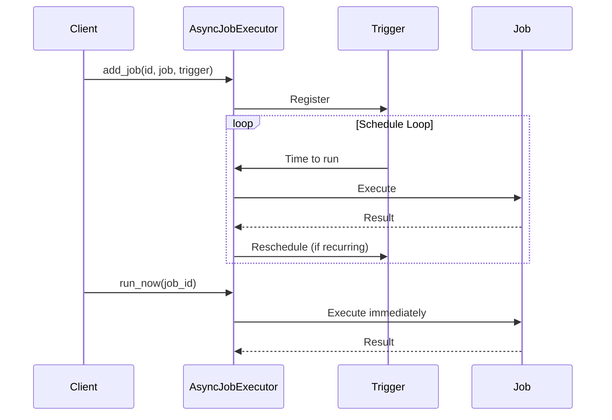

# Scheduler

Job scheduling with various trigger types.

## Scheduler Architecture



## Scheduling Flow



## Job Scheduling

```python
from cemaf.scheduler.executor import AsyncJobExecutor
from cemaf.scheduler.triggers import IntervalTrigger

executor = AsyncJobExecutor()

# Schedule job
await executor.add_job(
    job_id="daily_task",
    job=my_async_function,
    trigger=IntervalTrigger(seconds=86400)
)

# Run now
await executor.run_now("daily_task")
```
