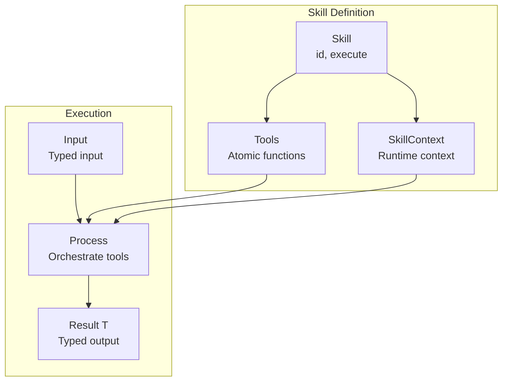
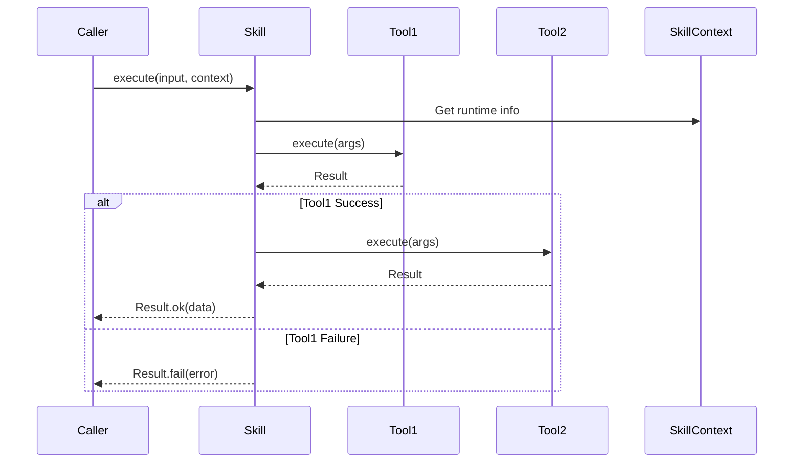

# Skills

Skills are composable capabilities that use tools to accomplish higher-level tasks.

## Skill Architecture



## Skill Execution Flow



## Defining a Skill

```python
from cemaf.skills.base import Skill
from cemaf.core.result import Result

class ResearchSkill(Skill[str, dict]):
    @property
    def id(self) -> str:
        return "research"

    async def execute(self, input: str, context: SkillContext) -> Result[dict]:
        # Use tools to accomplish the skill
        search_result = await self._search_tool.execute(query=input)
        if not search_result.success:
            return Result.fail("Search failed")

        # Process and return
        return Result.ok({"research": search_result.data})
```
