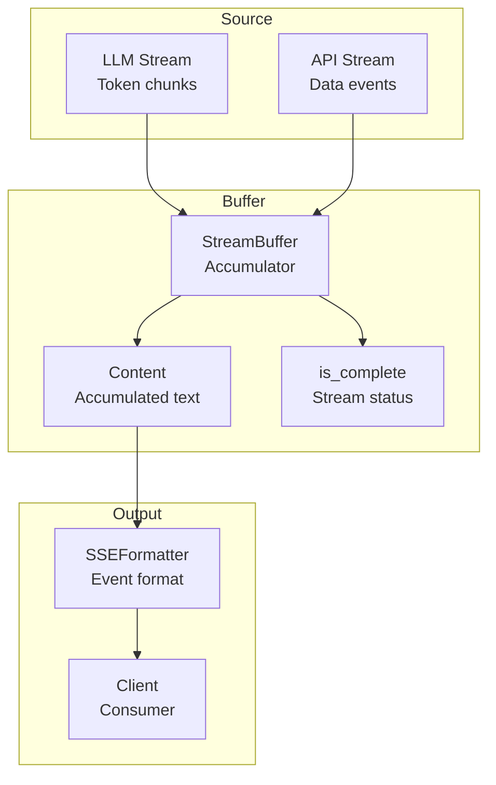
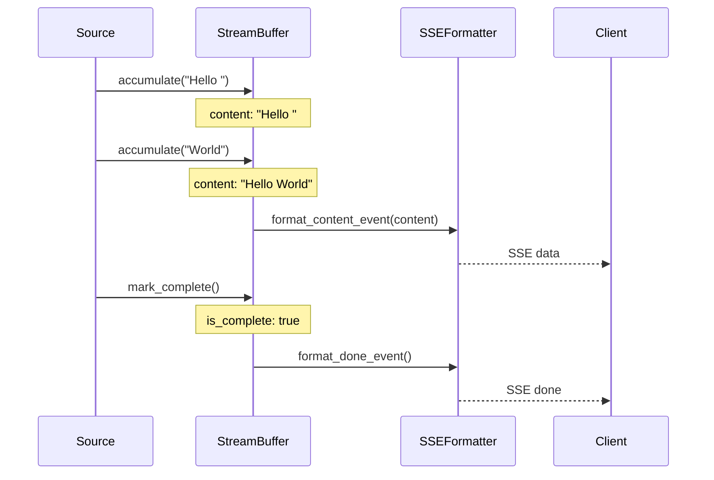

# Streaming

Server-Sent Events (SSE) and stream buffers for real-time updates.

## Streaming Architecture



## Streaming Flow



## Stream Buffer

```python
from cemaf.streaming.protocols import StreamBuffer

buffer = StreamBuffer()

# Accumulate content
buffer.accumulate("Hello ")
buffer.accumulate("World")

# Get accumulated content
content = buffer.content  # "Hello World"

# Check completion
if buffer.is_complete:
    print("Stream finished")
```

## SSE Formatter

```python
from cemaf.streaming.sse import SSEFormatter

formatter = SSEFormatter()
sse_data = formatter.format_content_event("Hello")
```
