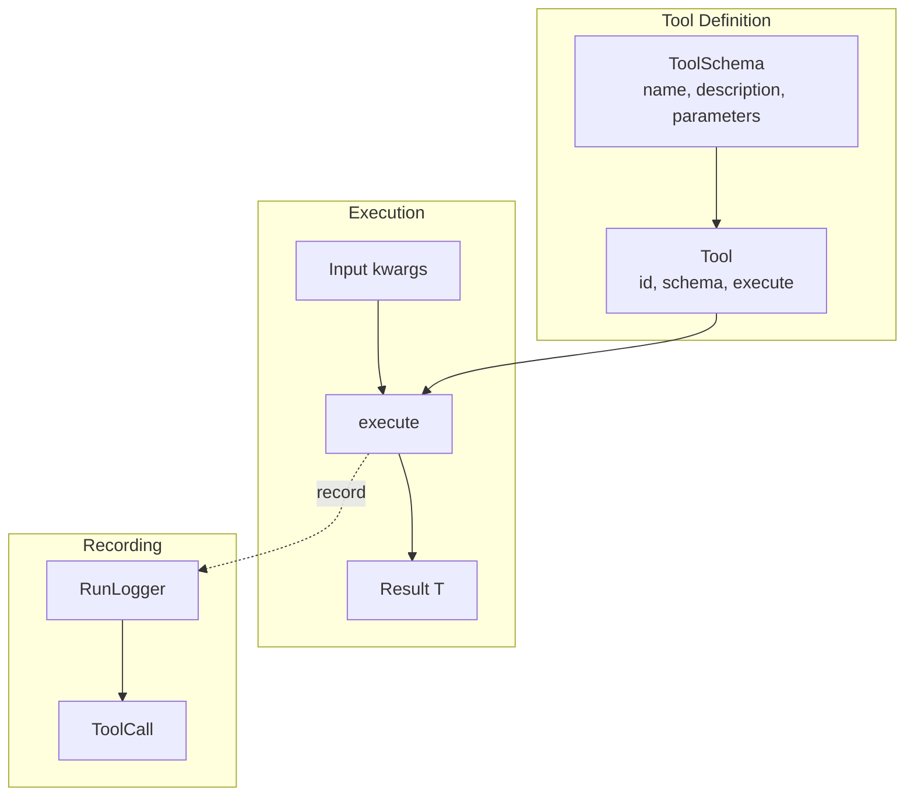
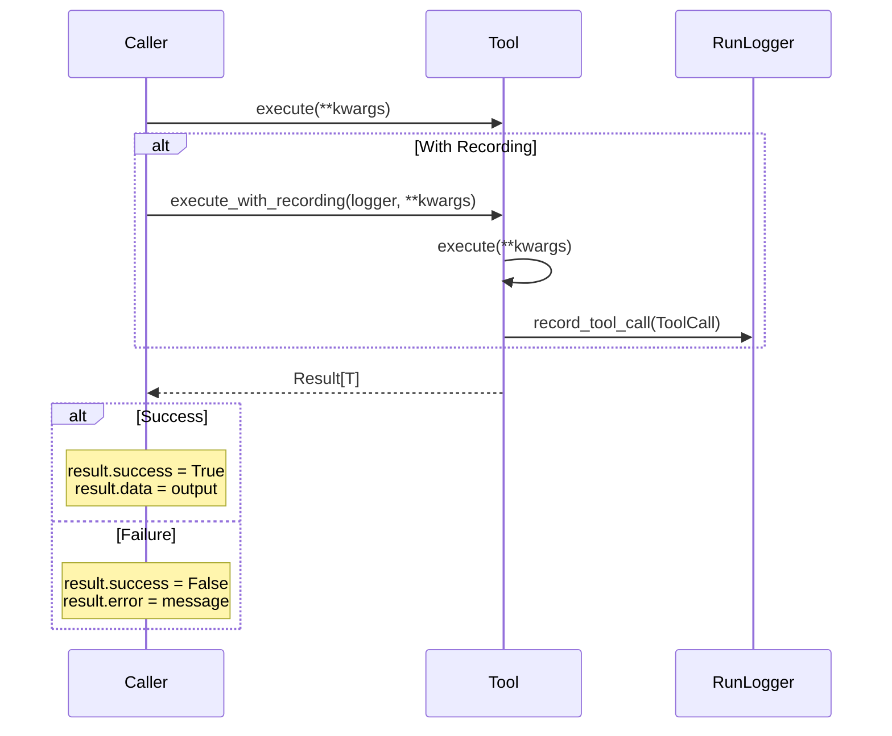

# Tools

Tools are atomic, stateless functions that perform a single operation.

## Tool Architecture



## Tool Execution Flow



## Defining a Tool

```python
from cemaf.tools.base import Tool, ToolSchema
from cemaf.core.result import Result

class SearchTool(Tool):
    @property
    def id(self) -> str:
        return "search"

    @property
    def schema(self) -> ToolSchema:
        return ToolSchema(
            name="search",
            description="Search the web",
            parameters={
                "type": "object",
                "properties": {
                    "query": {"type": "string"}
                }
            },
            required=("query",)
        )

    async def execute(self, query: str) -> Result[dict]:
        # Implementation
        try:
            results = perform_search(query)
            return Result.ok({"results": results})
        except Exception as e:
            return Result.fail(str(e))
```

## Tool Decorator

Quick way to create tools from functions:

```python
from cemaf.tools.base import tool

@tool(
    id="calculate",
    name="calculate",
    description="Perform arithmetic",
    parameters={"type": "object", "properties": {"expression": {"type": "string"}}}
)
async def calculate(expression: str) -> dict:
    result = eval(expression)
    return {"result": result}
```

## Tool Schema

Define parameters using JSON Schema:

```python
schema = ToolSchema(
    name="my_tool",
    description="Tool description",
    parameters={
        "type": "object",
        "properties": {
            "param1": {"type": "string"},
            "param2": {"type": "number"}
        }
    },
    required=("param1",)
)

# Convert to LLM formats
openai_format = schema.to_openai_format()
anthropic_format = schema.to_anthropic_format()
```

## Tool Execution

Tools always return `Result[T]` and never raise exceptions:

```python
result = await tool.execute(query="test")

if result.success:
    data = result.data
else:
    error = result.error
```
