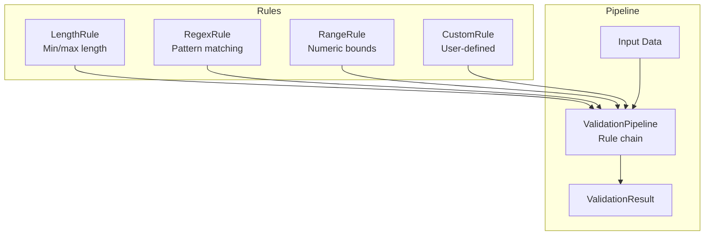
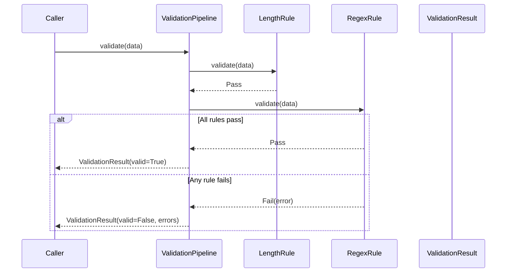

# Validation

Validation rules and pipelines for data validation.

## Validation Architecture



## Validation Flow



## Validation Pipeline

```python
from cemaf.validation.pipeline import ValidationPipeline
from cemaf.validation.rules import LengthRule, RegexRule

pipeline = ValidationPipeline() \
    .add_rule(LengthRule(min_length=5, max_length=100)) \
    .add_rule(RegexRule(pattern=r"^[a-z]+$"))

result = pipeline.validate("teststring")
```
