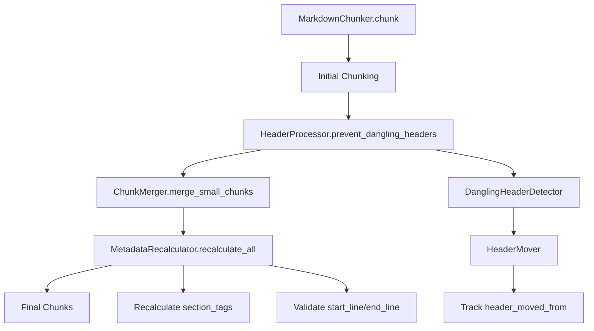

# Design Document: Dangling Headers v2 & Metadata Consistency

## Overview

Данный дизайн решает проблемы неполного покрытия dangling header fix и рассинхронизации метаданных после пост-обработки чанков.

## Architecture



### Ключевое изменение: Порядок операций

**Текущий порядок (проблемный):**
1. Chunking
2. Calculate section_tags
3. Dangling header fix
4. ❌ section_tags не пересчитываются

**Новый порядок:**
1. Chunking
2. Dangling header fix (с трекингом header_moved_from)
3. Merge small chunks
4. **Recalculate section_tags** ← новый шаг
5. Validate metadata consistency

## Components and Interfaces

### Enhanced HeaderProcessor

```python
class HeaderProcessor:
    def prevent_dangling_headers(self, chunks: list[Chunk]) -> list[Chunk]:
        """
        Предотвращает dangling headers во ВСЕХ секциях документа.
        
        Изменения:
        - Универсальная логика для любого header_path
        - Заполнение header_moved_from при переносе
        - Поддержка allow_oversize чанков
        """
    
    def _detect_dangling_headers(self, chunks: list[Chunk]) -> list[DanglingHeaderInfo]:
        """
        Обнаруживает dangling headers.
        
        Изменения:
        - Проверка ВСЕХ уровней заголовков (не только ####)
        - Учёт контекста секции (Impact, Leadership, etc.)
        """
    
    def _move_header_to_next_chunk(
        self, 
        chunks: list[Chunk], 
        source_idx: int, 
        header_info: DanglingHeaderInfo
    ) -> list[Chunk]:
        """
        Переносит заголовок в следующий чанк.
        
        Изменения:
        - Заполняет header_moved_from = source_idx
        - Обновляет start_line/end_line обоих чанков
        """
```

### New MetadataRecalculator Component

```python
class MetadataRecalculator:
    """Пересчитывает derived-метаданные после пост-обработки."""
    
    def recalculate_all(self, chunks: list[Chunk]) -> list[Chunk]:
        """Пересчитывает все derived-поля на финальных чанках."""
        chunks = self._recalculate_section_tags(chunks)
        chunks = self._validate_line_ranges(chunks)
        return chunks
    
    def _recalculate_section_tags(self, chunks: list[Chunk]) -> list[Chunk]:
        """
        Пересчитывает section_tags на основе фактического контента.
        
        Алгоритм:
        1. Для каждого чанка извлечь все заголовки из content
        2. Обновить section_tags списком найденных заголовков
        """
    
    def _extract_headers_from_content(self, content: str) -> list[str]:
        """Извлекает заголовки (###, ####) из контента чанка."""
    
    def _validate_line_ranges(self, chunks: list[Chunk]) -> list[Chunk]:
        """Проверяет согласованность start_line/end_line."""
```

### Enhanced DanglingHeaderDetector

```python
@dataclass
class DanglingHeaderInfo:
    chunk_index: int
    header_text: str
    header_level: int
    header_line_in_chunk: int  # позиция в чанке
    next_chunk_has_content: bool

class DanglingHeaderDetector:
    def detect(self, chunks: list[Chunk]) -> list[DanglingHeaderInfo]:
        """
        Обнаруживает dangling headers.
        
        Изменения:
        - Не привязан к конкретным header_path
        - Работает для любой структуры документа
        - Учитывает allow_oversize флаг
        """
    
    def _is_header_at_end(self, content: str) -> tuple[bool, str, int]:
        """
        Проверяет, заканчивается ли контент заголовком.
        
        Returns:
            (is_dangling, header_text, header_level)
        """
    
    def _next_chunk_has_related_content(
        self, 
        header_text: str, 
        next_chunk: Chunk
    ) -> bool:
        """Проверяет, содержит ли следующий чанк контент для этого заголовка."""
```

## Data Models

### Enhanced Chunk Metadata

```python
chunk.metadata = {
    # Существующие поля
    "section_tags": list[str],  # Пересчитывается после пост-обработки
    "dangling_header_fixed": bool,
    "header_path": str,
    "start_line": int,
    "end_line": int,
    
    # Улучшенные поля
    "header_moved_from": int | list[int] | None,  # chunk_index источника
    "headers_in_content": list[str],  # Фактические заголовки в контенте
}
```

### Line Range Contract

```python
@dataclass
class LineRangeContract:
    """
    Контракт для start_line/end_line:
    
    - Leaf nodes: диапазон собственного контента
    - Internal nodes: диапазон собственного контента (без детей)
    - Root node: диапазон всего документа (1..total_lines)
    
    Это означает, что сумма диапазонов детей НЕ обязана равняться
    диапазону родителя. Родитель содержит только свой "заголовочный"
    контент, а дети — детальный контент.
    """
    pass
```

## Correctness Properties

### Property 1: Universal Dangling Header Prevention
*For any* markdown document with headers, no chunk should end with a header (level 3-4) while the next chunk contains content belonging to that header, regardless of the section path.

**Validates: Requirements 1.1, 1.2, 1.3**

### Property 2: section_tags Content Consistency
*For any* chunk with section_tags, each tag in section_tags must correspond to a header actually present in the chunk's content.

**Validates: Requirements 2.1, 2.2, 2.3, 2.4**

### Property 3: header_moved_from Accuracy
*For any* chunk with dangling_header_fixed=true, header_moved_from must contain the valid chunk_index of the source chunk, or the field must be absent if not applicable.

**Validates: Requirements 3.1, 3.2, 3.3**

### Property 4: Line Range Contract Consistency
*For any* hierarchical chunking result, leaf and internal nodes have line ranges covering only their own content, while root covers the entire document.

**Validates: Requirements 4.1, 4.2, 4.3**

## Algorithm: Universal Dangling Header Detection

```python
def detect_dangling_headers(chunks: list[Chunk]) -> list[DanglingHeaderInfo]:
    """
    Универсальный алгоритм обнаружения dangling headers.
    
    Ключевое отличие от текущей реализации:
    - Не зависит от header_path
    - Работает для любого уровня заголовков (###, ####)
    - Проверяет ВСЕ чанки, а не только определённые секции
    """
    results = []
    
    for i, chunk in enumerate(chunks[:-1]):  # Все кроме последнего
        content = chunk.content.rstrip()
        
        # Проверяем, заканчивается ли чанк заголовком
        lines = content.split('\n')
        last_non_empty = None
        for line in reversed(lines):
            if line.strip():
                last_non_empty = line.strip()
                break
        
        if not last_non_empty:
            continue
        
        # Проверяем, является ли последняя строка заголовком
        header_match = re.match(r'^(#{1,6})\s+(.+)$', last_non_empty)
        if not header_match:
            continue
        
        header_level = len(header_match.group(1))
        header_text = header_match.group(2)
        
        # Проверяем, что следующий чанк содержит контент для этого заголовка
        next_chunk = chunks[i + 1]
        next_content = next_chunk.content.lstrip()
        
        # Если следующий чанк НЕ начинается с заголовка того же или выше уровня,
        # значит это контент для dangling header
        next_first_line = next_content.split('\n')[0].strip() if next_content else ''
        next_header_match = re.match(r'^(#{1,6})\s+', next_first_line)
        
        if not next_header_match or len(next_header_match.group(1)) > header_level:
            results.append(DanglingHeaderInfo(
                chunk_index=i,
                header_text=header_text,
                header_level=header_level,
                header_line_in_chunk=len(lines) - 1,
                next_chunk_has_content=True
            ))
    
    return results
```

## Algorithm: section_tags Recalculation

```python
def recalculate_section_tags(chunks: list[Chunk]) -> list[Chunk]:
    """
    Пересчитывает section_tags на основе фактического контента.
    
    Вызывается ПОСЛЕ всех пост-обработок (dangling fix, merge).
    """
    for chunk in chunks:
        content = chunk.content
        
        # Извлекаем все заголовки уровня 3-4 из контента
        headers = []
        for line in content.split('\n'):
            match = re.match(r'^(#{3,4})\s+(.+)$', line.strip())
            if match:
                headers.append(match.group(2).strip())
        
        # Обновляем section_tags
        chunk.metadata['section_tags'] = headers
        chunk.metadata['headers_in_content'] = headers  # Для отладки
    
    return chunks
```

## Testing Strategy

### Test Fixture: Real Document from TEST_REPORT_v2

```python
@pytest.fixture
def sde_criteria_document():
    """Реальный документ из тестового отчёта."""
    return """
# Критерии грейдов SDE
...
## Scope
#### Описание
...
#### Итоги работы
1. Изучил подходы...
...
#### Кто участвовал в реализации
...
## Impact
#### Описание задачи
...
#### Итоги работы
1. Изучил текущую систему...
...
"""
```

### Test Cases

```python
def test_dangling_headers_all_sections(sde_criteria_document):
    """Проверяет, что dangling headers исправлены во ВСЕХ секциях."""
    chunker = MarkdownChunker(ChunkConfig(max_chunk_size=1000))
    chunks = chunker.chunk(sde_criteria_document)
    
    # Проверяем каждую секцию
    for section in ['Scope', 'Impact', 'Leadership', 'Improvement']:
        section_chunks = [c for c in chunks if section in c.metadata.get('header_path', '')]
        
        for i, chunk in enumerate(section_chunks[:-1]):
            content = chunk.content.rstrip()
            # Не должно быть dangling headers
            assert not content.endswith('#### Итоги работы')
            assert not content.endswith('#### Кто участвовал в реализации')


def test_section_tags_match_content(sde_criteria_document):
    """Проверяет, что section_tags соответствуют фактическому контенту."""
    chunker = MarkdownChunker(ChunkConfig(max_chunk_size=1000))
    chunks = chunker.chunk(sde_criteria_document)
    
    for chunk in chunks:
        section_tags = chunk.metadata.get('section_tags', [])
        content = chunk.content
        
        for tag in section_tags:
            # Каждый тег должен присутствовать как заголовок в контенте
            assert f'#### {tag}' in content or f'### {tag}' in content, \
                f"Tag '{tag}' not found in chunk content"


def test_header_moved_from_populated():
    """Проверяет, что header_moved_from заполняется при переносе."""
    # ... тест с документом, где гарантированно будет перенос
```

## Implementation Plan

### Phase 1: Fix Universal Dangling Header Detection
1. Рефакторинг `DanglingHeaderDetector` — убрать привязку к header_path
2. Добавить поддержку всех уровней заголовков
3. Тесты на всех секциях документа

### Phase 2: Implement header_moved_from Tracking
1. Добавить трекинг в `HeaderMover._move_header_to_next_chunk()`
2. Обновить схему метаданных
3. Тесты на корректность заполнения

### Phase 3: Implement MetadataRecalculator
1. Создать компонент `MetadataRecalculator`
2. Интегрировать в пайплайн после всех пост-обработок
3. Тесты на соответствие section_tags контенту

### Phase 4: Document Line Range Contract
1. Добавить документацию в README
2. Добавить docstrings
3. Добавить валидацию в debug режиме

### Phase 5: Regression Tests
1. Создать fixture из реального документа
2. Добавить тесты для всех выявленных проблем
3. Интегрировать в CI
