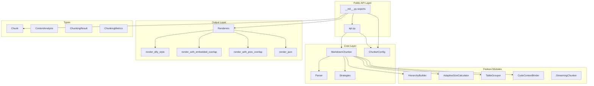
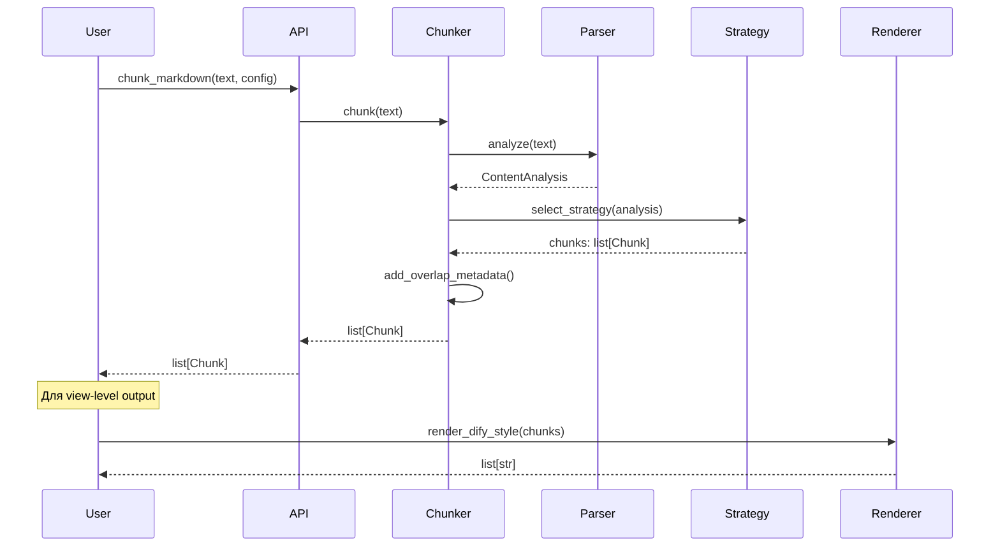

# Design Document: Chunkana Parity with dify-markdown-chunker

## Source of Truth

**Baseline Commit:** Зафиксирован в `BASELINE.md` — все golden outputs генерируются из плагина на этом коммите.

**Golden Outputs:**
- `tests/baseline/golden_canonical/` — канонический вывод (list[Chunk] как JSONL)
- `tests/baseline/golden_dify_style/` — view-level для include_metadata=True
- `tests/baseline/golden_no_metadata/` — view-level для include_metadata=False

**Generation Script:** `scripts/generate_baseline.py --plugin-path <path>`

**Правило:** Если тест расходится с golden — либо правим библиотеку, либо осознанно обновляем golden с документированием причины.

## Overview

Данный документ описывает архитектуру и детали реализации для достижения полной совместимости (parity) библиотеки **Chunkana** с плагином **dify-markdown-chunker v2**, а также создания самодостаточного руководства по миграции.

### Source of Truth

- **Baseline Commit:** Зафиксирован в `BASELINE.md`
- **Golden Outputs:** Генерируются из плагина на pinned commit
  - `tests/baseline/golden_canonical/` — канонический вывод
  - `tests/baseline/golden_dify_style/` — view-level (include_metadata=True)
  - `tests/baseline/golden_no_metadata/` — view-level (include_metadata=False)
- **Generation Script:** `scripts/generate_baseline.py`

### Цели дизайна

1. **Config Parity**: Полное соответствие параметров конфигурации между библиотекой и плагином
2. **API Completeness**: Удобные API-обёртки для механической миграции плагина
3. **Renderer Parity**: Byte-for-byte совместимость выходных форматов с baseline golden outputs
4. **Documentation**: Самодостаточный MIGRATION_GUIDE.md для переноса плагина
5. **Test Coverage**: Baseline и property-based тесты для защиты parity

### Ключевые инварианты (из requirements)

- `chunk_markdown()` всегда возвращает `list[Chunk]`, не union type
- `Chunk.content` содержит канонический текст без embedded overlap
- Overlap хранится только в `metadata.previous_content` / `metadata.next_content`
- `header_path` — строка формата `"/H1/H2"`, не list
- Atomic blocks (code fences, tables, LaTeX) не разрываются при `preserve_*=True`

## Architecture

### Компонентная диаграмма



### Поток данных



## Components and Interfaces

### 1. ChunkerConfig (config.py)

Расширение конфигурации для полного parity с плагином.

```python
@dataclass
class ChunkerConfig:
    """Configuration for markdown chunking with full plugin parity."""
    
    # === Size parameters ===
    max_chunk_size: int = 4096
    min_chunk_size: int = 512
    overlap_size: int = 200
    overlap_cap_ratio: float = 0.35  # NEW: limits overlap to fraction of adjacent chunk
    
    # === Behavior parameters ===
    preserve_atomic_blocks: bool = True
    extract_preamble: bool = True
    
    # === Strategy selection thresholds ===
    code_threshold: float = 0.3
    structure_threshold: int = 3
    list_ratio_threshold: float = 0.4
    list_count_threshold: int = 5
    strategy_override: str | None = None
    
    # === Code-context binding ===
    enable_code_context_binding: bool = True
    max_context_chars_before: int = 500
    max_context_chars_after: int = 300
    related_block_max_gap: int = 5
    bind_output_blocks: bool = True
    preserve_before_after_pairs: bool = True
    
    # === Adaptive sizing ===
    use_adaptive_sizing: bool = False
    adaptive_config: AdaptiveSizeConfig | None = None
    
    # === Hierarchical chunking ===
    include_document_summary: bool = True
    
    # === Content preprocessing ===
    strip_obsidian_block_ids: bool = False
    
    # === LaTeX handling ===
    preserve_latex_blocks: bool = True
    latex_display_only: bool = True
    latex_max_context_chars: int = 300
    
    # === Table grouping ===
    group_related_tables: bool = False
    table_grouping_config: TableGroupingConfig | None = None
    
    def to_dict(self) -> dict:
        """
        Serialize ALL fields including nested configs.
        
        Structure:
        - Plugin Parity Fields: keys from plugin's ChunkConfig.to_dict() at pinned commit
        - Chunkana Extensions: additional fields not in plugin
        
        Note: `enable_overlap` is a computed property that plugin includes in to_dict(),
        so we include it for parity. It's derived from overlap_size > 0.
        
        Note: `streaming_config` is NOT part of ChunkerConfig — it's passed separately
        to streaming functions.
        """
        result = {
            # === Plugin Parity Fields (from plugin's ChunkConfig.to_dict()) ===
            # Size parameters
            "max_chunk_size": self.max_chunk_size,
            "min_chunk_size": self.min_chunk_size,
            "overlap_size": self.overlap_size,
            # Behavior
            "preserve_atomic_blocks": self.preserve_atomic_blocks,
            "extract_preamble": self.extract_preamble,
            # Strategy thresholds
            "code_threshold": self.code_threshold,
            "structure_threshold": self.structure_threshold,
            "list_ratio_threshold": self.list_ratio_threshold,
            "list_count_threshold": self.list_count_threshold,
            "strategy_override": self.strategy_override,
            # Code-context binding
            "enable_code_context_binding": self.enable_code_context_binding,
            "max_context_chars_before": self.max_context_chars_before,
            "max_context_chars_after": self.max_context_chars_after,
            "related_block_max_gap": self.related_block_max_gap,
            "bind_output_blocks": self.bind_output_blocks,
            "preserve_before_after_pairs": self.preserve_before_after_pairs,
            # Computed (plugin includes this in to_dict())
            "enable_overlap": self.enable_overlap,
            
            # === Chunkana Extensions (not in plugin) ===
            "overlap_cap_ratio": self.overlap_cap_ratio,
            # Adaptive sizing
            "use_adaptive_sizing": self.use_adaptive_sizing,
            "adaptive_config": self.adaptive_config.to_dict() if self.adaptive_config else None,
            # Hierarchical
            "include_document_summary": self.include_document_summary,
            # Preprocessing
            "strip_obsidian_block_ids": self.strip_obsidian_block_ids,
            # LaTeX
            "preserve_latex_blocks": self.preserve_latex_blocks,
            "latex_display_only": self.latex_display_only,
            "latex_max_context_chars": self.latex_max_context_chars,
            # Table grouping
            "group_related_tables": self.group_related_tables,
            "table_grouping_config": (
                self.table_grouping_config.to_dict() 
                if self.table_grouping_config else None
            ),
        }
        return result
    
    @classmethod
    def from_dict(cls, data: dict) -> "ChunkerConfig":
        """
        Deserialize ALL fields including nested configs.
        
        Ignores unknown fields for forward compatibility.
        """
        import dataclasses
        
        config_data = data.copy()
        
        # Handle computed property (derived, not stored)
        config_data.pop("enable_overlap", None)
        
        # Handle nested adaptive_config
        if "adaptive_config" in config_data and config_data["adaptive_config"]:
            config_data["adaptive_config"] = AdaptiveSizeConfig(
                **config_data["adaptive_config"]
            )
        
        # Handle nested table_grouping_config
        if "table_grouping_config" in config_data and config_data["table_grouping_config"]:
            config_data["table_grouping_config"] = TableGroupingConfig(
                **config_data["table_grouping_config"]
            )
        
        # Filter to only known fields (ignore unknown for forward compatibility)
        known_fields = {f.name for f in dataclasses.fields(cls)}
        filtered_data = {k: v for k, v in config_data.items() if k in known_fields}
        
        return cls(**filtered_data)
```

### 2. API Wrappers (api.py)

Новые функции-обёртки для упрощения миграции.

```python
def chunk_text(text: str, config: ChunkerConfig | None = None) -> list[Chunk]:
    """
    Alias for chunk_markdown for migration convenience.
    
    Args:
        text: Markdown text to chunk
        config: Optional configuration
    
    Returns:
        List of Chunk objects
    """
    return chunk_markdown(text, config)


def chunk_file(
    path: str | Path,
    config: ChunkerConfig | None = None,
    encoding: str = "utf-8",
) -> list[Chunk]:
    """
    Chunk a markdown file.
    
    Args:
        path: Path to markdown file
        config: Optional configuration
        encoding: File encoding (default: utf-8)
    
    Returns:
        List of Chunk objects
    
    Raises:
        FileNotFoundError: If file does not exist
        UnicodeDecodeError: If encoding error occurs
    """
    path = Path(path)
    if not path.exists():
        raise FileNotFoundError(f"File not found: {path}")
    
    text = path.read_text(encoding=encoding)
    return chunk_markdown(text, config)


def chunk_file_streaming(
    path: str | Path,
    config: ChunkerConfig | None = None,
    streaming_config: StreamingConfig | None = None,
) -> Iterator[Chunk]:
    """
    Stream chunks from a large file.
    
    Best-effort contract (streaming MAY differ from batch):
        - Chunk boundaries near buffer splits may differ
        - Overlap metadata at buffer boundaries may differ
    
    Guaranteed invariants:
        - All source lines covered by at least one chunk
        - Atomic blocks NOT split (when preserve_atomic_blocks=True)
        - start_line values monotonically non-decreasing
    
    Args:
        path: Path to markdown file
        config: Chunking configuration
        streaming_config: Streaming buffer configuration
    
    Yields:
        Chunk objects incrementally
    """
    from .streaming import StreamingChunker
    
    streamer = StreamingChunker(
        config=config or ChunkerConfig.default(),
        streaming_config=streaming_config or StreamingConfig(),
    )
    yield from streamer.chunk_file(path)


def chunk_hierarchical(
    text: str,
    config: ChunkerConfig | None = None,
) -> HierarchicalChunkingResult:
    """
    Chunk text with hierarchical structure.
    
    Args:
        text: Markdown text to chunk
        config: Optional configuration
    
    Returns:
        HierarchicalChunkingResult with tree navigation
        
    HierarchyBuilder contract (verified against implementation):
        - build(chunks: list[Chunk], original_text: str) -> HierarchicalChunkingResult
        - Assigns chunk_id, parent_id, children_ids, hierarchy_level to metadata
        - Creates root document chunk if include_document_summary=True
        
    HierarchicalChunkingResult contract:
        - get_flat_chunks() -> list[Chunk]: leaf chunks only (for backward compat)
        - get_chunk(chunk_id) -> Chunk | None: O(1) lookup
        - get_parent(chunk_id) -> Chunk | None
        - get_children(chunk_id) -> list[Chunk]
        - get_ancestors(chunk_id) -> list[Chunk]
        - get_siblings(chunk_id) -> list[Chunk]
    """
    cfg = config or ChunkerConfig.default()
    chunker = MarkdownChunker(cfg)
    chunks = chunker.chunk(text)
    
    builder = HierarchyBuilder(
        include_document_summary=cfg.include_document_summary
    )
    return builder.build(chunks, text)
```

### 3. Renderers (renderers/formatters.py)

Точное соответствие форматам плагина.

```python
def render_dify_style(chunks: list[Chunk]) -> list[str]:
    """
    Render chunks in Dify-compatible format.
    
    Format (byte-for-byte match with plugin include_metadata=True):
        <metadata>
        {json}
        </metadata>
        {content}
    
    IMPORTANT: All formatting details (indent, key order, newlines, trailing whitespace)
    are derived from view-level golden outputs. Implementation MUST match goldens exactly.
    
    JSON formatting rules are determined by goldens, not assumptions.
    If goldens change, implementation must follow.
    
    Args:
        chunks: List of Chunk objects
    
    Returns:
        List of formatted strings
    """
    result = []
    for chunk in chunks:
        # Build metadata dict with start_line/end_line
        output_metadata = chunk.metadata.copy()
        output_metadata["start_line"] = chunk.start_line
        output_metadata["end_line"] = chunk.end_line
        
        # JSON formatting: match plugin golden outputs exactly
        # Key order: insertion order (NOT sorted) - verified against plugin
        metadata_json = json.dumps(
            output_metadata,
            ensure_ascii=False,
            indent=2,
            # NO sort_keys - plugin uses insertion order
        )
        
        # Format: <metadata>\n{json}\n</metadata>\n{content}
        # Note: single newline between </metadata> and content
        formatted = f"<metadata>\n{metadata_json}\n</metadata>\n{chunk.content}"
        result.append(formatted)
    
    return result


def render_with_embedded_overlap(chunks: list[Chunk]) -> list[str]:
    """
    Render chunks with bidirectional overlap embedded.
    
    Format (matches plugin include_metadata=False):
        {previous_content}\n{content}\n{next_content}
    
    Rules:
        - If previous_content is empty, omit it and leading newline
        - If next_content is empty, omit it and trailing newline
        - No extra trailing newline
    
    Args:
        chunks: List of Chunk objects
    
    Returns:
        List of formatted strings
    """
    result = []
    for chunk in chunks:
        parts = []
        
        prev = chunk.metadata.get("previous_content", "")
        next_ = chunk.metadata.get("next_content", "")
        
        if prev:
            parts.append(prev)
        parts.append(chunk.content)
        if next_:
            parts.append(next_)
        
        result.append("\n".join(parts))
    
    return result


def render_with_prev_overlap(chunks: list[Chunk]) -> list[str]:
    """
    Render chunks with only previous overlap (sliding window).
    
    Format:
        {previous_content}\n{content}
    
    Rules:
        - If previous_content is empty, return only content
        - No extra trailing newline
    
    Args:
        chunks: List of Chunk objects
    
    Returns:
        List of formatted strings
    """
    result = []
    for chunk in chunks:
        prev = chunk.metadata.get("previous_content", "")
        
        if prev:
            result.append(f"{prev}\n{chunk.content}")
        else:
            result.append(chunk.content)
    
    return result


def render_json(chunks: list[Chunk]) -> list[dict]:
    """
    Convert chunks to list of dictionaries.
    
    Args:
        chunks: List of Chunk objects
    
    Returns:
        List of dictionaries via chunk.to_dict()
    """
    return [chunk.to_dict() for chunk in chunks]


def render_inline_metadata(chunks: list[Chunk]) -> list[str]:
    """
    Render chunks with inline JSON metadata (sorted keys).
    
    Format:
        <metadata>
        {json with sorted keys, indent=2}
        </metadata>
        
        {content}
    
    Note: Two newlines between </metadata> and content.
    Note: Keys ARE sorted for deterministic output.
    
    Args:
        chunks: List of Chunk objects
    
    Returns:
        List of formatted strings
    """
    result = []
    for chunk in chunks:
        metadata_json = json.dumps(
            chunk.metadata,
            ensure_ascii=False,
            indent=2,
            sort_keys=True,  # Sorted for determinism
        )
        # Note: two newlines between </metadata> and content
        result.append(f"<metadata>\n{metadata_json}\n</metadata>\n\n{chunk.content}")
    
    return result
```

### 4. Public Exports (__init__.py)

Экспорты разделены на **Minimal Stable API** (для миграции) и **Extended API** (может меняться).

```python
"""
Chunkana - Intelligent Markdown chunking library for RAG systems.
"""

__version__ = "0.2.0"

# =============================================================================
# MINIMAL STABLE API (for migration, stable contract)
# =============================================================================

# Core types
from .types import Chunk
from .config import ChunkConfig, ChunkerConfig  # ChunkerConfig is alias

# Primary API functions
from .api import (
    chunk_markdown,
    chunk_text,           # alias for chunk_markdown
    chunk_file,           # file convenience
)

# Primary renderers (plugin parity)
from .renderers import (
    render_dify_style,           # include_metadata=True
    render_with_embedded_overlap, # include_metadata=False
)

# =============================================================================
# EXTENDED API (may change in minor versions)
# =============================================================================

# Extended API functions
from .api import (
    chunk_file_streaming,  # streaming for large files
    chunk_hierarchical,    # hierarchical chunking
    analyze_markdown,
    chunk_with_analysis,
    chunk_with_metrics,
    iter_chunks,
)

# Extended types
from .types import (
    ChunkingMetrics,
    ChunkingResult,
    ContentAnalysis,
    FencedBlock,
    TableBlock,
    Header,
    LatexBlock,
    ListBlock,
    ListItem,
)

# Configuration classes
from .adaptive_sizing import AdaptiveSizeConfig
from .table_grouping import TableGroupingConfig
from .streaming import StreamingConfig

# Core classes (for advanced usage)
from .chunker import MarkdownChunker
from .hierarchy import HierarchicalChunkingResult, HierarchyBuilder

# Extended renderers
from .renderers import (
    render_with_prev_overlap,
    render_json,
    render_inline_metadata,
)

__all__ = [
    # Version
    "__version__",
    # --- Minimal Stable API ---
    "Chunk",
    "ChunkConfig",
    "ChunkerConfig",
    "chunk_markdown",
    "chunk_text",
    "chunk_file",
    "render_dify_style",
    "render_with_embedded_overlap",
    # --- Extended API ---
    "chunk_file_streaming",
    "chunk_hierarchical",
    "analyze_markdown",
    "chunk_with_analysis",
    "chunk_with_metrics",
    "iter_chunks",
    "ChunkingMetrics",
    "ChunkingResult",
    "ContentAnalysis",
    "FencedBlock",
    "TableBlock",
    "Header",
    "LatexBlock",
    "ListBlock",
    "ListItem",
    "AdaptiveSizeConfig",
    "TableGroupingConfig",
    "StreamingConfig",
    "MarkdownChunker",
    "HierarchicalChunkingResult",
    "HierarchyBuilder",
    "render_with_prev_overlap",
    "render_json",
    "render_inline_metadata",
]
```

**Примечание:** `Validator`, `ValidationResult`, `validate_chunks` убраны из обязательных экспортов — они не требуются для миграции плагина и могут быть добавлены позже при необходимости.

## Data Models

### Nested Config Serialization

```python
@dataclass
class AdaptiveSizeConfig:
    """Configuration for adaptive chunk sizing."""
    
    base_size: int = 1500
    min_scale: float = 0.5
    max_scale: float = 1.5
    code_weight: float = 0.4
    table_weight: float = 0.3
    list_weight: float = 0.2
    sentence_length_weight: float = 0.1
    
    def to_dict(self) -> dict:
        return {
            "base_size": self.base_size,
            "min_scale": self.min_scale,
            "max_scale": self.max_scale,
            "code_weight": self.code_weight,
            "table_weight": self.table_weight,
            "list_weight": self.list_weight,
            "sentence_length_weight": self.sentence_length_weight,
        }


@dataclass
class TableGroupingConfig:
    """Configuration for table grouping."""
    
    max_distance_lines: int = 10
    max_grouped_tables: int = 5
    max_group_size: int = 5000
    require_same_section: bool = True
    
    def to_dict(self) -> dict:
        return {
            "max_distance_lines": self.max_distance_lines,
            "max_grouped_tables": self.max_grouped_tables,
            "max_group_size": self.max_group_size,
            "require_same_section": self.require_same_section,
        }


@dataclass
class StreamingConfig:
    """Configuration for streaming processing."""
    
    buffer_size: int = 100_000
    overlap_lines: int = 20
    max_memory_mb: int = 100
    safe_split_threshold: float = 0.8
    
    def to_dict(self) -> dict:
        return {
            "buffer_size": self.buffer_size,
            "overlap_lines": self.overlap_lines,
            "max_memory_mb": self.max_memory_mb,
            "safe_split_threshold": self.safe_split_threshold,
        }
```

### Golden Output Schemas

**Canonical Golden (JSONL)**:
```json
{"chunk_index": 0, "content": "...", "start_line": 1, "end_line": 10, "metadata": {"strategy": "structural", "header_path": "/Introduction", ...}}
{"chunk_index": 1, "content": "...", "start_line": 11, "end_line": 25, "metadata": {...}}
```

**View-Level Golden (JSONL)**:
```json
{"chunk_index": 0, "text": "<metadata>\n{...}\n</metadata>\n..."}
{"chunk_index": 1, "text": "<metadata>\n{...}\n</metadata>\n..."}
```


## Correctness Properties

*A property is a characteristic or behavior that should hold true across all valid executions of a system—essentially, a formal statement about what the system should do. Properties serve as the bridge between human-readable specifications and machine-verifiable correctness guarantees.*

### Property 1: Config Round-Trip Consistency

*For any* valid ChunkerConfig object, serializing to dict via `to_dict()` and deserializing via `from_dict()` SHALL produce an equivalent config object with all fields matching.

**Validates: Requirements 1.2, 1.3, 1.6**

### Property 2: Config Defaults on Partial Input

*For any* partial dictionary missing some config fields, `from_dict()` SHALL produce a config where missing fields have their default values.

**Validates: Requirements 1.4**

### Property 3: Config Validation Errors

*For any* invalid config parameter (negative sizes, out-of-range thresholds, invalid strategy names), config creation SHALL raise ValueError with descriptive message.

**Validates: Requirements 1.5**

### Property 4: Config Field Parity

*For any* field name in the EXPECTED_CONFIG_KEYS list (derived from plugin), `ChunkerConfig.to_dict()` SHALL contain that key.

**Validates: Requirements 1.1**

### Property 5: chunk_text Equivalence

*For any* markdown text and config, `chunk_text(text, config)` SHALL return the same result as `chunk_markdown(text, config)`.

**Validates: Requirements 2.1**

### Property 6: chunk_file Equivalence

*For any* file containing markdown text, `chunk_file(path, config)` SHALL return the same result as `chunk_markdown(file_content, config)`.

**Validates: Requirements 2.2**

### Property 7: chunk_file_streaming Invariants

*For any* markdown file processed via `chunk_file_streaming(path, config)`:
- All source lines SHALL be covered by at least one chunk
- Atomic blocks SHALL NOT be split (when preserve_atomic_blocks=True)
- start_line values SHALL be monotonically non-decreasing

Note: Exact chunk boundaries MAY differ from batch processing at buffer splits (best-effort contract).

**Validates: Requirements 2.3**

### Property 8: chunk_hierarchical Leaf Coverage

*For any* markdown text, the union of line ranges from `chunk_hierarchical(text).get_flat_chunks()` SHALL equal the union of line ranges from `chunk_markdown(text)`.

Formally: `{(c.start_line, c.end_line) for c in get_flat_chunks()} == {(c.start_line, c.end_line) for c in chunk_markdown()}`

**Validates: Requirements 2.4**

### Property 9: render_with_prev_overlap Format

*For any* chunk with non-empty `previous_content` in metadata, `render_with_prev_overlap([chunk])[0]` SHALL equal `previous_content + "\n" + chunk.content`.

**Validates: Requirements 3.3**

### Property 10: render_json Round-Trip

*For any* list of chunks, `[Chunk.from_dict(d) for d in render_json(chunks)]` SHALL produce chunks with equivalent content and metadata.

**Validates: Requirements 3.4**

### Property 11: render_inline_metadata Sorted Keys

*For any* chunk, the JSON in `render_inline_metadata([chunk])[0]` SHALL have keys in sorted order.

**Validates: Requirements 3.5**

### Property 12: No Trailing Newline in Renderers

*For any* chunk where `chunk.content` does not end with newline, rendered output from `render_dify_style`, `render_with_embedded_overlap`, `render_with_prev_overlap` SHALL NOT end with extra newline.

**Validates: Requirements 3.6**

### Property 13: Atomic Code Block Integrity

*For any* markdown document containing fenced code blocks, WHEN `preserve_atomic_blocks=True`, no chunk boundary SHALL fall inside a code block (code blocks are not split).

**Validates: Requirements 9.1, 12.5**

### Property 14: Atomic Table Integrity

*For any* markdown document containing tables, WHEN `preserve_atomic_blocks=True`, no chunk boundary SHALL fall inside a table (tables are not split).

**Validates: Requirements 9.2, 12.5**

### Property 15: Atomic LaTeX Integrity

*For any* markdown document containing LaTeX blocks, WHEN `preserve_latex_blocks=True`, no chunk boundary SHALL fall inside a LaTeX block.

**Validates: Requirements 9.3, 12.6**

### Property 16: Overlap Cap Ratio Constraint

*For any* chunk with `previous_content` or `next_content` in metadata, the overlap size SHALL NOT exceed `overlap_cap_ratio * adjacent_chunk_size`.

**Validates: Requirements 9.4**

### Property 17: Monotonic start_line

*For any* sequence of chunks from `chunk_markdown()`, `start_line` values SHALL be monotonically non-decreasing.

**Validates: Requirements 9.5**

### Property 18: No Empty Chunks

*For any* chunk in the output of `chunk_markdown()`, `chunk.content.strip()` SHALL NOT be empty.

**Validates: Requirements 9.6**

### Property 19: Line Coverage (Content Preservation)

*For any* markdown document with N lines, every source line (1..N) SHALL be covered by at least one chunk's [start_line, end_line] range.

Verification: `set(range(1, total_lines+1)) ⊆ union(range(c.start_line, c.end_line+1) for c in chunks)`

**Validates: Requirements 9.7**

### Property 20: Return Type Invariant

*For any* input to `chunk_markdown()`, the return type SHALL be `list[Chunk]`, never a union type or other structure.

**Validates: Requirements 12.1**

### Property 21: Chunk Content is Substring of Source

*For any* chunk, `chunk.content` (after CRLF→LF normalization) SHALL be a substring of the original source document (after same normalization).

This ensures chunk content comes from the source without fabrication.

**Note:** Exact line-to-content mapping is verified by baseline canonical tests, not this property.

**Validates: Requirements 12.2**

### Property 22: Overlap Only in Metadata

*For any* chunk with overlap, the overlap text SHALL be stored in `metadata["previous_content"]` and/or `metadata["next_content"]`, not embedded in `chunk.content`.

**Validates: Requirements 12.3**

### Property 23: header_path Format

*For any* chunk with `header_path` in metadata, the value SHALL be a string matching pattern `^(/[^/]+)*$` or `"/__preamble__"` or empty string.

**Validates: Requirements 12.4**

## Error Handling

### Configuration Errors

| Error Condition | Exception | Message Pattern |
|-----------------|-----------|-----------------|
| `max_chunk_size <= 0` | `ValueError` | "max_chunk_size must be positive, got {value}" |
| `min_chunk_size <= 0` | `ValueError` | "min_chunk_size must be positive, got {value}" |
| `overlap_size < 0` | `ValueError` | "overlap_size must be non-negative, got {value}" |
| `overlap_size >= max_chunk_size` | `ValueError` | "overlap_size must be less than max_chunk_size" |
| `code_threshold not in [0,1]` | `ValueError` | "code_threshold must be between 0 and 1" |
| `strategy_override invalid` | `ValueError` | "strategy_override must be one of {valid_set}" |
| `overlap_cap_ratio not in (0,1]` | `ValueError` | "overlap_cap_ratio must be between 0 and 1" |

### File Operation Errors

| Error Condition | Exception | Handling |
|-----------------|-----------|----------|
| File not found | `FileNotFoundError` | Raise with path in message |
| Encoding error | `UnicodeDecodeError` | Propagate with context |
| Permission denied | `PermissionError` | Propagate with context |

### Chunking Errors

| Error Condition | Handling |
|-----------------|----------|
| Empty input | Return empty list `[]` |
| Whitespace-only input | Return empty list `[]` |
| Malformed markdown | Best-effort chunking, no exception |
| Unclosed code fence | Treat as closed at EOF |

## Testing Strategy

### Dual Testing Approach

Тестирование использует комбинацию unit tests и property-based tests:

- **Unit tests**: Конкретные примеры, edge cases, baseline comparisons
- **Property tests**: Универсальные свойства, проверяемые на множестве сгенерированных входов

### Property-Based Testing Configuration

- **Framework**: `hypothesis` (Python)
- **Minimum iterations**: 100 per property
- **Tag format**: `# Feature: chunkana-parity-migration, Property N: {property_text}`

### Test Categories

#### 1. Baseline Canonical Tests (`tests/baseline/test_canonical.py`)

Сравнение с golden outputs из плагина:

```python
def normalize_content(content: str) -> str:
    """Normalize content for comparison: CRLF→LF."""
    return content.replace("\r\n", "\n")


@pytest.mark.parametrize("fixture", BASELINE_FIXTURES)
def test_canonical_output(fixture):
    """Compare chunk output with golden canonical."""
    text = load_fixture(fixture)
    expected = load_golden_canonical(fixture)
    
    chunks = chunk_markdown(text)
    
    assert len(chunks) == len(expected), f"Chunk count mismatch: {len(chunks)} vs {len(expected)}"
    
    for i, (chunk, golden) in enumerate(zip(chunks, expected)):
        # Content comparison with CRLF→LF normalization
        actual_content = normalize_content(chunk.content)
        expected_content = normalize_content(golden["content"])
        assert actual_content == expected_content, f"Chunk {i} content mismatch"
        
        # Line numbers must match exactly
        assert chunk.start_line == golden["start_line"], f"Chunk {i} start_line mismatch"
        assert chunk.end_line == golden["end_line"], f"Chunk {i} end_line mismatch"
        
        # Metadata comparison (dict equality)
        assert chunk.metadata == golden["metadata"], f"Chunk {i} metadata mismatch"
```

#### 2. Baseline View-Level Tests (`tests/baseline/test_view_level.py`)

Сравнение renderer output с golden:

```python
@pytest.mark.parametrize("fixture", BASELINE_FIXTURES)
def test_dify_style_output(fixture):
    """Compare render_dify_style with golden."""
    text = load_fixture(fixture)
    expected = load_golden_dify_style(fixture)
    
    chunks = chunk_markdown(text)
    rendered = render_dify_style(chunks)
    
    for i, (actual, golden) in enumerate(zip(rendered, expected)):
        assert actual == golden["text"], f"Chunk {i} render mismatch"
```

#### 3. Property Tests (`tests/property/`)

```python
from hypothesis import given, strategies as st

# Property 1: Config round-trip
@given(st.builds(ChunkerConfig, 
    max_chunk_size=st.integers(100, 10000),
    min_chunk_size=st.integers(50, 5000),
    overlap_size=st.integers(0, 500),
))
def test_config_round_trip(config):
    """
    Feature: chunkana-parity-migration, Property 1: Config Round-Trip
    """
    serialized = config.to_dict()
    restored = ChunkerConfig.from_dict(serialized)
    
    assert restored.max_chunk_size == config.max_chunk_size
    assert restored.min_chunk_size == config.min_chunk_size
    assert restored.overlap_size == config.overlap_size
    # ... all fields


# Property 17: Monotonic start_line
@given(markdown_text())
def test_monotonic_start_line(text):
    """
    Feature: chunkana-parity-migration, Property 17: Monotonic start_line
    """
    chunks = chunk_markdown(text)
    
    for i in range(1, len(chunks)):
        assert chunks[i].start_line >= chunks[i-1].start_line


# Property 18: No empty chunks
@given(markdown_text())
def test_no_empty_chunks(text):
    """
    Feature: chunkana-parity-migration, Property 18: No Empty Chunks
    """
    chunks = chunk_markdown(text)
    
    for chunk in chunks:
        assert chunk.content.strip(), "Empty chunk detected"


# Property 13: Atomic code block integrity
@given(markdown_with_code_blocks())
def test_atomic_code_blocks(text):
    """
    Feature: chunkana-parity-migration, Property 13: Atomic Code Block Integrity
    """
    config = ChunkerConfig(preserve_atomic_blocks=True)
    chunks = chunk_markdown(text, config)
    
    # Find all code block positions in original
    code_blocks = find_code_blocks(text)
    
    # Verify no chunk boundary falls inside a code block
    for block in code_blocks:
        for chunk in chunks:
            # If chunk starts inside block, it must also end inside or after
            if block.start_line < chunk.start_line < block.end_line:
                assert chunk.end_line >= block.end_line, \
                    f"Code block split at chunk starting line {chunk.start_line}"
```

#### 4. Config Parity Test (`tests/unit/test_config_parity.py`)

```python
# Keys from plugin's ChunkConfig.to_dict() - source of truth for parity
PLUGIN_CONFIG_KEYS = [
    # Size parameters
    "max_chunk_size",
    "min_chunk_size", 
    "overlap_size",
    # Behavior
    "preserve_atomic_blocks",
    "extract_preamble",
    # Strategy thresholds
    "code_threshold",
    "structure_threshold",
    "list_ratio_threshold",
    "list_count_threshold",
    "strategy_override",
    # Code-context binding
    "enable_code_context_binding",
    "max_context_chars_before",
    "max_context_chars_after",
    "related_block_max_gap",
    "bind_output_blocks",
    "preserve_before_after_pairs",
    # Computed (plugin includes this in to_dict)
    "enable_overlap",
]

# Chunkana-only extensions (not in plugin)
CHUNKANA_EXTENSION_KEYS = [
    "overlap_cap_ratio",
    "use_adaptive_sizing",
    "adaptive_config",
    "include_document_summary",
    "strip_obsidian_block_ids",
    "preserve_latex_blocks",
    "latex_display_only",
    "latex_max_context_chars",
    "group_related_tables",
    "table_grouping_config",
]


def test_config_contains_all_plugin_keys():
    """Verify ChunkerConfig.to_dict() contains all plugin parity keys."""
    config = ChunkerConfig()
    serialized = config.to_dict()
    
    for key in PLUGIN_CONFIG_KEYS:
        assert key in serialized, f"Missing plugin parity key: {key}"


def test_config_contains_chunkana_extensions():
    """Verify ChunkerConfig.to_dict() contains chunkana extension keys."""
    config = ChunkerConfig()
    serialized = config.to_dict()
    
    for key in CHUNKANA_EXTENSION_KEYS:
        assert key in serialized, f"Missing chunkana extension key: {key}"


def test_config_round_trip():
    """
    Verify from_dict(to_dict(config)) produces equivalent config.
    
    Note: enable_overlap is computed, so we verify it separately.
    """
    config = ChunkerConfig(
        max_chunk_size=8192,
        overlap_size=300,
        use_adaptive_sizing=True,
        adaptive_config=AdaptiveSizeConfig(base_size=2000),
    )
    
    restored = ChunkerConfig.from_dict(config.to_dict())
    
    # Plugin parity fields
    assert restored.max_chunk_size == config.max_chunk_size
    assert restored.overlap_size == config.overlap_size
    assert restored.enable_overlap == config.enable_overlap  # computed
    
    # Chunkana extensions
    assert restored.use_adaptive_sizing == config.use_adaptive_sizing
    assert restored.adaptive_config.base_size == config.adaptive_config.base_size
```

#### 5. Renderer Unit Tests (`tests/unit/test_renderers.py`)

```python
def test_render_dify_style_format():
    """Verify exact format of render_dify_style output."""
    chunk = Chunk(
        content="Hello world",
        start_line=1,
        end_line=1,
        metadata={"chunk_index": 0, "strategy": "test"},
    )
    
    result = render_dify_style([chunk])[0]
    
    # Verify structure
    assert result.startswith("<metadata>\n")
    assert "</metadata>\n" in result
    assert result.endswith("Hello world")
    
    # Verify no extra trailing newline
    assert not result.endswith("Hello world\n")


def test_render_with_embedded_overlap_format():
    """Verify format with bidirectional overlap."""
    chunk = Chunk(
        content="Main content",
        start_line=5,
        end_line=10,
        metadata={
            "previous_content": "Previous text",
            "next_content": "Next text",
        },
    )
    
    result = render_with_embedded_overlap([chunk])[0]
    
    assert result == "Previous text\nMain content\nNext text"


def test_render_inline_metadata_sorted_keys():
    """Verify keys are sorted in render_inline_metadata."""
    chunk = Chunk(
        content="Content",
        start_line=1,
        end_line=1,
        metadata={"zebra": 1, "alpha": 2, "beta": 3},
    )
    
    result = render_inline_metadata([chunk])[0]
    
    # Extract JSON part
    json_start = result.index("{")
    json_end = result.index("}") + 1
    json_str = result[json_start:json_end]
    
    # Verify key order
    assert json_str.index('"alpha"') < json_str.index('"beta"')
    assert json_str.index('"beta"') < json_str.index('"zebra"')
```

### Test File Structure

```
tests/
├── baseline/
│   ├── fixtures/              # Input markdown files
│   │   ├── simple_text.md
│   │   ├── nested_fences.md
│   │   ├── large_tables.md
│   │   ├── complex_lists.md
│   │   ├── code_context.md
│   │   ├── headers_deep.md
│   │   └── mixed_content.md
│   ├── golden_canonical/      # Canonical golden outputs (JSONL)
│   │   └── {fixture}.jsonl
│   ├── golden_dify_style/     # View-level golden (include_metadata=True)
│   │   └── {fixture}.jsonl
│   ├── golden_no_metadata/    # View-level golden (include_metadata=False)
│   │   └── {fixture}.jsonl
│   ├── test_canonical.py
│   └── test_view_level.py
├── property/
│   ├── test_config_properties.py
│   ├── test_chunk_invariants.py
│   ├── test_atomic_blocks.py
│   └── test_renderer_properties.py
├── unit/
│   ├── test_config_parity.py
│   ├── test_renderers.py
│   ├── test_api_wrappers.py
│   └── test_exports.py
└── conftest.py             # Shared fixtures and strategies
```

### Quality Gates

- CI: pytest, ruff, mypy, build, twine check
- Coverage: ≥ 80%
- All baseline tests pass
- All property tests pass (100 iterations minimum)
