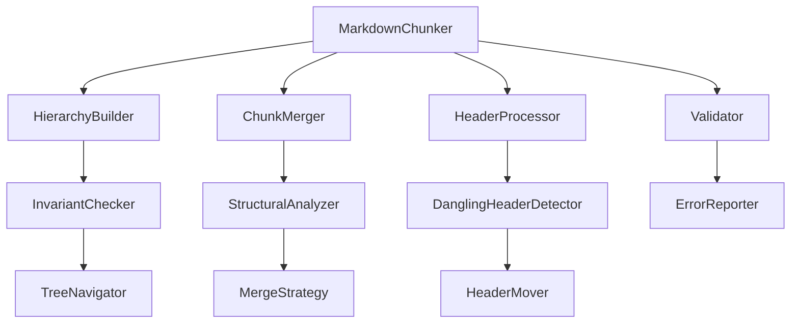

# Design Document

## Overview

This design addresses critical quality issues in the chunkana library's hierarchical chunking, chunk boundary detection, and micro-chunk handling. The improvements focus on maintaining tree invariants, preventing dangling headers, minimizing micro-chunks, and clarifying debug mode behavior while preserving backward compatibility.

## Architecture

The improvements will be implemented across several key components of the chunkana library:



### Component Responsibilities

- **HierarchyBuilder**: Enhanced with invariant checking and consistent tree construction
- **ChunkMerger**: New component for intelligent small chunk merging
- **HeaderProcessor**: New component for dangling header detection and prevention
- **InvariantChecker**: New component for validating tree invariants
- **ErrorReporter**: Enhanced error messages with actionable guidance

## Components and Interfaces

### Enhanced HierarchyBuilder

```python
class HierarchyBuilder:
    def __init__(self, 
                 include_document_summary: bool = True,
                 validate_invariants: bool = True,
                 strict_mode: bool = False):
        """
        Args:
            validate_invariants: Enable invariant checking during construction
            strict_mode: Raise exceptions on invariant violations vs. auto-fix
        """
    
    def build(self, chunks: list[Chunk], original_text: str) -> HierarchicalChunkingResult:
        """Enhanced with invariant validation."""
    
    def _validate_tree_invariants(self, chunks: list[Chunk]) -> None:
        """Validate all tree invariants after construction."""
```

### New ChunkMerger Component

```python
class ChunkMerger:
    def __init__(self, config: ChunkConfig):
        self.config = config
        self.structural_analyzer = StructuralAnalyzer()
    
    def merge_small_chunks(self, chunks: list[Chunk]) -> list[Chunk]:
        """Intelligently merge small chunks while preserving structure."""
    
    def _is_structurally_strong(self, chunk: Chunk) -> bool:
        """Enhanced structural strength detection."""
    
    def _find_merge_candidates(self, chunk: Chunk, chunks: list[Chunk]) -> list[Chunk]:
        """Find best merge candidates based on logical sections."""
```

### New HeaderProcessor Component

```python
class HeaderProcessor:
    def __init__(self, config: ChunkConfig):
        self.config = config
        self.detector = DanglingHeaderDetector()
    
    def prevent_dangling_headers(self, chunks: list[Chunk]) -> list[Chunk]:
        """Prevent headers from being separated from their content."""
    
    def _detect_dangling_headers(self, chunks: list[Chunk]) -> list[int]:
        """Identify chunks with dangling headers."""
    
    def _fix_dangling_header(self, chunks: list[Chunk], index: int) -> list[Chunk]:
        """Fix a specific dangling header situation."""
```

### Enhanced Validator

```python
class Validator:
    def __init__(self, config: ChunkConfig):
        self.config = config
        self.error_reporter = ErrorReporter()
    
    def validate_chunks(self, chunks: list[Chunk], original_text: str) -> ValidationResult:
        """Enhanced validation with detailed error reporting."""
    
    def validate_hierarchical_invariants(self, result: HierarchicalChunkingResult) -> ValidationResult:
        """Validate tree invariants with specific error messages."""
```

## Data Models

### Enhanced Chunk Metadata

New metadata fields for quality improvements:

```python
# Existing metadata fields remain unchanged for backward compatibility
chunk.metadata = {
    # ... existing fields ...
    
    # New fields for quality improvements
    "dangling_header_fixed": bool,  # Whether dangling header was corrected
    "merge_reason": str,  # Reason for merging (if applicable)
    "structural_strength": float,  # Structural strength score (0.0-1.0)
    "invariant_violations": list[str],  # Any invariant violations detected
    "debug_mode_active": bool,  # Whether chunk was affected by debug mode
}
```

### Enhanced ValidationResult

```python
@dataclass
class ValidationResult:
    is_valid: bool
    errors: list[ValidationError]
    warnings: list[ValidationWarning]
    performance_metrics: dict[str, float]
    
@dataclass
class ValidationError:
    error_type: str
    chunk_id: str | None
    message: str
    suggested_fix: str | None
    context: dict[str, Any]
```

## Correctness Properties

*A property is a characteristic or behavior that should hold true across all valid executions of a system-essentially, a formal statement about what the system should do. Properties serve as the bridge between human-readable specifications and machine-verifiable correctness guarantees.*

### Property Reflection

After analyzing the acceptance criteria, several properties can be combined for efficiency:
- Properties 1.1 and 1.2 can be combined into a single is_leaf consistency property
- Properties 2.1 and 2.2 can be combined into a comprehensive dangling header prevention property
- Properties 3.1, 3.2, and 3.3 can be combined into a comprehensive micro-chunk handling property
- Properties 7.1-7.4 can be combined into a performance preservation property

### Core Properties

**Property 1: Hierarchical Tree Invariants**
*For any* hierarchical chunking result, all chunks must satisfy tree invariants: is_leaf equals (children_ids is empty), parent-child relationships are bidirectional, and root chunks have consistent content ranges
**Validates: Requirements 1.1, 1.2, 1.3, 1.4, 1.5**

**Property 2: Dangling Header Prevention**
*For any* document with headers, no chunk should end with a header while the next chunk contains that header's content, and any header movements must preserve accurate header_path metadata
**Validates: Requirements 2.1, 2.2, 2.3, 2.4, 2.5**

**Property 3: Micro-Chunk Minimization**
*For any* chunking result, chunks smaller than min_chunk_size should either be merged with adjacent chunks in the same logical section or flagged as small_chunk only if they lack structural strength
**Validates: Requirements 3.1, 3.2, 3.3, 3.4, 3.5**

**Property 4: Debug Mode Consistency**
*For any* debug mode configuration, hierarchical mode with debug=True returns all chunks, debug=False returns only leaf chunks, and the behavior is consistent across document types
**Validates: Requirements 4.1, 4.2**

**Property 5: API Backward Compatibility**
*For any* existing public API method, the method signature and basic behavior must remain unchanged after quality improvements
**Validates: Requirements 5.1, 5.3, 5.4**

**Property 6: Performance Preservation**
*For any* document processing, quality improvements must not increase processing time by more than 20% and must use efficient algorithms to avoid quadratic complexity
**Validates: Requirements 7.1, 7.2, 7.3, 7.4**

**Property 7: Enhanced Error Reporting**
*For any* error condition, error messages must specify the specific problem, affected chunks, and include actionable suggestions for resolution
**Validates: Requirements 8.1, 8.2, 8.3, 8.4, 8.5**

## Error Handling

### Hierarchical Invariant Violations

```python
class HierarchicalInvariantError(Exception):
    def __init__(self, chunk_id: str, invariant: str, details: dict):
        self.chunk_id = chunk_id
        self.invariant = invariant
        self.details = details
        super().__init__(self._format_message())
    
    def _format_message(self) -> str:
        return f"Hierarchical invariant '{self.invariant}' violated in chunk {self.chunk_id}. {self._get_suggestion()}"
```

### Graceful Degradation

- **Invariant violations**: Auto-fix when possible, warn when not
- **Dangling headers**: Always attempt to fix, log when size constraints prevent optimal solution
- **Micro-chunks**: Flag rather than fail when merging is impossible
- **Performance issues**: Provide configuration options to disable expensive checks

## Testing Strategy

### Property-Based Testing

All correctness properties will be implemented using property-based testing with Hypothesis:

```python
@given(markdown_document())
def test_hierarchical_invariants(document):
    """Property 1: Hierarchical Tree Invariants"""
    chunker = MarkdownChunker()
    result = chunker.chunk_hierarchical(document)
    
    # Test all tree invariants
    for chunk in result.chunks:
        chunk_id = chunk.metadata["chunk_id"]
        children_ids = chunk.metadata.get("children_ids", [])
        is_leaf = chunk.metadata.get("is_leaf", True)
        
        # is_leaf consistency
        assert is_leaf == (len(children_ids) == 0)
        
        # Parent-child bidirectionality
        for child_id in children_ids:
            child = result.get_chunk(child_id)
            assert child is not None
            assert child.metadata.get("parent_id") == chunk_id
```

### Unit Testing

Specific test cases for edge conditions and error scenarios:

```python
def test_dangling_header_detection():
    """Test detection of dangling headers"""
    markdown = """
# Section 1

Some content here.

#### Subsection Details
"""
    # Configure to create dangling header situation
    config = ChunkConfig(max_chunk_size=50)  # Force small chunks
    chunker = MarkdownChunker(config)
    chunks = chunker.chunk(markdown)
    
    # Verify no chunk ends with header while next starts with content
    for i in range(len(chunks) - 1):
        current_content = chunks[i].content.strip()
        next_content = chunks[i + 1].content.strip()
        
        # Check if current ends with header
        if current_content.endswith("#### Subsection Details"):
            # Next chunk should not start with content belonging to this header
            assert not next_content.startswith("Some related content")
```

### Integration Testing

End-to-end testing with real-world documents to ensure quality improvements work together:

```python
def test_quality_improvements_integration():
    """Test that all quality improvements work together"""
    # Use the problematic document from the test report
    markdown = load_test_document("sde_criteria.md")
    
    config = ChunkConfig(max_chunk_size=1000, chunk_overlap=200)
    chunker = MarkdownChunker(config)
    
    # Test hierarchical mode
    result = chunker.chunk_hierarchical(markdown)
    
    # Verify no invariant violations
    validator = Validator(config)
    validation_result = validator.validate_hierarchical_invariants(result)
    assert validation_result.is_valid
    
    # Verify no dangling headers
    chunks = result.get_flat_chunks()
    assert not has_dangling_headers(chunks)
    
    # Verify minimal micro-chunks
    micro_chunks = [c for c in chunks if c.size < config.min_chunk_size and c.metadata.get("small_chunk")]
    assert len(micro_chunks) < len(chunks) * 0.1  # Less than 10% micro-chunks
```

### Performance Testing

Automated performance regression detection:

```python
@pytest.mark.performance
def test_performance_preservation():
    """Ensure quality improvements don't significantly impact performance"""
    documents = load_performance_test_documents()
    
    for doc in documents:
        # Measure baseline performance (without improvements)
        start_time = time.time()
        baseline_chunks = baseline_chunker.chunk(doc)
        baseline_time = time.time() - start_time
        
        # Measure improved performance
        start_time = time.time()
        improved_chunks = improved_chunker.chunk(doc)
        improved_time = time.time() - start_time
        
        # Verify performance degradation is within acceptable limits
        performance_ratio = improved_time / baseline_time
        assert performance_ratio <= 1.2  # No more than 20% slower
```

## Implementation Plan

### Phase 1: Hierarchical Invariant Fixes (P0)
1. Enhance `HierarchyBuilder` with invariant checking
2. Fix `is_leaf` calculation logic
3. Ensure parent-child bidirectionality
4. Add comprehensive error reporting
5. Implement property-based tests

### Phase 2: Dangling Header Prevention (P1)
1. Create `HeaderProcessor` component
2. Implement dangling header detection
3. Add header movement and merging logic
4. Preserve `header_path` metadata accuracy
5. Add unit and integration tests

### Phase 3: Micro-Chunk Minimization (P2)
1. Enhance `ChunkMerger` component
2. Improve structural strength analysis
3. Implement intelligent merge candidate selection
4. Add small chunk flagging logic
5. Add comprehensive test coverage

### Phase 4: Debug Mode Clarification (P2)
1. Document debug mode behavior clearly
2. Ensure consistent behavior across modes
3. Add debug mode specific tests
4. Update API documentation

### Phase 5: Performance and Error Handling
1. Add performance monitoring
2. Implement enhanced error reporting
3. Add performance regression tests
4. Optimize critical paths if needed

Each phase will include:
- Implementation of core functionality
- Property-based and unit tests
- Performance impact assessment
- Documentation updates
- Backward compatibility verification