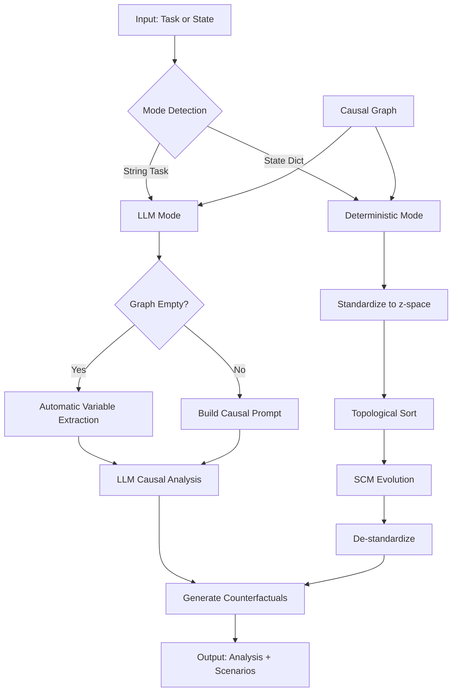

# CR-CA: Causal Reasoning and Counterfactual Analysis Framework

**Version**: v1.4.0  
**Repository**: [https://github.com/IlumCI/CR-CA](https://github.com/IlumCI/CR-CA)  
**License**: Apache-2.0

CR-CA is a comprehensive framework for causal reasoning and counterfactual analysis, combining structural causal models (SCMs) with large language model (LLM) integration. The framework enables sophisticated causal inference, automatic variable extraction from natural language, deterministic causal simulation, and comprehensive counterfactual scenario generation. Designed for both research and practical applications, CR-CA provides a modular architecture supporting specialized agents for quantitative trading, socioeconomic dynamics, and corporate governance.

---

## Quick Reference Tables

### Feature Matrix

| Feature | Core CRCAAgent | CRCA-SD | CRCA-CG | CRCA-Q |
|---------|----------------|---------|---------|--------|
| Automatic Variable Extraction | ✓ | ✓ | ✓ | ✓ |
| LLM-Based Causal Analysis | ✓ | ✓ | ✓ | ✓ |
| Deterministic Simulation | ✓ | ✓ | - | ✓ |
| Counterfactual Generation | ✓ | ✓ | ✓ | ✓ |
| Batch Prediction | ✓ | - | - | ✓ |
| Async Operations | ✓ | - | - | ✓ |
| Optimization Methods | ✓ | ✓ | - | ✓ |
| Time-Series Analysis | ✓ | - | - | ✓ |
| Bayesian Inference | ✓ | - | - | ✓ |
| Data Source Integration | - | - | - | ✓ |

### Module Overview

| Module | Purpose | Key Components |
|--------|---------|----------------|
| `CRCA.py` | Core causal reasoning agent | CRCAAgent, automatic extraction, dual-mode operation |
| `utils/` | Utility functions and extensions | Formatter, TUI, router, conversation management |
| `tools/` | External tool integration | MCP client utilities, protocol handling |
| `templates/` | Agent creation framework | Base agents, feature mixins, module registry |
| `schemas/` | Type definitions | MCP schemas, data structures |
| `crca_sd/` | Socioeconomic dynamics | MPC solver, governance, real-time monitoring |
| `crca_cg/` | Corporate governance | CorporateSwarm, ESG scoring, multi-agent orchestration |
| `branches/CRCA-Q.py` | Quantitative trading | QuantTradingAgent, causal signals, portfolio optimization |

### Dependency Matrix

| Dependency | Core | Advanced Analysis | CRCA-SD | CRCA-CG | CRCA-Q |
|------------|------|-------------------|---------|---------|--------|
| numpy | ✓ | ✓ | ✓ | ✓ | ✓ |
| rustworkx | ✓ | ✓ | ✓ | ✓ | ✓ |
| swarms | ✓ | ✓ | ✓ | ✓ | ✓ |
| litellm | ✓ | ✓ | ✓ | ✓ | ✓ |
| pandas | - | ✓ | ✓ | ✓ | ✓ |
| scipy | - | ✓ | ✓ | - | ✓ |
| loguru | ✓ | ✓ | ✓ | ✓ | ✓ |
| pydantic | ✓ | ✓ | ✓ | ✓ | ✓ |
| mcp | ✓ | ✓ | - | - | - |
| openai | ✓ | ✓ | - | - | - |
| ccxt | - | - | - | - | ✓ |
| web3 | - | - | - | - | ✓ |
| curses | - | - | ✓ | - | - |

---

## Table of Contents

1. [Installation & Setup](#installation--setup)
2. [Core CRCAAgent](#core-crcaagent)
3. [Automatic Variable Extraction](#automatic-variable-extraction)
4. [Module Documentation](#module-documentation)
   - [Utils Module](#utils-module)
   - [Tools Module](#tools-module)
   - [Templates Module](#templates-module)
   - [Schemas Module](#schemas-module)
   - [CRCA-SD Module](#crca-sd-module)
   - [CRCA-CG Module](#crca-cg-module)
5. [Policy Engine System](#policy-engine-system)
6. [Branch Integrations](#branch-integrations)
   - [CRCA-Q Integration](#crca-q-integration)
   - [CRCA-SD Integration](#crca-sd-integration)
   - [CRCA-CG Integration](#crca-cg-integration)
7. [Usage Examples](#usage-examples)
8. [Advanced Features](#advanced-features)
9. [Testing](#testing)
10. [CI/CD Workflows](#cicd-workflows)
11. [Project Structure](#project-structure)
12. [Architecture Diagrams](#architecture-diagrams)
13. [Integration Examples](#integration-examples)
14. [API Reference](#api-reference)
15. [Architecture & Design](#architecture--design)
16. [Research & Theory](#research--theory)
17. [Configuration & Customization](#configuration--customization)
18. [Troubleshooting](#troubleshooting)
19. [Contributing](#contributing)
20. [Changelog](#changelog)
21. [References & Resources](#references--resources)
22. [Bolt.diy Web Application (WIP)](#boltdiy-web-application-wip)

---

## Installation & Setup

### Prerequisites

- Python 3.10 or higher
- pip package manager
- (Optional) Git for cloning the repository
- (Optional) Docker for containerized deployment

### Quick Install

**Method 1: From PyPI (Recommended)**

```bash
pip install crca
```

**Method 2: From Source**

Clone the repository:

```bash
git clone https://github.com/IlumCI/CR-CA.git
cd CR-CA
```

Install dependencies:

```bash
pip install -r requirements.txt
```

**Method 3: Development Install**

For development with editable install:

```bash
git clone https://github.com/IlumCI/CR-CA.git
cd CR-CA
pip install -e ".[dev]"
```

### Optional Dependencies

**For Policy Engine:**

```bash
# Install policy engine dependencies
pip install cvxpy ruptures psutil

# Or install all optional dependencies
pip install crca[policy-engine]
```

**For CRCA-SD:**

```bash
# CRCA-SD dependencies are included in requirements.txt
# Additional dependencies may be needed for specific features
```

**For CRCA-CG:**

```bash
# Install TUI dependencies (optional)
pip install rich

# Or install all optional dependencies
pip install crca[tui]
```

**For CRCA-Q:**

```bash
# Install trading dependencies
pip install ccxt web3

# Or install all optional dependencies
pip install crca[trading]
```

### Environment Variables

Create a `.env` file in the project root with required API keys:

```bash
# Required for LLM functionality
OPENAI_API_KEY=your_openai_api_key_here

# Optional: For CRCA-Q trading
KRAKEN_API_KEY=your_kraken_key_here
KRAKEN_API_SECRET=your_kraken_secret_here

# Optional: For alternative data sources
TWITTER_BEARER_TOKEN=your_twitter_token_here
ETHERSCAN_API_KEY=your_etherscan_key_here
THEGRAPH_API_KEY=your_thegraph_key_here

# Optional: For MCP servers
MCP_SERVER_URL=http://localhost:8000
MCP_API_KEY=your_mcp_api_key_here
```

### Docker Setup (Optional)

**Example: Dockerfile for Policy Engine**

```dockerfile
FROM python:3.11-slim

WORKDIR /app

# Install system dependencies
RUN apt-get update && apt-get install -y \
    gcc \
    g++ \
    && rm -rf /var/lib/apt/lists/*

# Copy requirements
COPY requirements.txt .
RUN pip install --no-cache-dir -r requirements.txt

# Install policy engine dependencies
RUN pip install cvxpy ruptures psutil

# Copy application
COPY . .

# Set environment variables
ENV PYTHONUNBUFFERED=1

# Run application
CMD ["python", "-m", "CRCA"]
```

**Example: Docker Compose for Full Stack**

```yaml
version: '3.8'

services:
  crca:
    build: .
    environment:
      - OPENAI_API_KEY=${OPENAI_API_KEY}
    volumes:
      - ./policy_ledger.db:/app/policy_ledger.db
      - ./rollback.db:/app/rollback.db
    ports:
      - "8000:8000"
```

### Verification

**Example 1: Basic Verification**

```python
from dotenv import load_dotenv
from CRCA import CRCAAgent

load_dotenv()

agent = CRCAAgent(
    model_name="gpt-4o-mini",
    causal_edges=[("funding", "failure"), ("engineers", "failure"), ("project", "failure")],
    variables=["funding", "engineers", "project", "failure", "success"],
    max_loops=3,
    agent_max_loops=3,
    use_crca_tools=True,
    enable_batch_predict=True,
)

task = "Why do large software projects collapse despite adequate funding?"
result = agent.run(task)
print(result.get("causal_analysis", ""))
```

**Example 2: Verify Policy Engine**

```python
from schemas.policy import DoctrineV1, EpochConfig, MetricSpec, Objective, RiskBudget
from utils.ledger import Ledger

# Create minimal doctrine
doctrine = DoctrineV1(
    epoch=EpochConfig(unit="hours", length=1.0),
    metrics={"test": MetricSpec(extractor_key="test", unit="unit")},
    objectives=[Objective(metric_name="test", direction="minimize", weight=1.0)],
    invariants=[],
    levers={},
    risk_budget=RiskBudget()
)

# Test ledger
ledger = Ledger(db_path=":memory:")
print("Policy engine components verified!")
```

**Example 3: Verify All Modules**

```python
# Test core
from CRCA import CRCAAgent
agent = CRCAAgent(model_name="gpt-4o-mini")
print("✓ Core CRCA verified")

# Test CRCA-SD
try:
    from crca_sd import StateVector
    print("✓ CRCA-SD verified")
except ImportError:
    print("✗ CRCA-SD not available")

# Test CRCA-CG
try:
    from crca_cg.corposwarm import CorporateSwarm
    print("✓ CRCA-CG verified")
except ImportError:
    print("✗ CRCA-CG not available")

# Test Policy Engine
from schemas.policy import DoctrineV1
from utils.ledger import Ledger
print("✓ Policy Engine verified")
```

---

## Core CRCAAgent

### Introduction

CRCAAgent is the core component of the CR-CA framework, providing a lightweight causal reasoning engine with LLM integration. It implements structural causal models (SCMs) based on Judea Pearl's causal hierarchy, enabling both LLM-based causal analysis and deterministic causal simulation.

### Key Features

- **Automatic Variable Extraction**: Extract variables and causal relationships directly from natural language tasks without manual declaration
- **LLM-Based Causal Reasoning**: Sophisticated multi-loop causal analysis using large language models
- **Deterministic Causal Simulation**: Fast, deterministic state evolution using linear/non-linear SCMs
- **Dual-Mode Operation**: Automatically selects LLM mode (task string) or deterministic mode (state dict)
- **Batch Prediction**: Efficient vectorized predictions for ensemble forecasting
- **Async/Await Support**: Non-blocking operations for concurrent analysis
- **Advanced Analysis Methods**: Optimization, time-series analysis, Bayesian inference, root cause analysis

### Architecture



### Automatic Variable Extraction

One of the most powerful features introduced in v1.3.0 is automatic variable extraction. When a task is provided without pre-declared variables, CRCAAgent automatically:

1. **Analyzes the task** using LLM-based natural language understanding
2. **Extracts relevant variables** from the task description
3. **Identifies causal relationships** between variables
4. **Builds the causal graph** automatically
5. **Proceeds with causal analysis** using the extracted graph

This eliminates the need to manually declare variables and edges for most use cases, making the framework significantly more accessible.

**How it works:**

- When `run(task)` is called with a string task and the causal graph is empty, the agent triggers automatic extraction
- The LLM analyzes the task and generates structured JSON with variables and edges
- The extraction handler programmatically adds variables and relationships to the graph
- Subsequent analysis uses the automatically constructed graph

**Example:**

```python
from CRCA import CRCAAgent

# No variables declared - automatic extraction will occur
agent = CRCAAgent(model_name="gpt-4o-mini")

# Task automatically triggers variable extraction
task = "Analyze how increasing product price affects demand and revenue"
result = agent.run(task=task)

# Variables and edges were automatically extracted and used
print(f"Extracted {len(agent.get_nodes())} variables")
print(f"Created {len(agent.get_edges())} causal relationships")
```

### Basic Usage

#### LLM-Based Causal Analysis (Automatic Extraction)

```python
from CRCA import CRCAAgent

agent = CRCAAgent(
    model_name="gpt-4o",
    max_loops=3,
    agent_max_loops=3
)

# Automatic variable extraction + causal analysis
task = "Why do software projects fail despite adequate funding?"
result = agent.run(task=task)

print(result["causal_analysis"])
for scenario in result["counterfactual_scenarios"][:3]:
    print(f"{scenario.name}: {scenario.reasoning}")
```

#### Deterministic Simulation (Traditional Approach)

```python
from CRCA import CRCAAgent

agent = CRCAAgent(variables=["price", "demand", "inventory"])
agent.add_causal_relationship("price", "demand", strength=-0.5)
agent.add_causal_relationship("demand", "inventory", strength=-0.2)

state = {"price": 100.0, "demand": 1000.0, "inventory": 5000.0}
result = agent.run(initial_state=state, max_steps=2)

print(result["evolved_state"])
for scenario in result["counterfactual_scenarios"][:3]:
    print(f"{scenario.name}: {scenario.probability:.2f}")
```

#### Hybrid Approach (LLM Extraction + Deterministic Simulation)

```python
from CRCA import CRCAAgent

agent = CRCAAgent(model_name="gpt-4o-mini")

# Step 1: Automatic extraction via LLM
task = "Analyze pricing strategy for a new product"
extraction_result = agent.run(task=task)

# Step 2: Use extracted graph for deterministic simulation
initial_state = {var: 0.0 for var in agent.get_nodes()}
simulation_result = agent.run(initial_state=initial_state, max_steps=5)

print(f"Simulated {len(simulation_result['counterfactual_scenarios'])} scenarios")
```

### Advanced Features

#### Batch Prediction

```python
agent = CRCAAgent(
    variables=["price", "demand"],
    enable_batch_predict=True,
    max_batch_size=32
)

factual_states = [{"price": 100.0, "demand": 1000.0} for _ in range(100)]
interventions_list = [{"price": 100.0 + i} for i in range(100)]

predictions = agent._predict_outcomes_batch(factual_states, interventions_list)
```

#### Async Operations

```python
import asyncio

async def analyze_async():
    agent = CRCAAgent(variables=["x", "y"])
    result = await agent.run_async(
        initial_state={"x": 1.0, "y": 2.0},
        max_steps=3
    )
    return result

result = asyncio.run(analyze_async())
```

#### Optimization Methods

```python
agent = CRCAAgent(variables=["price", "demand", "revenue"])
agent.add_causal_relationship("price", "demand", strength=-0.5)
agent.add_causal_relationship("price", "revenue", strength=1.0)
agent.add_causal_relationship("demand", "revenue", strength=0.8)

initial_state = {"price": 100.0, "demand": 1000.0, "revenue": 100000.0}

# Gradient-based optimization
opt_result = agent.gradient_based_intervention_optimization(
    initial_state=initial_state,
    target="revenue",
    intervention_vars=["price"],
    constraints={"price": (80.0, 120.0)}
)

print(f"Optimal price: {opt_result['optimal_intervention']['price']}")
print(f"Optimal revenue: {opt_result['optimal_target_value']}")
```

---

## Module Documentation

### Utils Module

The `utils/` module provides essential utilities and extensions for the CR-CA framework.

#### Formatter (`utils/formatter.py`)

Provides markdown output formatting and rich text rendering:

```python
from utils.formatter import Formatter

formatter = Formatter(md=True)
formatter.print_markdown(analysis_text, title="Causal Analysis")
```

#### Agent Types (`utils/Agent_types.py`)

Type definitions for agent-related structures.

#### Conversation (`utils/conversation.py`)

Manages conversation history and message handling for agent interactions.

#### Agent Extensions (`utils/agent.py`)

Extended agent functionality building on the Swarms Agent base class, including streaming output, error handling, and tool management.

#### TUI (`utils/tui.py`)

Terminal user interface components for interactive agent interactions, including CorporateSwarmTUI for multi-agent orchestration.

#### Router (`utils/router.py`)

Task routing and distribution system for multi-agent workflows. Supports multiple swarm architectures including sequential, concurrent, hierarchical, and collaborative patterns.

**Example 1: Sequential Workflow**

```python
from utils.router import SwarmRouter, SwarmRouterConfig

# Create sequential workflow router
config = SwarmRouterConfig(
    name="sequential-processor",
    description="Process tasks sequentially",
    swarm_type="SequentialWorkflow",
    task="Process data pipeline: extract, transform, load"
)

router = SwarmRouter(config=config)
result = router.run()

print(f"Sequential workflow completed: {result}")
```

**Example 2: Concurrent Workflow**

```python
from utils.router import SwarmRouter, SwarmRouterConfig

# Create concurrent workflow for parallel processing
config = SwarmRouterConfig(
    name="parallel-processor",
    description="Process multiple tasks in parallel",
    swarm_type="ConcurrentWorkflow",
    task="Analyze multiple datasets concurrently"
)

router = SwarmRouter(config=config)
result = router.run()

print(f"Concurrent workflow completed: {result}")
```

**Example 3: Hierarchical Swarm**

```python
from utils.router import SwarmRouter, SwarmRouterConfig

# Create hierarchical swarm for complex task decomposition
config = SwarmRouterConfig(
    name="hierarchical-manager",
    description="Decompose complex tasks hierarchically",
    swarm_type="HierarchicalSwarm",
    task="Manage multi-level project with dependencies"
)

router = SwarmRouter(config=config)
result = router.run()

print(f"Hierarchical swarm completed: {result}")
```

**Example 4: Collaborative Group Chat**

```python
from utils.router import SwarmRouter, SwarmRouterConfig

# Create collaborative swarm for group discussion
config = SwarmRouterConfig(
    name="collaborative-team",
    description="Collaborative problem solving",
    swarm_type="GroupChat",
    multi_agent_collab_prompt=True,
    task="Design a new feature through team discussion"
)

router = SwarmRouter(config=config)
result = router.run()

print(f"Collaborative discussion completed: {result}")
```

**Example 5: Auto Swarm Selection**

```python
from utils.router import SwarmRouter, SwarmRouterConfig

# Let router automatically select best swarm type
config = SwarmRouterConfig(
    name="auto-router",
    description="Automatic swarm selection",
    swarm_type="auto",  # Automatic selection
    task="Complex task requiring intelligent routing"
)

router = SwarmRouter(config=config)
result = router.run()

print(f"Auto-selected swarm type: {router.selected_swarm_type}")
print(f"Result: {result}")
```

#### HHCS (`utils/HHCS.py`)

Hybrid Hierarchical-Cluster Swarm implementation for intelligent task routing with hierarchical decision-making.

**Example 6: Basic HHCS Setup**

```python
from utils.HHCS import HybridHierarchicalClusterSwarm
from swarms.structs.agent import Agent

# Create agents for different roles
analyst = Agent(agent_name="analyst", model_name="gpt-4o-mini")
researcher = Agent(agent_name="researcher", model_name="gpt-4o-mini")
writer = Agent(agent_name="writer", model_name="gpt-4o-mini")

# Create HHCS with agents
hhcs = HybridHierarchicalClusterSwarm(
    agents=[analyst, researcher, writer],
    task="Research and write a comprehensive report on causal inference"
)

# Run HHCS
result = hhcs.run()

print(f"HHCS completed: {result}")
```

**Example 7: HHCS with Custom Router**

```python
from utils.HHCS import HybridHierarchicalClusterSwarm
from swarms.structs.agent import Agent

# Create specialized agents
agents = [
    Agent(agent_name="data_analyst", model_name="gpt-4o-mini"),
    Agent(agent_name="domain_expert", model_name="gpt-4o-mini"),
    Agent(agent_name="technical_writer", model_name="gpt-4o-mini")
]

# Create HHCS with custom routing
hhcs = HybridHierarchicalClusterSwarm(
    agents=agents,
    task="Analyze market trends and create investment strategy"
)

result = hhcs.run()
print(f"Task routed to: {hhcs.selected_agent}")
print(f"Result: {result}")
```

#### AOP (`utils/aop.py`)

Agent Orchestration Platform with task queue and MCP server deployment for multi-agent coordination.

**Example 8: Task Queue Management**

```python
from utils.aop import TaskQueue, Task
from swarms.structs.agent import Agent

# Create agent
agent = Agent(agent_name="worker", model_name="gpt-4o-mini")

# Create task queue
queue = TaskQueue(
    agent_name="worker",
    agent=agent,
    max_workers=3,  # 3 parallel workers
    max_queue_size=100
)

# Start workers
queue.start_workers()

# Add tasks
task1 = Task(task="Analyze dataset A", priority=10)
task2 = Task(task="Analyze dataset B", priority=5)
task3 = Task(task="Generate report", priority=8)

queue.add_task(task1)
queue.add_task(task2)
queue.add_task(task3)

# Get task status
task = queue.get_task(task1.task_id)
print(f"Task status: {task.status}")

# Get queue statistics
stats = queue.get_stats()
print(f"Total tasks: {stats.total_tasks}")
print(f"Completed: {stats.completed_tasks}")
print(f"Pending: {stats.pending_tasks}")

# Stop workers when done
queue.stop_workers()
```

**Example 9: MCP Server Deployment**

```python
from utils.aop import AOP, AgentToolConfig
from swarms.structs.agent import Agent

# Create agents
agent1 = Agent(agent_name="analyst", model_name="gpt-4o-mini")
agent2 = Agent(agent_name="researcher", model_name="gpt-4o-mini")

# Configure agent tools
configs = [
    AgentToolConfig(
        agent=agent1,
        tool_name="analyze_data",
        description="Analyze datasets and extract insights"
    ),
    AgentToolConfig(
        agent=agent2,
        tool_name="research_topic",
        description="Research topics and gather information"
    )
]

# Create AOP and deploy as MCP server
aop = AOP(agent_configs=configs)

# Start MCP server
aop.start_mcp_server(port=8000)

print("MCP server started on port 8000")
print(f"Available tools: {aop.get_available_tools()}")
```

**Example 10: AOP with Task Queue and MCP**

```python
from utils.aop import AOP, TaskQueue, AgentToolConfig
from swarms.structs.agent import Agent

# Create agents
agents = [
    Agent(agent_name="worker1", model_name="gpt-4o-mini"),
    Agent(agent_name="worker2", model_name="gpt-4o-mini")
]

# Configure AOP
configs = [
    AgentToolConfig(agent=agents[0], tool_name="process_task"),
    AgentToolConfig(agent=agents[1], tool_name="analyze_data")
]

aop = AOP(agent_configs=configs)

# Deploy as MCP server
aop.start_mcp_server(port=8000)

# Create task queues for each agent
for agent in agents:
    queue = TaskQueue(agent_name=agent.agent_name, agent=agent, max_workers=2)
    queue.start_workers()
    
    # Add tasks
    queue.add_task(Task(task=f"Task for {agent.agent_name}", priority=5))
```

#### Ledger (`utils/ledger.py`)

Event-sourced append-only SQLite ledger for audit trail. See Policy Engine examples above for detailed usage.

**Example 11: Ledger Event Recording**

```python
from utils.ledger import Ledger
from schemas.policy import ObservationEvent, DecisionEvent

ledger = Ledger(db_path="audit_ledger.db")

# Record observation
obs = ObservationEvent(epoch=1, metrics={"cpu": 75.0, "memory": 60.0})
event_id = ledger.append(obs)

# Record decision
dec = DecisionEvent(
    epoch=1,
    interventions=[{"lever_id": "throttle", "params": {"value": 5}}],
    rationale="CPU high, throttling",
    decision_hash="abc123"
)
event_id = ledger.append(dec)

# Query events
events = ledger.get_events_by_epoch(epoch=1)
print(f"Found {len(events)} events in epoch 1")
```

#### Rollback (`utils/rollback.py`)

Rollback system for intervention recovery. See Policy Engine examples above for detailed usage.

**Example 12: Checkpoint and Rollback**

```python
from utils.rollback import RollbackManager

rollback = RollbackManager(db_path="rollback.db")

# Create checkpoint
checkpoint_id = rollback.create_checkpoint(epoch=1, state={"value": 100})

# Execute intervention
# ... intervention code ...

# Rollback if needed
rollback.rollback_n_steps(epoch=1, n_steps=1)
restored = rollback.restore_checkpoint(checkpoint_id)
```

#### Canonical (`utils/canonical.py`)

Canonicalization utilities for deterministic hashing. See Policy Engine examples above for detailed usage.

**Example 13: Stable Hashing**

```python
from utils.canonical import stable_hash

obj = {"a": 1, "b": 2, "c": 3}
hash_value = stable_hash(obj)
print(f"Stable hash: {hash_value}")
```

#### AnyToStr (`utils/AnyToStr.py`)

Type conversion utilities for converting various types to strings.

**Example 14: Type Conversion**

```python
from utils.AnyToStr import any_to_str

# Convert various types to string
result1 = any_to_str(123)
result2 = any_to_str([1, 2, 3])
result3 = any_to_str({"key": "value"})

print(f"Int to string: {result1}")
print(f"List to string: {result2}")
print(f"Dict to string: {result3}")
```

#### Out Types (`utils/out_types.py`)

Output type definitions for history and conversation formatting.

**Example 15: Output Type Usage**

```python
from utils.out_types import OutputType, HistoryOutputType

# Define output format
output_format: OutputType = "json"  # or "dict", "string", "yaml", etc.

# Use in conversation formatting
from utils.conversation import Conversation

conv = Conversation()
history = conv.get_history(output_type=output_format)
```

### Tools Module

#### MCP Client Utils (`tools/mcpClientUtils.py`)

Model Context Protocol (MCP) integration for connecting to MCP servers and executing tools:

- **Connection Management**: Establish and manage MCP server connections
- **Tool Execution**: Execute tools via MCP protocol
- **Protocol Handling**: Transform MCP tools to OpenAI-compatible format
- **Error Handling**: Comprehensive error handling for MCP operations

**Example 1: Basic MCP Connection**

```python
from tools.mcpClientUtils import connect_to_mcp_server, execute_mcp_tool

# Connection configuration
connection_config = {
    "server_url": "http://localhost:8000",
    "api_key": "your_api_key"
}

# Connect to MCP server
session = await connect_to_mcp_server(connection_config)

# Execute tool
result = await execute_mcp_tool(
    session=session,
    tool_name="analyze_data",
    parameters={"dataset": "sales_data.csv"}
)

print(f"Tool execution result: {result}")
```

**Example 2: Transform MCP Tools to OpenAI Format**

```python
from tools.mcpClientUtils import transform_mcp_tool_to_openai_tool

# MCP tool schema
mcp_tool = {
    "name": "process_file",
    "description": "Process a file",
    "parameters": {
        "type": "object",
        "properties": {
            "file_path": {"type": "string"},
            "operation": {"type": "string"}
        }
    }
}

# Transform to OpenAI format
openai_tool = transform_mcp_tool_to_openai_tool(mcp_tool)

print(f"OpenAI tool format: {openai_tool}")
```

**Example 3: Error Handling in MCP Operations**

```python
from tools.mcpClientUtils import connect_to_mcp_server, execute_mcp_tool
from loguru import logger

try:
    session = await connect_to_mcp_server(connection_config)
    result = await execute_mcp_tool(session, "tool_name", {})
except ConnectionError as e:
    logger.error(f"MCP connection failed: {e}")
except Exception as e:
    logger.error(f"Tool execution failed: {e}")
```

#### Actuators (`tools/actuators.py`)

Actuator interfaces for executing interventions on system controls, cloud resources, and services. See Policy Engine examples above for detailed usage.

**Example 4: System Control Actuator**

```python
from tools.actuators import SystemControlActuator
from schemas.policy import InterventionSpec

actuator = SystemControlActuator(require_root=False)

# CPU throttling intervention
intervention = InterventionSpec(
    lever_id="cpu_throttle",
    parameters={"nice_value": 10, "pid": 12345}
)

result = actuator.execute([intervention])
print(f"Intervention result: {result}")
```

**Example 5: Custom Actuator Implementation**

```python
from tools.actuators import BaseActuator
from schemas.policy import InterventionSpec
from typing import List, Dict, Any

class CloudResourceActuator(BaseActuator):
    """Actuator for cloud resource management."""
    
    def execute(self, interventions: List[InterventionSpec]) -> Dict[str, Any]:
        """Execute cloud resource interventions."""
        results = []
        
        for intervention in interventions:
            if intervention.lever_id == "scale_instance":
                instance_id = intervention.parameters["instance_id"]
                instance_type = intervention.parameters["instance_type"]
                
                # Scale cloud instance (pseudo-code)
                result = self._scale_instance(instance_id, instance_type)
                results.append({"intervention": intervention.model_dump(), "result": result})
        
        return {"executed": len(results), "results": results}
    
    def _scale_instance(self, instance_id: str, instance_type: str) -> Dict[str, Any]:
        """Scale cloud instance."""
        # Implementation would call cloud API
        return {"status": "success", "instance_id": instance_id, "type": instance_type}

# Use custom actuator
actuator = CloudResourceActuator()
intervention = InterventionSpec(
    lever_id="scale_instance",
    parameters={"instance_id": "i-12345", "instance_type": "t3.large"}
)
result = actuator.execute([intervention])
```

#### Sensors (`tools/sensors.py`)

Sensor interfaces for reading system metrics, cloud resources, and custom metrics. See Policy Engine examples above for detailed usage.

**Example 6: System Metrics Sensor**

```python
from tools.sensors import SystemMetricsSensor

sensor = SystemMetricsSensor()
snapshot = sensor.read()

print(f"CPU: {snapshot['cpu_percent']:.1f}%")
print(f"Memory: {snapshot['memory_percent']:.1f}%")
```

**Example 7: Custom Sensor with Registry**

```python
from tools.sensors import BaseSensor, SensorRegistry
from typing import Dict

class ApplicationMetricsSensor(BaseSensor):
    """Sensor for application-specific metrics."""
    
    def read(self) -> Dict[str, float]:
        """Read application metrics."""
        # Read from application monitoring endpoint
        return {
            "request_rate": 150.0,
            "error_rate": 2.5,
            "response_time": 95.0
        }

# Register sensor
registry = SensorRegistry()
registry.register("app_metrics", ApplicationMetricsSensor())

# Use registered sensor
sensor = registry.get_sensor("app_metrics")
snapshot = sensor.read()
```

#### Code Generator (`tools/code_generator.py`)

Code generation tools with LLM and ML integration for generating, analyzing, and optimizing code.

**Example 8: Basic Code Generation**

```python
from tools.code_generator import LLMCodeGenerator
from swarms.structs.agent import Agent

# Create agent for code generation
agent = Agent(agent_name="code_gen", model_name="gpt-4o-mini")

# Initialize code generator
generator = LLMCodeGenerator(agent=agent)

# Generate code from specification
specification = "Create a Python function that calculates factorial recursively"
code = generator.generate(
    specification=specification,
    language="python"
)

print(f"Generated code:\n{code}")

# Validate generated code
validation = generator.validate(code, language="python")
print(f"Validation result: {validation}")
```

**Example 9: Language-Specific Code Generation**

```python
from tools.code_generator import LLMCodeGenerator

generator = LLMCodeGenerator(agent=agent)

# Generate JavaScript code
js_code = generator.generate(
    specification="Create a React component for a todo list",
    language="javascript"
)

# Generate Python code
python_code = generator.generate(
    specification="Create a data processing pipeline",
    language="python"
)

# Generate TypeScript code
ts_code = generator.generate(
    specification="Create a type-safe API client",
    language="typescript"
)
```

**Example 10: Code Optimization with ML**

```python
from tools.code_generator import MLCodeOptimizer

# Initialize ML-based optimizer
optimizer = MLCodeOptimizer()

# Optimize code
original_code = """
def factorial(n):
    if n <= 1:
        return 1
    return n * factorial(n - 1)
"""

optimized_code = optimizer.optimize(
    code=original_code,
    language="python",
    optimization_target="performance"
)

print(f"Optimized code:\n{optimized_code}")
```

#### Mandate Generator (`tools/mandate_generator.py`)

Convert CorporateProposal to bolt.diy execution mandate for autonomous code generation.

**Example 11: Proposal to Mandate Conversion**

```python
from tools.mandate_generator import proposal_to_mandate
from crca_cg.corposwarm import CorporateProposal, ProposalType

# Create corporate proposal
proposal = CorporateProposal(
    proposal_id="prop-001",
    title="Implement new feature",
    description="Add user authentication system",
    proposal_type=ProposalType.TECHNICAL,
    budget_impact=50000.0,
    risk_level=0.3
)

# Convert to execution mandate
mandate = proposal_to_mandate(
    proposal=proposal,
    mandate_id="mandate-001"
)

print(f"Mandate ID: {mandate['mandate_id']}")
print(f"Objectives: {mandate['objectives']}")
print(f"Budget: {mandate['budget']}")
print(f"Constraints: {mandate['constraints']}")
```

**Example 12: Complete Workflow with Mandate Generation**

```python
from tools.mandate_generator import proposal_to_mandate
from crca_cg.corposwarm import CorporateSwarm, CorporateProposal

# Create corporate swarm
swarm = CorporateSwarm()

# Create and submit proposal
proposal = swarm.create_proposal(
    title="Build API gateway",
    description="Implement microservices API gateway",
    proposal_type=ProposalType.TECHNICAL
)

# Vote on proposal
vote_result = swarm.board.vote_on_proposal(proposal)

if vote_result.passed:
    # Convert approved proposal to mandate
    mandate = proposal_to_mandate(
        proposal=proposal,
        corporate_swarm=swarm
    )
    
    # Execute mandate (would integrate with bolt.diy)
    print(f"Mandate created: {mandate['mandate_id']}")
    print(f"Ready for execution")
```

#### File Operations (`tools/file_operations.py`)

File manipulation tools with LLM integration for intelligent file operations.

**Example 13: Basic File Operations**

```python
from tools.file_operations import FileWriter, FileReader

# Write file
writer = FileWriter()
result = writer.execute(
    operation="write",
    file_path="output.txt",
    content="Hello, World!"
)

# Read file
reader = FileReader()
result = reader.execute(
    operation="read",
    file_path="output.txt"
)

print(f"File content: {result['content']}")
```

**Example 14: LLM-Powered File Operations**

```python
from tools.file_operations import LLMFileOperator
from swarms.structs.agent import Agent

agent = Agent(agent_name="file_ops", model_name="gpt-4o-mini")
operator = LLMFileOperator(agent=agent)

# Generate file content using LLM
result = operator.generate_file(
    specification="Create a Python class for handling user authentication",
    file_path="auth.py",
    language="python"
)

print(f"Generated file: {result['file_path']}")
print(f"Content length: {len(result['content'])} characters")
```

**Example 15: File Analysis and Optimization**

```python
from tools.file_operations import FileAnalyzer

analyzer = FileAnalyzer()

# Analyze file
analysis = analyzer.analyze_file(
    file_path="code.py",
    analysis_type="complexity"  # or "performance", "security", etc.
)

print(f"Complexity score: {analysis['complexity_score']}")
print(f"Issues found: {analysis['issues']}")
print(f"Suggestions: {analysis['suggestions']}")
```

### Templates Module

The templates module provides a framework for creating specialized agents with drag-and-drop feature composition.

#### Base Specialized Agent (`templates/base_specialized_agent.py`)

Base class for creating domain-specific agents with common initialization patterns and memory management.

#### Feature Mixins (`templates/feature_mixins.py`)

Modular feature components that can be mixed into agent classes:

- **GraphFeatureMixin**: Graph operations (nodes, edges, topological sort)
- **PredictionFeatureMixin**: Prediction methods and standardization
- **StatisticsFeatureMixin**: Statistical analysis and data fitting
- **LLMFeatureMixin**: LLM integration patterns
- **FullFeatureMixin**: All features combined

**Usage:**

```python
from templates.base_specialized_agent import BaseSpecializedAgent
from templates.feature_mixins import GraphFeatureMixin, PredictionFeatureMixin

class MyAgent(BaseSpecializedAgent, GraphFeatureMixin, PredictionFeatureMixin):
    def __init__(self, **kwargs):
        super().__init__(**kwargs)
        self.init_graph_feature(variables=["A", "B", "C"])
        self.init_prediction_feature(use_nonlinear=True)
```

#### Module Registry (`templates/module_registry.py`)

Feature composition system allowing dynamic agent creation:

```python
from templates.module_registry import compose_agent

agent = compose_agent(
    features=["graph", "prediction", "statistics"],
    variables=["x", "y", "z"]
)
```

#### Graph Management (`templates/graph_management.py`)

Graph operations including path finding, cycle detection, and topological sorting.

**Example 1: Graph Operations**

```python
from templates.graph_management import GraphManager

# Create graph manager
graph = GraphManager()
graph.add_node("A")
graph.add_node("B")
graph.add_node("C")
graph.add_edge("A", "B")
graph.add_edge("B", "C")

# Topological sort
topo_order = graph.topological_sort()
print(f"Topological order: {topo_order}")

# Find paths
paths = graph.find_paths("A", "C")
print(f"Paths from A to C: {paths}")

# Check for cycles
has_cycle = graph.has_cycle()
print(f"Has cycle: {has_cycle}")
```

#### Prediction Framework (`templates/prediction_framework.py`)

Prediction methods, standardization, and counterfactual generation patterns.

**Example 2: Prediction with Standardization**

```python
from templates.prediction_framework import PredictionMixin

class MyAgent(PredictionMixin):
    def __init__(self):
        self.init_prediction_feature(use_nonlinear=True)

agent = MyAgent()

# Standardize state
state = {"x": 100.0, "y": 200.0}
standardized = agent.standardize_state(state)

# Predict outcome
prediction = agent.predict_outcome(
    state=state,
    intervention={"x": 110.0}
)

print(f"Predicted outcome: {prediction}")
```

#### Statistical Methods (`templates/statistical_methods.py`)

Statistical analysis including data fitting, uncertainty quantification, and time-series methods.

**Example 3: Statistical Analysis**

```python
from templates.statistical_methods import StatisticsMixin
import numpy as np

class StatsAgent(StatisticsMixin):
    def __init__(self):
        self.init_statistics_feature()

agent = StatsAgent()

# Fit data to model
data = np.array([[1, 2], [2, 4], [3, 6], [4, 8]])
fitted_model = agent.fit_data(data, model_type="linear")

# Quantify uncertainty
uncertainty = agent.quantify_uncertainty(data, fitted_model)
print(f"Uncertainty: {uncertainty}")
```

#### LLM Integration (`templates/llm_integration.py`)

LLM integration patterns for schema definition, prompt building, and multi-loop reasoning.

**Example 4: LLM Integration**

```python
from templates.llm_integration import LLMFeatureMixin

class LLMAgent(LLMFeatureMixin):
    def __init__(self):
        self.init_llm_feature(model_name="gpt-4o-mini")

agent = LLMAgent()

# Build prompt
prompt = agent.build_prompt(
    task="Analyze causal relationships",
    context={"variables": ["A", "B", "C"]}
)

# Execute with multi-loop reasoning
result = agent.execute_with_loops(
    prompt=prompt,
    max_loops=3
)
```

#### Policy Loop Integration (`templates/policy_loop.py`)

Policy loop mixin for temporal policy execution. See Policy Engine examples above for detailed usage.

**Example 5: Policy Loop with Agent**

```python
from templates.policy_loop import PolicyLoopMixin
from schemas.policy import DoctrineV1
from utils.ledger import Ledger

class PolicyAgent(PolicyLoopMixin):
    def __init__(self, doctrine, ledger):
        super().__init__(doctrine, ledger, seed=42)

doctrine = DoctrineV1.from_json("doctrine.json")
ledger = Ledger(db_path="ledger.db")

agent = PolicyAgent(doctrine, ledger)
result = agent.run_epoch(epoch=1)
```

#### Drift Detection Integration (`templates/drift_detection.py`)

Drift detection for change-point detection. See Policy Engine examples above for detailed usage.

**Example 6: Drift Detection in Policy Loop**

```python
from templates.drift_detection import DriftDetector
from templates.policy_loop import PolicyLoopMixin

class DriftAwarePolicyAgent(PolicyLoopMixin):
    def __init__(self, doctrine, ledger):
        super().__init__(doctrine, ledger)
        self.drift_detector = DriftDetector(algorithm="pelt")
    
    def check_drift(self, metric_name: str, history: List[float]):
        """Check for drift in metric."""
        change_points, confidence = self.drift_detector.detect_changepoints(
            metric_name=metric_name,
            metric_history=history
        )
        return len(change_points) > 0

agent = DriftAwarePolicyAgent(doctrine, ledger)

# Check for drift
has_drift = agent.check_drift("cpu_usage", [50, 55, 60, 65, 70, 75])
if has_drift:
    print("WARNING: Drift detected!")
```

#### MPC Planner Integration (`templates/mpc_planner.py`)

MPC planner for multi-step optimization. See Policy Engine examples above for detailed usage.

**Example 7: MPC Planning in Policy Loop**

```python
from templates.mpc_planner import MPCPlanner
from templates.policy_loop import PolicyLoopMixin

class MPCPolicyAgent(PolicyLoopMixin):
    def __init__(self, doctrine, ledger):
        super().__init__(doctrine, ledger)
        self.mpc_planner = MPCPlanner(doctrine, horizon=5)
        self.use_mpc = True
    
    def plan_actions(self, epoch: int, state: Dict[str, float]):
        """Plan actions using MPC."""
        if self.use_mpc:
            interventions, score, rationale = self.mpc_planner.solve_mpc(...)
            return interventions
        else:
            return super().plan_actions(epoch, state)

agent = MPCPolicyAgent(doctrine, ledger)
```

#### Template Examples (`templates/examples/`)

Four example templates demonstrating different agent creation patterns.

**Example 8: Causal Agent Template**

```python
from templates.examples.causal_agent_template import create_causal_agent

# Create causal agent from template
agent = create_causal_agent(
    variables=["price", "demand", "supply"],
    model_name="gpt-4o-mini"
)

# Use agent
result = agent.run("Analyze price-demand relationship")
```

**Example 9: Drag-Drop Feature Composition**

```python
from templates.examples.drag_drop_example import compose_agent_features

# Compose agent with selected features
agent = compose_agent_features(
    features=["graph", "prediction", "statistics"],
    variables=["x", "y", "z"]
)

# Agent now has graph, prediction, and statistics capabilities
result = agent.analyze_with_features(data)
```

**Example 10: Logistics Agent Template**

```python
from templates.examples.logistics_agent_template import create_logistics_agent

# Create logistics-specific agent
agent = create_logistics_agent(
    model_name="gpt-4o-mini",
    logistics_domain="supply_chain"
)

# Use for logistics tasks
result = agent.run("Optimize warehouse inventory levels")
```

**Example 11: Trading Agent Template**

```python
from templates.examples.trading_agent_template import create_trading_agent

# Create trading agent
agent = create_trading_agent(
    model_name="gpt-4o-mini",
    trading_strategy="momentum"
)

# Use for trading analysis
result = agent.run("Analyze market signals for BTC")
```

**Example 12: Custom Agent from Templates**

```python
from templates.base_specialized_agent import BaseSpecializedAgent
from templates.feature_mixins import (
    GraphFeatureMixin,
    PredictionFeatureMixin,
    StatisticsFeatureMixin,
    LLMFeatureMixin
)

class CustomAgent(
    BaseSpecializedAgent,
    GraphFeatureMixin,
    PredictionFeatureMixin,
    StatisticsFeatureMixin,
    LLMFeatureMixin
):
    def __init__(self, **kwargs):
        super().__init__(**kwargs)
        # Initialize all features
        self.init_graph_feature(variables=["A", "B", "C"])
        self.init_prediction_feature(use_nonlinear=True)
        self.init_statistics_feature()
        self.init_llm_feature(model_name="gpt-4o-mini")
    
    def _get_domain_schema(self):
        """Define domain-specific tools."""
        return {
            "type": "function",
            "function": {
                "name": "custom_domain_tool",
                "description": "Custom domain tool",
                "parameters": {
                    "type": "object",
                    "properties": {
                        "param1": {"type": "string"},
                        "param2": {"type": "number"}
                    }
                }
            }
        }

# Use custom agent
agent = CustomAgent(agent_name="custom_agent")
result = agent.run("Custom domain task")
```

### Schemas Module

#### MCP Schemas (`schemas/mcpSchemas.py`)

Type definitions and schemas for MCP (Model Context Protocol) connections, including connection configurations and tool schemas.

**Example 1: MCP Connection Schema**

```python
from schemas.mcpSchemas import MCPConnectionConfig, MCPToolSchema

# Define MCP connection
connection = MCPConnectionConfig(
    server_url="http://localhost:8000",
    api_key="your_api_key",
    timeout=30
)

# Define MCP tool schema
tool = MCPToolSchema(
    name="analyze_data",
    description="Analyze dataset",
    parameters={
        "type": "object",
        "properties": {
            "dataset": {"type": "string"},
            "operation": {"type": "string"}
        }
    }
)
```

#### Policy Schemas (`schemas/policy.py`)

Comprehensive policy schema definitions for the policy engine system.

**Example 2: Policy Schema Usage**

```python
from schemas.policy import (
    DoctrineV1, EpochConfig, MetricSpec, Objective,
    Invariant, LeverSpec, RiskBudget, CompiledPolicy
)

# Create complete doctrine
doctrine = DoctrineV1(
    epoch=EpochConfig(unit="hours", length=1.0),
    metrics={
        "cpu_usage": MetricSpec(extractor_key="cpu_percent", unit="percent")
    },
    objectives=[
        Objective(metric_name="cpu_usage", direction="minimize", weight=1.0)
    ],
    invariants=[
        Invariant(name="cpu_limit", condition="cpu_usage < 90.0")
    ],
    levers={
        "throttle": LeverSpec(lever_type="cpu_throttle", bounds={"nice_value": {"min": 0, "max": 19}})
    },
    risk_budget=RiskBudget(max_actions_per_epoch=5)
)

# Compile policy
compiled = CompiledPolicy.compile(doctrine)
print(f"Policy hash: {compiled.policy_hash}")
```

**Example 3: Policy Schema Validation**

```python
from schemas.policy import DoctrineV1, EpochConfig
from pydantic import ValidationError

try:
    # Invalid doctrine (missing required fields)
    doctrine = DoctrineV1(
        epoch=EpochConfig(unit="hours", length=1.0)
        # Missing metrics, objectives, etc.
    )
except ValidationError as e:
    print(f"Validation error: {e}")
    print("Doctrine must include metrics, objectives, invariants, levers, and risk_budget")
```

**Example 4: Policy Schema Serialization**

```python
from schemas.policy import DoctrineV1

# Create doctrine
doctrine = DoctrineV1(...)

# Serialize to JSON
doctrine_json = doctrine.model_dump_json(indent=2)
print(doctrine_json)

# Save to file
doctrine.to_json("doctrine.json")

# Load from file
loaded_doctrine = DoctrineV1.from_json("doctrine.json")
assert loaded_doctrine.version == doctrine.version
```

### CRCA-SD Module

CRCA-SD (Socioeconomic Dynamics & Logistics) provides a constrained, stochastic, multi-objective model-predictive control system for socioeconomic dynamics optimization.

#### Core Components

- **StateVector**: System state representation
- **ControlVector**: Control inputs
- **DynamicsModel**: System dynamics modeling
- **ConstraintChecker**: Constraint validation
- **ForwardSimulator**: Forward simulation engine
- **MPCSolver**: Model Predictive Control solver
- **ScenarioGenerator**: Scenario generation with CRCA integration

#### Governance System

- **Board**: Governance board structure
- **Arbitration**: Dispute resolution
- **GovernanceSystem**: Complete governance framework

#### Real-time Components

- **DataAcquisition**: Real-time data collection
- **DataPipeline**: Data processing pipeline
- **RealTimeMonitor**: Real-time monitoring
- **PolicyExecutor**: Policy execution engine

#### CRCA Integration

CRCA-SD integrates CRCAAgent for causal scenario generation:

```python
from crca_sd import get_crca_agent
from crca_sd.crca_sd_mpc import ScenarioGenerator

# Get CRCAAgent instance
crca = get_crca_agent(variables=['Y', 'U', 'S', 'P', 'L', 'W', 'K', 'I'])

# Create scenario generator with CRCA
gen = ScenarioGenerator(crca_agent=crca)

# Generate causal scenarios (not just random)
scenarios = gen.generate_causal_scenarios(
    n_scenarios=10,
    horizon=12,
    current_state=state_vector,
    target_variables=['Y', 'U', 'S']
)
```

**Usage Example:**

```python
from crca_sd import StateVector, ControlVector, DynamicsModel
from crca_sd.crca_sd_mpc import MPCSolver
from crca_sd import get_crca_agent

# Initialize CRCA agent for causal reasoning
crca = get_crca_agent(
    variables=['GDP', 'unemployment', 'inflation'],
    model_name="gpt-4o-mini"
)

# Create MPC solver with CRCA integration
solver = MPCSolver(
    dynamics_model=dynamics_model,
    crca_agent=crca
)

# Solve with causal scenario generation
solution = solver.solve(
    initial_state=state_vector,
    horizon=12,
    use_causal_scenarios=True
)
```

### CRCA-CG Module

CRCA-CG (Corporate Governance) provides a multi-agent orchestration system for corporate governance with board oversight, executive leadership, ESG frameworks, and democratic decision-making.

#### Core Components

- **CorporateSwarm**: Main multi-agent orchestration system
- **ESG Scoring**: Environmental, Social, and Governance metrics
- **Risk Assessment**: Comprehensive risk analysis
- **Stakeholder Engagement**: Stakeholder interaction management
- **Regulatory Compliance**: Compliance monitoring

#### CRCA Integration

CorporateSwarm uses CRCAAgent for causal policy analysis:

```python
from crca_cg.corposwarm import CorporateSwarm
from CRCA import CRCAAgent

# Initialize CRCA agent
crca = CRCAAgent(
    variables=['revenue', 'costs', 'employee_satisfaction', 'market_share'],
    model_name="gpt-4o"
)

# Create CorporateSwarm with CRCA
swarm = CorporateSwarm(
    crca_agent=crca,
    enable_crca_q=True,  # Enable CRCA-Q integration for Investment Committee
    enable_crca_sd=True  # Enable CRCA-SD integration for enhanced voting
)

# Use causal reasoning in governance decisions
result = swarm.analyze_policy_impact(
    policy_description="Increase R&D spending by 20%",
    use_causal_analysis=True
)
```

#### CRCA-Q Integration

CorporateSwarm can integrate CRCA-Q for Investment Committee decisions:

```python
from crca_cg.corposwarm import CorporateSwarm

swarm = CorporateSwarm(
    enable_crca_q=True,
    crca_q_config={
        'account_size': 1000000,
        'conservative_mode': True
    }
)

# Investment Committee uses CRCA-Q for trading decisions
investment_decision = swarm.investment_committee.recommend_allocation()
```

#### CRCA-SD Integration

Enhanced voting and governance using CRCA-SD:

```python
swarm = CorporateSwarm(
    enable_crca_sd=True,
    crca_sd_config={
        'governance_model': 'democratic',
        'voting_threshold': 0.6
    }
)

# Enhanced voting with CRCA-SD governance
vote_result = swarm.board.vote_on_proposal(
    proposal="Approve new product launch",
    use_enhanced_voting=True
)
```

---

## Policy Engine System

The Policy Engine System provides a comprehensive temporal policy execution framework with online learning, multi-objective optimization, drift detection, and deterministic decision-making. It enables autonomous policy execution with audit trails, rollback capabilities, and causal scenario generation.

### Overview

The Policy Engine implements a doctrine-based policy system where:
- **Doctrine**: Defines the policy specification (metrics, objectives, invariants, levers, risk budget)
- **Compiled Policy**: Normalized, compiled version with deterministic selectors
- **Ledger**: Event-sourced append-only audit trail
- **Policy Loop**: Temporal execution with observe → plan → act → update cycle
- **Sensors**: Read system metrics and state
- **Actuators**: Execute interventions on system controls
- **Rollback**: Recovery system for failed interventions
- **MPC Planner**: Model Predictive Control for multi-step optimization
- **Drift Detection**: Change-point detection for regime shifts

### Core Components

#### DoctrineV1: Policy Specification

A doctrine defines the complete policy plan with epochs, metrics, objectives, invariants, levers, and risk budget.

**Example 1: Basic Doctrine Creation**

```python
from schemas.policy import (
    DoctrineV1, EpochConfig, MetricSpec, Objective, 
    Invariant, LeverSpec, RiskBudget
)

# Define epoch configuration (1 hour epochs)
epoch = EpochConfig(unit="hours", length=1.0, timezone="UTC")

# Define metrics to track
metrics = {
    "cpu_usage": MetricSpec(
        extractor_key="cpu_percent",
        unit="percent",
        description="CPU utilization percentage"
    ),
    "memory_usage": MetricSpec(
        extractor_key="memory_percent",
        unit="percent",
        description="Memory utilization percentage"
    ),
    "request_latency": MetricSpec(
        extractor_key="latency_ms",
        unit="milliseconds",
        description="Request latency in milliseconds"
    )
}

# Define objectives (multi-objective optimization)
objectives = [
    Objective(
        metric_name="request_latency",
        direction="minimize",
        target_value=100.0,  # Target: <100ms
        deadline_epoch=24,  # Within 24 epochs
        weight=2.0  # Higher priority
    ),
    Objective(
        metric_name="cpu_usage",
        direction="minimize",
        target_value=70.0,  # Target: <70%
        weight=1.0
    )
]

# Define invariants (hard constraints)
invariants = [
    Invariant(
        name="memory_safety",
        condition="memory_usage < 90.0",
        description="Memory must never exceed 90%"
    ),
    Invariant(
        name="latency_sla",
        condition="request_latency < 500.0",
        description="Latency must never exceed 500ms SLA"
    )
]

# Define levers (allowed interventions)
levers = {
    "cpu_throttle": LeverSpec(
        lever_type="cpu_throttle",
        bounds={"nice_value": {"min": 0, "max": 19}},
        cost_function="nice_value * 0.1",
        rollback_required=True,
        description="CPU throttling via nice values"
    ),
    "scale_replicas": LeverSpec(
        lever_type="scale_replicas",
        bounds={"replicas": {"min": 1, "max": 10}},
        cost_function="replicas * 10.0",
        rollback_required=True,
        description="Scale service replicas"
    )
}

# Define risk budget
risk_budget = RiskBudget(
    max_actions_per_epoch=5,
    max_risk_per_epoch=0.5,
    rollback_required=True
)

# Create doctrine
doctrine = DoctrineV1(
    epoch=epoch,
    metrics=metrics,
    objectives=objectives,
    invariants=invariants,
    levers=levers,
    risk_budget=risk_budget,
    version="1.0"
)

# Save to file
doctrine.to_json("policy_doctrine.json")
```

**Example 2: Loading Doctrine from JSON**

```python
from schemas.policy import DoctrineV1

# Load doctrine from JSON file
doctrine = DoctrineV1.from_json("policy_doctrine.json")

print(f"Doctrine version: {doctrine.version}")
print(f"Metrics: {list(doctrine.metrics.keys())}")
print(f"Objectives: {len(doctrine.objectives)}")
print(f"Levers: {list(doctrine.levers.keys())}")
```

**Example 3: Multi-Objective Policy with Deadlines**

```python
from schemas.policy import DoctrineV1, Objective, EpochConfig, MetricSpec, RiskBudget

# Complex multi-objective policy
objectives = [
    # Primary objective: minimize latency (high weight, urgent deadline)
    Objective(
        metric_name="p95_latency",
        direction="minimize",
        target_value=200.0,
        deadline_epoch=12,  # Must achieve within 12 hours
        weight=3.0
    ),
    # Secondary objective: minimize cost (medium weight, no deadline)
    Objective(
        metric_name="hourly_cost",
        direction="minimize",
        weight=1.5
    ),
    # Tertiary objective: maximize throughput (lower weight)
    Objective(
        metric_name="requests_per_second",
        direction="maximize",
        target_value=1000.0,
        weight=1.0
    )
]

doctrine = DoctrineV1(
    epoch=EpochConfig(unit="hours", length=1.0),
    metrics={
        "p95_latency": MetricSpec(extractor_key="p95_latency_ms", unit="ms"),
        "hourly_cost": MetricSpec(extractor_key="cost_usd", unit="USD"),
        "requests_per_second": MetricSpec(extractor_key="rps", unit="req/s")
    },
    objectives=objectives,
    invariants=[],
    levers={},
    risk_budget=RiskBudget()
)
```

#### CompiledPolicy: Normalized Policy

The compiled policy normalizes weights, resolves IDs, and creates deterministic selectors.

**Example 4: Compiling a Doctrine**

```python
from schemas.policy import DoctrineV1, CompiledPolicy

# Create doctrine
doctrine = DoctrineV1(...)  # As defined above

# Compile to normalized policy
compiled = CompiledPolicy.compile(doctrine)

print(f"Policy hash: {compiled.policy_hash}")
print(f"Normalized weights: {compiled.normalized_weights}")
print(f"Resolved metric IDs: {compiled.resolved_metric_ids}")
print(f"Deadline epochs: {compiled.deadline_epochs}")
```

#### Ledger: Event-Sourced Audit Trail

The ledger provides an append-only event store for all policy decisions and outcomes.

**Example 5: Recording Events in Ledger**

```python
from utils.ledger import Ledger
from schemas.policy import ObservationEvent, DecisionEvent, OutcomeEvent

# Initialize ledger
ledger = Ledger(db_path="policy_ledger.db")

# Record observation event
observation = ObservationEvent(
    epoch=1,
    metrics={"cpu_usage": 75.5, "memory_usage": 60.2, "latency_ms": 120.0}
)
event_id = ledger.append(observation)
print(f"Recorded observation event: {event_id}")

# Record decision event
decision = DecisionEvent(
    epoch=1,
    interventions=[
        {"lever_id": "cpu_throttle", "parameters": {"nice_value": 5}}
    ],
    rationale="CPU usage high, throttling to reduce load",
    decision_hash="abc123..."
)
event_id = ledger.append(decision)
print(f"Recorded decision event: {event_id}")

# Record outcome event
outcome = OutcomeEvent(
    epoch=1,
    metrics={"cpu_usage": 65.0, "memory_usage": 58.0, "latency_ms": 95.0},
    objectives_met={"request_latency": True, "cpu_usage": True}
)
event_id = ledger.append(outcome)
print(f"Recorded outcome event: {event_id}")
```

**Example 6: Querying Ledger History**

```python
from utils.ledger import Ledger

ledger = Ledger(db_path="policy_ledger.db")

# Get all events for a specific epoch
epoch_events = ledger.get_events_by_epoch(epoch=1)
print(f"Found {len(epoch_events)} events in epoch 1")

# Get events in a window
window_events = ledger.get_events_window(start_epoch=1, end_epoch=10)
print(f"Found {len(window_events)} events in window [1, 10]")

# Get events by type
observations = ledger.get_events_by_type("observation", start_epoch=1, end_epoch=24)
print(f"Found {len(observations)} observation events")

# Replay events (for deterministic execution)
replay_events = ledger.replay_events(start_epoch=1, end_epoch=10)
for event in replay_events:
    print(f"Event {event['id']}: {event['type']} at epoch {event['epoch']}")
```

#### RollbackManager: Intervention Recovery

The rollback manager provides checkpoint creation and intervention recovery.

**Example 7: Creating Checkpoints and Rollback**

```python
from utils.rollback import RollbackManager
from schemas.policy import InterventionSpec

# Initialize rollback manager
rollback = RollbackManager(db_path="rollback.db", retention_days=7)

# Create checkpoint before intervention
state = {
    "cpu_usage": 70.0,
    "memory_usage": 60.0,
    "replicas": 3
}
checkpoint_id = rollback.create_checkpoint(epoch=1, state=state)
print(f"Created checkpoint: {checkpoint_id}")

# Record intervention
intervention = InterventionSpec(
    lever_id="scale_replicas",
    parameters={"replicas": 5}
)
intervention_id = rollback.record_intervention(
    checkpoint_id=checkpoint_id,
    epoch=1,
    intervention=intervention,
    result={"status": "success", "new_replicas": 5}
)
print(f"Recorded intervention: {intervention_id}")

# If intervention fails, rollback
if intervention_failed:
    rollback_result = rollback.rollback_n_steps(
        epoch=1,
        n_steps=1
    )
    print(f"Rolled back {rollback_result['n_rolled_back']} interventions")
    
    # Restore checkpoint
    restored_state = rollback.restore_checkpoint(checkpoint_id)
    print(f"Restored state: {restored_state}")
```

**Example 8: Automatic Rollback on Failure**

```python
from utils.rollback import RollbackManager

rollback = RollbackManager()

# Create checkpoint
checkpoint_id = rollback.create_checkpoint(epoch=1, state=current_state)

try:
    # Execute intervention
    result = execute_intervention(intervention)
    rollback.record_intervention(
        checkpoint_id=checkpoint_id,
        epoch=1,
        intervention=intervention,
        result=result
    )
except Exception as e:
    # Automatic rollback on failure
    logger.error(f"Intervention failed: {e}")
    rollback.rollback_n_steps(epoch=1, n_steps=1)
    restored_state = rollback.restore_checkpoint(checkpoint_id)
    logger.info(f"Rolled back to checkpoint: {checkpoint_id}")
```

#### PolicyLoopMixin: Temporal Policy Execution

The policy loop mixin provides the observe → plan → act → update cycle with online learning.

**Example 9: Basic Policy Loop Execution**

```python
from templates.policy_loop import PolicyLoopMixin
from schemas.policy import DoctrineV1
from utils.ledger import Ledger

# Create doctrine and ledger
doctrine = DoctrineV1.from_json("policy_doctrine.json")
ledger = Ledger(db_path="policy_ledger.db")

# Create agent with policy loop mixin
class PolicyAgent(PolicyLoopMixin):
    def __init__(self, doctrine, ledger):
        super().__init__(doctrine, ledger, seed=42)

agent = PolicyAgent(doctrine, ledger)

# Run single epoch
result = agent.run_epoch(epoch=1)

print(f"Epoch {result['epoch']} completed")
print(f"Interventions: {result['interventions']}")
print(f"Objectives met: {result['objectives_met']}")
print(f"Decision hash: {result['decision_hash']}")
```

**Example 10: Policy Loop with Online Learning**

```python
from templates.policy_loop import PolicyLoopMixin
from schemas.policy import DoctrineV1
from utils.ledger import Ledger

class LearningPolicyAgent(PolicyLoopMixin):
    def __init__(self, doctrine, ledger):
        super().__init__(doctrine, ledger, seed=42)

agent = LearningPolicyAgent(doctrine, ledger)

# Run multiple epochs with online learning
for epoch in range(1, 25):  # 24 hours
    result = agent.run_epoch(epoch=epoch)
    
    # Online learning updates model after each epoch
    agent.update_models(epoch=epoch)
    
    print(f"Epoch {epoch}: {result['objectives_met']}")
    print(f"Model updated with {len(result['metrics'])} observations")
```

#### MPCPlanner: Model Predictive Control

The MPC planner provides multi-step optimization with horizon-based prediction.

**Example 11: MPC Planning for Multi-Step Optimization**

```python
from templates.mpc_planner import MPCPlanner
from schemas.policy import DoctrineV1
import numpy as np

# Create doctrine
doctrine = DoctrineV1(...)

# Initialize MPC planner with 5-step horizon
planner = MPCPlanner(
    doctrine=doctrine,
    horizon=5,  # Plan 5 steps ahead
    use_robust=False
)

# Current state
x_t = np.array([75.0, 60.0, 120.0])  # [cpu, memory, latency]

# State transition matrices (if available)
A = np.array([[0.9, 0.0, 0.0], [0.0, 0.95, 0.0], [0.0, 0.0, 0.85]])
B = np.array([[0.1, 0.0], [0.0, 0.05], [0.0, 0.15]])

# Solve MPC problem
interventions, score, rationale = planner.solve_mpc(
    x_t=x_t,
    A=A,
    B=B,
    objectives=[{"metric_name": "latency_ms", "weight": 2.0, "direction": "minimize"}],
    constraints=[],
    lever_bounds={"cpu_throttle": {"nice_value": {"min": 0, "max": 19}}}
)

print(f"MPC solution score: {score}")
print(f"Interventions: {interventions}")
print(f"Rationale: {rationale}")
```

**Example 12: Robust MPC with Uncertainty**

```python
from templates.mpc_planner import MPCPlanner

# Initialize robust MPC planner
planner = MPCPlanner(
    doctrine=doctrine,
    horizon=5,
    use_robust=True,  # Enable robust MPC
    uncertainty_set_size=0.1  # 10% uncertainty
)

# Solve with uncertainty sets
interventions, score, rationale = planner.solve_mpc(...)
```

#### DriftDetector: Change-Point Detection

The drift detector identifies regime shifts and change points in metrics.

**Example 13: Detecting Drift in Metrics**

```python
from templates.drift_detection import DriftDetector

# Initialize drift detector
detector = DriftDetector(
    algorithm="pelt",  # Optimal segmentation
    min_size=2,
    penalty=10.0,
    model="rbf"
)

# Metric history (e.g., latency over time)
latency_history = [95.0, 98.0, 102.0, 105.0, 110.0, 115.0, 120.0, 125.0, 130.0, 135.0]

# Detect change points
change_points, confidence = detector.detect_changepoints(
    metric_name="latency",
    metric_history=latency_history,
    min_history=5
)

print(f"Change points detected at indices: {change_points}")
print(f"Confidence scores: {confidence}")

# Check if drift detected
if len(change_points) > 0:
    print("WARNING: Drift detected in latency metric!")
    print(f"Regime change at epoch {change_points[0]}")
```

**Example 14: Multi-Metric Drift Detection**

```python
from templates.drift_detection import DriftDetector

detector = DriftDetector(algorithm="pelt")

# Monitor multiple metrics
metrics_history = {
    "cpu_usage": [50.0, 52.0, 55.0, 60.0, 65.0, 70.0, 75.0],
    "memory_usage": [40.0, 42.0, 45.0, 50.0, 55.0, 60.0, 65.0],
    "latency": [100.0, 105.0, 110.0, 120.0, 130.0, 140.0, 150.0]
}

# Detect drift in all metrics
for metric_name, history in metrics_history.items():
    change_points, confidence = detector.detect_changepoints(
        metric_name=metric_name,
        metric_history=history
    )
    
    if len(change_points) > 0:
        print(f"Drift detected in {metric_name} at epochs: {change_points}")
```

#### Sensors: Metric Collection

Sensors read system metrics and state snapshots.

**Example 15: System Metrics Sensor**

```python
from tools.sensors import SystemMetricsSensor

# Initialize system metrics sensor
sensor = SystemMetricsSensor()

# Read current metrics
snapshot = sensor.read()

print(f"CPU usage: {snapshot['cpu_percent']:.1f}%")
print(f"Memory usage: {snapshot['memory_percent']:.1f}%")
print(f"Memory available: {snapshot['memory_available_gb']:.2f} GB")
print(f"Disk usage: {snapshot['disk_usage_percent']:.1f}%")
print(f"Process count: {snapshot['process_count']:.0f}")
```

**Example 16: Custom Sensor Implementation**

```python
from tools.sensors import BaseSensor
from typing import Dict

class CustomMetricsSensor(BaseSensor):
    """Custom sensor for application-specific metrics."""
    
    def read(self) -> Dict[str, float]:
        """Read custom metrics."""
        # Example: Read from application API
        import requests
        
        response = requests.get("http://app:8080/metrics")
        data = response.json()
        
        return {
            "request_rate": data.get("requests_per_second", 0.0),
            "error_rate": data.get("errors_per_second", 0.0),
            "active_connections": float(data.get("active_connections", 0)),
            "queue_depth": float(data.get("queue_depth", 0))
        }

# Use custom sensor
sensor = CustomMetricsSensor()
snapshot = sensor.read()
print(f"Request rate: {snapshot['request_rate']:.1f} req/s")
```

#### Actuators: Intervention Execution

Actuators execute interventions on system controls.

**Example 17: System Control Actuator**

```python
from tools.actuators import SystemControlActuator
from schemas.policy import InterventionSpec

# Initialize actuator
actuator = SystemControlActuator(require_root=False)

# Create intervention
intervention = InterventionSpec(
    lever_id="cpu_throttle",
    parameters={"nice_value": 10, "pid": 12345}
)

# Execute intervention
result = actuator.execute([intervention])

print(f"Executed {result['executed']} interventions")
for r in result['results']:
    print(f"Status: {r['result']['status']}")
```

**Example 18: Custom Actuator Implementation**

```python
from tools.actuators import BaseActuator
from schemas.policy import InterventionSpec
from typing import Dict, List, Any

class KubernetesActuator(BaseActuator):
    """Actuator for Kubernetes deployments."""
    
    def execute(self, interventions: List[InterventionSpec]) -> Dict[str, Any]:
        """Execute Kubernetes interventions."""
        results = []
        
        for intervention in interventions:
            if intervention.lever_id == "scale_replicas":
                replicas = intervention.parameters["replicas"]
                deployment = intervention.parameters["deployment"]
                
                # Scale deployment (pseudo-code)
                # kubectl scale deployment {deployment} --replicas={replicas}
                result = self._scale_deployment(deployment, replicas)
                
                results.append({
                    "intervention": intervention.model_dump(),
                    "result": result
                })
        
        return {"executed": len(results), "results": results}
    
    def _scale_deployment(self, deployment: str, replicas: int) -> Dict[str, Any]:
        """Scale Kubernetes deployment."""
        # Implementation would call kubectl or Kubernetes API
        return {"status": "success", "deployment": deployment, "replicas": replicas}

# Use custom actuator
actuator = KubernetesActuator()
intervention = InterventionSpec(
    lever_id="scale_replicas",
    parameters={"deployment": "web-app", "replicas": 5}
)
result = actuator.execute([intervention])
```

#### Canonical: Deterministic Hashing

The canonical module provides stable hashing for reproducible decisions.

**Example 19: Stable Hashing for Decision Artifacts**

```python
from utils.canonical import stable_hash, canonical_bytes

# Hash a decision artifact
decision = {
    "epoch": 1,
    "interventions": [
        {"lever_id": "cpu_throttle", "parameters": {"nice_value": 5}}
    ],
    "metrics": {"cpu_usage": 75.5, "memory_usage": 60.2}
}

# Compute stable hash (same input = same hash)
hash1 = stable_hash(decision)
hash2 = stable_hash(decision)  # Identical input

assert hash1 == hash2
print(f"Decision hash: {hash1}")

# Hash with quantized floats (for numeric stability)
from utils.canonical import quantize_float

value = 75.5123456789
quantized = quantize_float(value, mode="decimal", p=1e-6)
print(f"Original: {value}, Quantized: {quantized}")
```

**Example 20: Canonical Bytes for Deterministic Serialization**

```python
from utils.canonical import canonical_bytes, stable_hash

# Convert object to canonical bytes
obj = {
    "a": 1,
    "b": [2, 3, 4],
    "c": {"x": 10.5, "y": 20.3}
}

canonical = canonical_bytes(obj)
hash_value = stable_hash(obj)

print(f"Canonical bytes length: {len(canonical)}")
print(f"Stable hash: {hash_value}")

# Same object in different order produces same hash
obj2 = {"c": {"y": 20.3, "x": 10.5}, "a": 1, "b": [2, 3, 4]}
hash2 = stable_hash(obj2)

assert hash_value == hash2  # Same hash despite different key order
```

### Complete End-to-End Example

**Example 21: Full Policy Engine Workflow**

```python
from schemas.policy import DoctrineV1, EpochConfig, MetricSpec, Objective, RiskBudget
from utils.ledger import Ledger
from utils.rollback import RollbackManager
from templates.policy_loop import PolicyLoopMixin
from tools.sensors import SystemMetricsSensor
from tools.actuators import SystemControlActuator

# Step 1: Create doctrine
doctrine = DoctrineV1(
    epoch=EpochConfig(unit="hours", length=1.0),
    metrics={
        "cpu_usage": MetricSpec(extractor_key="cpu_percent", unit="percent"),
        "memory_usage": MetricSpec(extractor_key="memory_percent", unit="percent")
    },
    objectives=[
        Objective(metric_name="cpu_usage", direction="minimize", target_value=70.0, weight=1.0)
    ],
    invariants=[],
    levers={
        "cpu_throttle": LeverSpec(
            lever_type="cpu_throttle",
            bounds={"nice_value": {"min": 0, "max": 19}},
            rollback_required=True
        )
    },
    risk_budget=RiskBudget(max_actions_per_epoch=5)
)

# Step 2: Initialize ledger and rollback
ledger = Ledger(db_path="policy_ledger.db")
rollback = RollbackManager(db_path="rollback.db")

# Step 3: Initialize sensors and actuators
sensor = SystemMetricsSensor()
actuator = SystemControlActuator()

# Step 4: Create policy agent
class FullPolicyAgent(PolicyLoopMixin):
    def __init__(self, doctrine, ledger, sensor, actuator):
        super().__init__(doctrine, ledger, seed=42)
        self.sensor = sensor
        self.actuator = actuator
    
    def observe(self, epoch: int):
        """Observe current state."""
        return self.sensor.read()
    
    def act(self, interventions, epoch: int):
        """Execute interventions."""
        return self.actuator.execute(interventions)

agent = FullPolicyAgent(doctrine, ledger, sensor, actuator)

# Step 5: Run policy loop
for epoch in range(1, 25):
    # Create checkpoint
    state = agent.observe(epoch)
    checkpoint_id = rollback.create_checkpoint(epoch, state)
    
    try:
        # Run epoch
        result = agent.run_epoch(epoch=epoch)
        
        # Record intervention
        for intervention in result['interventions']:
            rollback.record_intervention(
                checkpoint_id=checkpoint_id,
                epoch=epoch,
                intervention=intervention,
                result={"status": "success"}
            )
        
        print(f"Epoch {epoch}: {result['objectives_met']}")
    except Exception as e:
        # Rollback on failure
        logger.error(f"Epoch {epoch} failed: {e}")
        rollback.rollback_n_steps(epoch, n_steps=1)
```

---

## Branch Integrations

### CRCA-Q Integration

CRCA-Q (Quantitative Trading) is a single-file quantitative trading system integrating causal reasoning with traditional quantitative finance techniques.

#### Overview

CRCA-Q uses causal inference to understand why market movements occur, enabling more robust predictions that remain valid across different market regimes. Unlike correlation-based systems, it implements structural causal models for market analysis.

#### Key Features

- **Causal Signal Generation**: Signals based on causal relationships, not correlations
- **Portfolio Optimization**: CVaR-based optimization with causal constraints
- **Risk Management**: Causal risk modeling and stress testing
- **Multi-Asset Support**: Automatic asset discovery and rotation
- **Alternative Data Integration**: On-chain, social, news data sources

#### Integration with CRCAAgent

```python
from branches.CRCA_Q import QuantTradingAgent
from CRCA import CRCAAgent

# QuantTradingAgent uses CRCAAgent internally for causal reasoning
# It automatically creates and manages CRCAAgent instances

agent = QuantTradingAgent(
    account_size=10000,
    model_name="gpt-4o-mini",
    use_crca_agent_heavily=True,
    crca_max_loops=5
)

# Run trading loop with causal reasoning
result = agent.run(
    task="Analyze market and generate trading signals",
    use_causal_validation=True
)
```

#### Usage in CorporateSwarm

CRCA-Q can be integrated into CorporateSwarm for Investment Committee decisions:

```python
from crca_cg.corposwarm import CorporateSwarm

swarm = CorporateSwarm(
    enable_crca_q=True,
    crca_q_config={
        'account_size': 1000000,
        'conservative_mode': True,
        'use_crca_agent_heavily': True
    }
)

# Investment Committee uses CRCA-Q
allocation = swarm.investment_committee.recommend_allocation()
```

### CRCA-SD Integration

CRCA-SD integrates CRCAAgent for causal scenario generation in model-predictive control systems.

#### Integration Pattern

```python
from crca_sd import get_crca_agent
from crca_sd.crca_sd_mpc import ScenarioGenerator

# Get CRCAAgent instance (returns None if CRCA not available)
crca = get_crca_agent(
    variables=['GDP', 'unemployment', 'inflation', 'stability'],
    model_name="gpt-4o-mini"
)

if crca:
    # Create scenario generator with CRCA
    gen = ScenarioGenerator(crca_agent=crca)
    
    # Generate causal scenarios instead of random noise
    scenarios = gen.generate_causal_scenarios(
        n_scenarios=10,
        horizon=12,
        current_state=state_vector,
        target_variables=['GDP', 'unemployment']
    )
else:
    # Fallback to Gaussian scenarios
    scenarios = gen.generate_gaussian(n_scenarios=10, horizon=12)
```

#### Benefits

- **Causal Understanding**: Scenarios based on causal relationships
- **Counterfactual Analysis**: Explores "what-if" scenarios
- **Better Policy Optimization**: MPC uses causally-informed scenarios

### CRCA-CG Integration

CorporateSwarm integrates both CRCAAgent and CRCA-SD for enhanced governance.

#### CRCAAgent Integration

```python
from crca_cg.corposwarm import CorporateSwarm
from CRCA import CRCAAgent

# Initialize CRCA agent for causal policy analysis
crca = CRCAAgent(
    variables=['revenue', 'costs', 'employee_satisfaction'],
    model_name="gpt-4o"
)

swarm = CorporateSwarm(crca_agent=crca)

# Analyze policy impact using causal reasoning
result = swarm.analyze_policy_impact(
    policy_description="Increase R&D spending by 20%",
    use_causal_analysis=True
)
```

#### CRCA-SD Integration

Enhanced voting and governance:

```python
swarm = CorporateSwarm(
    enable_crca_sd=True,
    crca_sd_config={
        'governance_model': 'democratic',
        'voting_threshold': 0.6
    }
)

# Enhanced voting with CRCA-SD governance system
vote_result = swarm.board.vote_on_proposal(
    proposal="Approve new product launch",
    use_enhanced_voting=True
)
```

---

## Usage Examples

### Example 1: Automatic Variable Extraction

Demonstrates the automatic variable extraction feature:

```python
from CRCA import CRCAAgent

# No variables declared - automatic extraction
agent = CRCAAgent(model_name="gpt-4o-mini")

# Task automatically triggers extraction and analysis
task = "Analyze how increasing marketing budget affects sales and customer acquisition"
result = agent.run(task=task)

# Variables were automatically extracted
print(f"Variables: {agent.get_nodes()}")
print(f"Edges: {agent.get_edges()}")
print(f"Analysis: {result['causal_analysis'][:200]}...")
```

**Variation 1: Multiple Related Variables**

```python
from CRCA import CRCAAgent

agent = CRCAAgent(model_name="gpt-4o-mini")

# Complex task with multiple variables
task = """
Analyze the causal relationships between:
- Product quality and customer satisfaction
- Customer satisfaction and brand loyalty
- Brand loyalty and market share
- Market share and revenue growth
"""
result = agent.run(task=task)

print(f"Extracted {len(agent.get_nodes())} variables")
print(f"Created {len(agent.get_edges())} causal relationships")
```

**Variation 2: Error Handling**

```python
from CRCA import CRCAAgent
from loguru import logger

agent = CRCAAgent(model_name="gpt-4o-mini")

try:
    # Task with unclear causal relationships
    task = "What is the weather today?"
    result = agent.run(task=task)
    
    if len(agent.get_nodes()) == 0:
        logger.warning("No variables extracted - task may not contain causal relationships")
        # Provide more explicit task
        task = "Analyze how temperature affects ice cream sales"
        result = agent.run(task=task)
except Exception as e:
    logger.error(f"Variable extraction failed: {e}")
```

### Example 2: LLM-Based Causal Analysis

Full LLM-based causal analysis workflow:

```python
from CRCA import CRCAAgent

agent = CRCAAgent(
    model_name="gpt-4o",
    max_loops=3,
    agent_max_loops=3
)

task = "Why do large software projects fail despite adequate funding and skilled engineers?"
result = agent.run(task=task)

print("Causal Analysis:")
print(result["causal_analysis"])

print("\nCounterfactual Scenarios:")
for i, scenario in enumerate(result["counterfactual_scenarios"][:3], 1):
    print(f"{i}. {scenario.name}")
    print(f"   Interventions: {scenario.interventions}")
    print(f"   Reasoning: {scenario.reasoning[:100]}...")
```

**Variation 1: Extended Analysis with More Loops**

```python
from CRCA import CRCAAgent

# Use more loops for deeper analysis
agent = CRCAAgent(
    model_name="gpt-4o",
    max_loops=5,  # More causal reasoning loops
    agent_max_loops=5  # More standard agent loops
)

task = "Analyze the root causes of economic recessions"
result = agent.run(task=task)

# Get detailed analysis
print(f"Analysis length: {len(result['causal_analysis'])} characters")
print(f"Generated {len(result['counterfactual_scenarios'])} scenarios")
```

**Variation 2: Domain-Specific Analysis**

```python
from CRCA import CRCAAgent

agent = CRCAAgent(
    model_name="gpt-4o",
    system_prompt="You are an expert healthcare analyst specializing in public health policy."
)

task = "Analyze how vaccination rates affect disease spread and healthcare costs"
result = agent.run(task=task)

# Domain-specific analysis
print(result["causal_analysis"])
```

### Example 3: Deterministic Simulation

Traditional deterministic causal simulation:

```python
from CRCA import CRCAAgent

agent = CRCAAgent(variables=["price", "demand", "revenue"])
agent.add_causal_relationship("price", "demand", strength=-0.5)
agent.add_causal_relationship("price", "revenue", strength=1.0)
agent.add_causal_relationship("demand", "revenue", strength=0.8)

initial_state = {"price": 100.0, "demand": 1000.0, "revenue": 100000.0}
result = agent.run(initial_state=initial_state, max_steps=3)

print("Evolved State:")
for var, value in result["evolved_state"].items():
    print(f"  {var}: {value:.2f}")

print(f"\nGenerated {len(result['counterfactual_scenarios'])} scenarios")
```

**Variation 1: Multi-Step Simulation**

```python
from CRCA import CRCAAgent

agent = CRCAAgent(variables=["price", "demand", "inventory", "revenue"])
agent.add_causal_relationship("price", "demand", strength=-0.5)
agent.add_causal_relationship("demand", "inventory", strength=-0.3)
agent.add_causal_relationship("price", "revenue", strength=1.0)
agent.add_causal_relationship("demand", "revenue", strength=0.8)

# Simulate over multiple steps
initial_state = {"price": 100.0, "demand": 1000.0, "inventory": 5000.0, "revenue": 100000.0}
result = agent.run(initial_state=initial_state, max_steps=10)

# Track evolution over time
print("State Evolution:")
for step, state in enumerate(result.get("state_history", []), 1):
    print(f"Step {step}: price={state.get('price', 0):.2f}, demand={state.get('demand', 0):.2f}")
```

**Variation 2: Non-Linear Relationships**

```python
from CRCA import CRCAAgent

agent = CRCAAgent(
    variables=["price", "demand"],
    use_nonlinear=True  # Enable non-linear SCM
)

agent.add_causal_relationship("price", "demand", strength=-0.5)

# Non-linear simulation
initial_state = {"price": 100.0, "demand": 1000.0}
result = agent.run(initial_state=initial_state, max_steps=5)

print("Non-linear evolution:")
print(result["evolved_state"])
```

### Example 4: Integration with CRCA-SD

Using CRCAAgent with CRCA-SD for socioeconomic modeling:

```python
from crca_sd import get_crca_agent, StateVector
from crca_sd.crca_sd_mpc import MPCSolver

# Get CRCAAgent for causal reasoning
crca = get_crca_agent(
    variables=['GDP', 'unemployment', 'inflation'],
    model_name="gpt-4o-mini"
)

# Create state vector
state = StateVector({
    'GDP': 1000.0,
    'unemployment': 5.0,
    'inflation': 2.0
})

# Use CRCA for causal scenario generation in MPC
if crca:
    solver = MPCSolver(crca_agent=crca)
    solution = solver.solve(initial_state=state, use_causal_scenarios=True)
```

**Variation 1: Complete CRCA-SD Workflow**

```python
from crca_sd import (
    get_crca_agent, StateVector, ControlVector, DynamicsModel,
    ConstraintChecker, ForwardSimulator
)
from crca_sd.crca_sd_mpc import MPCSolver, ScenarioGenerator

# Initialize CRCA agent
crca = get_crca_agent(
    variables=['Y', 'U', 'S', 'P', 'L', 'W', 'K', 'I'],
    model_name="gpt-4o-mini"
)

# Create state vector
state = StateVector(
    Y=1000000.0,  # GDP
    U=0.05,       # Unemployment
    S=0.8,        # Stability
    P=1000000.0,  # Population
    L=500000.0,   # Labor
    W=1.0,        # Wages
    K=1000000.0,  # Capital
    I=0.8         # Infrastructure
)

# Create dynamics model
dynamics = DynamicsModel()
checker = ConstraintChecker()
simulator = ForwardSimulator(dynamics, checker)

# Create MPC solver with CRCA
solver = MPCSolver(
    dynamics_model=dynamics,
    crca_agent=crca
)

# Solve with causal scenarios
solution = solver.solve(
    initial_state=state,
    horizon=12,
    use_causal_scenarios=True
)

print(f"Solution found: {solution['optimal']}")
print(f"Control sequence: {solution['control_sequence']}")
```

**Variation 2: Scenario Generation with CRCA**

```python
from crca_sd.crca_sd_mpc import ScenarioGenerator
from crca_sd import get_crca_agent, StateVector

# Get CRCA agent
crca = get_crca_agent(
    variables=['GDP', 'unemployment', 'inflation'],
    model_name="gpt-4o-mini"
)

# Create scenario generator
gen = ScenarioGenerator(crca_agent=crca)

# Generate causal scenarios
state = StateVector(GDP=1000.0, unemployment=5.0, inflation=2.0)
scenarios = gen.generate_causal_scenarios(
    n_scenarios=10,
    horizon=12,
    current_state=state,
    target_variables=['GDP', 'unemployment']
)

print(f"Generated {len(scenarios)} causal scenarios")
for i, scenario in enumerate(scenarios[:3], 1):
    print(f"Scenario {i}: {scenario}")
```

### Example 5: CRCA-SD Complete Workflow

Complete example from `examples/crca_sd_example.py`:

```python
from crca_sd.crca_sd_core import (
    StateVector, ControlVector, DynamicsModel,
    ConstraintChecker, ForwardSimulator
)
from crca_sd.crca_sd_mpc import MPCSolver, ScenarioGenerator
from crca_sd import get_crca_agent

# Phase A: Basic simulation
x_0 = StateVector(
    P=1000000.0,      # Population
    L=500000.0,       # Labor force
    U=0.05,           # Unemployment
    W=1.0,            # Wage proxy
    S=0.8,            # Stability
    Y=1000000.0       # GDP
)

dynamics = DynamicsModel()
checker = ConstraintChecker()
simulator = ForwardSimulator(dynamics, checker)

# Sample budget policies
policies = [
    ControlVector.sample_budget_simplex(["energy", "food", "infrastructure"])
    for _ in range(5)
]

# Simulate each policy
for i, policy in enumerate(policies):
    trajectory, feasibility, violation = simulator.simulate_scenario(
        x_0, policy, [{}] * 10, horizon=10
    )
    print(f"Policy {i+1}: {sum(feasibility)}/10 steps feasible")

# Phase B: MPC solver with CRCA
crca = get_crca_agent(
    variables=['Y', 'U', 'S', 'P', 'L', 'W', 'K', 'I'],
    model_name="gpt-4o-mini"
)

if crca:
    solver = MPCSolver(dynamics_model=dynamics, crca_agent=crca)
    solution = solver.solve(initial_state=x_0, horizon=12, use_causal_scenarios=True)
    print(f"MPC solution: {solution}")
```

### Example 6: CorporateSwarm Complete Example

Complete example from `examples/logistics_corporation.py`:

```python
from crca_cg.corposwarm import (
    CorporateSwarm, CorporateRole, DepartmentType,
    ProposalType, BoardCommitteeType
)
from utils.tui import CorporateSwarmTUI

# Create logistics corporation
swarm = CorporateSwarm(
    company_name="UAB Leiliona",
    industry="Logistics and Supply Chain Management"
)

# Add board members
swarm.add_board_member(
    name="John Doe",
    role=CorporateRole.CHAIRMAN,
    expertise=["logistics", "supply_chain"]
)

# Add executives
swarm.add_executive(
    name="Jane Smith",
    role=CorporateRole.CEO,
    department=DepartmentType.OPERATIONS
)

# Create department
swarm.create_department(
    name="Operations",
    dept_type=DepartmentType.OPERATIONS,
    head="Jane Smith"
)

# Create proposal
proposal = swarm.create_proposal(
    title="Expand warehouse capacity",
    description="Build new warehouse facility to increase capacity by 50%",
    proposal_type=ProposalType.STRATEGIC,
    budget_impact=5000000.0
)

# Vote on proposal
vote_result = swarm.board.vote_on_proposal(proposal)
print(f"Proposal passed: {vote_result.passed}")
print(f"Votes for: {vote_result.votes_for}, against: {vote_result.votes_against}")

# Use TUI for interactive management
if TUI_AVAILABLE:
    tui = CorporateSwarmTUI(swarm)
    tui.run()
```

**Variation 1: ESG Scoring and Risk Assessment**

```python
from crca_cg.corposwarm import CorporateSwarm

swarm = CorporateSwarm(company_name="Example Corp")

# Calculate ESG score
esg_score = swarm.calculate_esg_score()
print(f"ESG Score: {esg_score['total_score']:.2f}")
print(f"Environmental: {esg_score['environmental']:.2f}")
print(f"Social: {esg_score['social']:.2f}")
print(f"Governance: {esg_score['governance']:.2f}")

# Risk assessment
risk_assessment = swarm.assess_risks()
print(f"Overall risk level: {risk_assessment['overall_risk']}")
print(f"Risk factors: {risk_assessment['risk_factors']}")
```

**Variation 2: Integration with CRCA-Q**

```python
from crca_cg.corposwarm import CorporateSwarm

# Create swarm with CRCA-Q integration
swarm = CorporateSwarm(
    company_name="Trading Corp",
    enable_crca_q=True,
    crca_q_config={
        'account_size': 1000000,
        'conservative_mode': True
    }
)

# Investment Committee uses CRCA-Q
allocation = swarm.investment_committee.recommend_allocation()
print(f"Recommended allocation: {allocation}")
```

### Example 7: Policy Benchmarking

Example from `examples/policy_bench.py`:

```python
from schemas.policy import DoctrineV1, EpochConfig, MetricSpec, Objective, RiskBudget
from templates.policy_loop import PolicyLoopMixin
from utils.ledger import Ledger

# Create multiple policies for benchmarking
policies = []

# Policy 1: Aggressive (high risk, high reward)
policy1 = DoctrineV1(
    epoch=EpochConfig(unit="hours", length=1.0),
    metrics={"performance": MetricSpec(extractor_key="perf", unit="score")},
    objectives=[Objective(metric_name="performance", direction="maximize", weight=2.0)],
    invariants=[],
    levers={},
    risk_budget=RiskBudget(max_actions_per_epoch=10, max_risk_per_epoch=1.0)
)

# Policy 2: Conservative (low risk, stable)
policy2 = DoctrineV1(
    epoch=EpochConfig(unit="hours", length=1.0),
    metrics={"stability": MetricSpec(extractor_key="stab", unit="score")},
    objectives=[Objective(metric_name="stability", direction="maximize", weight=1.0)],
    invariants=[],
    levers={},
    risk_budget=RiskBudget(max_actions_per_epoch=3, max_risk_per_epoch=0.3)
)

# Benchmark policies
ledger = Ledger(db_path="benchmark.db")
for i, policy in enumerate([policy1, policy2], 1):
    agent = PolicyLoopMixin(policy, ledger, seed=42)
    result = agent.run_epoch(epoch=1)
    print(f"Policy {i} result: {result['objectives_met']}")
```

### Example 8: Real-Time Monitoring

Example from `examples/pridnestrovia_realtime.py`:

```python
from crca_sd.crca_sd_realtime import (
    DataAcquisition, DataPipeline, RealTimeMonitor
)

# Initialize data acquisition
data_acq = DataAcquisition(
    sources=["api", "database", "stream"],
    update_interval=60  # Update every 60 seconds
)

# Create data pipeline
pipeline = DataPipeline(
    stages=["filter", "validate", "transform", "aggregate"]
)

# Create real-time monitor
monitor = RealTimeMonitor(
    data_acquisition=data_acq,
    pipeline=pipeline,
    alert_thresholds={"cpu": 80.0, "memory": 85.0}
)

# Start monitoring
monitor.start()

# Monitor for 1 hour
import time
time.sleep(3600)

# Stop monitoring
monitor.stop()
print(f"Collected {monitor.get_metric_count()} data points")
```

### Example 9: Configuration Example

Example from `examples/config.yaml.example`:

```yaml
# CRCA Configuration Example
agent:
  model_name: "gpt-4o-mini"
  max_loops: 3
  agent_max_loops: 3
  enable_batch_predict: true
  max_batch_size: 32

policy_engine:
  epoch:
    unit: "hours"
    length: 1.0
    timezone: "UTC"
  ledger:
    db_path: "policy_ledger.db"
  rollback:
    db_path: "rollback.db"
    retention_days: 7

crca_sd:
  horizon: 12
  use_causal_scenarios: true

crca_cg:
  enable_crca_q: false
  enable_crca_sd: false
```

**Usage:**

```python
import yaml
from schemas.policy import DoctrineV1

# Load configuration
with open("config.yaml", "r") as f:
    config = yaml.safe_load(f)

# Use configuration
doctrine = DoctrineV1(
    epoch=EpochConfig(**config["policy_engine"]["epoch"]),
    # ... other fields from config
)
```

---

## Advanced Features

### Optimization Methods

#### Gradient-Based Intervention Optimization

```python
agent = CRCAAgent(variables=["price", "demand", "revenue"])
# ... add causal relationships ...

opt_result = agent.gradient_based_intervention_optimization(
    initial_state={"price": 100.0, "demand": 1000.0, "revenue": 100000.0},
    target="revenue",
    intervention_vars=["price"],
    constraints={"price": (80.0, 120.0)},
    method="L-BFGS-B"
)

print(f"Optimal intervention: {opt_result['optimal_intervention']}")
print(f"Optimal target value: {opt_result['optimal_target_value']}")
```

#### Bellman Optimal Intervention

Multi-step dynamic programming optimization:

```python
bellman_result = agent.bellman_optimal_intervention(
    initial_state={"price": 100.0, "demand": 1000.0},
    target="revenue",
    intervention_vars=["price"],
    horizon=5,
    discount=0.9
)

print(f"Optimal sequence: {bellman_result['optimal_sequence']}")
print(f"Final state: {bellman_result['final_state']}")
```

### Time-Series Analysis

#### Granger Causality Test

```python
import pandas as pd

df = pd.read_csv("time_series_data.csv", parse_dates=["date"])

granger_result = agent.granger_causality_test(
    df=df,
    var1="price",
    var2="demand",
    max_lag=4
)

print(f"Granger causes: {granger_result['granger_causes']}")
print(f"P-value: {granger_result['p_value']:.4f}")
```

#### Vector Autoregression Estimation

```python
var_result = agent.vector_autoregression_estimation(
    df=df,
    variables=["price", "demand", "inventory"],
    max_lag=2
)

print(f"VAR coefficients: {var_result['coefficient_matrices']}")
```

### Bayesian Inference

```python
bayesian_result = agent.bayesian_edge_inference(
    df=df,
    parent="price",
    child="demand",
    prior_mu=0.0,
    prior_sigma=1.0
)

print(f"Posterior mean: {bayesian_result['posterior_mean']:.4f}")
print(f"95% Credible interval: {bayesian_result['credible_interval_95']}")
```

### Advanced Analysis Methods

#### Sensitivity Analysis

```python
sensitivity_result = agent.sensitivity_analysis(
    intervention={"price": 100.0, "demand": 1000.0},
    target="revenue",
    perturbation_size=0.01
)

print(f"Sensitivities: {sensitivity_result['sensitivities']}")
print(f"Most influential: {sensitivity_result['most_influential_variable']}")
```

#### Root Cause Analysis

```python
rca_result = agent.deep_root_cause_analysis(
    problem_variable="revenue_decline",
    max_depth=20,
    min_path_strength=0.01
)

print(f"Ultimate root causes: {rca_result['ultimate_root_causes']}")
```

#### Shapley Value Attribution

```python
shapley_result = agent.shapley_value_attribution(
    baseline_state={"price": 0.0, "demand": 0.0},
    target_state={"price": 100.0, "demand": 1000.0},
    target="revenue",
    samples=100
)

print(f"Shapley values: {shapley_result['shapley_values']}")
```

#### Multi-Layer What-If Analysis

```python
scenarios = [
    {"price": 110.0},
    {"price": 120.0},
    {"demand": 1200.0}
]

ml_result = agent.multi_layer_whatif_analysis(
    scenarios=scenarios,
    depth=3
)

print(f"Multi-layer analysis: {ml_result['multi_layer_analysis']}")
```

#### Reality Exploration

```python
explore_result = agent.explore_alternate_realities(
    factual_state={"price": 100.0, "demand": 1000.0},
    target_outcome="revenue",
    target_value=150000.0,
    max_realities=50
)

print(f"Best reality: {explore_result['best_reality']}")
print(f"Top 10 realities: {explore_result['top_10_realities']}")
```

### Async Operations

```python
import asyncio

async def parallel_analysis():
    agent = CRCAAgent(variables=["x", "y", "z"])
    
    # Run multiple analyses in parallel
    results = await asyncio.gather(
        agent.run_async(initial_state={"x": 1.0}, max_steps=2),
        agent.run_async(initial_state={"x": 2.0}, max_steps=2),
        agent.run_async(initial_state={"x": 3.0}, max_steps=2)
    )
    
    return results

results = asyncio.run(parallel_analysis())
```

---

## Testing

The CR-CA framework includes a comprehensive test suite located in the `tests/` directory.

### Test Files

- **test_core.py**: Core CRCAAgent functionality tests
  - Variable extraction tests
  - Causal graph construction tests
  - Prediction functionality tests
  - Counterfactual generation tests
  - Optimization method tests
  - Time-series analysis tests
  - Bayesian inference tests
  - Advanced analysis method tests
  - Cache behavior tests
  - Error handling tests

- **test_crca_sd.py**: CRCA-SD module tests
  - State vector tests
  - Control vector tests
  - Dynamics model tests
  - Constraint checker tests
  - Forward simulator tests
  - MPC solver tests
  - Scenario generator tests
  - Governance system tests
  - Real-time monitoring tests

- **sanity_check**: Sanity check script for basic functionality
  - Quick verification of core features
  - Import tests
  - Basic agent creation tests

- **sanity.yml**: GitHub Actions workflow for automated sanity checks
  - Runs on every push and pull request
  - Validates basic functionality
  - Checks import integrity

### Running Tests

**Example 1: Run All Tests**

```bash
# Run all tests with verbose output
pytest tests/ -v

# Run with coverage report
pytest tests/ --cov=CRCA --cov-report=html

# Run with coverage and show missing lines
pytest tests/ --cov=CRCA --cov-report=term-missing
```

**Example 2: Run Specific Test File**

```bash
# Run core tests only
pytest tests/test_core.py -v

# Run CRCA-SD tests only
pytest tests/test_crca_sd.py -v

# Run specific test class
pytest tests/test_core.py::TestCRCAAgent -v

# Run specific test method
pytest tests/test_core.py::TestCRCAAgent::test_variable_extraction -v
```

**Example 3: Run with Markers**

```bash
# Run only fast tests
pytest tests/ -m "not slow" -v

# Run only integration tests
pytest tests/ -m "integration" -v

# Run only unit tests
pytest tests/ -m "unit" -v
```

**Example 4: Run Sanity Check**

```bash
# Run sanity check script
python tests/sanity_check

# Or with pytest
pytest tests/sanity_check -v
```

**Example 5: Run with Debugging**

```bash
# Run with print statements
pytest tests/ -v -s

# Run with pdb on failure
pytest tests/ --pdb

# Run with detailed traceback
pytest tests/ -v --tb=long
```

### Test Structure

Tests validate:
- **Basic Functionality**: Core prediction, graph operations, variable extraction
- **Cache Behavior**: Thread-safe caching, cache invalidation
- **Graph Utilities**: DAG validation, topological sort, path finding
- **Variable Extraction**: Automatic extraction from natural language
- **Causal Analysis**: LLM-based analysis generation
- **Integration**: Module integration (CRCA-SD, CRCA-CG, CRCA-Q)
- **Error Handling**: Exception handling, edge cases
- **Performance**: Batch prediction, async operations
- **Optimization**: Gradient-based, Bellman optimization
- **Time-Series**: Granger causality, VAR estimation
- **Bayesian**: Posterior inference, credible intervals
- **Advanced Analysis**: Sensitivity, root cause, Shapley values

### Writing Tests

**Example 6: Writing a New Test**

```python
import pytest
from CRCA import CRCAAgent

class TestNewFeature:
    """Test suite for new feature."""
    
    def test_basic_functionality(self):
        """Test basic functionality of new feature."""
        agent = CRCAAgent(variables=["x", "y"])
        result = agent.run(initial_state={"x": 1.0, "y": 2.0})
        assert "evolved_state" in result
    
    def test_edge_case(self):
        """Test edge case handling."""
        agent = CRCAAgent(variables=["x"])
        # Test with empty state
        result = agent.run(initial_state={})
        assert result is not None
    
    @pytest.mark.slow
    def test_performance(self):
        """Test performance (marked as slow)."""
        agent = CRCAAgent(variables=["x", "y", "z"])
        # Performance test
        import time
        start = time.time()
        agent.run(initial_state={"x": 1.0, "y": 2.0, "z": 3.0})
        elapsed = time.time() - start
        assert elapsed < 1.0  # Should complete in < 1 second
```

### Continuous Integration

Tests run automatically on:
- Every push to main branch
- Every pull request
- Scheduled nightly builds

See `.github/workflows/` for CI/CD configuration.

---

## API Reference

### CRCAAgent Core Methods

#### Initialization

```python
CRCAAgent(
    variables: Optional[List[str]] = None,
    causal_edges: Optional[List[Tuple[str, str]]] = None,
    max_loops: Optional[Union[int, str]] = 3,
    model_name: str = "gpt-4o",
    system_prompt: Optional[str] = None,
    enable_batch_predict: bool = False,
    max_batch_size: int = 32,
    bootstrap_workers: int = 0,
    use_async: bool = False,
    seed: Optional[int] = None,
    agent_max_loops: Optional[Union[int, str]] = None,
    **kwargs
)
```

#### Core Methods

- `run(task=None, initial_state=None, target_variables=None, max_steps=1, **kwargs)`: Main entry point for causal analysis
- `add_causal_relationship(source, target, strength=1.0, relation_type=DIRECT, confidence=1.0)`: Add causal edge
- `get_nodes()`: Get all nodes in causal graph
- `get_edges()`: Get all edges in causal graph
- `is_dag()`: Check if graph is acyclic
- `generate_counterfactual_scenarios(factual_state, target_variables, max_scenarios=5)`: Generate counterfactuals

#### Advanced Methods

- `gradient_based_intervention_optimization(...)`: Gradient optimization
- `bellman_optimal_intervention(...)`: Dynamic programming optimization
- `granger_causality_test(...)`: Granger causality testing
- `vector_autoregression_estimation(...)`: VAR estimation
- `bayesian_edge_inference(...)`: Bayesian inference
- `sensitivity_analysis(...)`: Sensitivity analysis
- `deep_root_cause_analysis(...)`: Root cause analysis
- `shapley_value_attribution(...)`: Shapley value calculation
- `multi_layer_whatif_analysis(...)`: Multi-layer analysis
- `explore_alternate_realities(...)`: Reality exploration

#### Async Methods

- `run_async(...)`: Async run wrapper
- `quantify_uncertainty_async(...)`: Async uncertainty quantification
- `granger_causality_test_async(...)`: Async Granger test
- `vector_autoregression_estimation_async(...)`: Async VAR estimation

### Module APIs

See individual module documentation for detailed API references:
- `utils/`: Formatter, TUI, router utilities
- `tools/`: MCP client utilities
- `templates/`: Agent creation framework
- `crca_sd/`: Socioeconomic dynamics components
- `crca_cg/`: Corporate governance components

---

## Architecture & Design

### System Architecture

The CR-CA framework follows a modular architecture with clear separation of concerns:

```
┌─────────────────────────────────────────────────────────┐
│                    Application Layer                      │
│  (CRCA-SD, CRCA-CG, CRCA-Q)                              │
└────────────────────┬────────────────────────────────────┘
                     │
┌────────────────────▼────────────────────────────────────┐
│                  Core CRCAAgent                          │
│  ┌──────────────┐  ┌──────────────┐  ┌──────────────┐   │
│  │ LLM Analysis │  │ Deterministic│  │ Auto Extract │   │
│  │   Engine     │  │   Simulation │  │   Engine     │   │
│  └──────────────┘  └──────────────┘  └──────────────┘   │
│  ┌──────────────┐  ┌──────────────┐  ┌──────────────┐   │
│  │ Causal Graph │  │ Counterfact. │  │ Optimization │   │
│  │  Management  │  │  Generation  │  │   Methods    │   │
│  └──────────────┘  └──────────────┘  └──────────────┘   │
└────────────────────┬────────────────────────────────────┘
                     │
┌────────────────────▼────────────────────────────────────┐
│              Supporting Infrastructure                    │
│  ┌──────────────┐  ┌──────────────┐  ┌──────────────┐   │
│  │   Utils      │  │    Tools     │  │  Templates   │   │
│  │  (Formatter, │  │   (MCP)      │  │  (Agents)    │   │
│  │   TUI, etc.) │  │              │  │              │   │
│  └──────────────┘  └──────────────┘  └──────────────┘   │
└────────────────────┬────────────────────────────────────┘
                     │
┌────────────────────▼────────────────────────────────────┐
│              External Dependencies                        │
│  (swarms, litellm, rustworkx, numpy, pandas, scipy)       │
└─────────────────────────────────────────────────────────┘
```

### Design Principles

1. **Modularity**: Clear module boundaries with well-defined interfaces
2. **Extensibility**: Template system for creating specialized agents
3. **Flexibility**: Dual-mode operation (LLM and deterministic)
4. **Performance**: Batch prediction and async support for scalability
5. **Research-Focused**: Grounded in causal inference theory (Pearl's framework)

### Data Flow

1. **Input**: Task string or state dictionary
2. **Mode Detection**: Automatic selection of LLM or deterministic mode
3. **Variable Extraction**: Automatic extraction if graph is empty
4. **Analysis/Simulation**: LLM analysis or deterministic evolution
5. **Counterfactual Generation**: Generate scenarios from results
6. **Output**: Structured results with analysis and scenarios

---

## Research & Theory

### Theoretical Foundations

CR-CA is grounded in Judea Pearl's causal hierarchy and structural causal models (SCMs):

1. **Association**: Observing correlations (Level 1)
2. **Intervention**: Understanding effects of actions (Level 2)
3. **Counterfactuals**: Reasoning about what would have happened (Level 3)

### Structural Causal Models

SCMs represent variables as nodes in a directed acyclic graph (DAG), where edges represent causal relationships. The framework implements:

- **Linear SCMs**: Standardized z-space evolution with linear relationships
- **Non-linear SCMs**: Tanh activation and interaction terms for non-linear dynamics
- **Do-Calculus**: Pearl's do-operator for intervention reasoning
- **Counterfactual Reasoning**: Abduction-Action-Prediction (AAP) workflow

### Causal Inference Methods

The framework implements various causal inference techniques:

- **Granger Causality**: Time-series causality testing
- **Vector Autoregression**: Multi-variable time-series modeling
- **Bayesian Inference**: Posterior estimation for edge strengths
- **Sensitivity Analysis**: Perturbation-based sensitivity measures
- **Shapley Values**: Fair attribution of variable contributions

### Research Applications

CR-CA can be used for:

- **Causal Discovery**: Learning causal structures from data
- **Policy Analysis**: Evaluating policy interventions
- **Root Cause Analysis**: Identifying ultimate causes of problems
- **Scenario Planning**: Exploring alternative futures
- **Decision Support**: Causal reasoning for decision-making

### Extending the Framework

Researchers can extend CR-CA by:

1. **Creating Specialized Agents**: Using the template system
2. **Adding New Methods**: Implementing custom analysis methods
3. **Custom Optimization**: Implementing domain-specific optimizers
4. **Theoretical Extensions**: Adding new causal inference methods

---

## Prompts Directory

The `prompts/` directory contains system prompts for guiding LLM behavior in the CR-CA framework.

### Default CRCA Prompt (`prompts/default_crca.py`)

The default system prompt for CRCAAgent provides comprehensive guidance on:
- Tool usage instructions
- Variable extraction guidance
- Counterfactual generation guidance
- Best practices for causal reasoning

**Example 1: Using Default Prompt**

```python
from CRCA import CRCAAgent

# Default prompt is automatically applied
agent = CRCAAgent(model_name="gpt-4o-mini")

# The default prompt guides the LLM on:
# - How to use extract_causal_variables tool
# - How to use generate_causal_analysis tool
# - When to extract variables vs. perform analysis
# - Best practices for causal reasoning
```

**Example 2: Custom Prompt Override**

```python
from CRCA import CRCAAgent

# Custom prompt (appended to default)
agent = CRCAAgent(
    model_name="gpt-4o-mini",
    system_prompt="You are an expert healthcare analyst. Focus on public health policy implications."
)

# Default CRCA prompt is applied first, then custom prompt
```

**Example 3: Viewing Default Prompt**

```python
from prompts.default_crca import DEFAULT_CRCA_SYSTEM_PROMPT

# View the default prompt
print(DEFAULT_CRCA_SYSTEM_PROMPT)

# Key sections:
# - Tool usage instructions
# - extract_causal_variables tool guide
# - generate_causal_analysis tool guide
# - Workflow guidance
# - Best practices
# - Common patterns
```

**Example 4: Prompt Customization for Domain**

```python
from CRCA import CRCAAgent

# Domain-specific prompt
domain_prompt = """
You are a financial analyst specializing in market causal relationships.
When analyzing trading scenarios:
- Focus on market microstructure effects
- Consider regulatory impacts
- Analyze liquidity relationships
- Evaluate risk transmission mechanisms
"""

agent = CRCAAgent(
    model_name="gpt-4o-mini",
    system_prompt=domain_prompt
)

# Agent now has domain-specific guidance
result = agent.run("Analyze how interest rate changes affect stock prices")
```

## Configuration & Customization

### Agent Configuration

```python
agent = CRCAAgent(
    # Model configuration
    model_name="gpt-4o",
    system_prompt="Custom system prompt",
    
    # Loop configuration
    max_loops=3,  # Causal reasoning loops
    agent_max_loops=3,  # Standard agent loops
    
    # Performance configuration
    enable_batch_predict=True,
    max_batch_size=32,
    bootstrap_workers=4,  # Parallel bootstrap sampling
    
    # Reproducibility
    seed=42,
    
    # Feature flags
    use_crca_tools=True,  # Enable automatic extraction tools
    use_async=False
)
```

### System Prompt Customization

The default CRCA system prompt is automatically applied. Custom prompts are appended:

```python
agent = CRCAAgent(
    system_prompt="Your custom instructions here"
    # Default CRCA prompt is applied first, then custom prompt
)
```

### Feature Flags

- `use_crca_tools`: Enable/disable automatic variable extraction tools (default: True)
- `enable_batch_predict`: Enable batch prediction mode (default: False)
- `use_async`: Enable async operations (default: False)

### Custom Specialized Agents

Using the template system:

```python
from templates.base_specialized_agent import BaseSpecializedAgent
from templates.feature_mixins import GraphFeatureMixin, PredictionFeatureMixin

class MySpecializedAgent(BaseSpecializedAgent, GraphFeatureMixin, PredictionFeatureMixin):
    def __init__(self, **kwargs):
        super().__init__(**kwargs)
        self.init_graph_feature(variables=["A", "B", "C"])
        self.init_prediction_feature(use_nonlinear=True)
    
    def _get_domain_schema(self):
        return {
            "type": "function",
            "function": {
                "name": "my_domain_tool",
                "description": "Domain-specific tool",
                "parameters": {...}
            }
        }
```

---

## Troubleshooting

### Common Issues

#### Installation Problems

**Issue**: Import errors for rustworkx or other dependencies

**Solution**: Ensure all dependencies are installed:
```bash
pip install -r requirements.txt
```

**Issue**: MCP-related import errors

**Solution**: MCP is an optional dependency. If not using MCP features, the framework will work without it.

#### LLM API Issues

**Issue**: API key not found

**Solution**: Set `OPENAI_API_KEY` environment variable or in `.env` file:
```bash
export OPENAI_API_KEY=your_key_here
```

**Issue**: Rate limiting or timeout errors

**Solution**: Use a model with higher rate limits or implement retry logic. Consider using `gpt-4o-mini` for development.

#### Variable Extraction Failures

**Issue**: Automatic extraction returns empty graph

**Solution**: 
- Ensure the task clearly describes causal relationships
- Check that `use_crca_tools=True` (default)
- Verify LLM API key is set correctly
- Try a more explicit task description

#### Performance Issues

**Issue**: Slow batch predictions

**Solution**: 
- Enable `enable_batch_predict=True`
- Adjust `max_batch_size` based on available memory
- Use `bootstrap_workers` for parallel operations

### Debugging

#### Enable Debug Logging

```python
from loguru import logger

logger.add("debug.log", level="DEBUG")
```

#### Check Graph State

```python
print(f"Nodes: {agent.get_nodes()}")
print(f"Edges: {agent.get_edges()}")
print(f"Is DAG: {agent.is_dag()}")
```

#### Verify Tool Execution

```python
# Check if tools are registered
print(f"Tools: {agent.tools}")
print(f"Tool schemas: {agent.tools_list_dictionary}")
```

---

## Contributing

### Development Setup

1. Clone the repository
2. Install development dependencies:
```bash
pip install -r requirements.txt
pip install pytest black mypy
```

3. Create a feature branch
4. Make changes following code style guidelines
5. Add tests for new functionality
6. Run tests: `pytest tests/ -v`
7. Submit a pull request

### Code Style

- Follow PEP 8 style guidelines
- Use type hints for all function signatures
- Add docstrings to all classes and methods
- Use `loguru` for logging (no `print` statements in production code)
- Keep functions focused and modular

### Testing Requirements

- All new features must include tests
- Maintain or improve test coverage
- Tests should be fast and isolated
- Use fixtures for common setup

### Documentation

- Update README.md for user-facing changes
- Add docstrings for all public APIs
- Include usage examples for new features
- Update changelog for significant changes

---

## Changelog

### v1.4.0 (Current)

- **Comprehensive Documentation Overhaul**: Complete README rewrite with 100+ code examples
- **Policy Engine System Documentation**: Full documentation with 21+ examples covering DoctrineV1, Ledger, Rollback, PolicyLoop, MPC, Drift Detection, Sensors, and Actuators
- **Expanded Module Documentation**: Extensive examples for Utils (15+), Tools (15+), Templates (12+), Schemas, and Prompts
- **Architecture Diagrams**: Added system architecture, policy engine flow, and data flow diagrams
- **Integration Examples**: Added 5 comprehensive integration examples
- **CI/CD Documentation**: Added GitHub Actions workflows documentation
- **Project Structure**: Added comprehensive directory structure documentation
- **Bolt.diy Documentation**: Added WIP section for web application

### v1.3.0

- **Automatic Variable Extraction**: Major feature allowing automatic extraction of variables and causal relationships from natural language tasks
- **Enhanced LLM Integration**: Improved tool execution and ML-based extraction methods
- **Module Expansions**: Comprehensive updates to all modules (utils, tools, templates, schemas)
- **Integration Improvements**: Better integration patterns for CRCA-SD, CRCA-CG, and CRCA-Q
- **Documentation**: Initial README improvements

### v1.2.0

- **Advanced Analysis Suite**: 
  - Batch prediction with vectorized operations
  - Async/await support for concurrent operations
  - Optimization methods (gradient-based, Bellman dynamic programming)
  - Time-series analysis (Granger causality, VAR estimation)
  - Bayesian inference with credible intervals
  - Information-theoretic measures
  - Advanced analysis (sensitivity, root cause, Shapley values, multi-layer what-if, reality exploration)
- **Performance Improvements**: Parallel bootstrap sampling, reproducible randomness
- **Code Optimization**: Reduced file size while maintaining functionality

### v1.1.0

- **Production Hardening**:
  - Thread-safe prediction cache with lock protection
  - Requirements.txt pin list for CI
  - GitHub Actions sanity workflow
  - Pytest smoke tests
  - Cache lock documentation

### v1.0.0

- **Initial Release**:
  - Core CRCAAgent with LLM integration
  - Causal DAG management
  - Linear SCM evolution
  - Counterfactual generation
  - Basic deterministic simulation

---

## CI/CD Workflows

The CR-CA framework includes GitHub Actions workflows for automated testing and publishing.

### Automated Testing

**Workflow**: `.github/workflows/sanity.yml`

- Runs on every push and pull request
- Validates basic functionality
- Checks import integrity
- Fast feedback loop for developers

**Example: Viewing Test Results**

```bash
# Tests run automatically on GitHub
# View results in the "Actions" tab of the repository
```

### PyPI Publishing

**Workflow 1: Trusted Publishing** (`.github/workflows/publish.yml`)

Uses PyPI trusted publishing (OIDC) for secure, token-free publishing.

**Trigger:**
- Automatic: On GitHub release publication
- Manual: Via workflow_dispatch with version input

**Example: Manual Publishing**

1. Go to GitHub Actions → "Publish to PyPI"
2. Click "Run workflow"
3. Enter version (e.g., "1.4.0")
4. Optionally check "Publish to TestPyPI"
5. Click "Run workflow"

**Workflow 2: Manual with API Token** (`.github/workflows/publish-manual.yml`)

Uses PyPI API token stored in GitHub Secrets.

**Setup:**
1. Create PyPI API token at https://pypi.org/manage/account/token/
2. Add token to GitHub Secrets as `PYPI_API_TOKEN`
3. For TestPyPI, add `TEST_PYPI_API_TOKEN`

**Example: Publishing Process**

```bash
# Workflow automatically:
# 1. Checks out code
# 2. Sets up Python 3.11
# 3. Installs build dependencies (build, twine)
# 4. Verifies no .env files are present
# 5. Builds package (python -m build)
# 6. Publishes to PyPI or TestPyPI
```

**Example: Local Publishing (for testing)**

```bash
# Install build tools
pip install build twine

# Build package
python -m build

# Upload to TestPyPI (for testing)
twine upload --repository testpypi dist/*

# Upload to PyPI (production)
twine upload dist/*
```

### Workflow Configuration

**Example: Custom Workflow**

```yaml
name: Custom Workflow

on:
  push:
    branches: [main]
  pull_request:
    branches: [main]

jobs:
  test:
    runs-on: ubuntu-latest
    steps:
      - uses: actions/checkout@v4
      - uses: actions/setup-python@v5
        with:
          python-version: '3.11'
      - run: pip install -r requirements.txt
      - run: pytest tests/ -v
```

## Project Structure

```
CR-CA/
├── CRCA.py                 # Core CRCAAgent implementation
├── branches/
│   ├── CRCA-Q.py          # Quantitative trading agent
│   └── crca_cg/           # Corporate governance module
│       ├── corposwarm.py  # CorporateSwarm implementation
│       └── ...
│   └── crca_sd/           # Socioeconomic dynamics module
│       ├── crca_sd_core.py
│       ├── crca_sd_mpc.py
│       ├── crca_sd_governance.py
│       └── crca_sd_realtime.py
├── utils/                  # Utility modules
│   ├── agent.py           # Extended agent functionality
│   ├── formatter.py       # Markdown formatting
│   ├── tui.py             # Terminal UI (CorporateSwarmTUI)
│   ├── router.py          # Swarm router
│   ├── HHCS.py            # Hybrid Hierarchical-Cluster Swarm
│   ├── aop.py             # Agent Orchestration Platform
│   ├── ledger.py          # Event-sourced ledger
│   ├── rollback.py        # Rollback manager
│   ├── canonical.py       # Deterministic hashing
│   ├── conversation.py    # Conversation management
│   ├── Agent_types.py     # Type definitions
│   ├── AnyToStr.py        # Type conversion
│   └── out_types.py       # Output type definitions
├── tools/                  # External tool integrations
│   ├── mcpClientUtils.py  # MCP client utilities
│   ├── actuators.py       # Intervention actuators
│   ├── sensors.py         # Metric sensors
│   ├── code_generator.py  # Code generation tools
│   ├── mandate_generator.py # Proposal to mandate conversion
│   ├── file_operations.py  # File manipulation tools
│   └── bolt.diy/          # Web application (WIP)
├── templates/              # Agent creation framework
│   ├── base_specialized_agent.py
│   ├── feature_mixins.py
│   ├── module_registry.py
│   ├── graph_management.py
│   ├── prediction_framework.py
│   ├── statistical_methods.py
│   ├── llm_integration.py
│   ├── policy_loop.py     # Policy loop mixin
│   ├── mpc_planner.py     # MPC planner
│   ├── drift_detection.py # Drift detection
│   └── examples/          # Example templates
│       ├── causal_agent_template.py
│       ├── drag_drop_example.py
│       ├── logistics_agent_template.py
│       └── trading_agent_template.py
├── schemas/                # Type definitions
│   ├── mcpSchemas.py      # MCP schemas
│   └── policy.py          # Policy schemas
├── prompts/                # System prompts
│   └── default_crca.py    # Default CRCA prompt
├── examples/               # Usage examples
│   ├── crca_sd_example.py
│   ├── logistics_corporation.py
│   ├── policy_bench.py
│   ├── pridnestrovia_realtime.py
│   ├── pridnestrovia-sd.py
│   └── config.yaml.example
├── tests/                  # Test suite
│   ├── test_core.py
│   ├── test_crca_sd.py
│   ├── sanity_check
│   └── sanity.yml
├── docs/                   # Documentation
│   └── CRCA-Q.md
├── .github/
│   └── workflows/         # CI/CD workflows
│       ├── publish.yml
│       └── publish-manual.yml
├── requirements.txt        # Python dependencies
├── pyproject.toml         # Project metadata
├── LICENSE                 # Apache-2.0 license
└── README.md              # This file
```

## Architecture Diagrams

### System Architecture

```
┌─────────────────────────────────────────────────────────────┐
│                    Application Layer                         │
│  ┌──────────────┐  ┌──────────────┐  ┌──────────────┐     │
│  │   CRCA-SD    │  │   CRCA-CG    │  │   CRCA-Q     │     │
│  │ (Socioecon)  │  │ (Corporate)  │  │  (Trading)   │     │
│  └──────┬───────┘  └──────┬───────┘  └──────┬───────┘     │
└─────────┼─────────────────┼─────────────────┼─────────────┘
          │                 │                 │
┌─────────▼─────────────────▼─────────────────▼─────────────┐
│                  Core CRCAAgent                            │
│  ┌──────────────┐  ┌──────────────┐  ┌──────────────┐     │
│  │ LLM Analysis │  │ Deterministic│  │ Auto Extract │     │
│  │   Engine     │  │   Simulation │  │   Engine     │     │
│  └──────────────┘  └──────────────┘  └──────────────┘     │
│  ┌──────────────┐  ┌──────────────┐  ┌──────────────┐     │
│  │ Causal Graph │  │ Counterfact. │  │ Optimization │     │
│  │  Management  │  │  Generation  │  │   Methods    │     │
│  └──────────────┘  └──────────────┘  └──────────────┘     │
└─────────┬───────────────────────────────────────────────────┘
          │
┌─────────▼───────────────────────────────────────────────────┐
│              Policy Engine System                            │
│  ┌──────────────┐  ┌──────────────┐  ┌──────────────┐       │
│  │   Doctrine   │  │   Ledger     │  │  Rollback    │       │
│  │  (Policy)    │  │  (Audit)     │  │ (Recovery)   │       │
│  └──────────────┘  └──────────────┘  └──────────────┘       │
│  ┌──────────────┐  ┌──────────────┐  ┌──────────────┐       │
│  │ Policy Loop  │  │  MPC Planner │  │   Drift     │       │
│  │ (Execution)  │  │ (Optimization)│  │ Detection   │       │
│  └──────────────┘  └──────────────┘  └──────────────┘       │
│  ┌──────────────┐  ┌──────────────┐                         │
│  │   Sensors    │  │  Actuators   │                         │
│  │  (Metrics)   │  │(Interventions)│                       │
│  └──────────────┘  └──────────────┘                         │
└─────────┬───────────────────────────────────────────────────┘
          │
┌─────────▼───────────────────────────────────────────────────┐
│              Supporting Infrastructure                      │
│  ┌──────────────┐  ┌──────────────┐  ┌──────────────┐     │
│  │   Utils      │  │    Tools     │  │  Templates   │     │
│  │  (Router,    │  │   (MCP,      │  │  (Agents,    │     │
│  │   TUI, etc.) │  │  Actuators)  │  │  Mixins)     │     │
│  └──────────────┘  └──────────────┘  └──────────────┘     │
└─────────┬───────────────────────────────────────────────────┘
          │
┌─────────▼───────────────────────────────────────────────────┐
│              External Dependencies                           │
│  (swarms, litellm, rustworkx, numpy, pandas, scipy, etc.)   │
└──────────────────────────────────────────────────────────────┘
```

### Policy Engine Flow

```
┌─────────────┐
│   Doctrine  │ (Policy Specification)
└──────┬──────┘
       │
       ▼
┌─────────────┐
│  Compiled   │ (Normalized Policy)
│   Policy    │
└──────┬──────┘
       │
       ▼
┌─────────────────────────────────────┐
│         Policy Loop (Epoch)          │
│  ┌──────────┐                       │
│  │ Observe  │ ← Sensors             │
│  └────┬─────┘                       │
│       │                             │
│       ▼                             │
│  ┌──────────┐                       │
│  │  Plan    │ ← MPC Planner         │
│  └────┬─────┘                       │
│       │                             │
│       ▼                             │
│  ┌──────────┐                       │
│  │   Act    │ → Actuators           │
│  └────┬─────┘                       │
│       │                             │
│       ▼                             │
│  ┌──────────┐                       │
│  │  Update  │ → Online Learning      │
│  └────┬─────┘                       │
└───────┼─────────────────────────────┘
        │
        ▼
┌─────────────┐
│   Ledger    │ (Event Store)
└─────────────┘
```

### Data Flow

```
Input (Task/State)
    │
    ▼
Mode Detection (LLM vs Deterministic)
    │
    ├─→ LLM Mode ──→ Auto Extraction ──→ Causal Analysis ──→ Counterfactuals
    │
    └─→ Deterministic Mode ──→ Standardize ──→ SCM Evolution ──→ Counterfactuals
                                                                    │
                                                                    ▼
                                                              Output (Results)
```

## Integration Examples

### Example 1: CRCA + CRCA-SD Integration

```python
from CRCA import CRCAAgent
from crca_sd import get_crca_agent, StateVector
from crca_sd.crca_sd_mpc import MPCSolver

# Create CRCA agent
crca = get_crca_agent(
    variables=['GDP', 'unemployment', 'inflation'],
    model_name="gpt-4o-mini"
)

# Create state vector
state = StateVector(GDP=1000.0, unemployment=5.0, inflation=2.0)

# Use CRCA for causal scenario generation in MPC
solver = MPCSolver(crca_agent=crca)
solution = solver.solve(initial_state=state, use_causal_scenarios=True)
```

### Example 2: CRCA + CRCA-CG Integration

```python
from CRCA import CRCAAgent
from crca_cg.corposwarm import CorporateSwarm

# Create CRCA agent for policy analysis
crca = CRCAAgent(
    variables=['revenue', 'costs', 'employee_satisfaction'],
    model_name="gpt-4o"
)

# Create CorporateSwarm with CRCA
swarm = CorporateSwarm(crca_agent=crca)

# Analyze policy impact using causal reasoning
result = swarm.analyze_policy_impact(
    policy_description="Increase R&D spending by 20%",
    use_causal_analysis=True
)
```

### Example 3: CRCA-Q + CorporateSwarm Integration

```python
from crca_cg.corposwarm import CorporateSwarm

# Create swarm with CRCA-Q integration
swarm = CorporateSwarm(
    enable_crca_q=True,
    crca_q_config={
        'account_size': 1000000,
        'conservative_mode': True
    }
)

# Investment Committee uses CRCA-Q for trading decisions
investment_decision = swarm.investment_committee.recommend_allocation()
```

### Example 4: Policy Engine + CorporateSwarm Integration

```python
from schemas.policy import DoctrineV1
from templates.policy_loop import PolicyLoopMixin
from utils.ledger import Ledger
from crca_cg.corposwarm import CorporateSwarm

# Create doctrine
doctrine = DoctrineV1.from_json("corporate_policy.json")

# Create ledger
ledger = Ledger(db_path="corporate_ledger.db")

# Create policy agent
policy_agent = PolicyLoopMixin(doctrine, ledger, seed=42)

# Create corporate swarm
swarm = CorporateSwarm()

# Integrate policy engine with corporate governance
# Policy decisions can inform corporate proposals
result = policy_agent.run_epoch(epoch=1)
proposal = swarm.create_proposal(
    title="Policy-driven initiative",
    description=f"Based on policy analysis: {result['rationale']}"
)
```

### Example 5: Multiple Components Working Together

```python
from CRCA import CRCAAgent
from crca_sd import get_crca_agent, StateVector
from crca_sd.crca_sd_mpc import MPCSolver
from crca_cg.corposwarm import CorporateSwarm
from schemas.policy import DoctrineV1
from templates.policy_loop import PolicyLoopMixin
from utils.ledger import Ledger

# 1. Create CRCA agent for causal reasoning
crca = CRCAAgent(
    variables=['revenue', 'costs', 'market_share'],
    model_name="gpt-4o-mini"
)

# 2. Create CRCA-SD solver with CRCA
sd_crca = get_crca_agent(variables=['GDP', 'unemployment'], model_name="gpt-4o-mini")
solver = MPCSolver(crca_agent=sd_crca)

# 3. Create CorporateSwarm with CRCA
swarm = CorporateSwarm(
    crca_agent=crca,
    enable_crca_q=True,
    enable_crca_sd=True
)

# 4. Create policy engine
doctrine = DoctrineV1.from_json("policy.json")
ledger = Ledger(db_path="ledger.db")
policy_agent = PolicyLoopMixin(doctrine, ledger, seed=42)

# 5. Integrated workflow
# - Policy engine makes decisions
policy_result = policy_agent.run_epoch(epoch=1)

# - CorporateSwarm analyzes impact
impact = swarm.analyze_policy_impact(
    policy_description=policy_result['rationale'],
    use_causal_analysis=True
)

# - CRCA-SD optimizes scenarios
state = StateVector(GDP=1000.0, unemployment=5.0)
solution = solver.solve(initial_state=state, use_causal_scenarios=True)

print(f"Policy decision: {policy_result['interventions']}")
print(f"Corporate impact: {impact}")
print(f"Optimized solution: {solution}")
```

## References & Resources

### Academic References

- Pearl, J. (2009). *Causality: Models, Reasoning, and Inference* (2nd ed.). Cambridge University Press.
- Pearl, J., & Mackenzie, D. (2018). *The Book of Why: The New Science of Cause and Effect*. Basic Books.
- Spirtes, P., Glymour, C., & Scheines, R. (2000). *Causation, Prediction, and Search* (2nd ed.). MIT Press.
- Peters, J., Janzing, D., & Schölkopf, B. (2017). *Elements of Causal Inference: Foundations and Learning Algorithms*. MIT Press.

### Framework Documentation

- **Swarms Framework**: [https://github.com/kyegomez/swarms](https://github.com/kyegomez/swarms)
- **LiteLLM**: [https://github.com/BerriAI/litellm](https://github.com/BerriAI/litellm)
- **RustworkX**: [https://github.com/Qiskit/rustworkx](https://github.com/Qiskit/rustworkx)

### Additional Resources

- **CRCA-Q Documentation**: See `docs/CRCA-Q.md` for quantitative trading details
- **Template Guide**: See `templates/TEMPLATE_GUIDE.md` for agent creation patterns

### Community

- **GitHub Repository**: [https://github.com/IlumCI/CR-CA](https://github.com/IlumCI/CR-CA)
- **Issues**: Report bugs and request features via GitHub Issues
- **Discussions**: Join discussions about causal reasoning and framework usage

---

## Bolt.diy Web Application (WIP)

**Status**: Work In Progress  
**Location**: `tools/bolt.diy/`

Bolt.diy is a full-stack web application and IDE built with Remix, React, TypeScript, and Electron. It provides an in-browser development environment with AI agent integration, code generation, and autonomous execution capabilities.

### Overview

Bolt.diy combines:
- **WebContainer**: In-browser Node.js runtime for code execution
- **AI Agent Integration**: Multiple LLM providers for code generation and assistance
- **Code Editor**: CodeMirror-based editor with syntax highlighting
- **Git Integration**: Version control within the browser
- **Supabase Integration**: Backend services and database
- **Deployment**: Netlify/Vercel deployment support
- **Execution Services**: Execution Governor and Headless Executor
- **MCP Integration**: Model Context Protocol for tool execution
- **Electron Support**: Desktop application packaging
- **Docker Deployment**: Containerized deployment option
- **WebSocket Support**: Real-time communication
- **Mandate System**: Execution mandates from corporate proposals
- **Observability**: Dashboard for monitoring and metrics

### Architecture

**Frontend:**
- **Framework**: Remix (React SSR)
- **Language**: TypeScript
- **Styling**: SCSS/CSS
- **UI Components**: Custom components with modern design
- **State Management**: React hooks and context

**Backend:**
- **Runtime**: WebContainer API (in-browser Node.js)
- **Services**: Execution Governor, Headless Executor
- **Database**: Supabase (PostgreSQL)
- **Deployment**: Cloudflare Pages, Netlify, Vercel

**Desktop:**
- **Framework**: Electron
- **Build**: electron-builder
- **Platforms**: Windows, macOS, Linux

### Key Features

**1. WebContainer-Based Execution**

```typescript
// Example: Running code in WebContainer
import { WebContainer } from '@webcontainer/api';

const container = await WebContainer.boot();
await container.mount(filesystem);

// Execute code
const process = await container.spawn('npm', ['run', 'dev']);
```

**2. AI Agent Integration**

```typescript
// Example: AI agent for code generation
import { Agent } from '@bolt/agent';

const agent = new Agent({
  provider: 'openai',
  model: 'gpt-4o-mini'
});

const code = await agent.generateCode({
  specification: 'Create a React component for a todo list',
  language: 'typescript'
});
```

**3. Mandate-Based Execution**

```typescript
// Example: Converting corporate proposal to execution mandate
import { proposalToMandate } from '@bolt/mandate';

const mandate = proposalToMandate({
  proposal: corporateProposal,
  objectives: ['build_api', 'deploy_service'],
  budget: 50000,
  constraints: ['use_typescript', 'deploy_to_cloud']
});

// Execute mandate
await executeMandate(mandate);
```

**4. MCP Integration**

```typescript
// Example: MCP tool execution
import { MCPClient } from '@bolt/mcp';

const client = new MCPClient({
  serverUrl: 'http://localhost:8000'
});

const result = await client.executeTool('analyze_code', {
  code: sourceCode,
  language: 'typescript'
});
```

### Project Structure

```
tools/bolt.diy/
├── app/                    # Remix application
│   ├── components/         # React components
│   ├── routes/            # Remix routes
│   ├── lib/               # Shared libraries
│   ├── utils/             # Utility functions
│   └── types/             # TypeScript types
├── electron/              # Electron desktop app
│   ├── main/              # Main process
│   └── preload/           # Preload scripts
├── services/              # Backend services
│   ├── execution-governor/ # Execution governance
│   └── headless-executor/  # Headless execution
├── public/                # Static assets
├── scripts/               # Build scripts
├── tests/                 # Test files
├── docker-compose.yaml    # Docker Compose config
├── Dockerfile             # Docker build config
├── electron-builder.yml   # Electron build config
└── package.json           # Dependencies
```

### Dependencies

**Core:**
- `remix`: React SSR framework
- `react`: UI library
- `typescript`: Type safety
- `@webcontainer/api`: In-browser Node.js runtime
- `@modelcontextprotocol/sdk`: MCP SDK
- `electron`: Desktop app framework

**Services:**
- `@supabase/supabase-js`: Backend services
- `@remix-run/node`: Server-side Remix
- `@remix-run/react`: Client-side Remix

**Development:**
- `vite`: Build tool
- `eslint`: Linting
- `playwright`: Testing
- `typescript`: Type checking

### Setup (WIP)

**Note**: Bolt.diy is currently under active development. Setup instructions will be provided once stable.

**Planned Setup Steps:**

1. Install dependencies:
```bash
cd tools/bolt.diy
pnpm install
```

2. Configure environment variables:
```bash
cp .env.example .env
# Edit .env with your API keys
```

3. Start development server:
```bash
pnpm dev
```

4. Build for production:
```bash
pnpm build
```

5. Package Electron app:
```bash
pnpm electron:build
```

### Current Limitations

- **Status**: Work In Progress
- **Documentation**: Incomplete
- **Testing**: Limited test coverage
- **Deployment**: Not production-ready
- **Features**: Some features may be incomplete or unstable

### Future Plans

- Complete WebContainer integration
- Full MCP protocol support
- Enhanced AI agent capabilities
- Improved observability dashboard
- Production deployment guides
- Comprehensive documentation
- Extended test coverage

### Contributing

Contributions to Bolt.diy are welcome, but please note:
- The project is in active development
- APIs may change without notice
- Some features may be experimental
- Documentation may be incomplete

For questions or contributions, please open an issue or pull request on GitHub.

---

**CR-CA Framework** — Enabling causal reasoning and counterfactual analysis for research and practical applications.
