```mermaid
flowchart TD
    Start([Start: QuantTradingAgent.run]) --> InitCheck{System State Check}
    InitCheck -->|COOLDOWN| CooldownTick[Cooldown Tick]
    InitCheck -->|ACTIVE| UpdatePnL[Update Session PnL]
    CooldownTick --> CheckCircuit[Check Circuit Breaker]
    UpdatePnL --> CheckCircuit
    CheckCircuit --> CheckIncremental{Incremental Update?}
    
    CheckIncremental -->|Yes & Cached| ReturnCached[Return Cached Result]
    CheckIncremental -->|No| CheckMultiAsset{Multi-Asset Mode?}
    
    CheckMultiAsset -->|Yes| MultiAssetFlow[Multi-Asset Workflow]
    CheckMultiAsset -->|No| SingleAssetFlow[Single-Asset Workflow]
    
    %% Single Asset Flow
    SingleAssetFlow --> FetchData1[Fetch Market Data]
    FetchData1 --> FetchAltData1[Fetch Alternative Data]
    FetchAltData1 --> ComputeSignals1[Compute Signals]
    ComputeSignals1 --> ValidateSignals1[Validate Signals with CRCA]
    ValidateSignals1 --> BuildCausalGraph[Build Causal Graph]
    BuildCausalGraph --> FitSCM[Fit SCM from Data]
    FitSCM --> GeneratePredictions1[Generate Predictions]
    GeneratePredictions1 --> OptimizePortfolio1[Optimize Portfolio]
    OptimizePortfolio1 --> CalculateTargets1[Calculate Price Targets]
    CalculateTargets1 --> MakeDecision1[Make Trading Decision]
    
    %% Multi-Asset Flow
    MultiAssetFlow --> FetchData2[Fetch Multi-Asset Data]
    FetchData2 --> ProcessAssets[Process Each Asset]
    ProcessAssets --> ComputeSignals2[Compute Signals per Asset]
    ComputeSignals2 --> ValidateSignals2[Validate Signals per Asset]
    ValidateSignals2 --> GenerateMultiPredictions[Generate Multi-Asset Predictions]
    GenerateMultiPredictions --> AssetRotation{Asset Rotation Enabled?}
    AssetRotation -->|Yes| EvaluateRotation[Evaluate Asset Rotation]
    AssetRotation -->|No| BatchProcessing[Batch Processing]
    EvaluateRotation --> ExecuteRotationTrades[Execute Rotation Trades]
    ExecuteRotationTrades --> BatchProcessing
    BatchProcessing --> OptimizePortfolio2[Optimize Portfolio per Batch]
    OptimizePortfolio2 --> MakeMultiDecisions[Make Multi-Asset Decisions]
    
    %% Decision Making Process
    MakeDecision1 --> EvaluateCausalStability[Evaluate Causal Stability]
    MakeMultiDecisions --> EvaluateCausalStability
    EvaluateCausalStability --> CausalBlock{Causal Block?}
    CausalBlock -->|Yes| HoldSignal1[Signal: HOLD]
    CausalBlock -->|No| ComputeConfidence[Compute Confidence]
    
    ComputeConfidence --> ComputeSignalStrength[Compute Signal Strength]
    ComputeSignalStrength --> CheckThresholds{Meets Thresholds?}
    CheckThresholds -->|No| HoldSignal2[Signal: HOLD]
    CheckThresholds -->|Yes| DetermineSignal{Signal Direction?}
    
    DetermineSignal -->|Positive| BuySignal[Signal: BUY]
    DetermineSignal -->|Negative| SellSignal[Signal: SELL]
    DetermineSignal -->|Neutral| HoldSignal3[Signal: HOLD]
    
    BuySignal --> PositionSizing[Position Sizing Calculation]
    SellSignal --> PositionSizing
    HoldSignal1 --> RiskCheck
    HoldSignal2 --> RiskCheck
    HoldSignal3 --> RiskCheck
    
    PositionSizing --> KellyCriterion{Kelly Criterion}
    KellyCriterion --> RiskParity{Risk Parity}
    RiskParity --> TargetVol[Target Volatility]
    TargetVol --> AdjustForUncertainty[Adjust for Uncertainty]
    AdjustForUncertainty --> AdjustForConfidence[Adjust for Confidence]
    AdjustForConfidence --> RiskCheck[Risk Pre-Trade Check]
    
    RiskCheck --> CheckPositionSize{Position Size OK?}
    CheckPositionSize -->|No| AdjustSize[Adjust Position Size]
    CheckPositionSize -->|Yes| CheckCircuitBreaker[Check Circuit Breaker]
    AdjustSize --> CheckCircuitBreaker
    
    CheckCircuitBreaker --> CircuitOK{Circuit OK?}
    CircuitOK -->|No| BlockTrade[Block Trade - HOLD]
    CircuitOK -->|Yes| CheckSystemState{System State?}
    
    CheckSystemState -->|COOLDOWN/EXIT| SetCooldownSignal[Set COOLDOWN/EXIT Signal]
    CheckSystemState -->|ACTIVE| CheckLiveMode{Live Trading Mode?}
    SetCooldownSignal --> RecordDecision
    
    CheckLiveMode -->|Yes| ExecuteTrade[Execute Trade via ExecutionEngine]
    CheckLiveMode -->|No| LogDemoTrade[Log Demo Trade]
    
    ExecuteTrade --> TradeSuccess{Trade Success?}
    TradeSuccess -->|Yes| RecordFill[Record Live Fill]
    TradeSuccess -->|No| LogError[Log Trade Error]
    RecordFill --> UpdatePositions[Update Positions]
    LogDemoTrade --> UpdatePositions
    LogError --> UpdatePositions
    
    UpdatePositions --> UpdatePortfolioMetrics[Update Portfolio Metrics]
    UpdatePortfolioMetrics --> CheckPromotion{Promotion Threshold?}
    CheckPromotion -->|Yes| PromoteBaseline[Promote Baseline]
    CheckPromotion -->|No| CheckCooldownTrigger
    PromoteBaseline --> CheckCooldownTrigger{Should Enter Cooldown?}
    
    CheckCooldownTrigger -->|Yes| EnterCooldown[Enter Cooldown State]
    CheckCooldownTrigger -->|No| MonitorSignals[Monitor Signal Health]
    EnterCooldown --> MonitorSignals
    
    MonitorSignals --> TrackPnL[Track PnL]
    TrackPnL --> UpdateCRCADiagnostics[Update CRCA Diagnostics]
    UpdateCRCADiagnostics --> CalculateAttribution[Calculate Performance Attribution]
    CalculateAttribution --> RecordDecision[Record Decision & Results]
    
    BlockTrade --> RecordDecision
    ReturnCached --> End
    
    RecordDecision --> BuildResult[Build Result Dictionary]
    BuildResult --> CacheResult[Cache Result]
    CacheResult --> End([End: Return Result])
    
    %% Styling
    classDef startEnd fill:#90EE90,stroke:#006400,stroke-width:3px
    classDef process fill:#87CEEB,stroke:#4682B4,stroke-width:2px
    classDef decision fill:#FFD700,stroke:#FF8C00,stroke-width:2px
    classDef risk fill:#FF6B6B,stroke:#8B0000,stroke-width:2px
    classDef execution fill:#9370DB,stroke:#4B0082,stroke-width:2px
    
    class Start,End startEnd
    class FetchData1,FetchData2,FetchAltData1,ComputeSignals1,ComputeSignals2,ValidateSignals1,ValidateSignals2,GeneratePredictions1,GenerateMultiPredictions,OptimizePortfolio1,OptimizePortfolio2,MakeDecision1,MakeMultiDecisions,PositionSizing,UpdatePositions,UpdatePortfolioMetrics,MonitorSignals,TrackPnL process
    class InitCheck,CheckIncremental,CheckMultiAsset,AssetRotation,CausalBlock,CheckThresholds,DetermineSignal,CheckPositionSize,CircuitOK,CheckSystemState,CheckLiveMode,TradeSuccess,CheckPromotion,CheckCooldownTrigger decision
    class RiskCheck,CheckCircuitBreaker,BlockTrade risk
    class ExecuteTrade,RecordFill,LogDemoTrade execution
```

```mermaid
graph TB
    subgraph "Orchestration Layer"
        QTA[QuantTradingAgent<br/>Main Orchestrator]
    end
    
    subgraph "Data Layer"
        MDC[MarketDataClient<br/>Price Data Fetching]
        ADC[AltDataClient<br/>Alternative Data]
        ESM[ExchangeSocketManager<br/>WebSocket Connections]
        OBT[OrderBookTracker<br/>Order Book Processing]
    end
    
    subgraph "Signal Generation Layer"
        TSS[TimeSeriesSignals<br/>Momentum, Reversal, MA]
        VS[VolatilitySignals<br/>Realized Vol, GARCH]
        LS[LiquiditySignals<br/>Amihud, VPIN, Turnover]
        CSS[CrossSectionalSignals<br/>Size, Beta, Low Vol]
        RVS[RelativeValueSignals<br/>Pairs, Cointegration]
        RS[RegimeSignals<br/>Volatility/Liquidity Regimes]
        MS[MetaSignals<br/>Crowding, Instability]
        ASS[Alternative Signals<br/>On-chain, Social, News]
    end
    
    subgraph "Causal Reasoning Layer"
        CE[CausalEngine<br/>SCM Builder]
        CRCA[CRCAAgent<br/>Causal Analysis]
        SV[SignalValidator<br/>Causal Validation]
        RD[RegimeDetector<br/>Regime Classification]
        CML[CausalMLModels<br/>Causal Forests/Transformers]
        JTE[JointTrainingEngine<br/>Joint Causal-ML Training]
    end
    
    subgraph "Model & Prediction Layer"
        EP[EnsemblePredictor<br/>Multi-Model Ensemble]
        MF[ModelFactory<br/>Model Creation]
        TG[TargetGenerator<br/>Forward Returns]
        ML[MetaLearner<br/>Signal Weight Optimization]
        SWO[SignalWeightOptimizer<br/>Performance-Based Weights]
        MSel[ModelSelector<br/>Regime-Based Selection]
    end
    
    subgraph "Portfolio Optimization Layer"
        PO[PortfolioOptimizer<br/>CVaR Optimization]
        CE2[CovarianceEstimator<br/>EWMA, Shrinkage]
        RM[RiskManager<br/>CVaR, Stress Testing]
    end
    
    subgraph "Risk Management Layer"
        RMon[RiskMonitor<br/>Position Limits, Drawdown]
        CB[CircuitBreaker<br/>Daily Limits, Kill Switch]
        PS[PositionSizer<br/>Kelly, Risk Parity]
        TCM[TransactionCostModel<br/>Spread, Slippage, Impact]
    end
    
    subgraph "Execution Layer"
        EE[ExecutionEngine<br/>Trade Execution]
        KRC[KrakenRestClient<br/>Kraken API]
        CCXT[CCXT Exchange<br/>Binance, Coinbase]
        TWAP[TWAPExecutor<br/>Time-Weighted Execution]
        VWAP[VWAPExecutor<br/>Volume-Weighted Execution]
        SR[SmartRouter<br/>Multi-Exchange Routing]
        ISO[ImplementationShortfallOptimizer<br/>Optimal Order Splitting]
    end
    
    subgraph "Monitoring & Calibration Layer"
        MonSys[MonitoringSystem<br/>PnL Tracking, Diagnostics]
        CC[ConfidenceCalibrator<br/>Isotonic Calibration]
        BE[BacktestEngine<br/>Walk-Forward Analysis]
    end
    
    subgraph "Asset Management Layer"
        AD[AssetDiscovery<br/>Asset Selection]
        ARM[AssetRotationManager<br/>Portfolio Rotation]
        EAC[ExchangeAssetCatalog<br/>Exchange Assets]
    end
    
    subgraph "Caching & Storage"
        Redis[(Redis Cache<br/>Signals, Alternative Data)]
        FileCache[(File Cache<br/>Fallback Storage)]
    end
    
    %% Orchestration connections
    QTA --> MDC
    QTA --> ADC
    QTA --> ESM
    QTA --> TSS
    QTA --> VS
    QTA --> LS
    QTA --> CSS
    QTA --> RVS
    QTA --> RS
    QTA --> MS
    QTA --> CE
    QTA --> SV
    QTA --> EP
    QTA --> PO
    QTA --> RMon
    QTA --> CB
    QTA --> EE
    QTA --> MonSys
    QTA --> AD
    QTA --> ARM
    
    %% Data flow
    MDC --> Redis
    ADC --> Redis
    ADC --> FileCache
    ESM --> OBT
    
    %% Signal flow
    TSS --> SV
    VS --> SV
    LS --> SV
    CSS --> SV
    RVS --> SV
    RS --> SV
    MS --> SV
    ASS --> SV
    
    %% Causal flow
    SV --> CE
    CE --> CRCA
    CE --> CML
    CML --> JTE
    RD --> CE
    
    %% Prediction flow
    SV --> EP
    EP --> MF
    TG --> EP
    ML --> EP
    SWO --> ML
    MSel --> ML
    
    %% Portfolio flow
    EP --> PO
    CE2 --> PO
    RM --> PO
    PO --> PS
    
    %% Risk flow
    PS --> RMon
    RMon --> CB
    TCM --> PS
    RMon --> EE
    
    %% Execution flow
    EE --> KRC
    EE --> CCXT
    EE --> TWAP
    EE --> VWAP
    EE --> SR
    EE --> ISO
    
    %% Monitoring flow
    EE --> MonSys
    EP --> CC
    CC --> MonSys
    QTA --> BE
    
    %% Asset management flow
    AD --> EAC
    ARM --> AD
    ARM --> EE
    
    %% Styling
    classDef orchestration fill:#4A90E2,stroke:#2E5C8A,stroke-width:3px,color:#fff
    classDef data fill:#50C878,stroke:#2D7A4E,stroke-width:2px,color:#fff
    classDef signal fill:#FFB347,stroke:#CC8A2E,stroke-width:2px
    classDef causal fill:#9B59B6,stroke:#6B3A7A,stroke-width:2px,color:#fff
    classDef model fill:#E74C3C,stroke:#A93226,stroke-width:2px,color:#fff
    classDef portfolio fill:#3498DB,stroke:#2471A3,stroke-width:2px,color:#fff
    classDef risk fill:#E67E22,stroke:#A04000,stroke-width:2px,color:#fff
    classDef execution fill:#16A085,stroke:#0E6655,stroke-width:2px,color:#fff
    classDef monitoring fill:#95A5A6,stroke:#5D6D7E,stroke-width:2px,color:#fff
    classDef asset fill:#F39C12,stroke:#B9770E,stroke-width:2px
    classDef cache fill:#34495E,stroke:#1B2631,stroke-width:2px,color:#fff
    
    class QTA orchestration
    class MDC,ADC,ESM,OBT data
    class TSS,VS,LS,CSS,RVS,RS,MS,ASS signal
    class CE,CRCA,SV,RD,CML,JTE causal
    class EP,MF,TG,ML,SWO,MSel model
    class PO,CE2,RM portfolio
    class RMon,CB,PS,TCM risk
    class EE,KRC,CCXT,TWAP,VWAP,SR,ISO execution
    class MonSys,CC,BE monitoring
    class AD,ARM,EAC asset
    class Redis,FileCache cache
```

# CRCA-Q: Causal Reasoning for Quantitative Trading

## Executive Summary

CRCA-Q is a single-file quantitative trading system that integrates **causal reasoning** (based on Judea Pearl's Structural Causal Models and the CRCA framework) with traditional quantitative finance techniques. Unlike correlation-based systems, CRCA-Q uses **causal inference** to understand *why* market movements occur, enabling more robust predictions that remain valid across different market regimes.

This document provides a comprehensive technical deep-dive into the system's architecture, theoretical foundations, and practical implementation.

---

## Table of Contents

1. [Philosophical Foundation: Causal vs. Correlational Trading](#philosophical-foundation)
2. [System Architecture Overview](#system-architecture)
3. [Core Components Deep Dive](#core-components)
4. [Causal Reasoning Engine](#causal-reasoning-engine)
5. [Signal Generation and Validation](#signal-generation)
6. [Portfolio Optimization](#portfolio-optimization)
7. [Risk Management Framework](#risk-management)
8. [Execution and Backtesting](#execution-backtesting)
9. [Comparison with Renaissance Technologies](#renaissance-comparison)
10. [Quick Setup Guide](#quick-setup)
11. [Advanced Configuration](#advanced-configuration)

---

## Philosophical Foundation: Causal vs. Correlational Trading {#philosophical-foundation}

### The Fundamental Problem

Traditional quantitative trading systems (including many used by hedge funds) rely heavily on **correlational patterns**: "When X happens, Y tends to follow." This approach has critical limitations:

1. **Regime Dependency**: Correlations break down when market regimes change (e.g., bull vs. bear markets)
2. **Spurious Relationships**: Many correlations are coincidental, not causal
3. **Lack of Interpretability**: It's unclear *why* a signal works, making it hard to adapt when conditions change
4. **Overfitting Risk**: Complex models can memorize historical patterns without understanding underlying mechanisms

### The Causal Solution

CRCA-Q addresses these issues by implementing **causal reasoning** based on Judea Pearl's framework:

- **Structural Causal Models (SCMs)**: Represent market variables as nodes in a directed acyclic graph (DAG), where edges represent causal relationships
- **Do-Calculus**: Uses Pearl's do-operator to reason about interventions ("What happens if we *force* sentiment to increase?")
- **Counterfactual Reasoning**: Answers "What would have happened if..." questions, enabling robust scenario analysis
- **Confounder Identification**: Distinguishes between direct causal effects and spurious correlations

### Why This Matters

Consider a simple example: **Volume → Price Movement**

- **Correlational view**: "High volume correlates with price increases"
- **Causal view**: "High volume *causes* increased liquidity, which *causes* reduced price impact, which *causes* more efficient price discovery"

The causal view is more robust because:
- It explains *why* the relationship exists
- It can predict behavior under interventions (e.g., "What if we artificially increase volume?")
- It remains valid across different market regimes

---

## System Architecture Overview {#system-architecture}

CRCA-Q is organized into **five major subsystems**, each with specific responsibilities:



### Data Flow

1. **Data Acquisition**: MarketDataClient fetches historical prices; AltDataClient gathers alternative data (social sentiment, on-chain metrics, news)
2. **Signal Generation**: Multiple signal classes compute technical indicators, alternative data signals, and cross-asset relationships
3. **Causal Validation**: CausalEngine builds an SCM and validates signals using causal reasoning
4. **Prediction**: Ensemble of models (linear, tree-based, neural) generates forward-looking predictions
5. **Portfolio Optimization**: PortfolioOptimizer allocates capital based on expected returns, covariance, and risk constraints
6. **Risk Management**: RiskMonitor and CircuitBreaker enforce position limits and stop losses
7. **Execution**: ExecutionEngine places trades (in live mode) or simulates them (in demo mode)

---

## Core Components Deep Dive {#core-components}

### 1. MarketDataClient

**Purpose**: Fetches and normalizes market data from multiple sources.

**Key Methods**:
- `fetch_price_data()`: Retrieves historical OHLCV data for a single asset
- `fetch_multiple_assets()`: Batch fetches data for multiple assets with alignment
- `validate_unified_schema()`: Ensures all assets have consistent date ranges and column structures
- `compute_multi_asset_covariance()`: Calculates covariance matrices using EWMA (Exponentially Weighted Moving Average)

**Data Sources**:
- **Crypto**: CoinGecko API (free tier), with fallback to demo data
- **Stocks**: Yahoo Finance (via `yfinance`)
- **FX/Futures**: Yahoo Finance with symbol transformations

**Unified Schema**:
All data is normalized to:
```python
{
    'date': pd.Timestamp,
    'price': float,      # Close price
    'volume': float,     # Trading volume
    'market_cap': float, # Market capitalization (0 for non-crypto)
    'returns': float     # Computed as price.pct_change()
}
```

**Why This Matters**: Consistent data schema enables multi-asset portfolio optimization and cross-asset signal generation.

---

### 2. AltDataClient (Alternative Data Connector)

**Purpose**: Aggregates non-price data sources that provide leading indicators of market movements.

**Data Sources**:

1. **On-Chain Metrics** (Ethereum/blockchain):
   - Active addresses growth
   - Transaction volume trends
   - Network growth rate
   - Gas efficiency metrics
   - Sources: The Graph, Etherscan API, direct RPC calls

2. **Social Sentiment**:
   - Twitter sentiment (via Twitter API v2)
   - Reddit sentiment (via Reddit API)
   - Social volume metrics
   - Sources: Twitter Bearer Token, Reddit API

3. **News Sentiment**:
   - NewsAPI sentiment scores
   - Headline sentiment analysis
   - News volume spikes
   - Source: NewsAPI

4. **GitHub Activity**:
   - Repository commit frequency
   - Developer activity momentum
   - Community health metrics
   - Source: GitHub API

5. **Exchange Metrics**:
   - Funding rates (perpetual futures)
   - Open interest
   - Long/short ratios
   - Source: Exchange APIs (Binance, Bybit)

**Caching Strategy**:
- **Redis** (preferred): Fast in-memory caching with TTL
- **File-based**: Fallback using `.cache/alternative_data/`
- **TTL by source**: On-chain (2h), social (30m), news (1h), GitHub (2h), exchange (30m)

**Confidence Weights**:
Each data source is weighted by:
- **Freshness** (40%): How recent is the data?
- **Reliability** (40%): Is the source available and consistent?
- **Stability** (20%): How stable is the signal over time?

---

### 3. Signal Generation Classes

CRCA-Q generates **hundreds of signals** across multiple categories:

#### TimeSeriesSignals

**Purpose**: Technical indicators based on price/volume history.

**Key Signals**:
- `momentum()`: Log price difference over lookback period (trend following)
- `short_term_reversal()`: Negative of recent returns (mean reversion)
- `sma_distance()`: Distance from price to moving average (normalized)
- `ema_trend()`: Exponential moving average trend
- `ma_crossover()`: Fast MA - Slow MA (normalized)
- `volatility_breakout()`: True Range breakout signal
- `price_level()`: Log price z-score (relative positioning)

**Theoretical Basis**: Based on academic literature (Jegadeesh & Titman 1993, Moskowitz et al. 2012) showing that momentum and reversal effects are persistent across markets.

#### VolatilitySignals

**Purpose**: Measure and predict volatility, a key risk factor.

**Key Signals**:
- `realized_variance()`: Rolling variance of returns
- `realized_volatility()`: Square root of variance (annualized)
- `garch_volatility()`: GARCH(1,1) model for volatility clustering
- `vol_of_vol()`: Volatility of volatility (uncertainty measure)
- `skewness()`: Third moment of returns (tail risk)
- `kurtosis()`: Fourth moment (fat tails)
- `volatility_clustering()`: Autocorrelation of absolute returns

**Why Volatility Matters**: Volatility is a **latent causal variable** in the SCM. High volatility can cause:
- Reduced liquidity (market makers widen spreads)
- Increased risk aversion (investors reduce positions)
- Feedback loops (volatility → price → volatility)

#### LiquiditySignals

**Purpose**: Measure market depth and trading costs.

**Key Signals**:
- `turnover()`: Volume / Market Cap (liquidity ratio)
- `volume_zscore()`: Standardized volume (unusual activity)
- `amihud_illiquidity()`: Price impact per unit volume (Amihud 2002)
- `bid_ask_spread()`: Spread / Mid price (transaction cost)
- `order_book_imbalance()`: (Bid volume - Ask volume) / Total volume
- `depth_slope()`: Order book depth asymmetry
- `trade_imbalance()`: Signed volume (buyer vs. seller pressure)
- `vpin()`: Volume-synchronized probability of informed trading

**Causal Role**: Liquidity is a **mediating variable**:
```
Sentiment → Volume → Liquidity → Price Impact → Returns
```

#### CrossSectionalSignals

**Purpose**: Compare assets relative to each other (multi-asset mode).

**Key Signals**:
- `size()`: Log market cap (size effect)
- `beta()`: Correlation with market returns (systematic risk)
- `residual_volatility()`: Idiosyncratic risk (after removing market factor)
- `low_volatility()`: Negative of volatility (low-vol anomaly)
- `cross_sectional_momentum()`: Relative momentum vs. other assets

**Academic Basis**: Fama-French factors, low-volatility anomaly (Ang et al. 2006).

#### RelativeValueSignals

**Purpose**: Identify mispricings between related assets.

**Key Signals**:
- `pair_spread()`: Price difference between two assets (pairs trading)
- `cointegration_residual()`: Deviation from long-run equilibrium
- `futures_basis()`: (Futures price - Spot price) / Spot price
- `cross_asset_correlation()`: Rolling correlation between assets
- `relative_strength()`: Performance relative to benchmark
- `btc_eth_correlation()`: Crypto-specific correlation signal

**Trading Strategy**: When spread deviates from historical mean, expect mean reversion.

#### RegimeSignals

**Purpose**: Detect market regimes (calm, volatile, trending, mean-reverting).

**Key Signals**:
- `volatility_regime()`: Classifies volatility into low/medium/high regimes
- `liquidity_regime()`: Classifies liquidity into normal/tight/loose regimes
- `post_event_drift()`: Price drift after earnings/news events

**Why Regimes Matter**: Different signals work in different regimes. Causal relationships may change:
- **Calm regime**: Momentum signals stronger
- **Volatile regime**: Mean reversion signals stronger
- **Liquidity crisis**: All signals weaken (market dysfunction)

#### MetaSignals

**Purpose**: Measure signal quality and stability.

**Key Signals**:
- `signal_crowding()`: Correlation of signal with market returns (overcrowding)
- `signal_instability()`: T-statistic of signal mean (statistical significance)

**Causal Interpretation**: If a signal is "crowded" (many traders use it), its predictive power may decay due to:
- **Reflexivity**: Traders' actions affect the market, breaking the causal chain
- **Arbitrage**: Other traders exploit the pattern, eliminating the edge

---

## Causal Reasoning Engine {#causal-reasoning-engine}

### Theoretical Foundation

CRCA-Q implements **Structural Causal Models (SCMs)** as defined by Judea Pearl:

**Definition**: An SCM is a triple `(U, V, F)` where:
- `U`: Exogenous (unobserved) variables (e.g., market shocks)
- `V`: Endogenous (observed) variables (e.g., price, volume, sentiment)
- `F`: Structural equations that define causal relationships

**Example SCM** (simplified):
```
M_t = f_M(U_M, Vol_{t-1})           # Momentum depends on volatility
Vol_t = f_Vol(U_Vol, L_t)            # Volatility depends on liquidity
L_t = f_L(U_L, Volume_t)            # Liquidity depends on volume
Price_t = f_Price(U_Price, M_t, Vol_t, L_t)  # Price depends on momentum, vol, liquidity
```

### CausalEngine Implementation

**Class**: `CausalEngine`

**Core Components**:

1. **CRCAAgent Integration**:
   ```python
   self.crca = CRCAAgent(
       agent_name='crca-quant-trading',
       model_name='gpt-4o-mini',  # LLM for causal reasoning
       max_loops=2  # (5 in longterm_mode)
   )
   ```

2. **Latent Variables**:
   - `M_t`: Momentum (trend strength)
   - `Vol_t`: Volatility (uncertainty)
   - `L_t`: Liquidity (market depth)
   - `OF_t`: Order flow (buyer/seller imbalance)
   - `R_i,t`: Return of asset i at time t
   - `F_i,t`: Fundamental value of asset i at time t

3. **SCM Building**:
   ```python
   def build_scm(self, variables: List[str], edges: List[Tuple[str, str]]):
       # Adds causal edges to the graph
       for parent, child in edges:
           self.crca.add_causal_relationship(parent, child, strength=0.0)
   ```

4. **Fitting from Data**:
   ```python
   def fit_from_data(self, df: pd.DataFrame, variables: List[str], window: int = 30):
       # Estimates edge strengths using least squares regression
       # Applies exponential decay (alpha=0.9) for time-varying relationships
   ```

### Signal Validation via Causal Reasoning

**Class**: `SignalValidator`

**Validation Process**:

1. **Mutual Information** (40% weight):
   - Measures information-theoretic relationship between signal and target
   - Uses correlation as proxy: `min(1.0, abs(correlation) * 2)`

2. **Regime Invariance** (40% weight):
   - Tests if signal-target relationship is stable across regimes
   - Computes correlation in each regime, penalizes high variance
   - **Causal signals should be regime-invariant** (Pearl's stability requirement)

3. **Structural Consistency** (20% weight):
   - Checks if signal maps to known latent variables in the SCM
   - Example: Volatility signals should map to `Vol_t` node
   - Graph boost: +0.15 if signal matches SCM structure

**Example Validation**:
```python
signal_scores = {
    'signal_momentum': {
        'score': 0.85,  # High score: strong causal relationship
        'relevance': 0.90,  # High mutual information
        'stability': 0.80,  # Stable across regimes
        'causal_role': 0.85  # Maps to M_t in SCM
    },
    'signal_spurious': {
        'score': 0.35,  # Low score: weak causal relationship
        'relevance': 0.40,  # Low mutual information
        'stability': 0.20,  # Unstable across regimes
        'causal_role': 0.45  # No clear SCM mapping
    }
}
```

### Causal Stability Evaluation

**Method**: `_evaluate_causal_stability()`

**Process**:

1. **Build SCM Dataset**:
   - Extracts variables: `sentiment`, `liquidity`, `volume`, `momentum`, `trend`, `reversion_pressure`, `short_vol`, `future_return`
   - Shifts all variables by 1 period (to ensure causality, not correlation)

2. **Fit Causal Graph**:
   ```python
   edges = {
       'volume': ['sentiment', 'liquidity'],
       'momentum': ['sentiment', 'liquidity', 'volume'],
       'short_vol': ['regime_vol'],
       'future_return': ['momentum', 'trend', 'reversion_pressure', 'short_vol']
   }
   ```
   - Uses least squares to estimate edge strengths (coefficients)

3. **Monte Carlo Intervention Simulation**:
   - For each parent variable, perturbs it by ±ε
   - Propagates effect through causal chain
   - Measures impact on `future_return`
   - **Score**: Average magnitude of causal effects

4. **Structural Score**:
   - Normalizes edge coefficients by target standard deviation
   - Measures strength of direct and indirect paths
   - Example: `volume → momentum → future_return` (chain score)

5. **Blocking Decision**:
   - If causal score < threshold (0.35 default, 0.45 conservative), **block trading**
   - Rationale: Unstable causal structure indicates regime change or model misspecification

**Why This Matters**: Unlike correlation-based systems, CRCA-Q can **detect when its model is wrong** and automatically reduce risk.

---

## Signal Generation and Validation {#signal-generation}

### Signal Computation Pipeline

**Method**: `compute_signals()`

**Steps**:

1. **Data Preparation**:
   - Ensures `price` and `returns` columns exist
   - Handles single-asset vs. multi-asset mode
   - Caches signals in Redis (if available)

2. **Time-Series Signals**:
   ```python
   signals['momentum'] = TimeSeriesSignals.momentum(data, lookback=12)
   signals['sma_distance'] = TimeSeriesSignals.sma_distance(data, window=20)
   signals['volatility'] = VolatilitySignals.realized_volatility(data, window=1)
   ```

3. **Alternative Data Signals**:
   ```python
   if 'onchain' in alternative_data_cache:
       signals['active_addresses'] = OnChainSignals.active_addresses_growth(onchain_data)
   if 'social' in alternative_data_cache:
       signals['twitter_sentiment'] = SocialSentimentSignals.twitter_sentiment(social_data)
   ```

4. **Cross-Asset Signals** (multi-asset mode):
   ```python
   signals['btc_correlation'] = RelativeValueSignals.btc_eth_correlation(eth_data, btc_data)
   signals['relative_strength'] = RelativeValueSignals.relative_strength(asset_data, market_data)
   ```

5. **Regime Detection**:
   ```python
   signals['volatility_regime'] = RegimeSignals.volatility_regime(data, window=20)
   signals['liquidity_regime'] = RegimeSignals.liquidity_regime(data, window=20)
   ```

6. **Meta-Signals**:
   ```python
   signals['signal_crowding'] = MetaSignals.signal_crowding(data, 'momentum', market_returns)
   ```

**Output**: DataFrame with columns for each signal, indexed by date.

### Signal Validation

**Method**: `validate_signals()`

**Process**:

1. **Causal Scoring** (for each signal):
   ```python
   causal_score = signal_validator.compute_causal_score(
       signal_name='signal_momentum',
       signal_values=signals_df['momentum'],
       target=signals_df['returns'].shift(-1),  # Future returns
       regimes=signals_df['volatility_regime']
   )
   ```

2. **Signal Filtering**:
   - Removes signals with score < 0.3
   - Removes signals with excessive NaN values
   - Removes signals with zero variance

3. **Signal Weighting**:
   - Weights by causal score
   - Applies decay factor (0.95) for recent performance
   - Meta-learner optimizes weights based on historical performance

**Output**: Dictionary mapping signal names to scores:
```python
{
    'signal_momentum': {'score': 0.85, 'relevance': 0.90, 'stability': 0.80, 'causal_role': 0.85},
    'signal_volatility': {'score': 0.72, 'relevance': 0.75, 'stability': 0.70, 'causal_role': 0.71},
    ...
}
```

---

## Portfolio Optimization {#portfolio-optimization}

### Theoretical Foundation

CRCA-Q uses **Conditional Value at Risk (CVaR)** optimization, which is superior to mean-variance optimization because:

1. **Tail Risk Focus**: CVaR measures expected loss in worst-case scenarios (e.g., worst 5% of outcomes)
2. **Non-Normal Returns**: Works with fat-tailed distributions (common in crypto)
3. **Regime Awareness**: Can incorporate regime-dependent constraints

### PortfolioOptimizer Implementation

**Class**: `PortfolioOptimizer`

**Optimization Problem**:

```
Maximize: μ'w - λ * w'Σw
Subject to:
  - Σ|w_i| ≤ max_leverage
  - w_i ≥ -max_leverage (no shorting beyond leverage limit)
  - w_i ≤ max_leverage
  - Σ|w_i|_type ≤ max_exposure_per_type (e.g., crypto ≤ 60%)
```

Where:
- `μ`: Expected returns vector
- `Σ`: Covariance matrix (EWMA with λ=0.94)
- `w`: Portfolio weights
- `λ`: Risk aversion parameter (default: 1.0)

**Solver**:
- **CVXPY** (if available): Convex optimization solver (ECOS)
- **Fallback**: Analytical solution using inverse covariance matrix

**Multi-Asset Constraints**:
```python
cross_asset_constraints = {
    'crypto': 0.6,    # Max 60% in crypto
    'stock': 0.4,     # Max 40% in stocks
    'fx': 0.2,        # Max 20% in FX
}
```

### Covariance Estimation

**Class**: `CovarianceEstimator`

**Methods**:

1. **EWMA Covariance**:
   ```python
   Σ_t = (1-α) * Σ_{t-1} + α * r_t * r_t'
   ```
   - `α = 0.06` (decay factor, equivalent to λ=0.94)
   - Gives more weight to recent observations
   - **Why**: Market relationships change over time

2. **Shrinkage Estimator**:
   ```python
   Σ_shrink = shrinkage * (trace(Σ)/n * I) + (1-shrinkage) * Σ_sample
   ```
   - Shrinks sample covariance toward identity matrix
   - Reduces estimation error when n_assets > n_observations
   - **Why**: Prevents overfitting in high-dimensional settings

**Positive Semi-Definite Enforcement**:
- Adds small epsilon to diagonal: `Σ + εI`
- Eigendecomposition: `Σ = QΛQ'`, then `Λ = max(Λ, ε)`
- Reconstructs: `Σ_psd = Q * diag(Λ) * Q'`

---

## Risk Management Framework {#risk-management}

### RiskMonitor

**Class**: `RiskMonitor`

**Constraints**:

1. **Position Size Limits**:
   - `max_position_size`: Max fraction per asset (default: 20%)
   - `max_exposure_per_asset`: Hard cap (default: 15%)
   - `max_exposure_per_type`: Max exposure per asset class

2. **Leverage Limits**:
   - `max_leverage`: Total leverage (default: 1.0 = no leverage)
   - Checks: `Σ|w_i| ≤ max_leverage`

3. **Correlation Limits**:
   - `max_correlation`: Max pairwise correlation (default: 0.8)
   - Prevents over-concentration in correlated assets

4. **Volatility Limits**:
   - `max_portfolio_volatility`: Max portfolio volatility (default: 20%)
   - Adjusts position sizes if asset volatility exceeds limit

5. **Drawdown Limits**:
   - `max_drawdown`: Max allowed drawdown (default: 15%)
   - Tracks peak portfolio value, blocks trades if drawdown exceeded

6. **Dollar Risk**:
   - `max_dollar_risk_per_trade`: Max dollar loss per trade
   - Calculates: `position_size * stop_loss_distance * portfolio_value`

**Pre-Trade Checks**:
```python
is_valid, reason, adjusted_size = risk_monitor.pre_trade_check(
    signal='BUY',
    position_size=0.15,  # 15% of portfolio
    current_positions={'BTC': 0.10, 'ETH': 0.05},
    portfolio_value=10000,
    stop_loss_distance=0.02,  # 2% stop loss
    asset_volatility=0.35,  # 35% annualized vol
    asset_type='crypto'
)
```

**Output**: `(False, "Position size exceeds max_exposure_per_asset", 0.15)` → Adjusted to 15% cap.

### CircuitBreaker

**Class**: `CircuitBreaker`

**Protection Mechanisms**:

1. **Daily Loss Limit**:
   - `max_daily_loss`: Max daily loss (default: 5%)
   - Tracks cumulative PnL, trips if exceeded

2. **Trade Frequency Limit**:
   - `max_trades_per_day`: Max trades per day (default: 50)
   - Prevents overtrading and API rate limit issues

3. **Kill Switch**:
   - `kill_switch_file`: File path (default: 'kill_switch.txt')
   - If file exists, immediately stops all trading
   - **Use case**: Manual emergency stop

**Integration**:
```python
circuit_ok, reason = circuit_breaker.check_circuit()
if not circuit_ok:
    logger.error(f"Circuit breaker tripped: {reason}")
    return {'signal': 'HOLD', 'reason': reason}
```

### Position Sizing

**Class**: `PositionSizer`

**Methods**:

1. **Kelly Criterion** (default):
   ```
   f* = (expected_return) / (volatility²)
   ```
   - Optimal bet size for long-term growth
   - **Conservative adjustment**: Uses 25% of Kelly (`f* * 0.25`)

2. **Risk Parity**:
   ```
   f* = target_vol / volatility
   ```
   - Equalizes risk contribution across assets
   - Target volatility: 10-15% annualized

3. **Target Volatility**:
   ```
   f* = target_vol / realized_vol
   ```
   - Maintains constant portfolio volatility
   - Adjusts positions as volatility changes

**Uncertainty Penalty**:
```python
adjusted_size = base_size * (1 - 0.5 * uncertainty_penalty)
```
- Reduces position size when prediction uncertainty is high
- Uncertainty penalty: `min(uncertainty_ratio, 2.0)`

**Confidence Adjustment**:
```python
final_size = adjusted_size * confidence
```
- Scales position by prediction confidence (0-1)

---

## Execution and Backtesting {#execution-backtesting}

### ExecutionEngine

**Class**: `ExecutionEngine`

**Supported Exchanges**:
- **Kraken**: Native REST API (KrakenRestClient)
- **Binance**: Via CCXT library
- **Coinbase**: Via CCXT library

**Trade Execution Flow**:

1. **Symbol Derivation**:
   ```python
   symbol = execution_engine._derive_symbol('ETH')
   # Returns: 'ETH/USD' (Kraken), 'ETH/USDT' (Binance), etc.
   ```

2. **Market Metadata**:
   - Fetches min order size, price precision, lot size
   - Validates trade size meets exchange requirements

3. **Order Placement**:
   ```python
   trade_result = execution_engine.execute_trade(
       signal='BUY',
       size_fraction=0.1,  # 10% of portfolio
       base_symbol='ETH',
       expected_return_pct=0.05,  # 5% expected return
       leverage=None  # No leverage
   )
   ```

4. **Transaction Cost Estimation**:
   - **Spread**: Bid-ask spread (default: 5 bps)
   - **Slippage**: Market impact (default: 10 bps)
   - **Market Impact**: `0.5 * sqrt(trade_value / daily_volume)`
   - **Fees**: Maker (0.1%) or Taker (0.2%)

5. **Fill Recording**:
   - Records: `symbol`, `side`, `amount`, `price`, `timestamp`
   - Updates portfolio state

**Dry Run Mode**:
- If `dry_run=True`, simulates execution without placing orders
- Logs what *would* have been executed

### BacktestEngine

**Class**: `BacktestEngine`

**Backtesting Methodology**:

1. **Rolling Window**:
   - **Train window**: 60 days (configurable)
   - **Test window**: 7 days (configurable)
   - **Step size**: 7 days (non-overlapping)

2. **Walk-Forward Analysis**:
   ```
   Fold 1: Train [T-60:T], Test [T:T+7]
   Fold 2: Train [T-53:T+7], Test [T+7:T+14]
   Fold 3: Train [T-46:T+14], Test [T+14:T+21]
   ...
   ```

3. **Trade Simulation**:
   ```python
   def _simulate_trade(self, signal, weight, price, capital, position, entry_price):
       if signal == 'BUY':
           execution_price = price * (1 + slippage_rate)  # 0.05% slippage
           commission = trade_cost * commission_rate  # 0.1% commission
           capital -= (trade_cost + commission)
           position += trade_size
   ```

4. **Performance Metrics**:
   - **Total Return**: `(final_capital - initial_capital) / initial_capital`
   - **Annualized Return**: `(1 + total_return)^(252/days) - 1`
   - **Volatility**: `std(daily_returns) * sqrt(252)`
   - **Sharpe Ratio**: `annualized_return / volatility`
   - **Sortino Ratio**: `annualized_return / downside_std` (only negative returns)
   - **Max Drawdown**: `max((peak - equity) / peak)`
   - **Calmar Ratio**: `annualized_return / max_drawdown`
   - **Win Rate**: `wins / total_trades`

**Report Example**:
```
================================================================================
BACKTEST REPORT
================================================================================

Initial Capital: $100,000.00
Final Capital: $115,000.00
Total Return: 15.00%

Performance Metrics:
  Annualized Return: 18.50%
  Volatility: 12.30%
  Sharpe Ratio: 1.50
  Sortino Ratio: 2.10
  Max Drawdown: 8.20%
  Calmar Ratio: 2.26
  Win Rate: 55.00%
  Total Trades: 120
================================================================================
```

---

## Comparison with Renaissance Technologies {#renaissance-comparison}

### Renaissance Technologies Approach

Renaissance Technologies (Medallion Fund) is known for:

1. **Statistical Arbitrage**: Exploiting short-term price discrepancies
2. **Machine Learning**: Complex neural networks and ensemble methods
3. **Data Mining**: Massive datasets, alternative data sources
4. **High-Frequency Trading**: Microsecond execution, co-location
5. **Secrecy**: Proprietary algorithms, limited disclosure

### CRCA-Q Advantages

#### 1. **Causal Reasoning**

**Renaissance**: Relies on statistical patterns (correlations, cointegrations)

**CRCA-Q**: Uses causal models to understand *why* patterns exist

**Example**:
- **Renaissance**: "BTC and ETH prices move together (correlation = 0.85)"
- **CRCA-Q**: "BTC price → market sentiment → ETH price (causal chain), with strength β=0.72"

**Benefit**: Causal models are more robust to regime changes. If the correlation breaks, Renaissance may not know why. CRCA-Q can detect regime shifts via causal stability checks.

#### 2. **Interpretability**

**Renaissance**: "Black box" models (neural networks with thousands of parameters)

**CRCA-Q**: Interpretable causal graphs showing:
- Which variables cause which
- Strength of causal relationships
- Mediating pathways (e.g., sentiment → volume → price)

**Benefit**: Easier to debug, adapt, and explain to stakeholders.

#### 3. **Regime Adaptation**

**Renaissance**: May require retraining when regimes change

**CRCA-Q**: Automatically detects regime changes via:
- Causal stability evaluation
- Regime detection signals
- Signal validation (regime invariance)

**Benefit**: Faster adaptation to new market conditions.

#### 4. **Alternative Data Integration**

**Renaissance**: Uses proprietary data sources (satellite imagery, credit card transactions, etc.)

**CRCA-Q**: Integrates:
- On-chain blockchain data (unique to crypto)
- Social sentiment (Twitter, Reddit)
- GitHub activity (developer momentum)
- News sentiment
- Exchange metrics (funding rates, open interest)

**Benefit**: More comprehensive view of market drivers, especially in crypto.

#### 5. **Risk Management**

**Renaissance**: Sophisticated risk models (likely CVaR, stress testing)

**CRCA-Q**: Implements:
- CVaR optimization
- Causal stability blocking (unique feature)
- Multi-layer risk checks (position size, leverage, correlation, drawdown)
- Circuit breakers

**Benefit**: Similar risk management, but with causal validation layer.

### CRCA-Q Limitations vs. Renaissance

1. **Scale**: Renaissance trades billions; CRCA-Q is designed for smaller accounts
2. **Speed**: Renaissance uses HFT infrastructure; CRCA-Q is not optimized for microsecond execution
3. **Data**: Renaissance has proprietary datasets; CRCA-Q uses public APIs
4. **Complexity**: Renaissance likely uses more sophisticated ML models (deep learning, reinforcement learning)

### When CRCA-Q Excels

1. **Crypto Markets**: On-chain data provides unique alpha
2. **Regime Changes**: Causal models adapt faster than correlation-based systems
3. **Interpretability**: Useful for research, education, and regulatory compliance
4. **Small-Medium Accounts**: Designed for accounts $1K-$100K (Renaissance focuses on institutional scale)

---

## Quick Setup Guide {#quick-setup}

### Installation

```bash
# Clone repository
git clone <repo-url>
cd swarms

# Install dependencies
pip install pandas numpy requests loguru python-dotenv
pip install ccxt websockets  # For live trading
pip install rich  # For UI (optional)

# Optional (for advanced features):
pip install torch xgboost lightgbm cvxpy optuna  # ML and optimization
pip install redis  # For caching
pip install yfinance  # For stock data
```

### Environment Variables

Create `.env` file:

```bash
# For live trading (Kraken example)
KRAKEN_API_KEY=your_api_key
KRAKEN_API_SECRET=your_api_secret
KRAKEN_API_PASSPHRASE=your_passphrase  # Optional for Kraken

# For alternative data (optional)
TWITTER_BEARER_TOKEN=your_twitter_token
NEWSAPI_KEY=your_newsapi_key
ETHERSCAN_API_KEY=your_etherscan_key
THEGRAPH_API_KEY=your_thegraph_key
```

## Advanced Configuration {#advanced-configuration}

### Trading Configuration

Edit `TRADING_CONFIG` in the file:

```python
TRADING_CONFIG = {
    'account_size': 10000,  # Account size in USD
    'max_position_size': 0.3,  # Max 30% per position
    'max_position_hard_cap': 0.3,  # Hard limit
    'min_trade_value': 5.0,  # Minimum $5 per trade
    'position_size_multiplier': 1.0,  # Scale all positions
    'conservative_mode': True,  # Tighter risk controls
    'aggressive_mode': False,  # More aggressive sizing
    'cooldown_enabled': False,  # Enable cooldown periods
    'stop_loss_pct': -10.0,  # -10% stop loss
    'stop_gain_pct': 20.0,  # +20% take profit
    'promotion_threshold_pct': 0.1,  # 10% gain triggers baseline promotion
}
```

### Longterm Mode Configuration

```python
LONGTERM_MODE_CONFIG = {
    'prediction_horizon_days': 7,  # 7-day predictions
    'position_evaluation_interval_hours': 1,  # Check every hour
    'max_position_size': 0.005,  # 0.5% max position
    'min_confidence_threshold': 0.85,  # 85% confidence required
    'crca_max_loops': 5,  # More thorough causal analysis
    'use_crca_agent_heavily': True,  # Heavy use of CRCA validation
}
```

### Alternative Data Configuration

```python
ALTERNATIVE_DATA_CONFIG = {
    'use_real_apis': True,  # Use real APIs (vs mock data)
    'cache_type': 'redis',  # 'redis' or 'file'
    'window_size_days': 7,  # 7-day lookback
    'enabled_sources': {
        'onchain': True,
        'social': True,
        'news': True,
        'github': True,
        'exchange': True,
    },
    'cache_ttl': {
        'onchain': 7200,  # 2 hours
        'social': 1800,   # 30 minutes
        'news': 3600,     # 1 hour
        'github': 7200,   # 2 hours
        'exchange': 1800, # 30 minutes
    },
}
```

### Signal Priority Weights

```python
PRIORITY_WEIGHTS = {
    'predicted_return': 0.45,  # 45% weight on predictions
    'volume': 0.15,            # 15% on volume
    'volatility': 0.15,        # 15% on volatility
    'trend_strength': 0.10,    # 10% on trend
    'signal_quality': 0.10,    # 10% on signal quality
    'market_cap': 0.05,        # 5% on market cap
}
```

---

## Conclusion

CRCA-Q represents a novel approach to quantitative trading by integrating **causal reasoning** with traditional quantitative finance techniques. Unlike correlation-based systems, CRCA-Q:

1. **Understands why** market movements occur (via SCMs)
2. **Adapts to regime changes** (via causal stability checks)
3. **Validates signals** using causal criteria (regime invariance, structural consistency)
4. **Provides interpretability** (causal graphs, not black boxes)

While not a replacement for institutional-grade systems like Renaissance Technologies, CRCA-Q offers unique advantages for:
- **Crypto markets** (on-chain data integration)
- **Research and education** (interpretable models)
- **Small-medium accounts** ($1K-$100K)
- **Regime-adaptive trading** (causal reasoning)

**Key Takeaway**: CRCA-Q is not just another ML trading system—it's a **causal reasoning system** that happens to trade. This fundamental difference makes it more robust, interpretable, and adaptable than traditional correlation-based approaches.# CRCA-Q: Causal Reasoning for Quantitative Trading

## Executive Summary

CRCA-Q is a single-file quantitative trading system that integrates **causal reasoning** (based on Judea Pearl's Structural Causal Models and the CRCA framework) with traditional quantitative finance techniques. Unlike correlation-based systems, CRCA-Q uses **causal inference** to understand *why* market movements occur, enabling more robust predictions that remain valid across different market regimes.

This document provides a comprehensive technical deep-dive into the system's architecture, theoretical foundations, and practical implementation.

---

## Table of Contents

1. [Philosophical Foundation: Causal vs. Correlational Trading](#philosophical-foundation)
2. [System Architecture Overview](#system-architecture)
3. [Core Components Deep Dive](#core-components)
4. [Causal Reasoning Engine](#causal-reasoning-engine)
5. [Signal Generation and Validation](#signal-generation)
6. [Portfolio Optimization](#portfolio-optimization)
7. [Risk Management Framework](#risk-management)
8. [Execution and Backtesting](#execution-backtesting)
9. [Comparison with Renaissance Technologies](#renaissance-comparison)
10. [Quick Setup Guide](#quick-setup)
11. [Advanced Configuration](#advanced-configuration)

---

## Philosophical Foundation: Causal vs. Correlational Trading {#philosophical-foundation}

### The Fundamental Problem

Traditional quantitative trading systems (including many used by hedge funds) rely heavily on **correlational patterns**: "When X happens, Y tends to follow." This approach has critical limitations:

1. **Regime Dependency**: Correlations break down when market regimes change (e.g., bull vs. bear markets)
2. **Spurious Relationships**: Many correlations are coincidental, not causal
3. **Lack of Interpretability**: It's unclear *why* a signal works, making it hard to adapt when conditions change
4. **Overfitting Risk**: Complex models can memorize historical patterns without understanding underlying mechanisms

### The Causal Solution

CRCA-Q addresses these issues by implementing **causal reasoning** based on Judea Pearl's framework:

- **Structural Causal Models (SCMs)**: Represent market variables as nodes in a directed acyclic graph (DAG), where edges represent causal relationships
- **Do-Calculus**: Uses Pearl's do-operator to reason about interventions ("What happens if we *force* sentiment to increase?")
- **Counterfactual Reasoning**: Answers "What would have happened if..." questions, enabling robust scenario analysis
- **Confounder Identification**: Distinguishes between direct causal effects and spurious correlations

### Why This Matters

Consider a simple example: **Volume → Price Movement**

- **Correlational view**: "High volume correlates with price increases"
- **Causal view**: "High volume *causes* increased liquidity, which *causes* reduced price impact, which *causes* more efficient price discovery"

The causal view is more robust because:
- It explains *why* the relationship exists
- It can predict behavior under interventions (e.g., "What if we artificially increase volume?")
- It remains valid across different market regimes

---

## System Architecture Overview {#system-architecture}

CRCA-Q is organized into **five major subsystems**, each with specific responsibilities:



### Data Flow

1. **Data Acquisition**: MarketDataClient fetches historical prices; AltDataClient gathers alternative data (social sentiment, on-chain metrics, news)
2. **Signal Generation**: Multiple signal classes compute technical indicators, alternative data signals, and cross-asset relationships
3. **Causal Validation**: CausalEngine builds an SCM and validates signals using causal reasoning
4. **Prediction**: Ensemble of models (linear, tree-based, neural) generates forward-looking predictions
5. **Portfolio Optimization**: PortfolioOptimizer allocates capital based on expected returns, covariance, and risk constraints
6. **Risk Management**: RiskMonitor and CircuitBreaker enforce position limits and stop losses
7. **Execution**: ExecutionEngine places trades (in live mode) or simulates them (in demo mode)

---

## Core Components Deep Dive {#core-components}

### 1. MarketDataClient

**Purpose**: Fetches and normalizes market data from multiple sources.

**Key Methods**:
- `fetch_price_data()`: Retrieves historical OHLCV data for a single asset
- `fetch_multiple_assets()`: Batch fetches data for multiple assets with alignment
- `validate_unified_schema()`: Ensures all assets have consistent date ranges and column structures
- `compute_multi_asset_covariance()`: Calculates covariance matrices using EWMA (Exponentially Weighted Moving Average)

**Data Sources**:
- **Crypto**: CoinGecko API (free tier), with fallback to demo data
- **Stocks**: Yahoo Finance (via `yfinance`)
- **FX/Futures**: Yahoo Finance with symbol transformations

**Unified Schema**:
All data is normalized to:
```python
{
    'date': pd.Timestamp,
    'price': float,      # Close price
    'volume': float,     # Trading volume
    'market_cap': float, # Market capitalization (0 for non-crypto)
    'returns': float     # Computed as price.pct_change()
}
```

**Why This Matters**: Consistent data schema enables multi-asset portfolio optimization and cross-asset signal generation.

---

### 2. AltDataClient (Alternative Data Connector)

**Purpose**: Aggregates non-price data sources that provide leading indicators of market movements.

**Data Sources**:

1. **On-Chain Metrics** (Ethereum/blockchain):
   - Active addresses growth
   - Transaction volume trends
   - Network growth rate
   - Gas efficiency metrics
   - Sources: The Graph, Etherscan API, direct RPC calls

2. **Social Sentiment**:
   - Twitter sentiment (via Twitter API v2)
   - Reddit sentiment (via Reddit API)
   - Social volume metrics
   - Sources: Twitter Bearer Token, Reddit API

3. **News Sentiment**:
   - NewsAPI sentiment scores
   - Headline sentiment analysis
   - News volume spikes
   - Source: NewsAPI

4. **GitHub Activity**:
   - Repository commit frequency
   - Developer activity momentum
   - Community health metrics
   - Source: GitHub API

5. **Exchange Metrics**:
   - Funding rates (perpetual futures)
   - Open interest
   - Long/short ratios
   - Source: Exchange APIs (Binance, Bybit)

**Caching Strategy**:
- **Redis** (preferred): Fast in-memory caching with TTL
- **File-based**: Fallback using `.cache/alternative_data/`
- **TTL by source**: On-chain (2h), social (30m), news (1h), GitHub (2h), exchange (30m)

**Confidence Weights**:
Each data source is weighted by:
- **Freshness** (40%): How recent is the data?
- **Reliability** (40%): Is the source available and consistent?
- **Stability** (20%): How stable is the signal over time?

---

### 3. Signal Generation Classes

CRCA-Q generates **hundreds of signals** across multiple categories:

#### TimeSeriesSignals

**Purpose**: Technical indicators based on price/volume history.

**Key Signals**:
- `momentum()`: Log price difference over lookback period (trend following)
- `short_term_reversal()`: Negative of recent returns (mean reversion)
- `sma_distance()`: Distance from price to moving average (normalized)
- `ema_trend()`: Exponential moving average trend
- `ma_crossover()`: Fast MA - Slow MA (normalized)
- `volatility_breakout()`: True Range breakout signal
- `price_level()`: Log price z-score (relative positioning)

**Theoretical Basis**: Based on academic literature (Jegadeesh & Titman 1993, Moskowitz et al. 2012) showing that momentum and reversal effects are persistent across markets.

#### VolatilitySignals

**Purpose**: Measure and predict volatility, a key risk factor.

**Key Signals**:
- `realized_variance()`: Rolling variance of returns
- `realized_volatility()`: Square root of variance (annualized)
- `garch_volatility()`: GARCH(1,1) model for volatility clustering
- `vol_of_vol()`: Volatility of volatility (uncertainty measure)
- `skewness()`: Third moment of returns (tail risk)
- `kurtosis()`: Fourth moment (fat tails)
- `volatility_clustering()`: Autocorrelation of absolute returns

**Why Volatility Matters**: Volatility is a **latent causal variable** in the SCM. High volatility can cause:
- Reduced liquidity (market makers widen spreads)
- Increased risk aversion (investors reduce positions)
- Feedback loops (volatility → price → volatility)

#### LiquiditySignals

**Purpose**: Measure market depth and trading costs.

**Key Signals**:
- `turnover()`: Volume / Market Cap (liquidity ratio)
- `volume_zscore()`: Standardized volume (unusual activity)
- `amihud_illiquidity()`: Price impact per unit volume (Amihud 2002)
- `bid_ask_spread()`: Spread / Mid price (transaction cost)
- `order_book_imbalance()`: (Bid volume - Ask volume) / Total volume
- `depth_slope()`: Order book depth asymmetry
- `trade_imbalance()`: Signed volume (buyer vs. seller pressure)
- `vpin()`: Volume-synchronized probability of informed trading

**Causal Role**: Liquidity is a **mediating variable**:
```
Sentiment → Volume → Liquidity → Price Impact → Returns
```

#### CrossSectionalSignals

**Purpose**: Compare assets relative to each other (multi-asset mode).

**Key Signals**:
- `size()`: Log market cap (size effect)
- `beta()`: Correlation with market returns (systematic risk)
- `residual_volatility()`: Idiosyncratic risk (after removing market factor)
- `low_volatility()`: Negative of volatility (low-vol anomaly)
- `cross_sectional_momentum()`: Relative momentum vs. other assets

**Academic Basis**: Fama-French factors, low-volatility anomaly (Ang et al. 2006).

#### RelativeValueSignals

**Purpose**: Identify mispricings between related assets.

**Key Signals**:
- `pair_spread()`: Price difference between two assets (pairs trading)
- `cointegration_residual()`: Deviation from long-run equilibrium
- `futures_basis()`: (Futures price - Spot price) / Spot price
- `cross_asset_correlation()`: Rolling correlation between assets
- `relative_strength()`: Performance relative to benchmark
- `btc_eth_correlation()`: Crypto-specific correlation signal

**Trading Strategy**: When spread deviates from historical mean, expect mean reversion.

#### RegimeSignals

**Purpose**: Detect market regimes (calm, volatile, trending, mean-reverting).

**Key Signals**:
- `volatility_regime()`: Classifies volatility into low/medium/high regimes
- `liquidity_regime()`: Classifies liquidity into normal/tight/loose regimes
- `post_event_drift()`: Price drift after earnings/news events

**Why Regimes Matter**: Different signals work in different regimes. Causal relationships may change:
- **Calm regime**: Momentum signals stronger
- **Volatile regime**: Mean reversion signals stronger
- **Liquidity crisis**: All signals weaken (market dysfunction)

#### MetaSignals

**Purpose**: Measure signal quality and stability.

**Key Signals**:
- `signal_crowding()`: Correlation of signal with market returns (overcrowding)
- `signal_instability()`: T-statistic of signal mean (statistical significance)

**Causal Interpretation**: If a signal is "crowded" (many traders use it), its predictive power may decay due to:
- **Reflexivity**: Traders' actions affect the market, breaking the causal chain
- **Arbitrage**: Other traders exploit the pattern, eliminating the edge

---

## Causal Reasoning Engine {#causal-reasoning-engine}

### Theoretical Foundation

CRCA-Q implements **Structural Causal Models (SCMs)** as defined by Judea Pearl:

**Definition**: An SCM is a triple `(U, V, F)` where:
- `U`: Exogenous (unobserved) variables (e.g., market shocks)
- `V`: Endogenous (observed) variables (e.g., price, volume, sentiment)
- `F`: Structural equations that define causal relationships

**Example SCM** (simplified):
```
M_t = f_M(U_M, Vol_{t-1})           # Momentum depends on volatility
Vol_t = f_Vol(U_Vol, L_t)            # Volatility depends on liquidity
L_t = f_L(U_L, Volume_t)            # Liquidity depends on volume
Price_t = f_Price(U_Price, M_t, Vol_t, L_t)  # Price depends on momentum, vol, liquidity
```

### CausalEngine Implementation

**Class**: `CausalEngine`

**Core Components**:

1. **CRCAAgent Integration**:
   ```python
   self.crca = CRCAAgent(
       agent_name='crca-quant-trading',
       model_name='gpt-4o-mini',  # LLM for causal reasoning
       max_loops=2  # (5 in longterm_mode)
   )
   ```

2. **Latent Variables**:
   - `M_t`: Momentum (trend strength)
   - `Vol_t`: Volatility (uncertainty)
   - `L_t`: Liquidity (market depth)
   - `OF_t`: Order flow (buyer/seller imbalance)
   - `R_i,t`: Return of asset i at time t
   - `F_i,t`: Fundamental value of asset i at time t

3. **SCM Building**:
   ```python
   def build_scm(self, variables: List[str], edges: List[Tuple[str, str]]):
       # Adds causal edges to the graph
       for parent, child in edges:
           self.crca.add_causal_relationship(parent, child, strength=0.0)
   ```

4. **Fitting from Data**:
   ```python
   def fit_from_data(self, df: pd.DataFrame, variables: List[str], window: int = 30):
       # Estimates edge strengths using least squares regression
       # Applies exponential decay (alpha=0.9) for time-varying relationships
   ```

### Signal Validation via Causal Reasoning

**Class**: `SignalValidator`

**Validation Process**:

1. **Mutual Information** (40% weight):
   - Measures information-theoretic relationship between signal and target
   - Uses correlation as proxy: `min(1.0, abs(correlation) * 2)`

2. **Regime Invariance** (40% weight):
   - Tests if signal-target relationship is stable across regimes
   - Computes correlation in each regime, penalizes high variance
   - **Causal signals should be regime-invariant** (Pearl's stability requirement)

3. **Structural Consistency** (20% weight):
   - Checks if signal maps to known latent variables in the SCM
   - Example: Volatility signals should map to `Vol_t` node
   - Graph boost: +0.15 if signal matches SCM structure

**Example Validation**:
```python
signal_scores = {
    'signal_momentum': {
        'score': 0.85,  # High score: strong causal relationship
        'relevance': 0.90,  # High mutual information
        'stability': 0.80,  # Stable across regimes
        'causal_role': 0.85  # Maps to M_t in SCM
    },
    'signal_spurious': {
        'score': 0.35,  # Low score: weak causal relationship
        'relevance': 0.40,  # Low mutual information
        'stability': 0.20,  # Unstable across regimes
        'causal_role': 0.45  # No clear SCM mapping
    }
}
```

### Causal Stability Evaluation

**Method**: `_evaluate_causal_stability()`

**Process**:

1. **Build SCM Dataset**:
   - Extracts variables: `sentiment`, `liquidity`, `volume`, `momentum`, `trend`, `reversion_pressure`, `short_vol`, `future_return`
   - Shifts all variables by 1 period (to ensure causality, not correlation)

2. **Fit Causal Graph**:
   ```python
   edges = {
       'volume': ['sentiment', 'liquidity'],
       'momentum': ['sentiment', 'liquidity', 'volume'],
       'short_vol': ['regime_vol'],
       'future_return': ['momentum', 'trend', 'reversion_pressure', 'short_vol']
   }
   ```
   - Uses least squares to estimate edge strengths (coefficients)

3. **Monte Carlo Intervention Simulation**:
   - For each parent variable, perturbs it by ±ε
   - Propagates effect through causal chain
   - Measures impact on `future_return`
   - **Score**: Average magnitude of causal effects

4. **Structural Score**:
   - Normalizes edge coefficients by target standard deviation
   - Measures strength of direct and indirect paths
   - Example: `volume → momentum → future_return` (chain score)

5. **Blocking Decision**:
   - If causal score < threshold (0.35 default, 0.45 conservative), **block trading**
   - Rationale: Unstable causal structure indicates regime change or model misspecification

**Why This Matters**: Unlike correlation-based systems, CRCA-Q can **detect when its model is wrong** and automatically reduce risk.

---

## Signal Generation and Validation {#signal-generation}

### Signal Computation Pipeline

**Method**: `compute_signals()`

**Steps**:

1. **Data Preparation**:
   - Ensures `price` and `returns` columns exist
   - Handles single-asset vs. multi-asset mode
   - Caches signals in Redis (if available)

2. **Time-Series Signals**:
   ```python
   signals['momentum'] = TimeSeriesSignals.momentum(data, lookback=12)
   signals['sma_distance'] = TimeSeriesSignals.sma_distance(data, window=20)
   signals['volatility'] = VolatilitySignals.realized_volatility(data, window=1)
   ```

3. **Alternative Data Signals**:
   ```python
   if 'onchain' in alternative_data_cache:
       signals['active_addresses'] = OnChainSignals.active_addresses_growth(onchain_data)
   if 'social' in alternative_data_cache:
       signals['twitter_sentiment'] = SocialSentimentSignals.twitter_sentiment(social_data)
   ```

4. **Cross-Asset Signals** (multi-asset mode):
   ```python
   signals['btc_correlation'] = RelativeValueSignals.btc_eth_correlation(eth_data, btc_data)
   signals['relative_strength'] = RelativeValueSignals.relative_strength(asset_data, market_data)
   ```

5. **Regime Detection**:
   ```python
   signals['volatility_regime'] = RegimeSignals.volatility_regime(data, window=20)
   signals['liquidity_regime'] = RegimeSignals.liquidity_regime(data, window=20)
   ```

6. **Meta-Signals**:
   ```python
   signals['signal_crowding'] = MetaSignals.signal_crowding(data, 'momentum', market_returns)
   ```

**Output**: DataFrame with columns for each signal, indexed by date.

### Signal Validation

**Method**: `validate_signals()`

**Process**:

1. **Causal Scoring** (for each signal):
   ```python
   causal_score = signal_validator.compute_causal_score(
       signal_name='signal_momentum',
       signal_values=signals_df['momentum'],
       target=signals_df['returns'].shift(-1),  # Future returns
       regimes=signals_df['volatility_regime']
   )
   ```

2. **Signal Filtering**:
   - Removes signals with score < 0.3
   - Removes signals with excessive NaN values
   - Removes signals with zero variance

3. **Signal Weighting**:
   - Weights by causal score
   - Applies decay factor (0.95) for recent performance
   - Meta-learner optimizes weights based on historical performance

**Output**: Dictionary mapping signal names to scores:
```python
{
    'signal_momentum': {'score': 0.85, 'relevance': 0.90, 'stability': 0.80, 'causal_role': 0.85},
    'signal_volatility': {'score': 0.72, 'relevance': 0.75, 'stability': 0.70, 'causal_role': 0.71},
    ...
}
```

---

## Portfolio Optimization {#portfolio-optimization}

### Theoretical Foundation

CRCA-Q uses **Conditional Value at Risk (CVaR)** optimization, which is superior to mean-variance optimization because:

1. **Tail Risk Focus**: CVaR measures expected loss in worst-case scenarios (e.g., worst 5% of outcomes)
2. **Non-Normal Returns**: Works with fat-tailed distributions (common in crypto)
3. **Regime Awareness**: Can incorporate regime-dependent constraints

### PortfolioOptimizer Implementation

**Class**: `PortfolioOptimizer`

**Optimization Problem**:

```
Maximize: μ'w - λ * w'Σw
Subject to:
  - Σ|w_i| ≤ max_leverage
  - w_i ≥ -max_leverage (no shorting beyond leverage limit)
  - w_i ≤ max_leverage
  - Σ|w_i|_type ≤ max_exposure_per_type (e.g., crypto ≤ 60%)
```

Where:
- `μ`: Expected returns vector
- `Σ`: Covariance matrix (EWMA with λ=0.94)
- `w`: Portfolio weights
- `λ`: Risk aversion parameter (default: 1.0)

**Solver**:
- **CVXPY** (if available): Convex optimization solver (ECOS)
- **Fallback**: Analytical solution using inverse covariance matrix

**Multi-Asset Constraints**:
```python
cross_asset_constraints = {
    'crypto': 0.6,    # Max 60% in crypto
    'stock': 0.4,     # Max 40% in stocks
    'fx': 0.2,        # Max 20% in FX
}
```

### Covariance Estimation

**Class**: `CovarianceEstimator`

**Methods**:

1. **EWMA Covariance**:
   ```python
   Σ_t = (1-α) * Σ_{t-1} + α * r_t * r_t'
   ```
   - `α = 0.06` (decay factor, equivalent to λ=0.94)
   - Gives more weight to recent observations
   - **Why**: Market relationships change over time

2. **Shrinkage Estimator**:
   ```python
   Σ_shrink = shrinkage * (trace(Σ)/n * I) + (1-shrinkage) * Σ_sample
   ```
   - Shrinks sample covariance toward identity matrix
   - Reduces estimation error when n_assets > n_observations
   - **Why**: Prevents overfitting in high-dimensional settings

**Positive Semi-Definite Enforcement**:
- Adds small epsilon to diagonal: `Σ + εI`
- Eigendecomposition: `Σ = QΛQ'`, then `Λ = max(Λ, ε)`
- Reconstructs: `Σ_psd = Q * diag(Λ) * Q'`

---

## Risk Management Framework {#risk-management}

### RiskMonitor

**Class**: `RiskMonitor`

**Constraints**:

1. **Position Size Limits**:
   - `max_position_size`: Max fraction per asset (default: 20%)
   - `max_exposure_per_asset`: Hard cap (default: 15%)
   - `max_exposure_per_type`: Max exposure per asset class

2. **Leverage Limits**:
   - `max_leverage`: Total leverage (default: 1.0 = no leverage)
   - Checks: `Σ|w_i| ≤ max_leverage`

3. **Correlation Limits**:
   - `max_correlation`: Max pairwise correlation (default: 0.8)
   - Prevents over-concentration in correlated assets

4. **Volatility Limits**:
   - `max_portfolio_volatility`: Max portfolio volatility (default: 20%)
   - Adjusts position sizes if asset volatility exceeds limit

5. **Drawdown Limits**:
   - `max_drawdown`: Max allowed drawdown (default: 15%)
   - Tracks peak portfolio value, blocks trades if drawdown exceeded

6. **Dollar Risk**:
   - `max_dollar_risk_per_trade`: Max dollar loss per trade
   - Calculates: `position_size * stop_loss_distance * portfolio_value`

**Pre-Trade Checks**:
```python
is_valid, reason, adjusted_size = risk_monitor.pre_trade_check(
    signal='BUY',
    position_size=0.15,  # 15% of portfolio
    current_positions={'BTC': 0.10, 'ETH': 0.05},
    portfolio_value=10000,
    stop_loss_distance=0.02,  # 2% stop loss
    asset_volatility=0.35,  # 35% annualized vol
    asset_type='crypto'
)
```

**Output**: `(False, "Position size exceeds max_exposure_per_asset", 0.15)` → Adjusted to 15% cap.

### CircuitBreaker

**Class**: `CircuitBreaker`

**Protection Mechanisms**:

1. **Daily Loss Limit**:
   - `max_daily_loss`: Max daily loss (default: 5%)
   - Tracks cumulative PnL, trips if exceeded

2. **Trade Frequency Limit**:
   - `max_trades_per_day`: Max trades per day (default: 50)
   - Prevents overtrading and API rate limit issues

3. **Kill Switch**:
   - `kill_switch_file`: File path (default: 'kill_switch.txt')
   - If file exists, immediately stops all trading
   - **Use case**: Manual emergency stop

**Integration**:
```python
circuit_ok, reason = circuit_breaker.check_circuit()
if not circuit_ok:
    logger.error(f"Circuit breaker tripped: {reason}")
    return {'signal': 'HOLD', 'reason': reason}
```

### Position Sizing

**Class**: `PositionSizer`

**Methods**:

1. **Kelly Criterion** (default):
   ```
   f* = (expected_return) / (volatility²)
   ```
   - Optimal bet size for long-term growth
   - **Conservative adjustment**: Uses 25% of Kelly (`f* * 0.25`)

2. **Risk Parity**:
   ```
   f* = target_vol / volatility
   ```
   - Equalizes risk contribution across assets
   - Target volatility: 10-15% annualized

3. **Target Volatility**:
   ```
   f* = target_vol / realized_vol
   ```
   - Maintains constant portfolio volatility
   - Adjusts positions as volatility changes

**Uncertainty Penalty**:
```python
adjusted_size = base_size * (1 - 0.5 * uncertainty_penalty)
```
- Reduces position size when prediction uncertainty is high
- Uncertainty penalty: `min(uncertainty_ratio, 2.0)`

**Confidence Adjustment**:
```python
final_size = adjusted_size * confidence
```
- Scales position by prediction confidence (0-1)

---

## Execution and Backtesting {#execution-backtesting}

### ExecutionEngine

**Class**: `ExecutionEngine`

**Supported Exchanges**:
- **Kraken**: Native REST API (KrakenRestClient)
- **Binance**: Via CCXT library
- **Coinbase**: Via CCXT library

**Trade Execution Flow**:

1. **Symbol Derivation**:
   ```python
   symbol = execution_engine._derive_symbol('ETH')
   # Returns: 'ETH/USD' (Kraken), 'ETH/USDT' (Binance), etc.
   ```

2. **Market Metadata**:
   - Fetches min order size, price precision, lot size
   - Validates trade size meets exchange requirements

3. **Order Placement**:
   ```python
   trade_result = execution_engine.execute_trade(
       signal='BUY',
       size_fraction=0.1,  # 10% of portfolio
       base_symbol='ETH',
       expected_return_pct=0.05,  # 5% expected return
       leverage=None  # No leverage
   )
   ```

4. **Transaction Cost Estimation**:
   - **Spread**: Bid-ask spread (default: 5 bps)
   - **Slippage**: Market impact (default: 10 bps)
   - **Market Impact**: `0.5 * sqrt(trade_value / daily_volume)`
   - **Fees**: Maker (0.1%) or Taker (0.2%)

5. **Fill Recording**:
   - Records: `symbol`, `side`, `amount`, `price`, `timestamp`
   - Updates portfolio state

**Dry Run Mode**:
- If `dry_run=True`, simulates execution without placing orders
- Logs what *would* have been executed

### BacktestEngine

**Class**: `BacktestEngine`

**Backtesting Methodology**:

1. **Rolling Window**:
   - **Train window**: 60 days (configurable)
   - **Test window**: 7 days (configurable)
   - **Step size**: 7 days (non-overlapping)

2. **Walk-Forward Analysis**:
   ```
   Fold 1: Train [T-60:T], Test [T:T+7]
   Fold 2: Train [T-53:T+7], Test [T+7:T+14]
   Fold 3: Train [T-46:T+14], Test [T+14:T+21]
   ...
   ```

3. **Trade Simulation**:
   ```python
   def _simulate_trade(self, signal, weight, price, capital, position, entry_price):
       if signal == 'BUY':
           execution_price = price * (1 + slippage_rate)  # 0.05% slippage
           commission = trade_cost * commission_rate  # 0.1% commission
           capital -= (trade_cost + commission)
           position += trade_size
   ```

4. **Performance Metrics**:
   - **Total Return**: `(final_capital - initial_capital) / initial_capital`
   - **Annualized Return**: `(1 + total_return)^(252/days) - 1`
   - **Volatility**: `std(daily_returns) * sqrt(252)`
   - **Sharpe Ratio**: `annualized_return / volatility`
   - **Sortino Ratio**: `annualized_return / downside_std` (only negative returns)
   - **Max Drawdown**: `max((peak - equity) / peak)`
   - **Calmar Ratio**: `annualized_return / max_drawdown`
   - **Win Rate**: `wins / total_trades`

**Report Example**:
```
================================================================================
BACKTEST REPORT
================================================================================

Initial Capital: $100,000.00
Final Capital: $115,000.00
Total Return: 15.00%

Performance Metrics:
  Annualized Return: 18.50%
  Volatility: 12.30%
  Sharpe Ratio: 1.50
  Sortino Ratio: 2.10
  Max Drawdown: 8.20%
  Calmar Ratio: 2.26
  Win Rate: 55.00%
  Total Trades: 120
================================================================================
```

---

## Comparison with Renaissance Technologies {#renaissance-comparison}

### Renaissance Technologies Approach

Renaissance Technologies (Medallion Fund) is known for:

1. **Statistical Arbitrage**: Exploiting short-term price discrepancies
2. **Machine Learning**: Complex neural networks and ensemble methods
3. **Data Mining**: Massive datasets, alternative data sources
4. **High-Frequency Trading**: Microsecond execution, co-location
5. **Secrecy**: Proprietary algorithms, limited disclosure

### CRCA-Q Advantages

#### 1. **Causal Reasoning**

**Renaissance**: Relies on statistical patterns (correlations, cointegrations)

**CRCA-Q**: Uses causal models to understand *why* patterns exist

**Example**:
- **Renaissance**: "BTC and ETH prices move together (correlation = 0.85)"
- **CRCA-Q**: "BTC price → market sentiment → ETH price (causal chain), with strength β=0.72"

**Benefit**: Causal models are more robust to regime changes. If the correlation breaks, Renaissance may not know why. CRCA-Q can detect regime shifts via causal stability checks.

#### 2. **Interpretability**

**Renaissance**: "Black box" models (neural networks with thousands of parameters)

**CRCA-Q**: Interpretable causal graphs showing:
- Which variables cause which
- Strength of causal relationships
- Mediating pathways (e.g., sentiment → volume → price)

**Benefit**: Easier to debug, adapt, and explain to stakeholders.

#### 3. **Regime Adaptation**

**Renaissance**: May require retraining when regimes change

**CRCA-Q**: Automatically detects regime changes via:
- Causal stability evaluation
- Regime detection signals
- Signal validation (regime invariance)

**Benefit**: Faster adaptation to new market conditions.

#### 4. **Alternative Data Integration**

**Renaissance**: Uses proprietary data sources (satellite imagery, credit card transactions, etc.)

**CRCA-Q**: Integrates:
- On-chain blockchain data (unique to crypto)
- Social sentiment (Twitter, Reddit)
- GitHub activity (developer momentum)
- News sentiment
- Exchange metrics (funding rates, open interest)

**Benefit**: More comprehensive view of market drivers, especially in crypto.

#### 5. **Risk Management**

**Renaissance**: Sophisticated risk models (likely CVaR, stress testing)

**CRCA-Q**: Implements:
- CVaR optimization
- Causal stability blocking (unique feature)
- Multi-layer risk checks (position size, leverage, correlation, drawdown)
- Circuit breakers

**Benefit**: Similar risk management, but with causal validation layer.

### CRCA-Q Limitations vs. Renaissance

1. **Scale**: Renaissance trades billions; CRCA-Q is designed for smaller accounts
2. **Speed**: Renaissance uses HFT infrastructure; CRCA-Q is not optimized for microsecond execution
3. **Data**: Renaissance has proprietary datasets; CRCA-Q uses public APIs
4. **Complexity**: Renaissance likely uses more sophisticated ML models (deep learning, reinforcement learning)

### When CRCA-Q Excels

1. **Crypto Markets**: On-chain data provides unique alpha
2. **Regime Changes**: Causal models adapt faster than correlation-based systems
3. **Interpretability**: Useful for research, education, and regulatory compliance
4. **Small-Medium Accounts**: Designed for accounts $1K-$100K (Renaissance focuses on institutional scale)

---

## Quick Setup Guide {#quick-setup}

### Installation

```bash
# Clone repository
git clone https://github.com/IlumCI/CR-CA
cd CRCA

# Install dependencies
pip install pandas numpy requests loguru python-dotenv
pip install ccxt websockets  # For live trading
pip install rich  # For UI (optional)

# Optional (for advanced features):
pip install torch xgboost lightgbm cvxpy optuna  # ML and optimization
pip install redis  # For caching
pip install yfinance  # For stock data
```

### Environment Variables

Create `.env` file:

```bash
# For live trading (Kraken example)
KRAKEN_API_KEY=your_api_key
KRAKEN_API_SECRET=your_api_secret
KRAKEN_API_PASSPHRASE=your_passphrase  # Optional for Kraken

# For alternative data (optional)
TWITTER_BEARER_TOKEN=your_twitter_token
NEWSAPI_KEY=your_newsapi_key
ETHERSCAN_API_KEY=your_etherscan_key
THEGRAPH_API_KEY=your_thegraph_key
```


## Advanced Configuration {#advanced-configuration}

### Trading Configuration

Edit `TRADING_CONFIG` in the file:

```python
TRADING_CONFIG = {
    'account_size': 10000,  # Account size in USD
    'max_position_size': 0.3,  # Max 30% per position
    'max_position_hard_cap': 0.3,  # Hard limit
    'min_trade_value': 5.0,  # Minimum $5 per trade
    'position_size_multiplier': 1.0,  # Scale all positions
    'conservative_mode': True,  # Tighter risk controls
    'aggressive_mode': False,  # More aggressive sizing
    'cooldown_enabled': False,  # Enable cooldown periods
    'stop_loss_pct': -10.0,  # -10% stop loss
    'stop_gain_pct': 20.0,  # +20% take profit
    'promotion_threshold_pct': 0.1,  # 10% gain triggers baseline promotion
}
```

### Longterm Mode Configuration

```python
LONGTERM_MODE_CONFIG = {
    'prediction_horizon_days': 7,  # 7-day predictions
    'position_evaluation_interval_hours': 1,  # Check every hour
    'max_position_size': 0.005,  # 0.5% max position
    'min_confidence_threshold': 0.85,  # 85% confidence required
    'crca_max_loops': 5,  # More thorough causal analysis
    'use_crca_agent_heavily': True,  # Heavy use of CRCA validation
}
```

### Alternative Data Configuration

```python
ALTERNATIVE_DATA_CONFIG = {
    'use_real_apis': True,  # Use real APIs (vs mock data)
    'cache_type': 'redis',  # 'redis' or 'file'
    'window_size_days': 7,  # 7-day lookback
    'enabled_sources': {
        'onchain': True,
        'social': True,
        'news': True,
        'github': True,
        'exchange': True,
    },
    'cache_ttl': {
        'onchain': 7200,  # 2 hours
        'social': 1800,   # 30 minutes
        'news': 3600,     # 1 hour
        'github': 7200,   # 2 hours
        'exchange': 1800, # 30 minutes
    },
}
```

### Signal Priority Weights

```python
PRIORITY_WEIGHTS = {
    'predicted_return': 0.45,  # 45% weight on predictions
    'volume': 0.15,            # 15% on volume
    'volatility': 0.15,        # 15% on volatility
    'trend_strength': 0.10,    # 10% on trend
    'signal_quality': 0.10,    # 10% on signal quality
    'market_cap': 0.05,        # 5% on market cap
}
```

---

## Conclusion

CRCA-Q represents a novel approach to quantitative trading by integrating **causal reasoning** with traditional quantitative finance techniques. Unlike correlation-based systems, CRCA-Q:

1. **Understands why** market movements occur (via SCMs)
2. **Adapts to regime changes** (via causal stability checks)
3. **Validates signals** using causal criteria (regime invariance, structural consistency)
4. **Provides interpretability** (causal graphs, not black boxes)

While not a replacement for institutional-grade systems like Renaissance Technologies, CRCA-Q offers unique advantages for:
- **Crypto markets** (on-chain data integration)
- **Research and education** (interpretable models)
- **Small-medium accounts** ($1K-$100K)
- **Regime-adaptive trading** (causal reasoning)

**Key Takeaway**: CRCA-Q is not just another ML trading system—it's a **causal reasoning system** that happens to trade. This fundamental difference makes it more robust, interpretable, and adaptable than traditional correlation-based approaches.
