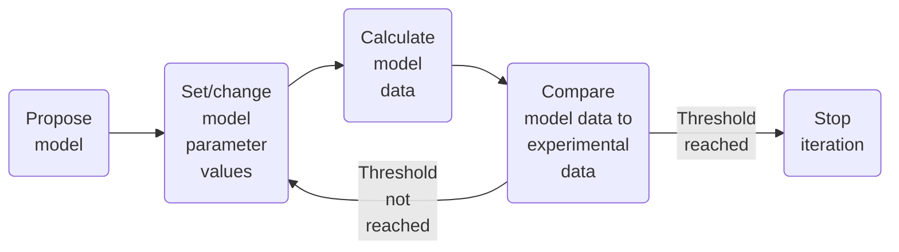

# :material-calculator: Analysis

This section provides an overview of **diffraction data analysis** in
EasyDiffraction, focusing on model-dependent analysis, calculation engines, and
minimization techniques.

In EasyDiffraction, we focus on **model-dependent analysis**, where a model is
constructed based on prior knowledge of the studied system, and its parameters
are optimized to achieve the best agreement between experimental and calculated
diffraction data. Model-dependent analysis is widely used in neutron and X-ray
scattering data.

## Calculation

EasyDiffraction relies on third-party crystallographic libraries, referred to as
**calculation engines** or just **calculators**, to perform the calculations.

The calculation engines are used to calculate the diffraction pattern for the
defined model of the studied sample using the instrumental and other required
experiment-related parameters, such as the wavelength, resolution, etc.

You do not necessarily need the measured data to perform the calculations, but
you need a structural model and some details about the type of experiment you
want to simulate.

EasyDiffraction is designed as a flexible and extensible tool that supports
different **calculation engines** for diffraction pattern calculations.
Currently, we integrate CrysPy, CrysFML, and PDFfit2 libraries as calculation
engines.

### CrysPy Calculator

[CrysPy](https://www.cryspy.fr) is a Python library originally developed for
analysing polarised neutron diffraction data. It is now evolving into a more
general purpose library and covers powders and single crystals, nuclear and
(commensurate) magnetic structures, unpolarised neutron and X-ray diffraction.

### CrysFML Calculator

[CrysFML](https://code.ill.fr/scientific-software/CrysFML2008) library is a
collection of Fortran modules for crystallographic computations. It is used in
the software package [FullProf](https://www.ill.eu/sites/fullprof/), and we are
currently working on its integration into EasyDiffraction.

### PDFfit2 Calculator

[PDFfit2](https://github.com/diffpy/diffpy.pdffit2/) is a Python library for
calculating the pair distribution function (PDF) from crystallographic models.

### Set Calculator

To show the supported calculation engines:

```python
project.analysis.show_supported_calculators()
```

The example of the output is:

Supported calculators

| Calculator | Description                                                 |
| ---------- | ----------------------------------------------------------- |
| cryspy     | CrysPy library for crystallographic calculations            |
| pdffit     | PDFfit2 library for pair distribution function calculations |

To select the desired calculation engine, e.g., 'cryspy':

```python
project.analysis.current_calculator = 'cryspy'
```

## Minimization / Optimization

The process of refining model parameters involves iterating through multiple
steps until the calculated data sufficiently matches the experimental data. This
process is illustrated in the following diagram:



Like the calculation engines, EasyDiffraction is designed to utilize various
third-party libraries for model refinement and parameter optimization. These
libraries provide robust curve fitting and uncertainty estimation tools.

### Lmfit Minimizer

Most of the examples in this section will use the
[lmfit](https://lmfit.github.io/lmfit-py/) package, which provides a high-level
interface to non-linear optimisation and curve fitting problems for Python. It
is one of the tools that can be used to fit models to the experimental data.

### Bumps Minimizer

Another package that can be used for the same purpose is
[bumps](https://bumps.readthedocs.io/en/latest/). In addition to traditional
optimizers which search for the best minimum they can find in the search space,
bumps provides Bayesian uncertainty analysis which explores all viable minima
and finds confidence intervals on the parameters based on uncertainty in the
measured values.

### DFO-LS Minimizer

[DFO-LS](https://github.com/numericalalgorithmsgroup/dfols) (Derivative-Free
Optimizer for Least-Squares) is a Python library for solving nonlinear
least-squares minimization, without requiring derivatives of the objective.

### Set Minimizer

To show the supported minimizers:

```python
project.analysis.show_supported_minimizers()
```

The example of the output is:

Supported minimizers

| Minimizer             | Description                                                              |
| --------------------- | ------------------------------------------------------------------------ |
| lmfit                 | LMFIT library using the default Levenberg-Marquardt least squares method |
| lmfit (leastsq)       | LMFIT library with Levenberg-Marquardt least squares method              |
| lmfit (least_squares) | LMFIT library with SciPy’s trust region reflective algorithm             |
| dfols                 | DFO-LS library for derivative-free least-squares optimization            |

To select the desired calculation engine, e.g., 'lmfit (least_squares)':

```python
project.analysis.current_minimizer = 'lmfit (leastsq)'
```

### Fit Mode

In EasyDiffraction, you can set the **fit mode** to control how the refinement
process is performed. The fit mode determines whether the refinement is
performed independently for each experiment or jointly across all experiments.

To show the supported fit modes:

```python
project.analysis.show_supported_fit_modes()
```

An example of supported fit modes is:

Supported fit modes

| Strategy | Description                                                         |
| -------- | ------------------------------------------------------------------- |
| single   | Independent fitting of each experiment; no shared parameters        |
| joint    | Simultaneous fitting of all experiments; some parameters are shared |

You can set the fit mode using the `set_fit_mode` method of the `analysis`
object:

```python
project.analysis.fit_mode = 'joint'
```

To check the current fit mode, you can use the `show_current_fit_mode` method:

```python
project.analysis.show_current_fit_mode()
```

### Perform Fit

Refining the sample model and experiment parameters against measured data is
usually divided into several steps, where each step involves adding or removing
parameters to be refined, calculating the model data, and comparing it to the
experimental data as shown in the diagram above.

To select the parameters to be refined, you can set the attribute `free` of the
parameters to `True`. This indicates that the parameter is free to be optimized
during the refinement process.

Here is an example of how to set parameters to be refined:

```python
# Set sample model parameters to be refined.
project.sample_models['lbco'].cell.length_a.free = True

# Set experiment parameters to be refined.
project.experiments['hrpt'].linked_phases['lbco'].scale.free = True
project.experiments['hrpt'].instrument.calib_twotheta_offset.free = True
project.experiments['hrpt'].background['10'].y.free = True
project.experiments['hrpt'].background['165'].y.free = True
```

After setting the parameters to be refined, you can perform the fit using the
`fit` method of the `analysis` object:

```python
project.analysis.fit()
```

This method will iterate through the defined steps, adjusting the parameters
until the calculated data sufficiently matches the experimental data.

An example of the output after performing the fit is:

```console
Using experiment 🔬 'hrpt' for 'single' fitting
🚀 Starting fitting process with 'lmfit (leastsq)'...
📈 Goodness-of-fit (reduced χ²) change:
╒═════════════════╤═════════════════╤═════════════════╕
│    iteration    │        χ²       │ improvement [%] │
╞═════════════════╪═════════════════╪═════════════════╡
│        1        │      164.59     │                 │
│        12       │      33.43      │     79.7% ↓     │
│        21       │      13.22      │     60.4% ↓     │
│        30       │       5.78      │     56.3% ↓     │
│        39       │       3.15      │     45.6% ↓     │
│        77       │       3.14      │                 │
╘═════════════════╧═════════════════╧═════════════════╛
🏆 Best goodness-of-fit (reduced χ²) is 3.14 at iteration 73
✅ Fitting complete.
Fit results
✅ Success: True
⏱️ Fitting time: 0.77 seconds
📏 Goodness-of-fit (reduced χ²): 3.14
📏 R-factor (Rf): 8.42%
📏 R-factor squared (Rf²): 11.79%
📏 Weighted R-factor (wR): 11.62%
📈 Fitted parameters:
```

Now, you can inspect the fitted parameters to see how they have changed during
the refinement process, select more parameters to be refined, and perform
additional fits as needed.

To plot the measured vs calculated data after the fit, you can use the
`plot_meas_vs_calc` method of the `analysis` object:

```python
project.plot_meas_vs_calc(expt_name='hrpt', show_residual=True)
```

## Constraints

In EasyDiffraction, you can define **constraints** on the model parameters to
ensure that they remain within a specific range or follow a certain relationship
during the refinement process.

### Setting Aliases

Before setting constraints, you need to set aliases for the parameters you want
to constrain. This can be done using the `add` method of the `aliases` object.
Aliases are used to reference parameters in a more readable way, making it
easier to manage constraints.

An example of setting aliases for parameters in a sample model:

```python
# Set aliases for the atomic displacement parameters
project.analysis.aliases.add(
    label='biso_La',
    param_uid=project.sample_models['lbco'].atom_sites['La'].b_iso.uid
)
project.analysis.aliases.add(
    label='biso_Ba',
    param_uid=project.sample_models['lbco'].atom_sites['Ba'].b_iso.uid
)

# Set aliases for the occupancies of the atom sites
project.analysis.aliases.add(
    label='occ_La',
    param_uid=project.sample_models['lbco'].atom_sites['La'].occupancy.uid
)
project.analysis.aliases.add(
    label='occ_Ba',
    param_uid=project.sample_models['lbco'].atom_sites['Ba'].occupancy.uid
)
```

### Setting Constraints

Now that you have set the aliases, you can define constraints using the `add`
method of the `constraints` object. Constraints are defined by specifying the
**left-hand side (lhs) alias** and the **right-hand side (rhs) expression**. The
rhs expression can be a simple alias or a more complex expression involving
other aliases.

An example of setting constraints for the aliases defined above:

```python
project.analysis.constraints.add(
    lhs_alias='biso_Ba',
    rhs_expr='biso_La'
)

project.analysis.constraints.add(
    lhs_alias='occ_Ba',
    rhs_expr='1 - occ_La'
)
```

These constraints ensure that the `biso_Ba` parameter is equal to `biso_La`, and
the `occ_Ba` parameter is equal to `1 - occ_La`. This means that the occupancy
of the Ba atom will always be adjusted based on the occupancy of the La atom,
and the isotropic displacement parameter for Ba will be equal to that of La
during the refinement process.

### Viewing Constraints

To view the defined constraints, you can use the `show_constraints` method:

```python
project.analysis.show_constraints()
```

The example of the output is:

User defined constraints

| lhs_alias | rhs_expr   | full expression     |
| --------- | ---------- | ------------------- |
| biso_Ba   | biso_La    | biso_Ba = biso_La   |
| occ_Ba    | 1 - occ_La | occ_Ba = 1 - occ_La |

## Analysis as CIF

To inspect an analysis configuration in CIF format, use:

```python
# Show sample model as CIF
project.sample_models['lbco'].show_as_cif()
```

Example output:

```
╒════════════════════════════════════════════════╕
│ _analysis.calculator_engine  cryspy            │
│ _analysis.fitting_engine     "lmfit (leastsq)" │
│ _analysis.fit_mode           single            │
│                                                │
│ loop_                                          │
│ _alias.label                                   │
│ _alias.param_uid                               │
│ biso_La  lbco.atom_site.La.B_iso_or_equiv      │
│ biso_Ba  lbco.atom_site.Ba.B_iso_or_equiv      │
│ occ_La   lbco.atom_site.La.occupancy           │
│ occ_Ba   lbco.atom_site.Ba.occupancy           │
│                                                │
│ loop_                                          │
│ _constraint.lhs_alias                          │
│ _constraint.rhs_expr                           │
│ biso_Ba  biso_La                               │
│ occ_Ba   "1 - occ_La"                          │
╘════════════════════════════════════════════════╛
```

## Saving an Analysis

Saving the project, as described in the [Project](project.md) section, will also
save the analysis settings to the `analysis.cif` inside the project directory.

<br>

---

Now that the analysis is finished, you can proceed to the next step:
[Summary](experiment.md).
